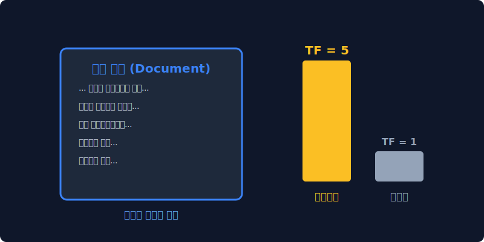
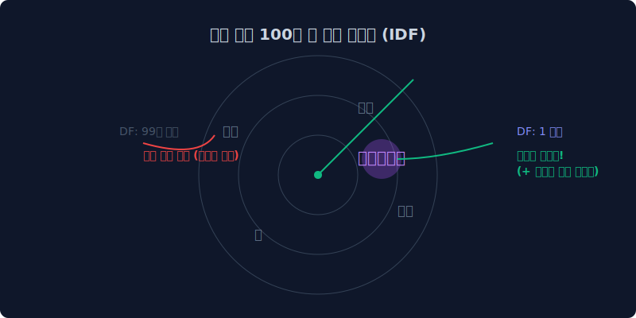
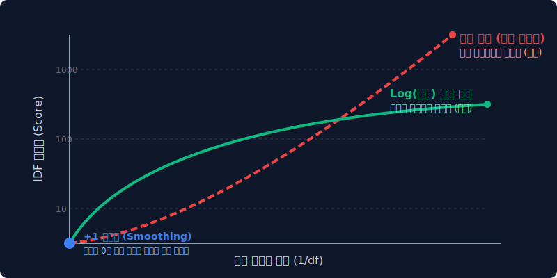
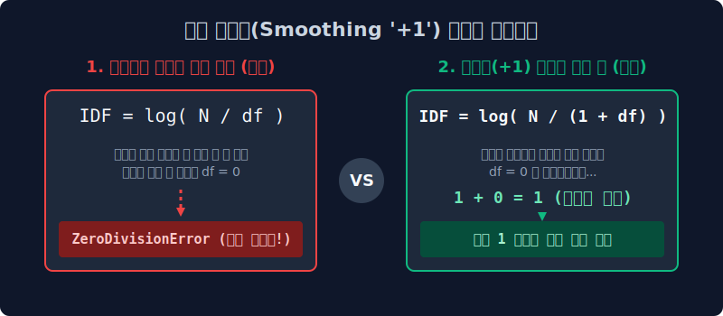
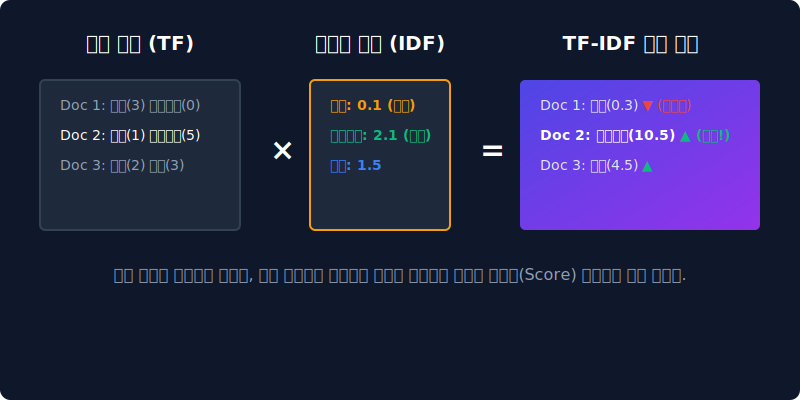

# 3.5 마법의 가중치 저울: TF-IDF 보정 방정식

특정 문서의 핵심을 파악하기 위해 단순 카운트를 무작정 올려주는 행위(TF)와, 여러 문서에 널리 퍼진 바퀴벌레 같은 스팸 단어들에게 치명적인 로그 함숫값 패널티를 부여하는(IDF) 양팔 저울형 수학 공식의 정수를 깨우칩니다.

단순 횟수 카운팅(Bag-of-Words) 시스템이 지프의 법칙(Zipf's Law) 앞에서 어떻게 붕괴했었는지를 기억하시나요? TF-IDF는 이러한 무지성 카운팅에 **'희소성(Rarity)'** 이라는 빛과 소금 같은 가중치를 곱하여, 진정한 문서의 '키워드'를 수면 위로 끌어올립니다.

---

## 3.5.1 TF-IDF 의 탄생 철학: 왜 저울이 필요한가?

결국 데이터 마이닝 관점에서 기계가, 혹은 인간이 알고 싶은 것은 **"이 방대한 문서 안에서 가장 특색 있고 지배적인 핵심 키워드 3개가 뭐야?"** 를 묻는 구조입니다. 

카운트 기반의 DTM(Document-Term Matrix) 행렬은 그저 출현 빈도에만 집착하여 `the`, `a`, `은/는/이/가` 처럼 무의미한 불용어(Stopwords)를 랭킹 1위로 올려버리는 치명적 오류를 낳았습니다. 이를 타파하기 위해 정보 검색 및 텍스트 마이닝 학자들은 각 단어의 '문서 내 중요도'와 '전체 문서군 내의 범용성'을 곱셈으로 상쇄시키는 **영리한 가중치 보정 방정식**을 창안했습니다.

$$ \text{TF-IDF} = \mathbf{TF} (\text{Term Frequency}) \times \mathbf{IDF} (\text{Inverse Document Frequency}) $$

> **[일러스트] TF-IDF의 가중치 저울:** 수백 장의 쓰레기 문서에 쓰이는 무거운 단어 집합보다, 특정 문서에만 반짝 등장하는 희귀한 단어의 결정체가 훨씬 더 높은 스코어 가치를 획득하게 됩니다.

---

## 3.5.2 앞부분 저울: TF (단어 빈도, Term Frequency)

TF는 특정 문서(Document) 내에서 특정 단어(Term)가 등장하는 횟수입니다.

$$ \text{tf}(d, t) = f_{d,t} $$

*   **관점:** 내가 지금 분석하고 있는 **바로 이 책(특정 문서 $d$) 안에서 해당 단어 $t$가 과연 몇 번이나 자주 거론되었는가?**
*   **가중치 동작:** **(+) 플러스 점수 가산**
*   **컴퓨터의 논리:** "당연히 책의 주인공 이름처럼 내 책에서 많이 불렸으면, 일단 그 문서의 핵심 주제일 확률이 상당히 높다!" $\to$ 빈도가 오를수록 스코어를 비례해서 높여줍니다.

### 다양한 TF 정규화(Normalization) 기법들

만약 어떤 문서의 길이가 10,000페이지에 달한다면, 특정 단어가 단순히 분량에 비례해 많이 등장하여 TF 값이 비정상적으로 폭등하는 문제(길이 편향, Length Bias)가 필연적으로 발생합니다. 이를 보정하기 위해 통계학에서는 단순 산술 카운트 외에도 다음과 같은 다양한 TF 정규화(Normalization) 기법을 도입하여 사용합니다.

1. **불리언 빈도 (Boolean Frequency)**
   * **수식:** $\text{tf}(t,d) = 1 \, \text{(단어가 존재할 경우)}, \; 0 \, \text{(존재하지 않을 경우)}$
   * **원리:** 단어가 한 번 나오든 천 번 나오든 빈도수의 크기와 차이를 가차 없이 무시하고, 오직 "해당 서적에 단어가 출현하였는가?"의 유무만으로 TF 값을 `1`로 고정하는 극단적 압축 방식입니다.
   * **목적:** 빈도수 자체보다는 문서 내에 특정 식별 키워드가 포함되었는지 여부만을 스캔하고 필터링하는 데 주력할 때 채택합니다.

2. **로그 정규화 (Log Normalization)**
   * **수식:** $\text{tf}(t,d) = \log(1 + f_{t,d})$
   * **원리:** 특정 단어가 10배 더 많이 출현했다고 해서 그 중요성 빈도가 영원히 정확하게 10배 더 높게 비례한다고 단정 지을 수는 없다는 경제학적 '한계 효용 체감의 법칙'을 도입한 모델입니다.
   * **목적:** 출현 빈도가 수백, 수천 번 이상 치솟아 폭주하는 특정 스팸성 키워드나, 문서가 지나치게 길어서 발생하는 카운트(Count) 상승폭을 로그 곡선으로 부드럽게 꺾어버림으로써 TF 값의 스케일 폭발을 방지합니다.

3. **이중 정규화 K (Double Normalization K)**
   * **수식:** $\text{tf}(t,d) = K + (1 - K) \frac{f_{t,d}}{\max(\{f_{t',d} : t' \in d\})}$
   * **원리:** 당장 분석 중인 해당 문서 내부에서 가장 빈도수가 높은(1등 랭크) 단어의 빈도를 분모(Max) 기둥으로 기준 잡고, 현재 타겟 단어의 카운트를 분자로 두어 비율(Percentage) 기반의 벡터로 계산합니다. 이때 $K$(보통 0.5)라는 스무딩(Smoothing) 상수를 더해 줍니다.
   * **목적:** 문서의 전체 분량이 10페이지이든 1,000페이지이든 상관없이 문서 절대 길이에 따른 카운트 편향을 상쇄시키고, 오직 해당 문서 내에서의 '상대적 지분 비율'이라는 공정한 척도로 정규화해 내는 가장 진보한 TF 방식입니다.

---

## 3.5.3 뒷부분 저울: IDF (역문서 빈도, Inverse Document Frequency)

IDF는 특정 단어 $t$가 '전체 문서 집합(Corpus)'에서 얼마나 흔하게, 혹은 희귀하게 등장하는지를 측정하는 지표의 역수(Inverse)입니다. TF-IDF를 마법으로 만들어 주는 진정한 핵심입니다.

*   **관점:** **세상의 수많은 문헌(도서관 전체)을 펼쳐봤더니, 저 단어가 개나 소나 다 쓰는 흔해 빠진 쓰레기 단어인가?**
*   **가중치 동작:** **(-) 무자비한 패널티 (스코어 감점)**
*   **컴퓨터의 논리:** "어? 너 내 문서에서 무려 100번이나 나왔길래 핵심 키워드인 줄 알았더니, 저기 옆집 요리책이랑 스포츠 기사에도 죄다 100번씩 쓰인 흔한 관사/조사 였어? 넌 정보적 가치가 없다!" $\to$ 점수를 무참히 깎아버립니다.

> [!TIP]  
> **📖 초심자를 위한 쉬운 해설: IDF의 눈물겨운 '희소성' 보상**  
> 반대로 `트랜스포머` 라는 단어는 세상 모든 책을 뒤져도 요리책이나 서정 소설에는 무조건 $0$회 등장합니다! 오직 IT 기계공학 논문에만 바짝 등장하는 초-레어템입니다. 기계는 범용성이 박살난 이 진귀한 단어를 발견하면 패널티를 주는 대신 무지막지한 **IDF 가중치 칭찬 뻥튀기 보너스 스코어**를 부여하게 됩니다.

---

## 3.5.4 충격과 공포의 IDF 세부 수학 공식 해부

이 똑똑한 역문서 패널티 기능을 온전하게 구현하기 위해 기계학습에서는 고등학교 시절의 **수학 로그 기호 ($\log$)** 를 소환해야만 합니다. 일반적인 IDF의 공식은 통계학 패키지마다 조금씩 차이가 있으나, 대체로 다음의 수식을 심장부에 품고 있습니다.

$$
\text{TF-IDF}(w, d) = \text{TF}(w, d) \times \left( \log \left( \frac{n}{1 + \text{df}(w)} \right) + 1 \right)
$$

각 수식 요소의 직관적 해석:
* **$n$** : 전체 문서 세상의 크기 (예: 도서관에 박힌 전체 1,000,000권의 장서수)
* **$\text{df}(w)$ (Document Frequency)** : 타겟 단어 $w$가 단 한 번이라도 등장했던 문서들의 수 (예: "너 지금 몇 권에서 출몰했냐?")

### 1. 분수에 뜬금없이 들어간 로그(`log`) 함수의 마법
왜 역수를 취할 때 단순히 $\frac{n}{\text{df}(w)}$를 쓰지 않고 로그($log$) 함수라는 곡선 변환기를 씌울까요? 

만약 세상에 문서가 1,000만 권이나 존재하는데 특정 전문 용어가 딱 1권에서만 우연히 등장했다면 어떻게 될까요? 단순 분수비라면 그 역수 배율은 자그마치 **10,000,000배**로 폭주하여 튀어나갑니다.
가중치를 준답시고 이렇게 천문학적인 분수 뻥튀기가 일어나면, TF-IDF의 최종 행렬 스코어보드는 통째로 밸런스가 붕괴되어 모델이 마비됩니다. 

**로그(Logarithm) 함수**는 아무리 $X$축 (분수 스케일) 숫자가 1억, 10억으로 커진다 하더라도, 그 성장 곡선의 기울기를 팍 꺾어버려서 $Y$값(결과치)을 보통 $[1 \sim \text{수십]}$ 사이의 통제 가능한 스케일 숫자로 얌전하게 압축해 버리는 수학계의 훌륭한 **'데이터 댐(댐)'** 역할을 합니다. 

### 2. 분모가 무너지면 서버가 꺼진다: 스무딩(+1) 방어막

이 공식 구조는 파이썬 코딩 및 머신러닝 개발 현장에서는 엄청난 아킬레스건을 하나 가지고 있습니다. 

> 만약 방금 세상에 태어난 신조어라서, 세상 어떤 훈련 문서 집합에서도 단 한 번도 언급된 적이 없는 미지의 타겟 단어가 분모에 들어간다면? 

*   등장 횟수 $\text{df}(w) = 0$ 이 됩니다.
*   컴퓨터 프로그래밍에서 (특히 파이썬 연산에서) **분모가 $0$ 이 되는 순간 가차 없이 `ZeroDivisionError` 핵폭탄 에러가 터지고, 학습 서버는 즉시 강제 종료(Crash) 되어 버립니다.**
*   이러한 시스템적 참사를 예방하기 위해, 분모가 최소한 $0$이 되지 않게끔 1을 억지로 더해주는 꼼수 상수 안전장치를 부착합니다. 이를 데이터 마이닝에서는 맹장 수술을 하듯 **부드럽게 에러를 피해 간다 하여 분모 스무딩(Smoothing)** 이라고 부릅니다.

---

## 3.5.5 최종 벡터 변환: TF-IDF 결정 행렬의 완성

위의 $\text{TF} \times \text{IDF}$ 마법 연산을 모두 거치고 나면, 아래 다이어그램처럼 문서들은 완전히 새로운 '가중치 성적표'를 득하게 됩니다.

1.  **흔한 단어 (예: 사과)**: 문서를 구별하는 분별력이 없으므로 TF가 제아무리 높아도 IDF 역문서 값에 의해 가차 없이 깎여 내려갑니다. (저평가)
2.  **레어 키워드 (예: 인공지능)**: 해당 단어가 등장한 문서(Doc 2)에서는 다른 문서와의 강력한 차별성을 가지므로 압도적인 핵심 스코어를 얻으며 승천합니다. (핵심)

이처럼 무의미한 카운팅의 바다 속에서 TF-IDF 저울 공식에 데이터를 부어 넣으면, 우리는 쓰레기 관사를 $0$점에 수렴시키고 세상에서 가장 아름다운 **'핵심 주제 벡터 엑셀표(Matrix)'**를 손에 넣게 됩니다. 

그리고 대망의 마지막, 기계는 이렇게 산출된 고차원 공간 상의 $X, Y, Z...$ 숫자 벡터들의 좌표 거리를 수학 각도로 측정(**코사인 유사도 등**)하여 "이 두 문서는 98% 확률로 비슷한 주제를 말하고 있습니다!" 라고 최종 정답을 자랑스럽게 출력할 수 있게 됩니다.
