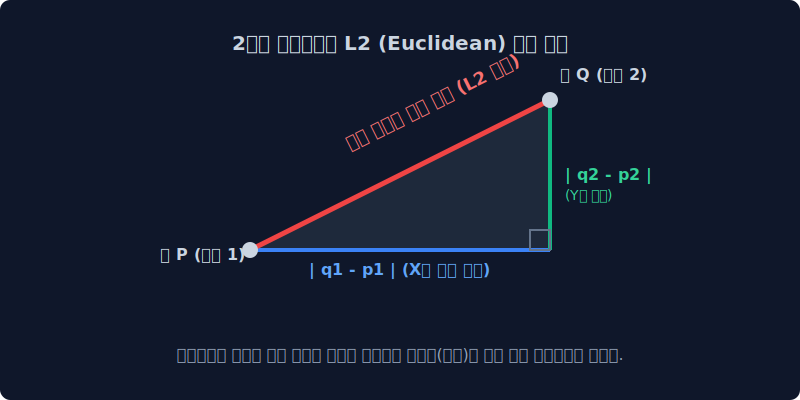
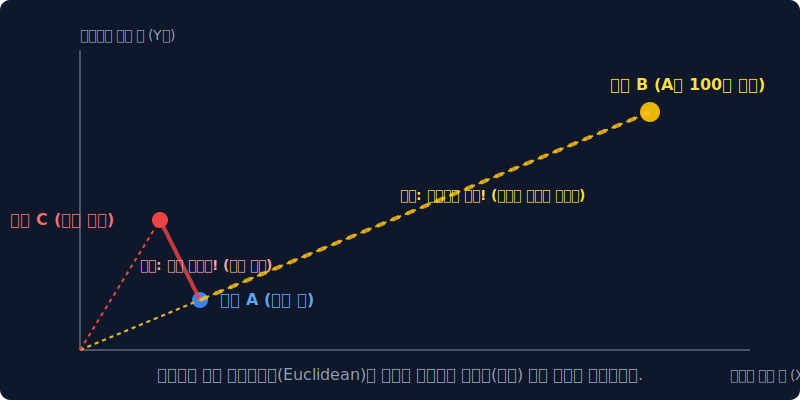
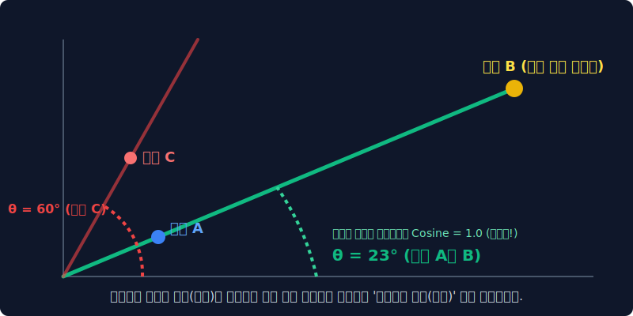
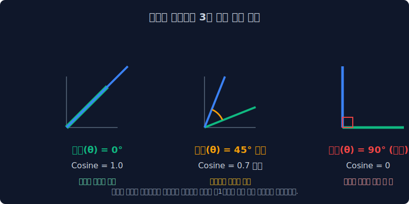

# 3.6 벡터 유사도: 유클리드의 헛발질과 코사인의 위대함

이제 우리가 고안해 낸 숫자로 된 단어 빈도 행렬을 다차원의 우주 기하학 공간에 던져 넣습니다. 이 공간에서 두 문서가 얼마나 성격이 비슷한지를 '수학적 잣대(Ruler)'를 들이대어 측정하게 됩니다. 우리는 초등학교 때 배운 단순 직선거리인 유클리디안 거리가 왜 거짓말 문서(앵무새)에 속수무책으로 무너지는지 확인하고, 이를 구원하는 코사인(Cosine) 각도의 강력한 스캔 원리를 상세히 분석합니다.

---

## 3.6.1 벡터 유사도(Similarity)의 기하학적 패러다임

우리가 카운팅으로 만든 TF-IDF 문서 통계표는 머신러닝에서 곧바로 $X, Y, Z$ 축을 가지는 좌표 평면(다차원 우주 공간)의 위치 스탯으로 변환됩니다. 
문서 A가 찍힌 '점 좌표 위치'와 문서 B가 찍힌 점 사이의 **[물리적 직선 거리]** 와 원점에서 쏘아 올린 **[레이저 각도의 방향성]**을 기하학적으로 비교하여 기계는 두 텍스트가 의미상 일치하는지 판별합니다.

---

## 3.6.2 유클리디안 거리 (Euclidean Distance): 피타고라스의 자

유클리드 거리는 인간이 가장 파악하기 쉬운 초등학교 수준의 측량법입니다. 2차원(종이 위)이든 10차원(초공간)이든 좌표에서 두 점 사이를 잇는 "가장 최단 거리의 일직선 선분 자" 그 자체입니다.

### 계산 공식 (L2 거리)
직각 삼각형의 빗변을 구하는 피타고라스 정리와 완벽하게 일치합니다.
$$ 
L_2 \text{ Distance} = \sqrt{(q_1 - p_1)^2 + (q_2 - p_2)^2 + \dots + (q_n - p_n)^2} 
$$

* **장점**: 직관적이고 연산의 물리적 메커니즘이 군더더기 없이 가장 간결합니다.

---

## 3.6.3 유클리디안 자의 헛발질: 앵무새 거짓말 문서에 속다

하지만 고도화된 자연어 처리(NLP) 영역에서, 이 유클리디안의 최단 거리 측정 방식을 곧이곧대로 믿고 서비스에 적용했다가는 검색 엔진의 품질이 박살 나게 됩니다.

> [!WARNING]  
> **📖 초심자를 위한 쉬운 해설: 길이에 속아버리는 직선 자**  
> **문서 A**: "배트맨 오토바이 짱 멋있다" (길이: 짧음)  
> **문서 C**: "슈퍼맨 망토 색깔 이상하다" (전혀 다른 내용)  
> **문서 B**: "배트맨 오토바이 짱 멋있다. 배트맨 오토바이..." x 100번 매크로 반복 복사 (길이: 미친 듯이 김)  
> 
> 사람의 상식이자 의미론적 관점에서 **문서 A와 문서 B는 100% 똑같은 주제**를 말하고 있습니다.
> 
> 하지만 문서 B는 단어 출현 횟수 카운트가 $100$을 돌파했기 때문에 기하학적 공간상에서 $X, Y$ 축의 먼 바깥 우주 공간으로 날아가 버립니다.
> **직선 자(Euclidean)로 물리적 측정**을 강행해보면, 기계는 내용이 똑같은 A와 B의 직선 거리가 아득히 멀다고 계산해 버립니다. 반면 내용이 전혀 다른 A와 C는 우연히 '카운트 스탯'이 작다는 이유 하나만으로 원점 근처에 옹기종기 모이게 되어 "두 문서가 매우 가깝다(유사하다)"고 역대급 오답을 뱉어냅니다!

단순히 전체 텍스트의 볼륨(문서의 사이즈 길이)이 길어졌을 뿐인데 데이터 측정값이 완전히 붕괴되는 현상입니다.

---

## 3.6.4 AI의 완벽한 구원자: 코사인 유사도 (Cosine Similarity)

자연어 처리기 공간의 진정한 구원자는 삼각함수, 바로 코사인입니다. 두 문서의 물리적인 길이 스탯(거대함) 차이를 백지에 가깝게 **정규화(Normalization)** 시켜버리고, 오직 우주 공간을 향해 뻗어나가는 **레이저의 방향(각도, $\theta$)** 일치 여부만 칼같이 재어버리는 수학 기법입니다.

### 코사인 공식 해부
두 벡터의 내적(Dot Product)을 각 벡터의 크기(Magnitude)의 곱으로 나눈 수식입니다.
$$
\text{Cosine Similarity}(A, B) = \cos(\theta) = \frac{A \cdot B}{\|A\| \|B\|} = \frac{\sum_{i=1}^{n} A_i B_i}{\sqrt{\sum_{i=1}^{n} A_i^2} \sqrt{\sum_{i=1}^{n} B_i^2}}
$$
분모에서 각 문서 벡터의 절댓값 덩치(길이) 스탯으로 다시 나누어 주므로, 100번 복사 붙여넣기를 한 `문서 B` 나 원본 `문서 A` 나 완전히 똑같은 $1$의 비율 스케일로 완벽하게 압축, 정규화됩니다.

---

## 3.6.5 코사인의 마법: 유사도 3대 구간 판독

단어 빈도수(TF-IDF 등) 데이터는 음수(-) 값이 발생하지 않습니다. 즉, 좌표 평면에서 언제나 제1 사분면(우상향) 공간에만 존재합니다. 따라서 두 텍스트 사이의 각도는 최소 $0^\circ$에서 최대 $90^\circ$ 안쪽에서만 움직이게 됩니다.

| 측정된 각도 범위 | 코사인 값 도출 ($\cos \theta$) | 문서 관계 분석 (결론) |
|:---|:---|:---|
| **$0^\circ$ (각도 차이 전혀 없음)** | **수학적 `1.0` (100% 정답)** | 이 두 문서는 완전히 똑같은 논조와 테마를 공유하는 쌍둥이 문서입니다. (완벽 일치) |
| $45^\circ$ (다소 벌어짐) | `0.707` 등 수렴 | 주제가 엇갈리며 서로 단어가 겹치지 않는 부분이 많습니다. |
| **$90^\circ$ (완전 수직, 직교)** | **수학적 `0` (상호 독립)** | 단어가 단 한 개도 겹치지 않는 직교(Orthogonal) 상태. 완벽히 이질적인 문서입니다. |

이 멋진 코사인 측정 프로세서가 장착됨으로써, 기계는 텍스트를 숫자로 치환하고, 잡음을 발라내며(TF-IDF), 마침내 문서 길이에 농락당하지 않고 각 문서의 유기적인 기하학적 유사도를 인간보다 정밀하게 판단할 수 있는 **[진정한 통계적 자연어 프로세서]**의 거대한 초석을 완성하게 됩니다!
