# 벡터 유사도: 유클리드의 헛발질과 코사인의 위대함

이제 우리가 뼈 빠지게 고안해 낸 숫자로 된 단어/문서 벡터 공간에서, 두 문서가 얼마나 성격이 비슷한지를 수학 자(Ruler)를 들이대어 잽니다. 단순 직선거리인 유클리디안 거리가 어떻게 거짓말 문서(앵무새)에 속수무책으로 당하는지, 그에 대한 완벽한 방어책인 코사인(Cosine) 각도의 기하학적 원리를 배웁니다.

---

## 00. 벡터 유사도(Similarity)의 기하학
우리가 카운팅으로 만든 문서 통계표는 $X, Y, Z$ 축을 가지는 좌표 평면(우주)에 던져서 점을 찍을 수 있습니다. 
문서 1호 벡터가 찍힌 점 좌표 위치와, 문서 2호가 찍힌 점 사이의 [거리] 와 [각도 방향]을 쳐다보면 이 두 문서가 얼마나 똑같은 내용인지 기하학적으로 검증할 수 있습니다.

## 01. 유클리디안 거리 (Euclidean Distance): 피타고라스의 자
우리가 초등학교 때부터 쓰던, 수학 좌표에서 두 점 사이를 잇는 "가장 최단 거리 일직선 선분 자" 그 자체입니다.

* **계산 공식**: 직각 삼각형의 피타고라스 정리
  $$ L_2 \text{ Distance} = \sqrt{(q_1 - p_1)^2 + (q_2 - p_2)^2 + \dots + (q_n - p_n)^2} $$
* **장점**: 너무 직관적이고 연산이 물리적으로 제일 쉽고 빠릅니다.

## 02. 유클리디안 자의 헛발질: 앵무새 거짓말 문서에 속다
하지만 자연어 처리에서 이 유클리디안의 최단 거리 자를 믿고 썼다가는 회사가 망해버립니다.

> [!WARNING]  
> **📖 초심자를 위한 쉬운 해설: 복사 붙여넣기에 속는 직선 자**  
> **문서 A**: "배트맨 오토바이 짱 멋있다" (길이 1)  
> **문서 B**: "배트맨 오토바이 짱 멋있다. 배트맨 오토바이..." x 100번 반복 (길이 100)  
> **문서 C**: "슈퍼맨 오토바이 제일 멋있다" (길이 1)  
> 
> 사람의 상식으로 문서 A와 C는 글자 배열이 100% 똑같으므로 가장 유사한 문서입니다!
> 문서 A와 문서 B는 말만 길게 100번 복사 붙여넣기 한 똑같은 앵무새 내용입니다.
> 
> 하지만 문서 B는 단어 출현 횟수 카운트가 `100`이기 때문에 공간 좌표기 우주 저 멀리 날아가서($x=100$) 처박히게 됩니다. 반면 A와 C는 옹기종기 1 근처에 모입니다.
> **직선 자(Euclidean)로 물리적 측정**을 해보면, 내용이 똑같은 A와 B의 직선 거리가 미친 듯이 차이 난다고 나오며, 오히려 내용이 전혀 다른 A와 C가 가깝다고 거짓말 분석을 내뱉습니다!! 단순히 문서 길이(단어의 억지 카운트)가 길어지면 수치(거리)가 완전히 박살 나는 현상입니다.

## 03. 완벽한 구원자: 코사인 유사도 (Cosine Similarity)
AI 세계의 진정한 구원자입니다. 두 문서의 물리적 길이(스펙 스탯 수치) 차이를 완전히 개무시해 버리고, 오직 원점으로부터 두 선분이 가리키는 **방향(각도, $\theta$)의 일치 여부**만 칼같이 재어버리는 수학 기법입니다.

* 문서 A의 좌표점 각도 45도. 
* 문서 B(100번 앵무새 반복 복사물)는 스탯(길이)이 저기 안드로메다로 날아갔음에도 불구하고 그 비율이 완전 똑같으므로 방향 역시 45도입니다.
* 코사인 각도 측정기는 "길이는 달라도 두 놈의 각도(방향성)가 100% 일치하네? 이건 똑같은 주제의 문서다!!" 라며 $1.0$ 만점을 선사합니다. (길이의 왜곡을 방어한 완벽한 논리)

## 04. 코사인의 마법: 유사도 3대 구간
단어 빈도수(TF-IDF) 데이터는 마이너스 값이 없으므로 십자가 평면이 아니라 항상 우상향의 제1 사분면에만 존재합니다. 따라서 두 문서 사이의 각도는 언제나 0도에서 90도 안에서만 놉니다.

| 각도 범위 | 코사인 값 도출 ($\cos \theta$) | 문서 관계 분석 (결론) |
|:---|:---|:---|
| **$0^\circ$ (각도 차이 없음)** | **기하학적 `1` (100% 정답)** | 이 두 문서는 완전히 복사 붙여넣기 한 쌍둥이 문서입니다. |
| $45^\circ$ (약간 벌어짐) | `0.707` 등 | 서로 단어가 많이 겹치진 않네요. |
| **$90^\circ$ (완전 수직, 반대 방향)** | **기하학적 `0` (상호 독립, 직교)** | 아예 단어가 하나도 겹치지 않는 완전 남남 세계의 문서입니다. |

이 멋진 코사인 측정기가 장착됨으로써, 기계는 텍스트를 숫자로 치환하고, 잡음을 발라내며(TF-IDF), 마침내 문서 간의 기하학적 유사도를 인간처럼 정밀하게 판단할 수 있는 **[통계적 자연어 처리기]**의 거대한 초석을 완성했습니다!
