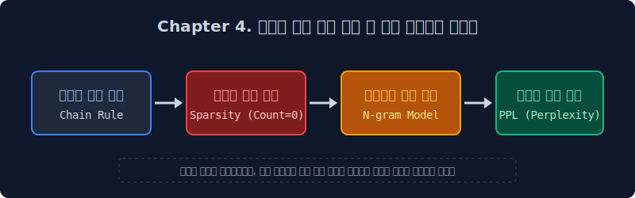

# 4. 언어 모델 (Language Model) 확률 연산 프레임워크와 평가

자연어 딥러닝 시대 이전, 통계적 언어 모델(Statistical Language Model)이 마주했던 수학적/컴퓨팅 연산의 장벽과 이를 타개하기 위한 차원 축소의 역사를 고찰합니다. 문장을 생성해 내는 과정이 인간의 예술적 창조성이 아닌, 조건부 확률(Conditional Probability) 교집합에 기댄 정보 단위 배팅임을 수리적으로 증명하고, 이러한 생성 모델의 성능을 정량적으로 계측해 내는 역학 지표인 퍼플렉서티(PPL) 및 최신 성능 벤치마크 평가 방법론들을 심층 학습합니다.

## 단원 학습목차

* 4.1 [언어 모델: 고차원적 통계와 확률 배팅 연산](/basic/04/sec01/)
  * 4.1.1 컴퓨터는 통계적 확률 앵무새다 (Stochastic Parrot)
  * 4.1.2 기계 번역과 오타 교정 이면의 확률 변수 판독 알고리즘

* 4.2 [조건부 확률과 거대한 도미노 연쇄 법칙 (Chain Rule)](/basic/04/sec02/)
  * 4.2.1 초기 언어 모델(SLM)의 수학적 목표와 결합 확률 전개
  * 4.2.2 도미노처럼 뻗어나가는 조건부 교집합 연산 부하 ($\prod$)

* 4.3 [통계 알고리즘의 붕괴: 희소성의 폭발 (Sparsity)](/basic/04/sec03/)
  * 4.3.1 세상에 단 한 줄도 존재하지 않는 창작 문장을 스캔했을 때 
  * 4.3.2 분모 제로(Zero Division)에 의한 분할 에러 및 시스템 셧다운의 위협

* 4.4 [근원적 타협점: N-gram 구조와 확률적 마르코프 체인](/basic/04/sec04/)
  * 4.4.1 연산 폭발 방지를 위한 과거 문맥 데이터 절단 (Truncation)
  * 4.4.2 롱-텀 디펜던시(Long-Term Dependency) 장기 의존성 상실의 본질적 한계

* 4.5 [정량적 통계 평가 지표: 혼란도(PPL)와 분기 기하학](/basic/04/sec05/)
  * 4.5.1 객체 탐지와 자연어 모델 간의 성과 측정 패러다임 간극
  * 4.5.2 정보 엔트로피 역전 공식: 분기 계수(Branching Factor)의 심리적 환산

* 4.6 [거대 언어 모델(LLM) 시대의 진일보된 평가 지표와 환각](/basic/04/sec06/)
  * 4.6.1 빈도와 PPL 맹신이 낳은 돌연변이: 확률적 허언증 (환각, Hallucination)
  * 4.6.2 최신 지식 생태계 벤치마크: BLEU, ROUGE, MMLU, 그리고 LLM-as-a-Judge
