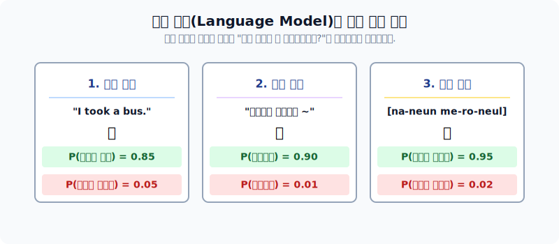
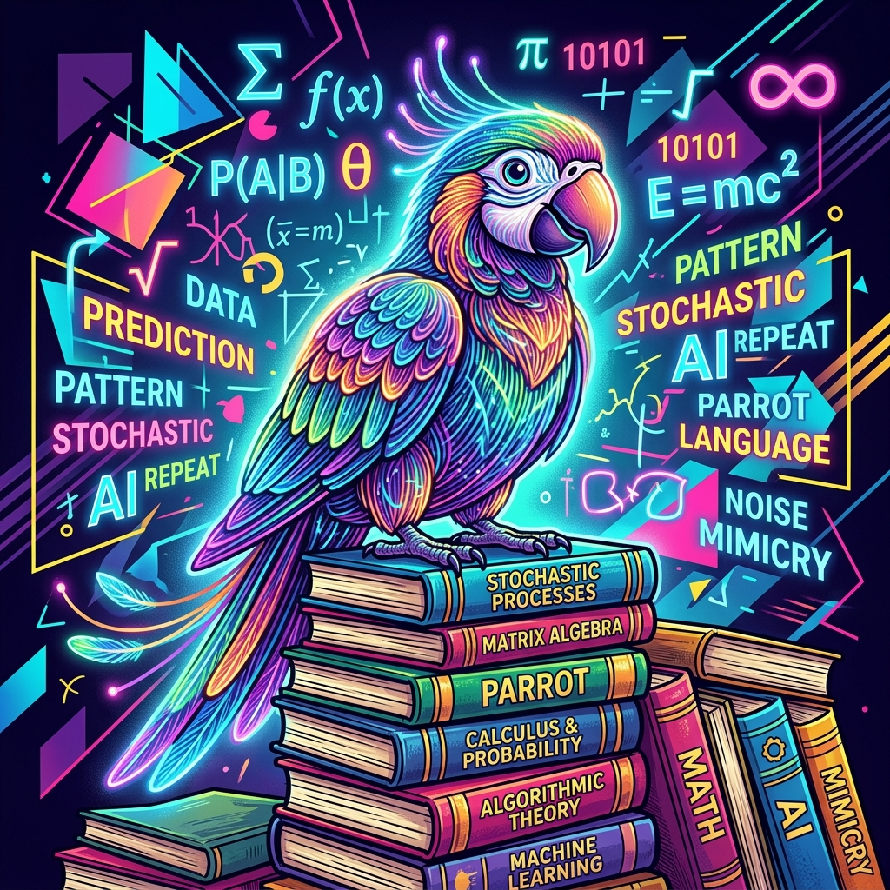

# 통계 기반 언어 모델의 확률론적 이해

기계가 한글과 영어를 조합해서 문장을 만들어 낼 때, 그 과정이 인간의 창조능력이 아니라 그저 지독한 "확률(Probability) 숫자 맞추기 게임"에 불과하다는 씁쓸한 진실을 수학적으로 배웁니다.

---

## 00. 통계적 언어모델의 개념
단어가 모여 문장이 될 때 그 조합이 무작위인지 자연스러운 언어인지 통계와 확률 수식으로 증명합니다.

> [!NOTE]  
> **📖 초심자를 위한 쉬운 해설**  
> AI는 내일 주식 시장을 예측하는 것처럼, 다음 단어를 예측하기 위해 주사위를 굴립니다. AI에게 주사위 굴리기는 결코 운이 아니라 **과거의 엄청난 학습 데이터를 통해 계산된 가장 높은 확률을 찾는 정교한 수학 연산**입니다.

## 01. 언어모델(Language Model)이란?
단어의 순서(시퀀스) 전체에 **논리적인 확률 값을 할당하는 통계 모델**입니다.
* 목표: 이전 단어들이 쭉 주어졌을 때, 그 **다음 단어가 무엇일지를 확률적으로 예측**하는 것.

## 02. 언어모델: 왜 하필 수학 '확률'인가?
자연어는 $1+1=2$ 처럼 딱 떨어지는 정답이 없고, 수많은 선택지 중 가장 그럴싸한(자연스러운) 하나를 고르는 불확실성의 미학이기 때문입니다.
* `“오늘 점심 뭐 먹지? ( )”` → `“짜장면”`, `“김치찌개”` 등이 나올 확률이 높지, `“시멘트”`가 나올 확률은 `0%`에 수렴합니다.

## 03. 언어모델의 필요성 (확률 점수의 대결)
어떤 문장이 사람이 쓴 자연어에 가까운지 점수를 매기는 데 쓰입니다.

| 문장 후보 | 자연어 점수 확률 $P(W)$ | 평가 |
|:---|:---|:---|
| `I eat apple` | $P = 0.85$ (높음!) | 👍 정상적인 자연어 |
| `Apple eat I` | $P = 0.0001$ (최악) | ❌ 외계어 (버림) |

## 04. 언어모델 적용 예시 (기계 번역 / 오타 교정 / 음성 인식)
가장 보편적인 활용법들은 모두 확률론적 승부입니다.

*   **기계 번역**: $P(\text{나는 버스를 탔다}) > P(\text{나는 버스를 태운다})$ (왼쪽 승리!)
*   **오타 교정**: "선생님이 부리나케 ( )" $\to P(\text{달려갔다}) > P(\text{잘려갔다})$ (달려갔다 승리!)
*   **음성 인식**: 발음이 뭉개졌을 때 $\to P(\text{메론을 먹는다}) > P(\text{메롱을 먹는다})$ (메론 승리!)

## 05. 통계적 언어모델(SLM)의 수학적 계산 원리
과거 딥러닝 이전 시대(SLM)에는 "수억 권의 책"을 쌓아두고 직접 횟수를 카운트했습니다.

**목표 명제**: 문장 전체 확률 $P(W)$ 구하기.
여기서 $W$는 $n$개의 단어 시퀀스 $(w_1, w_2, \dots, w_n)$ 입니다.

## 06. 조건부 확률(Conditional Probability)의 도입
단어는 문맥 때문에 이전 단어들의 절대적인 영향을 받습니다. 따라서 고등학교 통계의 **조건부 확률($P(B \mid A)$)** 공식을 빌려옵니다.

$$ P(B \mid A) = \frac{P(A,B)}{P(A)} $$

## 07. 조건부 확률의 연쇄법칙(Chain Rule)
길고 엄청난 문장은 하나의 덩어리 확률이 아니라, 단어들이 도미노처럼 연속해서 벌어지는 곱셈($\prod$)으로 증명할 수 있습니다.

$$ P(w_1, w_2, \dots, w_n) = \prod_{i=1}^{n} P(w_i \mid w_1, \dots, w_{i-1}) $$

*   예를 들어, 4단어 문장의 발생 확률은 아래 확률의 곱과 같습니다.
    $$ P(A, B, C, D) = P(A) \times P(B \mid A) \times P(C \mid A,B) \times P(D \mid A,B,C) $$

## 08. 단어가 등장할 확률: 카운트 기반 계산
그렇다면 저 확률값들은 도대체 어디서 가져올까요? 바로 **데이터셋의 출현 빈도수 수작업 카운트**에서 가져옵니다.

$$ P(\text{is} \mid \text{An adorable little boy}) = \frac{\text{Count}(\text{An adorable little boy is})}{\text{Count}(\text{An adorable little boy})} $$

> [!TIP]  
> **📖 초심자를 위한 쉬운 해설**  
> 즉, 내 백과사전에 `An adorable little boy` 라는 영어 문장이 딱 100번 쓰였는데, 그 바로 뒤에 `is`가 따라붙은 경우가 30번이라면, 저 분수식의 정답은 $\frac{30}{100} = 0.3 (30\%)$ 가 되는 초등학생 수준의 명료한 산수입니다.

## 09. 카운트 기반 언어모델의 치명적 한계: 희소 문제 (Sparsity)
완벽해 보이지만 이 수학 공식에는 치명적인 폭탄이 숨겨져 있습니다.

> [!CAUTION]  
> **희소 문제 (Sparsity Problem)**: 내가 쓴 소설 문장이 전 세계 인터넷 데이터베이스를 다 뒤져도 단 한 번도 존재한 적이 없는 희귀 문장이라면? 분모값인 $\text{Count}$가 `0`이 되어 버리며 에러가 폭발합니다.

## 10. 언어모델의 진화 타협점: N-gram (전체 대신 일부만 보기)
이 희소성 에러를 막고자 통계학자들은 **잔머리(근사화, Approximation)**를 굴렸습니다. 문맥 전체를 통째로 보려니까 데이터가 없는 것입니다. 앞의 주어를 쿨하게 다 버리고, **"이전 단어 $N$개"**만 보고 확률을 맞추기로 타협합니다.

*   (전체 문맥) $P(\text{is} \mid \text{An adorable little boy})$
*   **(N-gram 근사 적용)** 억지로 잘라내어 타협 $\approx P(\text{is} \mid \text{boy})$

## 11. N-gram 모델의 마르코프 체인(Markov Chain)
이 철학은 통계학의 **마르코프 성질**에 완벽히 의존합니다.
"현재의 상태를 예측하기 위해서는 너무나 아득한 먼 과거(주어)는 필요 없고, 아주 최근 과거 정보(바로 전 단어)만으로 충분히 논리적으로 독립적이다." 라는 대전제입니다.

## 12. 딥러닝 시대의 통계 한계: 확률적 앵무새 (Stochastic Parrot)
과거의 통계(SLM)를 넘어 강력한 딥러닝(LLM 챗GPT)이 왔지만, 여전히 본질은 "수학적 확률 맞추기"에 지나지 않아 치명적인 문제가 발생합니다.

> [!WARNING]  
> **📖 초심자를 위한 쉬운 해설: 환각(Hallucination)의 이유**  
> AI는 내가 쓴 글을 우아하게 이해해서 대답하는 것이 아닙니다.  
> 뱃속에 계산기를 품은 **확률적 앵무새(Stochastic Parrot)**에 불과합니다. "세종대왕이 아이폰을 언제 집어던졌지?" 라고 물어보면, 아무 생각 없이 인터넷에서 배운 확률(세종대왕 다음에 아이폰 단어가 올 확률 1% 라도 있으면 조합해버림)로 미친 듯이 그럴싸한 소설(거짓말) 확률을 지저귀기 바쁩니다. 의미와 진리를 모른다는 철학적 비판이기도 합니다.
