# 언어모델: 고차원적 확률 맞추기 도박

기계가 한글과 영어를 조합해서 아름다운 일기장 문장을 만들어 낼 때, 그 과정이 절대 인간과 같은 "창조 능력"이나 "예술"이 아니라, 그저 1초에 수천 번 주사위를 굴리는 지독한 "확률(Probability) 숫자 맞추기 게임"에 불과하다는 씁쓸한 수학적 진실을 파헤쳐 봅니다.

---

## 00. 언어모델(Language Model)이란?
단어가 모여 문장이 될 때, 그 조합이 무작위로 섞인 외계어인지 사람이 쓰는 자연스러운 언어인지를 **통계와 확률 수학 공식**으로 점수를 내어 증명하는 채점 기계입니다.

> [!NOTE]  
> **📖 초심자를 위한 쉬운 해설: 챗GPT의 속마음**  
> AI는 소설책을 쓸 때 절대 뒷내용을 미리 상상하고 큰 그림을 그리지 않습니다. 내일 주식 시장의 차트를 예측하는 펀드 매니저처럼, 오직 **바로 다음 단어 하나를 예측하기 위해** 주사위를 굴릴 뿐입니다.  
> 인공지능에게 이 주사위 굴리기는 결코 '운빨'이 아니라, **과거 수백억 권의 문학책 학습 데이터를 통해 계산된 가장 높은 확률을 찾아내는 정교한 수학 연산**입니다.

## 01. 다음 단어의 확률 예측 (어원의 승부)
언어 모델의 최종 목표는 아주 심플합니다: **"이전 단어들이 쭉 주어졌을 때, 과연 그 다음에 튀어나올 단어가 무엇일지 확률적으로 가장 높은 정답을 고르는 것"**

자연어는 $1+1=2$ 처럼 딱 떨어지는 정답이 없습니다. 수많은 선택지 중에서 가장 그럴싸한(자연스러운) 하나를 고르는 불확실성의 미학 게임입니다.
* `“오늘 점심 뭐 먹지? ( )”` $\to$ 이 문장을 AI에게 주면, AI는 주사위를 굴려 `“짜장면” (25%)`, `“김치찌개” (40%)` 등이 나올 확률을 띄우지, 뜬금없이 `“시멘트”`가 나올 확률은 `0%`에 수렴시켜 버립니다.

## 02. 자연어 확률 점수 채점표
우리가 쓴 오타 가득한 문장이 사람이 쓴 번역어에 가까운지, 외계어인지 확률 점수를 매기는 데 쓰입니다.

| 문장 후보 | 머릿속 기계적 자연어 점수 확률 $P(W)$ | 평가 |
|:---|:---|:---|
| `I eat apple` | $P = 0.85$ (85% 아주 높음!) | 👍 정상적인 인간의 자연어 |
| `Apple eat I` | $P = 0.00000001$ (0%에 가까움) | ❌ 미친 외계어 (버림) |

## 03. 언어모델 파이프라인의 실무 적용처
오늘날 스마트폰에 깔려 있는 보편적인 편의 기능들은 모두 이 무자비한 '확률론적 승부 모델'을 베이스로 돌아가고 있습니다.

1. **기계 번역 (Papago, Google)**
   * $P(\text{나는 버스를 탔다}) > P(\text{나는 버스를 태운다})$
   * 기계는 문법을 모릅니다. 그저 한국인들 데이터를 긁어보니 왼쪽 문법 확률이 우파보다 압도적으로 높기에 왼쪽을 번역 결과로 송출합니다.
2. **스마트폰 자판 오타 교정**
   * "선생님이 부리나케 ( )" 
   * $P(\text{달려갔다}) > P(\text{잘려갔다})$ $\to$ '잘려갔다'는 확률이 0이므로 오타로 인식해 강제 교정합니다.
3. **음성 인식 (Siri, Bixby)**
   * 사용자가 마스크를 끼고 발음이 뭉개졌을 때: 
   * $P(\text{메론을 먹는다}) > P(\text{메롱을 먹는다})$ $\to$ 후자는 한국어 데이터 확률상 존재하기 힘드므로 메론으로 강제 인식합니다.

수식도, 감정도 없이 그저 방대한 도서관 데이터 카운팅에 의존해 **'가장 높은 확률 번호'**를 뽑아내는 이 통계의 도박판이 어떻게 수학적으로 굴러가는지, 다음 장에서 고등학교 확률 공식을 빌려와 증명해 봅니다.
