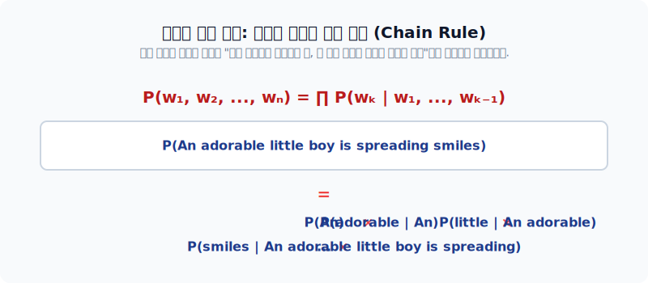
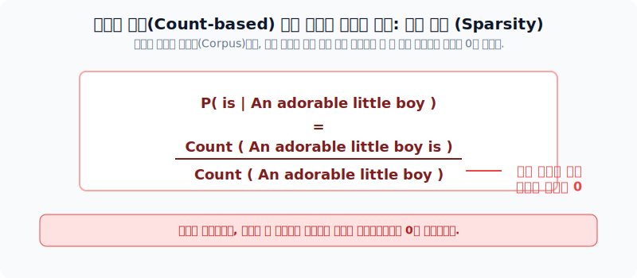
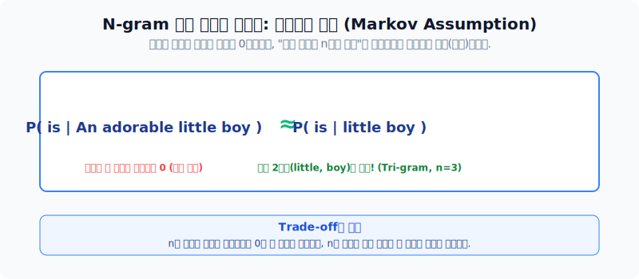
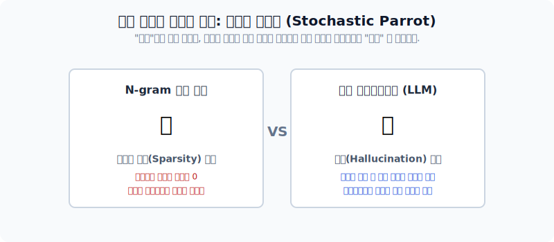

# 통계적 언어 모델(Statistical Language Model)의 개념

자연어 처리에서 "어떤 문장이 더 그럴듯하고 자연스러운가?"를 판별하는 것은 수많은 애플리케이션의 핵심 근간입니다. 이 섹션에서는 수학적 확률 기반으로 언어 현상을 모델링하는 통계적 언어 모델과 N-gram, 그리고 그 근원적인 한계에 대해 다룹니다.

---

## 1. 언어 모델(Language Model)이란?

언어 모델은 단어의 시퀀스(문장)에 확률을 할당하는 시스템입니다. "이전 단어들이 주어졌을 때, 다음에 올 단어는 무엇일까?"를 맞추기 위해 훈련 데이터로부터 단어 조합의 확률 분포를 파악(근사)합니다. 언어는 여러 대안 중 하나를 고르는 불확실한 연속 과정이기 때문에 필연적으로 수학의 **확률(Probability)** 이 개입될 수밖에 없습니다.

*확률 분포를 통해 더 자연스러운 문맥을 고르는 기계 번역, 오타 교정, 음성 인식 시나리오*

---

## 2. 조건부 확률의 연쇄 법칙 (Chain Rule)

그렇다면 전체 문장의 번역기나 음성 인식이 도출해내는 '문장이 발생할 전체 확률'은 어떻게 구할까요? 통계적 언어 모델(SLM)에서는 이를 **조건부 확률(Conditional Probability)의 연쇄 법칙**으로 정의합니다. 즉, 문장의 확률은 "앞 단어들까지 등장했을 때 다음 단어가 등장할 확률"들의 연속된 곱셈으로 쪼개어 구할 수 있습니다.

---

## 3. 통계적 한계: 희소 문제 (Sparsity Problem)

고전적인 통계적 언어 모델은 확률을 오직 카운트(등장 횟수) 기반으로 도출합니다. $P(\text{is} | \text{boy}) = \frac{\text{count(boy is)}}{\text{count(boy)}}$ 처럼 훈련 데이터(Corpus)에 존재하는 개수를 곧바로 확률로 치환합니다. 그러나 여기에는 치명적인 문제가 있습니다.

*방대한 기사들을 모두 읽어도 한 번도 등장하지 않은 특정 문구의 조합은 확률이 0이 되는 희소 문제*

---

## 4. N-gram 언어 모델과 마르코프 가정

희소 문제로 인해 문장이 조금만 길어져도 확률이 무조건 0에 수렴하는 문제를 해결하기 위해, 문장의 맨 처음부터 끝까지 전체를 다 보지 말고 **직전 $n$개의 단어만 참고하자(근사 approximation)**는 논리가 탄생하며, 이를 **N-gram 언어 모델**이라고 부릅니다. 

마치 "현재 상태만 알면 미래는 과거와 독립적이다"라고 보는 마르코프 체인(Markov Chain)의 성질을 언어에 도입하여 희소성을 줄인 아이디어입니다.

*참고하는 윈도우 크기($n$)의 조절을 통해 trade-off를 해결하려는 접근*

---

## 5. 결론: "확률적 앵무새"라는 본질적 한계

이처럼 텍스트를 카운트와 확률로만 접근하는 방식은 한계를 지닙니다. 과거 N-gram 모델의 경우는 `0`이라는 확률때문에 생성 자체가 멈춰버리는 1차원적인 불안정성이 있었지만, 문맥 창을 무한대로 키운 최신 LLM(대형언어모델) 마저도 그 본질은 통계를 기반으로 합니다.

연구자들은 최신 LLM이 인간의 언어를 지능적으로 이해한 것이 아니라, 그저 학습 데이터를 기반으로 확률에 맞춰 치장된 텍스트를 뱉어내는 **"확률적 앵무새(Stochastic parrot)"** 에 불과하다는 뼈아픈 시각을 제시하기도 합니다. 이런 맹점을 보여주는 대표적인 결과가 바로 문맥은 그럴듯하나 사실이 아닌 내용을 생성해내는 환각(Hallucination) 현상입니다.
