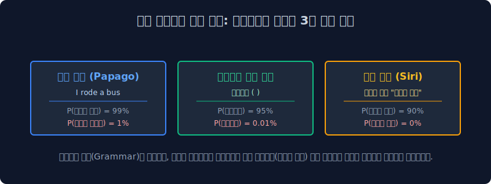

# 4.1 언어 모델의 본질: 고차원적 확률 맞추기 도박

기계가 한글과 영어를 조합해서 아름다운 한 편의 일기장 문장을 만들어 낼 때, 그 과정은 절대 인간과 같은 "창조적 고민"이나 "예술적 상상력"이 들어가지 않습니다. 그저 1초에 수천 번 $N$면체 주사위를 굴리며 빈도가 가장 높은 숫자를 찍는 무자비한 **"확률(Probability) 맞추기 도박 게임"** 에 불과하다는 씁쓸한 수학적 진실을 파헤쳐 봅니다.

---

## 4.1.1 언어 모델 (Language Model) 이란?

자연어 처리 도메인에서 "모델(Model)" 이란, 단어들이 모여 꼬리에 꼬리를 무는 시퀀스(문장)를 이룰 때, 그 단어 조합의 배열이 무작위로 섞인 미친 외계어인지 사람이 쓰는 자연스러운 문장인지를 **통계와 확률 수학 공식**으로 점수를 내어 증명하고 생성해 내는 **통계적 채점 기계**를 뜻합니다.

> [!NOTE]  
> **📖 초심자를 위한 쉬운 해설: 챗GPT의 공허한 속마음**  
> 챗GPT 인공지능은 동화책을 쓸 때 절대 뒷내용을 미리 상상하거나 기승전결(플롯)의 큰 그림을 머릿속에 그리지 않습니다. 내일 주식 시장의 차트를 예측하는 펀드 매니저처럼, 기계는 오직 과거 데이터에 기반하여 **바로 다음 번에 튀어나올 딱 한 단어(Next Token)를 예측하기 위해** 트랜스포머 레이어라는 거대한 주사위를 굴릴 뿐입니다.  
> 인공지능에게 이 주사위 굴리기는 결코 '운빨'이 아니라, **과거 수만 년 치 인류의 문학책과 위키백과 데이터 학습을 통해 극한으로 최적화 계산된 가장 높은 확률을 찾아내는 정교한 선형대수 연산**입니다.

---

## 4.1.2 다음 단어의 확률 예측 (어원 시퀀스의 승부)

언어 모델의 최종 목표는 아주 심플하고 확고합니다: 

**"과거의 이전 단어(Context)들이 쭈욱 주어졌을 때, 과연 그 바로 다음에 튀어나올 타겟 단어가 무엇일지 확률적으로 가장 압도적인 정답(Maximum Likelihood)을 고르는 것"**

자연어는 $1+1=2$ 처럼 딱 떨어지는 결정론적 정답이 존재하지 않습니다. 수십만 개의 단어 백과사전(Vocabulary) 선택지 중에서 가장 그럴싸한 단어 구슬 하나를 짚어내는 불확실성의 미학 게임입니다.

* `“오늘 점심 뭐 먹지? 나는 짬뽕 말고 ( )”` $\to$ 이 문장을 AI 머리에 입력하면, AI는 수학적 주사위를 굴려 `“짜장면” (65.2%)`, `“제육볶음” (21.4%)` 등이 나올 확률 띠 그래프를 활성화시비만, 뜬금없이 `“시멘트”`가 나올 확률은 소수점 밑바닥인 `0.00000001%`에 수렴시켜 원천 봉쇄해 버립니다.

이렇게 높은 확률로 뽑힌 1등 단어 `짜장면`을 자기가 방금 쓴 문장 뒤에 찰싹 붙인 뒤, 문장이 `“오늘 점심 뭐 먹지? 나는 짬뽕 말고 짜장면 ( )”` 으로 길어지면 **이 과정을 컴퓨터가 꺼질 때까지 무한정 반복하는 것 (Auto-Regressive)**이 바로 생성형 AI의 본질입니다.

---

## 4.1.3 자연어 확률 점수 채점표

언어 모델은 문장을 생성할 뿐만 아니라, 입력된 문장이 얼마나 인간의 문법과 맥락에 가까운지 통계적 점수를 매기는 판사 역할도 수행합니다.

| 문장 시퀀스 후보 ($W$) | 머릿속 기계적 자연어 점수 확률 모델 $P(W)$ | 평가 |
|:---|:---|:---|
| `I am going to school` | $P_A = 0.88$ (88%, 최고 확률 구역) | 👍 지극히 정상적인 인간의 자연어 |
| `School going am I to` | $P_B = 0.000000018$ (0%에 수렴) | ❌ 미친 외계어 (확률 계산 기각) |

---

## 4.1.4 언어 모델 파이프라인의 실무 적용처 (세상을 지배하는 통계 마법)

오늘날 여러분의 스마트폰에 깔려 있는 보편적인 편의 기능들은 인공지능이 무언가 대단한 문법적 사고(Grammar Thinking)를 해서가 아니라, 모두 앞서 배운 이 무자비한 **'확률론적 통계 승부 모델'**을 내장 베이스로 굴러가고 있습니다.

### 1. 기계 번역 판별기 (Papago, Google Translate)
*   사용자 입력: `I rode a bus`
*   $P(\text{나는 버스를 탔다}) > P(\text{나는 버스를 태운다})$
*   기계 번역기 엔진은 영어나 한국어의 '문법의 뜻'을 깊게 이해하지 않습니다. 그저 한국인들 말뭉치(Corpus) 데이터를 긁어 통계를 돌려보니 왼쪽 문장의 등장 빈도 확률(1,500회 등장)이 우측(2회 등장)보다 압도적으로 높기에, 수학적으로 가장 안전한 왼쪽 문장을 최종 번역 결과로 송출할 뿐입니다.

### 2. 스마트폰 자판 오토 코렉트 (오타 강제 교정)
*   사용자의 급한 타이핑: `선생님이 부리나케 자려갔다` 
*   $P(\text{달려갔다}) \gg P(\text{자려갔다})$
*   스마트폰 내장 AI는 '부리나케' 라는 부사 뒷자리에는 95% 확률로 '달려갔다' 나 '도망갔다'가 오는데 사용자의 타이핑 '자려갔다'는 확률이 0%에 가깝다는 수식을 즉각 연산해 냅니다. 따라서 오타로 판정하고 빨간 줄을 긋거나 강제로 교정해 버립니다.

### 3. 음성 인식 보정술 (Siri, Bixby, STT)
*   사용자가 시끄러운 지하철에서 이어폰 마이크에 대고 발음이 뭉개지며 말했을 때: `메ㄹ을 머자`
*   $P(\text{메론을 먹자}) > P(\text{메롱을 먹자})$
*   단순한 주파수 인식기로는 두 단어를 스펠링으로 완벽히 분리해 낼 수 없지만, 뒤에 있는 '먹는다' 라는 서술어(Context)를 참작해 보았을 때, 확률적으로 '메롱을 먹는' 행위는 한국어 데이터 상 존재 확률이 희박하므로 AI는 앞의 뭉개진 파동을 '메론(과일)'으로 100% 강제 인식 보정합니다.

그렇다면, 이토록 수식도 감정도 없이 그저 방대한 도서관 데이터 카운팅에 의존하여 통계의 도박판을 이끄는 **'다음 단어의 거대한 확률 체인'** 이 수학적으로 정확히 어떻게 곱해지고 굴러가는 것일까요? 
다음 장에서 고등학교 확률과 통계 교과서의 공식을 빌려와 그 무서운 사슬을 증명해 봅니다.
