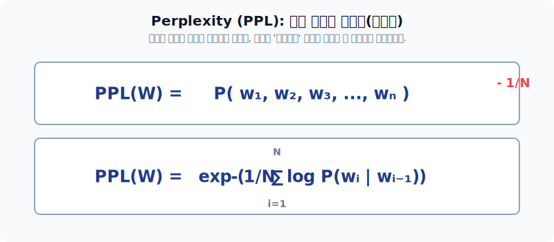
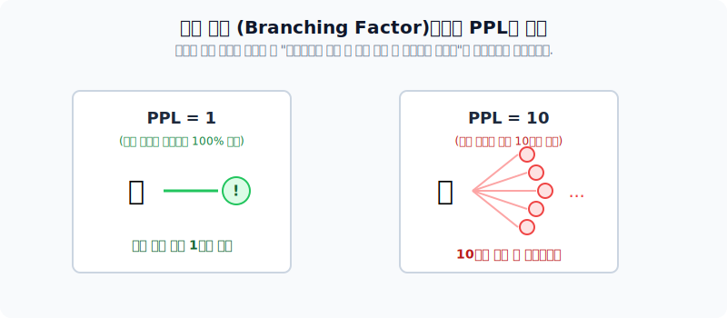
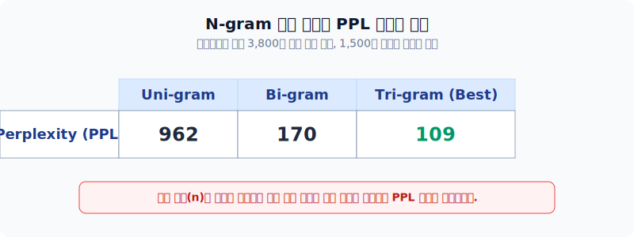

# 언어 모델의 성능 평가 지표: Perplexity (PPL)

주관식 시험(자연어 텍스트)에는 완벽한 유일 정답이 없습니다!! 정답이 없는 언어 모델의 예측 성능을 통계학과 수학 분기 계수(Branching Factor) 개념으로 날카롭게 채점하는 PPL 공식과 지표들을 배웁니다.

---

## 00. 언어모델의 성능평가 도입
우리가 앞서 만든 확률적 확률 모델이 얼마나 훌륭한 문장을 만들어 내는지, 기계 구조적으로 측정해야 합니다.

## 01. 성능 평가의 기준: 이미지 분류 vs 텍스트 생성
분류(Classifier)와 생성(Generative)은 채점 방식 자체가 아예 다를 수밖에 없습니다.

| 모델 형태 | 비유 (문제 형태) | 특징과 채점 방식 |
|:---|:---|:---|
| **이미지 객체 탐지** | **객관식 시험** (정답 딱 1개) | (강아지를 보여주며) 강아지라고 맞히면 `100점`, 고양이라고 하면 가차 없이 `0점`. 매우 직관적이고 칼같은 채점. |
| **자연어 텍스트 생성** | **주관식 논술** (정답 수만 개) | "선생님이 교실을 부리나케 ( )" $\to$ "달려갔다", "뛰어갔다", "향했다" 등 수백 개 형태가 다 말이 됩니다. 채점이 수학적으로 불명확합니다. |

## 02. 자연어 정답 기반 평가 메커니즘의 붕괴
* 만약 언어에서도 "밥을 먹었다"만을 유일한 `100점 정답`으로 잡고 평가하면? 
* 모델이 "식사를 했다"라고 완벽한 대답을 해도 기계는 `0점`으로 채점해 버립니다.
* 이런 방식으로 사람이 일일이 채점하면 비용과 시간이 극도로 낭비되며 AI 연구 속도가 박살 납니다.

## 03. 텍스트 평가지표: Perplexity (PPL) 란?
이러한 주관성 문제를 타개하기 위해 나온 수학, 정보이론 통계 지표입니다. 
* 언어모델이 다음 단어를 지칭할 때(예측할 때), **얼마나 혼란스러워하지 않고 확신을 가지고 확률을 모아서 맞췄는가**를 숫자율로 재는 것입니다.
* 퍼플렉서티(PPL, 헷갈림 정도)는 수치가 **낮을수록(덜 헤맬수록)** 절대적으로 우수한 성능의 언어모델입니다!

## 04. Perplexity (PPL) 의 무시무시한 수학 공식
$N$개의 단어로 구성된 문장 $W$의 PPL(헷갈림 지수)은, 단어 확률들의 곱을 길이에 따라 기하평균을 낸 후 역수(루트)를 취하여 계산됩니다.

$$ \text{PPL}(W) = P(w_1, w_2, \dots, w_N)^{-\frac{1}{N}} = \sqrt[N]{\frac{1}{P(w_1, w_2, \dots, w_N)}} $$

> [!TIP]  
> **📖 초심자를 위한 쉬운 해설: 헷갈린 방의 갯수**  
> 루트와 분수가 떠다니는 저 공식이 끔찍해 보이지만, 아주 쉬운 철학입니다.  
> PPL 지표는 곧 **분기 계수(Branching Factor)**를 뜻합니다.  
> 즉 문장을 생성할 때, 기계 머릿속에서 **"음, 다음 단어로 쓸데없는 후보들이 총 몇 개나 있지?"**라며 쥔 보기 카드의 갯수를 뜻합니다.  
> *   `PPL = 1` : "무조건 100% 이거야!" 하고 다른 보기를 생각조차 안 함 (천재)
> *   `PPL = 100` : "어... 다음 단어로 갈 길이 100갈래나 되는데 어디로 가지?" 이마에 땀을 뻘뻘 흘리는 수치 (바보)

## 05. 연쇄 법칙을 치환한 최종 PPL 수식 연산
우리가 이전 챕터에서 배운 연쇄법칙(Chain Rule) 덧셈 곱셈표를 저 무서운 분모(루트 구멍 안)에 집어넣어 전개해 보면,

$$ \text{PPL}(W) = \sqrt[N]{\frac{1}{\prod_{i=1}^N P(w_i \mid w_1, \dots, w_{i-1})}} $$

(각 단어가 등장할 조건부 확률을 곱한 것의 루트 역수로 깔끔하게 딱 떨어집니다!)

## 06. PPL 응용 예시: N-gram 체급별 헷갈림 차이
월스트리트 저널 데이터 3,800만 단어를 통과시킨 실험 모델의 채점 결과표입니다!

*   **1단계 (Uni-gram)**: 직전 앞 단어를 아예 안 보고 추측하는 장님 모델 $\to$ PPL이 무려 `962` (900갈림길에서 헤매는 수준)
*   **3단계 (Tri-gram)**: 앞에 나온 두 개 단어를 참고해서 추측하는 양반 모델 $\to$ PPL이 `109`로 급감! 
*   **결론**: 문맥(앞 단어)을 길게 참고할수록 컴퓨터의 헷갈림(PPL) 지수는 극적으로 하락하여 아주 똑똑해집니다!

## 07. PPL 평가방법의 주의사항: 만능은 아니다!
PPL은 모델 가중치의 수학적 성능을 자랑하기 좋지만, 인간의 공감능력을 설명해 주진 못합니다.
* PPL 결과는 단지 '지가 공부한 모의고사(테스트 데이터) 환경 안에서의 상대적인 등락'일 뿐입니다.
* 언어의 확률적인 생성 문법 능력만 쳐다볼 뿐, 모델의 발언이 진실인지 거짓인지 **비윤리적이고 의미 없는 헛소리(환각)인지에 대한 필터링 감별 기능이 전혀 없습니다!** (이것이 LLM의 근본 리스크입니다)

## 08. 현대 딥러닝 텍스트 생성 평가지표 4대장
미래의 LLM 생태계에서는 단순한 다음 단어 예측(PPL)을 넘어서, 실제로 어떤 태스크를 푸느냐에 따라 지표가 전문 분화되었습니다.

| 지표명 (Metrics) | 약자 설명 및 작동 원리 규칙 |
|:---:|:---|
| **BLEU** | 번역기 전문 채점 표 (전문가가 쓴 직역 문장과 형태소가 얼마나 수학적으로 겹치는가?) |
| **ROUGE** | 뉴스 요약 AI 전문 채점 (핵심 단어들이 하나도 안 빠지고 요약문에 쏙 담겼는가 비율 컷!) |
| **MMLU** | 고도화 지식 채점 (GPT들이 대학 법학, 의학 기출문제 시험지를 억지로 풀게 시켜서 정답률 산출) |
| **Judge (심판 모델)** | 윤리성/논리성은 수식 채점이 불가능하니, 걍 제일 똑똑한 최상위 모델(GPT-4)이 후배의 대답을 "흠, 이 대답은 논리가 빈약하네 4점" 이라고 AI가 AI를 채점해 버리는 방식! |
