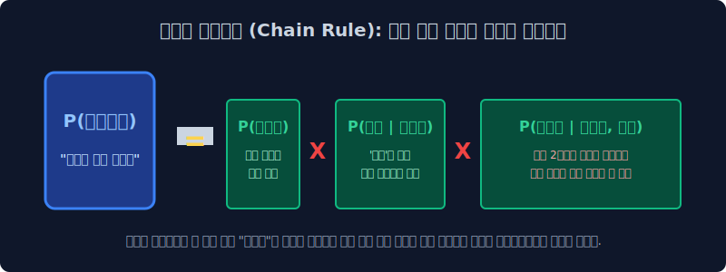

# 4.2 조건부 확률과 도미노 연쇄법칙 (Chain Rule)

전 챕터에서 컴퓨터가 "다음 단어 카운팅(Counting)"을 통해 다음 단어를 가장 로또 당첨 확률이 높은 놈으로 뽑는다는 것을 알았습니다. 그렇다면 문장 전체 데이터셋이 하나로 완성될 확률은 어떻게 수학적으로 증명(Proof)할 수 있을까요? 고등학교 수학 시간에 우리를 괴롭혔던 '조건부 확률'과 '연쇄 곱셈법칙(Chain Rule)'을 텍스트 공학 기저에 대입해 거대한 확률 사슬을 무너뜨려 봅니다.

---

## 4.2.1 과거 통계적 언어모델(SLM)의 수학적 계산 원리

과거 딥러닝 이전 시대, 일명 통계적 언어 모델(Statistical Language Model: SLM) 시대에는 뉴런 네트워크 지능이랄 게 고도화되지 않았습니다. 그냥 메모리에 "수십억 권의 책 텍스트 말뭉치(Corpus)"를 통째로 쌓아두고, 사람이 직접 엑셀 돋보기로 앞 단어가 나올 횟수를 카운트했습니다.

*   **최종 수학적 목표**: 유저가 던진 문장 전체 집합이 현실에서 자연스럽게 발생할 완벽한 결합 확률 **$P(W)$** 구하기.
*   여기서 $W$는 $n$개의 단어가 줄줄이 소시지처럼 이어진 텍스트 시퀀스 $(w_1, w_2, \dots, w_n)$ 벡터를 뜻합니다.

---

## 4.2.2 조건부 확률 (Conditional Probability) 의 필연성

단어가 하늘에서 뚝 떨어지는 사건은 서로 완벽하게 독립적인 사건(동전 던지기)일까요? 아닙니다. 주어와 동사, 명사는 앞뒤의 촘촘한 '문맥(Context)' 그물망 때문에 서로 물귀신처럼 지독하게 영향을 주고받습니다. 
따라서 자연어처리는 $P(A) \times P(B)$ 같은 독립 곱셈이 아니라, 고등학교 확률과 통계의 **조건부 확률($P(B \mid A)$)** 공식을 빌려올 수밖에 없습니다.

$$ P(B \mid A) = \frac{P(A \cap B)}{P(A)} $$
*(B라는 단어가 일어날 순수 확률은, A라는 과거의 앞 단어 사건이 이미 바닥에 터졌을 때를 가정해서 계산하여 좁혀야 한다)*

---

## 4.2.3 도미노 연쇄 법칙 (Chain Rule) 의 무거운 봇짐

> "철수가 어제 맛있는 피자를 ( )" 

문장 하나가 완벽하게 생성되기 위해서는 한 단어의 확률만 필요한 게 아닙니다. 길고 엄청난 문장은 각 단어 하나하나가 도미노 레이스처럼 연속해서 벌어지는 **연속 곱셈($\prod$, Pi Product 기호)** 의 그물망으로만 증명할 수 있습니다.

통계적 연쇄 법칙을 텍스트 모델에 적용하여 수식으로 펼치면 매우 우아한 모양이 나옵니다.
$$ P(w_1, w_2, \dots, w_n) = \prod_{i=1}^{n} P(w_i \mid w_1, w_2, \dots, w_{i-1}) $$

> [!TIP]  
> **📖 초심자를 위한 쉬운 해설: 4단어 문장의 억압된 조건부 굴레**  
> 예를 들어, `(A)철수는, (B)어제, (C)피자를, (D)먹는다` 라는 4단어로 구성된 문장의 총 발생 확률을 풀어헤쳐 보겠습니다.  
> $$ P(A, B, C, D) = P(A) \times P(B \mid A) \times P(C \mid A,B) \times P(D \mid A,B,C) $$  
> 
> * **1번 레이어 ($A$)**: `A(철수는)`는 맨 앞에 있으므로 눈치 볼 것도 없이 혼자 편하게 등장하며 베이스 확률을 깝니다.
> * **2번 레이어 ($B \mid A$)**: `B(어제)`는 이미 앞에 나타난 주어 `A`의 눈치를 철저히 보면서 자기가 튀어나올 확률을 좁힙니다.
> * **4번 마지막 레이어 ($D \mid A,B,C$)**: 마지막 종착역인 동사 `D(먹는다)`는 확률적으로 가장 불쌍하고 연산이 무겁습니다. 자기가 태어나기 위해 이미 앞에 무겁게 깔려버린 `A, B, C` 의 맥락 눈치를 **완벽하게 전부 다 살펴본(조건부 교집합) 직후에야** 자신의 확률을 결정지어 끝단에 곱해버리기 때문입니다. 
>
> 문장이 길어질수록 맨 뒤에 붙는 Token 단어는 앞선 수천 개의 조건부 단어를 눈치 봐야 하므로 컴퓨터의 연산 램 메모리(Time Complexity)가 기하급수적으로 폭발하게 됩니다.

---

## 4.2.4 그래서 각 단어의 수학 확률 숫자는 어떻게 채워 넣었을까? 

그렇다면 초기 컴퓨터 학자들은 저 세부적인 조건부 확률($P$) 숫자 결괏값들(ex: 0.14)을 도대체 어떻게 구해왔을까요? 
딥러닝의 $W \cdot x + b$ 같은 엄청난 최적화 미분 공식이 있었을 것 같지만, 허무하게도 그저 구글 서버에 저장된 **인터넷 텍스트 데이터베이스의 생짜 [출현 빈도수 수작업 카운트 비율]**에서 엑셀 초등학생 나누기로 값을 강제로 도출했습니다.

$$ P(\text{is} \mid \text{An adorable little boy}) = \frac{\text{Count}(\text{An adorable little boy is})}{\text{Count}(\text{An adorable little boy})} $$

> [!WARNING]  
> **📖 초심자를 위한 쉬운 분석: 초등학생 분수 산수 도출법**  
> 즉, 내 위키백과 데이터 하드디스크에 `An adorable little boy` 라는 긴 영어 주어 구문 덩어리가 지금까지 통틀어 딱 100번($100$) 쓰였다고 쳐봅시다. 
> 그런데 그 100번의 문장 뒷부분을 돋보기로 하나하나 다 스캔해보니 바로 뒤에 `is`가 찰싹 따라붙은 케이스 단어집이 정확히 30개($30$) 였습니다.
> 그러면 과거 학자들은 딥러닝 연산이고 뭐고 다 집어치우고 그냥 분자와 분모로 나눠서 $\frac{30}{100} = 0.3 (30\%)$ 가 되는 초등학생 수준의 명료한 산수로 그 단어의 도박 확률값을 못 박아버렸습니다.

이처럼 옛날 1900년대의 언어 모델 기술은 고도화된 선형대수가 아니라, 그저 100만 권짜리 책을 통째로 쑤셔 넣고 뒤에서 단어가 몇 번 붙었나 단순무식하게 쪼아보는 카운팅에 의존했습니다. 

그리고 이 어마무시한 무식함 때문에, 바로 다음 장에서 세상 모든 서버가 뻗어버리는 **차원의 붕괴(Sparsity 에러와 분모 0의 종말)** 라는 비참한 결말로 치닫게 되며 AI의 첫 번째 암흑기(AI Winter)가 찾아오게 됩니다.
