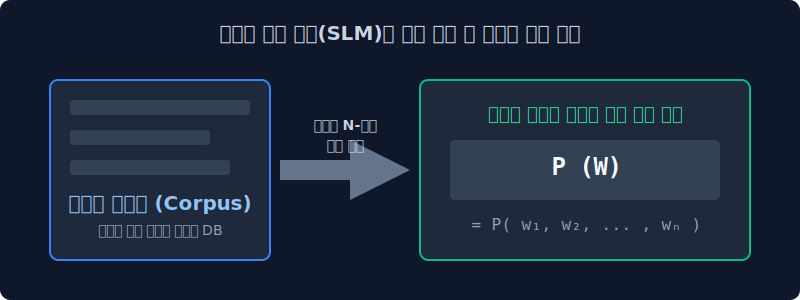
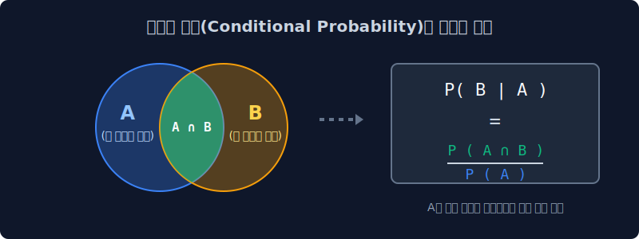
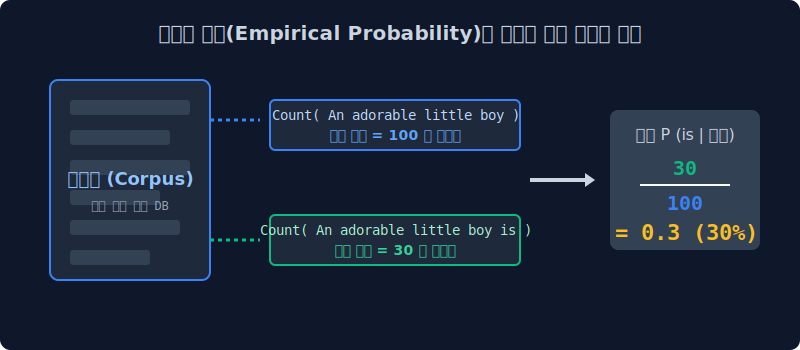

# 4.2 조건부 확률 구조와 거대한 도미노 연쇄 법칙 (Chain Rule)

전 챕터에서 컴퓨터가 "다음 단어 확률 계산"을 통해 자연어 문장을 지능적으로 직조해 낸다는 원리를 파악했습니다. 그렇다면, $N$개의 단어로 이루어진 길고 거대한 문장 전체 시퀀스가 인간의 현실 언어 세계에서 완벽하게 발생할 수 있는 종합 확률은 수학적으로 어떻게 산출하고 증명할 수 있을까요? 

고등학교 수학 교과과정에 등장하는 **'조건부 확률(Conditional Probability)'** 이론과 이를 연속적으로 확장한 **'연쇄 법칙(Chain Rule)'** 알고리즘을 텍스트 마이닝 기저에 대입하여, 거대한 통계적 언어 사슬의 연산 메커니즘을 상세히 해부해 봅니다.

---

## 4.2.1 과거 통계적 언어 모델(SLM)의 수학적 목표 지표

현대의 고도화된 트랜스포머(Transformer) 딥러닝 이전 시대, 일명 **통계적 언어 모델(Statistical Language Model: SLM)** 시대에는 뉴런 네트워크 추론 최적화의 개념이 제한적이었습니다. 

당시 학자들은 물리적 데이터 센터 메모리에 "수천만 권 분량의 책 텍스트 말뭉치(DB Corpus)"를 통째로 적재해 두고, 컴퓨터가 직접 단어의 출현 패턴을 $N$ 단위로 쪼개어 탐색하여 빈도수를 계량하는 경험적 통계 계산법에 의존했습니다.

*   **최종 수학적 목표**: 컴퓨터가 생성하고자 하는 문장 전체 시퀀스 집합이, 실제 인간의 자연어 환경에서 위화감 없이 유창하게 발생할 완벽한 **결합 확률 모형 $P(W)$** 를 구축하는 것.
*   여기서 대문자 $W$는 $n$개의 개별 단어가 차례대로 도열해 이어진 문장 텍스트 벡터 $(w_1, w_2, \dots, w_n)$ 를 의미합니다.

---

## 4.2.2 조건부 확률 (Conditional Probability) 의 수학적 필연성

글을 작성할 때 등장하는 개별 단어의 발화 사건은, 수학적으로 동전을 던지듯 서로 완벽하게 독립적인 사건(Independent Event)일까요? 결코 그렇지 않습니다. 조사가 등장하면 뒤이어 특정 동사가 확률상 압도적으로 나타나듯, 모든 어휘 쌍은 앞뒤로 촘촘히 엮인 **'문맥(Context)' 그물망** 때문에 서로 긴밀하게 상호 종속적인 확률 영향을 주고받습니다. 

따라서 자연어 처리 환경 공학에서는 두 사건이 독립적일 때 곱하는 단순 확률 곱셈식 $P(A) \times P(B)$을 채택할 수 없으며, 조건부 확률의 표본 공간 제어 공식인 **조건부 확률($P(B \mid A)$)** 방정식을 필연적으로 도입해야만 합니다.

$$ P(B \mid A) = \frac{P(A \cap B)}{P(A)} $$
*(해석: 타겟 단어 $B$가 발화될 고유 확률값은, 반드시 과거의 앞 단어 조합 $A$라는 전제 조건이 '이미 현실 세계에 발생했다'고 가정된 축소된 표본 공간 환경 내에서만 재계산 및 좁혀져야 한다)*

---

## 4.2.3 도미노 연쇄 법칙 (Chain Rule) 통계망의 무거운 봇짐

> "철수가 어제 맛있는 피자를 ( )" 

수십 개의 단어가 엮인 단 하나의 문장이 기계 내부에서 확률상으로 완벽하게 조립 생성되기 위해서는, 단 한 번의 조건부 스캔 연산만 부과되는 것이 아닙니다. 거대한 문장 길이는 각 단어 하나하나가 도미노 레이스처럼 점진적인 종속성을 띠고 연속해서 벌어지는 **연속 조건부 확률 곱셈($\prod$, Pi Product 기호)** 의 수학적 그물망으로만 증명해 낼 수 있습니다.

통계적 연쇄 법칙 알고리즘을 텍스트 배열 모델에 적용하여 산술 수식으로 펼치면 매우 정교하고 이상적인 다항 곱셈 모양이 도출됩니다.
$$ P(w_1, w_2, \dots, w_n) = \prod_{i=1}^{n} P(w_i \mid w_1, w_2, \dots, w_{i-1}) $$

> [!TIP]  
> **💡 자연어 도미노 해부: 4개 단어 문장의 억압된 조건부 굴레**  
> 예를 들어, `(A)철수는, (B)어제, (C)피자를, (D)먹는다` 라는 단순 4단어 문장의 총 발생 결합 확률을 해체해 연속 전개해 보겠습니다.  
> $$ P(A, B, C, D) = P(A) \times P(B \mid A) \times P(C \mid A,B) \times P(D \mid A,B,C) $$  
> 
> * **1번 발화 레이어 ($A$)**: `A(철수는)`는 맨 앞에 등재되므로 앞선 조건의 억압 없이 독립적 베이스 발화 확률을 깝니다.
> * **2번 발화 레이어 ($B \mid A$)**: `B(어제)`는 이미 앞단에 나타난 주어 `A`의 언어적 통계 제약을 철저히 물려받아 자기가 튀어나올 확률 표본 공간을 좁힙니다.
> * **4번 종착 레이어 ($D \mid A,B,C$)**: 마지막 종착지점 동사 `D(먹는다)`는 수학적 메모리 관점에서 가장 무자비한 컴퓨팅 연산의 부하를 겪게 됩니다. 그가 발화되기 위해서는, 본인 바로 앞부분까지 무겁게 쌓이고 깔려버린 `A, B, C` 전체의 종속 맥락 지표들을 **완벽하게 전부 다 스캔한(조건부 교집합 탐색)** 이후에야 단일 확률의 소수점을 결정지을 수 있기 때문입니다. 
>
> 이 공리 때문에, 도출 문장이 길어져 모델 끝단에 붙는 Token 단어일수록 누적된 앞선 수천 개의 거대 조건부 토큰을 일일이 관측 검색하고 의존해야 하므로 컴퓨터의 **연산 및 메모리 복잡도(Time & Space Complexity)** 가 기하급수적, 즉 지수 함수적으로 폭발하게 됩니다.

---

## 4.2.4 경험적 통계에 기반한 확률 추정 (Empirical Frequency Estimation) 

가장 궁금한 본질적 의문이자 핵심이 남았습니다. 그렇다면 초창기 컴퓨터 학자들은 저 세부적이고 끝없이 나열된 개별 조건부 확률 스코어($P$ 숫자 결괏값들, 예를 들어 0.14) 수식을 연산하기 위해 기계 내부에서 어떤 방식으로 변숫값을 산출했었을까요? 

현재의 인공 신경망 딥러닝에서 사용하는 최적화 미분 그라디언트 함수 같은 거창한 수리를 사용했을 것 같지만, 허무하게도 그들은 서버 데이터베이스에 저장된 **인터넷 텍스트 문서의 생짜 [명목상 출현 카운트 빈도수 비율]** 을 구하여 분자 분모 나눗셈으로 결괏값을 강제로 경험적 도출(Empirical Count) 해냈습니다.

수학적 한계 확률 추정 산출 공식 구조 체계는 다음과 같습니다.
$$ P(\text{is} \mid \text{An adorable little boy}) = \frac{\text{Count}(\text{An adorable little boy is})}{\text{Count}(\text{An adorable little boy})} $$

> [!WARNING]  
> **💡 카운트 기반 경험 추정법의 구조 해석과 멸망의 전조**  
> 위 공식의 직관적인 계산 과정을 살펴봅시다. 내 위키백과 데이터 하드디스크 코퍼스를 전부 검색해보니 `An adorable little boy` 라는 영어 주어 구문 덩어리가 지금까지 통틀어 딱 100회($100$) 쓰였다고 쳐봅시다. 
> 
> 그런데 그 100개의 검색된 문장 뒷부분 패턴을 시스템 돋보기로 하나하나 전부 조사(Scanning)해보니, 다른 동사가 아닌 정확히 타겟어 `is`가 찰싹 따라붙은 케이스 단어집이 일목요연하게 30개($30$) 였습니다. 
> 그러면 과거 모델 학자들은 $\frac{30}{100} = 0.3 (30\%)$ 이 되는 너무나도 명료한 단순 나눗셈 분수 산출식으로 해당 단어 시퀀스의 도박 확률값을 못 박아버렸습니다.

이처럼 구시대 통계적 언어 모델 기술은 고차원 선형대수 최적화가 아니라, 무지막지한 1백만 권 단위의 말뭉치를 때려 넣고 뒤에 단어가 정확히 몇 번 직렬로 이어 붙었는지 **물리적으로 쪼아보는 검색 카운팅 체계(Search Patterning)**에 극단적으로 의존했습니다. 

그리고 이러한 물리적 전수조사의 치명적인 한계 때문에, 이어지는 다음 장에서 **구글과 마이크로소프트 서버의 분모 값이 문자 그대로 통째로 소멸해 터져버리는 희소성 차원의 붕괴(Sparsity OOM 및 Zero Division의 종말)** 라는 대참사를 마주하게 되며 인류의 AI는 깊은 체력적 한계선에 부딪히게 됩니다.
