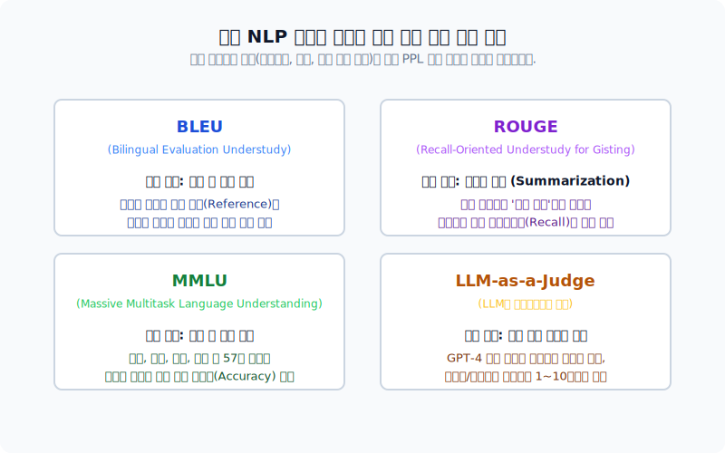

# 언어 모델(Language Model)의 성능 평가

이미지 분류는 명확한 '정답 클래스'가 있기에 정확도(Accuracy)를 쉽게 측정할 수 있습니다. 반면, 언어 모델은 "선생님이 부리나케 달려갔다"와 "선생님이 빨리 뛰어갔다"처럼 표현 방식에 따라 수많은 '정답'이 존재할 수 있기에 기존의 정확도 평가 방식으론 한계가 있습니다. 본 섹션에서는 확률 분포의 근사를 목표로 하는 언어 모델의 특성에 맞춘 고유한 성능 평가 지표를 알아봅니다.

---

## 1. Perplexity (PPL, 당혹도/혼란도)

가장 대표적인 언어 모델의 내부 평가(Intrinsic evaluation) 지표는 **Perplexity(PPL)** 입니다. 단어 그대로 모델이 다음 단어를 예측할 때 얼마나 "헷갈려하고(당혹스러워) 있는지"를 나타내는 수치입니다. 따라서 **PPL 수치가 낮을수록 훌륭한 언어 모델**을 의미합니다.

*문장의 확률의 역수를 정규화한 값으로 구하는 PPL의 수학적 정의*

의미론적으로 PPL은 모델의 **분기 계수(Branching Factor)**를 의미합니다. 모델이 다음 단어를 산출할 때 마음속으로 대략 몇 개의 가능한 오답들 사이에서 저울질(고민)하고 있는지를 직관적인 수치로 보여줍니다.

*PPL=1은 정답을 확신함(Best)을 의미하고, PPL=10은 열 가지 보기 중에서 갈팡질팡함을 의미*

실제로 방대한 월스트리트 저널 기사를 바탕으로 N-gram을 학습시켰을 때, 참고하는 문맥의 창 크기(n) 커질수록 힌트를 많이 얻어 PPL 수치가 뚝뚝 떨어짐을 관찰할 수 있습니다.

*많은 이전 단어(n)를 참고할수록 다음 예측의 불확실성이 줄어들어 PPL이 감소함*

> **[주의점]** PPL이 낮다고 해서 문장의 의미적, 사실적 '진실성'까지 훌륭하다고 보장할 수는 없습니다. 단순히 주어진 말뭉치(Corpus)의 전후 확률 분포를 유창하게 잘 모방했다는 뜻에 불과하기 때문입니다.

---

## 2. 기타 과업 특화 언어 모델 평가 지표

PPL이 언어 모델 자체의 문장 생성 능숙함을 보는 것이라면, 실제 응용 애플리케이션의 '목적'에 특화된 실무적인 평가 지표들(Extrinsic evaluation)도 활발히 쓰이고 있습니다. 

- **BLEU**: 기계 번역에서 인간이 번역한 정답지와 모델의 번역 결과가 얼마나 단어/순서 측면에서 일치하는지를 엄격하게 측정합니다.
- **ROUGE**: 문서 요약에서 사람이 뽑아낸 핵심(중요 단어)를 인공지능이 도망치지 않고(Recall) 얼마나 잘 포함했는지를 측정합니다.
- **MMLU**: 최신 LLM의 똑똑함을 잴 때 가장 흔히 쓰이는 57개 주제(의학, 법학 등)의 거대한 객관식 시험지입니다.
- **LLM-as-a-Judge**: 인간 평가자가 일일이 점수를 매기기에는 챗봇의 답변이 너무 길고 많으므로, 평가에 있어 압도적인 지능을 지닌 최상위급 LLM(예: GPT-4)을 초빙하여 후배 모델들의 퀄리티를 평가(1~10점)하게 하는 트렌디한 방식입니다.
