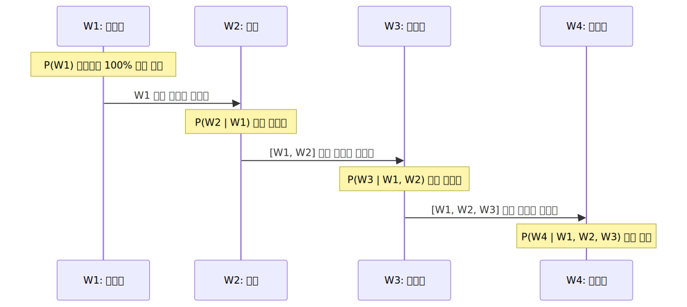

# 조건부 확률과 도미노 연쇄법칙 (Chain Rule)

전 챕터에서 컴퓨터가 카운팅을 통해 다음 단어를 가장 로또 당첨 확률이 높은 놈으로 뽑는다는 것을 알았습니다. 그렇다면 문장 1개가 완전히 생성될 확률은 어떻게 구할까요? 고등학교 수학 시간에 우리를 괴롭혔던 '조건부 확률'과 '연쇄 곱셈법칙'을 텍스트 공학에 대입해 무너뜨려 봅니다.

---

## 00. 과거 통계적 언어모델(SLM)의 수학적 계산 원리
과거 딥러닝 이전 시대(SLM)에는 지능이랄 게 없었습니다. 그냥 메모리에 "수십억 권의 책" 텍스트를 통째로 쌓아두고, 사람이 직접 돋보기로 앞 단어가 나올 횟수를 카운트했습니다.

* **목표 명제**: 문장 전체가 발생할 완벽한 확률 **$P(W)$** 구하기.
* 여기서 $W$는 $n$개의 단어가 줄줄이 소시지처럼 이어진 시퀀스 $(w_1, w_2, \dots, w_n)$ 를 뜻합니다.

## 01. 조건부 확률 (Conditional Probability)
단어가 하늘에서 뚝 떨어지는 사건은 완전히 독립확률일까요? 아닙니다. 주어와 동사 명사는 앞뒤 '문맥(Context)' 때문에 서로 물귀신처럼 지독하게 이전 단어들에 얽혀 영향을 받습니다. 
따라서 자연어처리는 고등학교 수학의 **조건부 확률($P(B \mid A)$)** 공식을 빌려올 수밖에 없습니다.

$$ P(B \mid A) = \frac{P(A,B)}{P(A)} $$
*(B라는 단어가 일어날 확률은, A라는 사건이 이미 터졌을 때를 가정해서 계산한다)*

## 02. 도미노 연쇄 법칙 (Chain Rule)의 완성
"철수가 어제 맛있는 피자를 ( )" 
문장 하나가 완성되기 위해서는 한 단어의 확률만 필요한 게 아닙니다. 길고 엄청난 문장은 단어 하나하나가 도미노처럼 연속해서 벌어지는 **연속 곱셈($\prod$, Pi 기호)** 으로 증명할 수밖에 없습니다.

수식으로 펼치면 매우 우아한 모양이 나옵니다.
$$ P(w_1, w_2, \dots, w_n) = \prod_{i=1}^{n} P(w_i \mid w_1, \dots, w_{i-1}) $$

> [!TIP]  
> **📖 초심자를 위한 쉬운 해설: 4단어 문장의 조건부 굴레**  
> 예를 들어, `A, B, C, D` 라는 4단어로 구성된 문장의 총 발생 확률을 풀어헤쳐 보겠습니다.  
> $$ P(A, B, C, D) = P(A) \times P(B \mid A) \times P(C \mid A,B) \times P(D \mid A,B,C) $$  
> 
> * 1번: `A(철수)`는 혼자 편하게 등장합니다. 
> * 2번: `B(는)`는 이미 앞에 나타난 `A`의 눈치를 보면서 튀어나올 확률을 봅니다.
> * 4번: 마지막단어 `D(먹는다)`는 가장 불쌍합니다. 자기가 태어나기 위해 이미 앞에 깔려버린 `A(철수), B(는), C(피자를)` 눈치를 전부 다 살펴본(조건부) 직후에야 자신의 확률을 결정지어 곱해버립니다. 
>
> 문장이 길어질수록 맨 뒤에 붙는 단어는 앞의 수백 개의 조건부 단어를 눈치 봐야 하므로 연산량이 기하급수적으로 폭발하게 됩니다.

## 03. 단어가 등장할 확률: 단순무식 카운트 기반
그렇다면 컴퓨터는 저 세부적인 조건부 확률($P$) 숫자값들을 도대체 어디서 구해올까요? 

엄청난 공식이 있을 것 같지만, 허무하게도 그저 구글 서버에 저장된 **인터넷 텍스트 데이터베이스의 생짜 [출현 빈도수 수작업 카운트 비율]**에서 엑셀 나누기로 가져옵니다.

$$ P(\text{is} \mid \text{An adorable little boy}) = \frac{\text{Count}(\text{An adorable little boy is})}{\text{Count}(\text{An adorable little boy})} $$

> [!WARNING]  
> **📖 초심자를 위한 쉬운 해설: 초등학생 산수 나누기**  
> 즉, 내 백과사전에 `An adorable little boy` 라는 긴 영어 구문이 지금까지 통틀어 딱 100번 쓰였다고 쳐봅시다. 
> 그런데 그 100번 중에서 바로 뒤에 `is`가 따라붙은 케이스가 30번이라면? 
> 그냥 분모 분자로 나눠서 $\frac{30}{100} = 0.3 (30\%)$ 가 되는 초등학생 수준의 명료한 산수 타겟팅입니다.

이처럼 옛날 언어모델은 우아한 수학이 아니라, 그저 100만 권짜리 책을 통째로 쑤셔넣고 뒤에서 단어가 몇 번 붙었나 단순무식하게 쪼아보는 카운팅에 의존했습니다. 그리고 이 무식함은 다음 장에서 살펴볼 **차원의 붕괴(Sparsity 에러)**라는 비참한 결말로 치닫게 됩니다.
