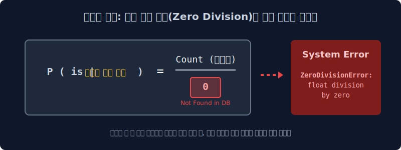
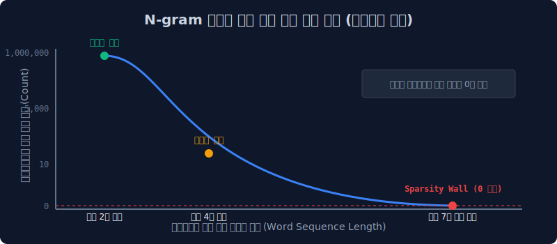

# 4.3 통계 알고리즘의 붕괴: 희소성(Sparsity)의 폭발

이전 장에서 다루었던 경험적 빈도 확률(Empirical Frequency Count) 분모-분자 추정 모델은 그 직관성에도 불구하고, 실제 라이브 서버 환경에서는 연산 도중 치명적으로 마비되어버리는 '기획 단계의 근본적 결함'을 안고 있었습니다. 전 세계의 방대한 웹 코퍼스(Corpus)가 100만 권 이상 수집되어 있다 하더라도 절대 채워지지 않는 거대한 확률의 공백 현상, 통계학에서의 **데이터 희소성(Data Sparsity)** 문제를 수학적으로 심층 진단해 봅니다.

---

## 4.3.1 카운트 기반 언어 모델의 치명적 전제 조건

이전 장에서 전개한 결합 확률 및 조건부 확률($P$) 곱셈 체계 공식은 이론적으로나 수식적으로 완벽해 보이지만, 실무 적용 상 지독한 "수학적 딜레마"를 감추고 있습니다.

$$ P(\text{is} \mid \text{An adorable little boy}) = \frac{\text{Count}(\text{An adorable little boy is})}{\text{Count}(\text{An adorable little boy})} $$

위 분수 공식 체계가 시스템 에러 없이 정상 연산되기 위해서는 상식적이면서도 불가능에 가까운 하나의 극단적 전제가 반드시 충족되어야만 합니다. 
**"컴퓨터가 지금 예측하려는 저 길고 복잡한 선행 문맥(Context) 배열 텍스트가, 세상 어딘가의 물리적인 서버 하드디스크 내부(Corpus 모수)에 단 하나도 토시가 틀리지 않은 똑같은 형태로 수집되어 `Count` 가 무조건 1 이상 미리 확보되어 있어야 한다"**는 조건입니다.

---

## 4.3.2 데이터셋에 일치하는 문장이 지구상 존재하지 않는다면?

사용자가 창의성을 발휘하여 아주 특이한 문학적인 은유 수식어를 연거푸 붙여 챗봇에게 아래와 같이 타이핑을 입력했다고 가정해 봅시다.

> **"지옥의 유황불에서 디스코 춤을 추는 파란색 솜사탕이 ( ? )"**

해당 문장은 단어들의 지엽적인 결합일 뿐 문법적으로나 구문론적으로는 어떠한 구조적 오류도 발견할 수 없는 완전한 자연어 문형입니다. 
하지만 구글이나 네이버 서버가 확보한 거대한 텍스트 데이터베이스 전체를 전부 샅샅이 스캐닝해 보아도, 심지어 100년 치 신문 기사와 방대한 웹 커뮤니티 댓글들을 병렬 크롤링해 조회해보아도, **저 7어절짜리 문맥 토큰 배열 시퀀스와 '완벽히 일치하는 기록 데이터 패턴'은 우주에 단 한 줄도 존재하지 않습니다!** 
인류 역사상 그 누구도 저러한 기괴하고 구체적인 문맥의 텍스트 덩어리를 통계 서버에 카운팅 되도록 게시판에 타이핑한 적이 한 번도 없기 때문입니다.

---

## 4.3.3 분모가 소멸하는 대참사 (Zero Division Error 체제)

이때 서버의 내부 데이터베이스 조회 매핑(`Count`) 함수는 일치 항목을 찾지 못하고 자비 없이 기계적인 숫자 `0`을 반환합니다. 그리고 이 `0`이 확률 계산식의 밑바닥 분모 위치에 깔리는 순간, 연산 시스템 파이프라인의 지옥이 열립니다.

$$ P(\text{is} \mid \text{지옥의 솜사탕}) = \frac{\text{Count}(\text{지옥의 솜사탕 is})}{\mathbf{0}} $$

> [!CAUTION]  
> **💡 희소 차원의 붕괴 (Sparsity Error) 와 서버 셧다운**  
> 전 세계의 어떠한 첨단 슈퍼컴퓨터라도 현대 수학의 룰 위에서 분모(밑바닥)가 `0`이 되는 연산은 물리적으로나 논리적으로 절대 처리할 수 없습니다! (Division by Zero) 
> 
> $\to$ 파이썬(Python) 엔진 프로그램 메모리는 경험적 확률 모델이 이 수식을 마주하는 즉시 **`ZeroDivisionError`** 치명적 예외(Exception) 알림을 콘솔에 띄우며, 번역기나 챗봇 메인 서버의 프로세스 스레드(Thread) 자체를 강제로 블루스크린 처리하고 셧다운(Shut-down) 시켜버립니다.
> 
> 기계가 매끄러운 번역이나 생성을 이행하려면 이론적으로 '무한대'에 가까운 모든 텍스트 문맥 조합 다항 쌍 데이터가 미리 확보되어야 합니다. 그러나 인간 언어가 창조할 수 있는 수백억 갈래의 단어 순열(Sequence Combinations) 대비, 실제로 인간이 글로 타이핑해서 데이터베이스로 존재하는 표본 조각은 바닷물 한 방울 수준으로 극히 일부에 불과합니다. 결국 대부분의 차원 메모리 매트릭스 테이블 영역이 공백의 암흑 물질로 텅 비어 버리는 이 막막한 수학적 현상을, 인공지능 학계에서는 **차원의 저주(Curse of Dimensionality)** 에 얽힌 **데이터의 희소성(Sparsity)** 직면 문제라고 정의합니다.

---

## 4.3.4 기하급수적 한계 관측 곡선 (분량에 비례하는 통계 체계의 붕괴)

인류는 일상적 대화 환경에서 문장을 구사할 때 결코 명사구 단어 2개 수준으로 발화를 단절하지 않습니다. 수식하는 서술어나 관형어를 꼬리에 붙여 타겟 문장이 길어질수록, 그 길고 거대한 문장 시퀀스 전체가 인터넷 서버 덤프 데이터에 '우연히 단 한 글자 띄어쓰기도 안 틀리고 똑같이 존재할 확률 스탯'은 기하급수적으로 극악하게 땅바닥으로 곤두박질칩니다.

*   `Count("소년이")` $\to$ 너무나 평범한 2-gram 명사구 표본입니다. 인터넷 크롤링 데이터베이스에 파싱 하면 100만 건 카운트가 거뜬히 확보됩니다. (안전함)
*   `Count("착한 소년이")` $\to$ 수식어가 단 한 개만 붙기 시작해도 조회 카운트 쿼리 결과가 즉시 5천 건으로 급감합니다.
*   `Count("어제 전학 온 매우 착한 안경 쓴 소년이")` $\to$ 놀라울 것 없이 시스템은 **카운트 Zero ($0$건)** 를 출력합니다.
*   **시퀀스 어순 파괴(Sequence Constraint)**: 심지어 동일 문장에서 "안경 쓴"과 "착한" 의 어순을 살짝만 뒤바꾸더라도 컴퓨터 해시 체계 입장에서는 이 배열을 완전히 별개인 신규 독립 문자열(Hash Pattern)로 취급하여 또다시 융통성 없이 카운트 값이 `0` (Sparsity Server Error) 으로 폭발해 버립니다.

---

## 4.3.5 메모리 한계선에 부딪힌 학계의 타개책: 마르코프 단절의 도입

조건부 확률의 연쇄 법칙(도미노 체인) 수식 구조를 원형 그대로 유지하며 긴 문장을 매끄럽게 통계화하고 싶었던 구시대 언어모델(SLM) 공학자들은 이 거대하고 잔혹한 `제로(0) 분모` 장벽 한계선 앞에서 절망했습니다. 문장이 고작 3어절 이상 길어지기만 하면 검색 모수 탐색 결과가 `0`으로 치달아 조건부 연쇄 확률 곱셈 파이프라인의 연속 파동이 중간에 강제로 셧다운 되어 버렸기 때문입니다.

이러한 구조적 컴퓨팅 연산 불가능성을 수학적으로 타개해 내기 위하여, 통계 학자들은 우아하고 고차원적이었던 체인 곱셈 수식의 완벽함을 일부 포기하고 치명타적인 선언을 결심하게 됩니다. 

> *전체 문장이 생성되기까지 그 오랜 과거의 모든 누적 문맥(Full Context History)을 전부 곱해 고려해서 완벽한 확률을 구하는 행위는, 현재의 메모리 데이터베이스 용량과 CPU 연산 체계상 수학적으로 불가능하다. **따라서 오래된 과거 기억은 컴퓨팅 램 영역에서 강제적으로 쳐내 삭제(Truncation)해버리고, 오직 바로 직전의 몇 개 단어 조건만을 확률 공식의 모수로 삼아 눈 가리고 아웅하는 근사치(Approximation)를 도출하자!***

이러한 고육지책 타협의 산물로서 탄생한 거대한 프레임워크가 바로, 이다음 장에서 중점적으로 해부해 볼 현재 컴퓨팅 생성 알고리즘 기반의 뼈대 기술인 **N-gram 구조와 확률적 마르코프 체인(Markov Chain) 파편화 모델**입니다.
