# 통계의 붕괴: 희소성의 폭발 (Sparsity)

전 챕터에서 빈도수를 구하기 위해 분모와 분자를 구하던 초등학생 수준의 나누기 통계 모델은 사실 현실 세계에서 아예 박살 나서 쓸 수 없는 치명적인 결함 공식이었습니다. 인터넷에 아무리 책이 많아도 절대 채워지지 않는 구멍, **데이터 희소성(Sparsity)**의 덫을 살펴봅니다.

---

## 00. 카운트 기반 언어모델의 치명적 한계
이전 장에서 배운 조건부 확률 곱셈 공식은 완벽해 보이지만, 철저하게 "수학적 함정" 하나를 감추고 있습니다.

$$ P(\text{is} \mid \text{An adorable little boy}) = \frac{\text{Count}(\text{An adorable little boy is})}{\text{Count}(\text{An adorable little boy})} $$

이 분수 공식이 성립하려면 아주 당연하게도, **세상 어딘가의 서버에는 무조건 문맥이 통째로 저장된 `Count` 모수가 미리 세팅되어 있어야** 합니다.

## 01. 내가 쓴 소설 문장이 지구상에 없다면? 
사용자가 아주 특이하게 문학적인 수식어를 연거푸 붙여서 아래와 같이 질문을 던졌다고 가정해 봅시다.

> **"지옥의 유황불에서 춤추는 파란색 솜사탕이"**

이 문장은 문법적으로는 한국어로서 아무런 오류가 없습니다. 
하지만 구글이나 네이버 서버의 텍스트 데이터베이스(Corpus) 전체를 다 뒤져봐도, 100년 치 신문 기사를 다 스캔해 봐도, 일치하는 텍스트 덩어리를 **단 한 줄도 절대 찾을 수 없습니다!** 
아무도 저런 기괴한 문맥의 덩어리를 인터넷에 쓴 적이 없기 때문입니다.

## 02. 분모가 0이 되는 참사 (Zero Division Error)
이때 서버의 데이터베이스 조회 결과(Count)는 자비 없이 `0`을 반환합니다.

$$ P(\text{is} \mid \text{지옥의 유황불 솜사탕}) = \frac{\text{Count}(\text{지옥의 유황불 솜사탕 is})}{\mathbf{0}} $$

> [!CAUTION]  
> **희소 문제 (Sparsity Problem)의 종말**  
> 전 세계 어떤 슈퍼컴퓨터라도 수학에서 분모(밑바닥)가 `0`이 되는 연산은 처리할 수 없습니다! $\to$ 파이썬 프로그램은 그 즉시 치명적인 **Divide by Zero** 에러 창을 띄우며 번역기 챗봇 서버 자체를 강제로 셧다운 시켜버립니다.
> 
> 기계가 똑똑해지려면 무한대에 가까운 모든 텍스트 문맥 조합 쌍 데이터가 필요한데, 우주상의 어떤 서버 구멍도 인간이 지어낼 수 있는 수백억 갈래의 단어 순서 조합(Sequence)을 다 엑셀로 저장해 둘 수는 없습니다. 이렇게 메모리에 없는 텅 빈 공간(구멍)을 데이터가 휘발성으로 비어 있다고 하여 **희소성(Sparsity)** 문제라고 부릅니다.

## 03. 긴 문장에 대한 불가능의 영역
문장이 기하급수적으로 길어질수록, 그 긴 문장 덩어리가 인터넷 서버에 통째로 우연히 똑같이 존재할 확률은 로또 1등에 맞는 것보다도 더 극악하게 떨어집니다.

*   `Count("소년이")` $\to$ 구글에 검색하면 100만 권 나옵니다. (안전함)
*   `Count("착한 소년이")` $\to$ 5천 권으로 확 줍니다.
*   `Count("어제 전학 온 매우 착한 소년이")` $\to$ 단 한 권도 없습니다! 바로 **희소성 에러 폭발(Sparsity)**! 카운트가 `0`이 됩니다.

## 04. 진퇴양난에 빠진 통계 학자들
통계적 언어모델(SLM)을 신봉하던 학자들은 이 카운터 장벽 앞에서 절망했습니다. 연쇄 법칙(도미노) 수식으로 긴 문장을 끝까지 완벽하게 이어가고 싶은데, 문장이 3단어 이상 길어지기만 하면 구글 데이터베이스에 검색 결과 0(Sparsity)이 떠서 연쇄 확률 곱셈이 중간에 끊어지고 파괴되어 버렸기 때문입니다.

이를 타개하기 위해, 학자들은 자존심을 굽히고 "아, 전체 문맥을 완벽히 다 보는 건 수학적으로 에바다. **그냥 어거지로 편법을 써서 눈 가리고 아웅하자!**" 라며 잔머리를 굴린 대안을 긴급히 내놓게 됩니다. 

그 타협의 산물이 바로 다음 장에서 소개될 **N-gram 마르코프 체인 모델**입니다.
