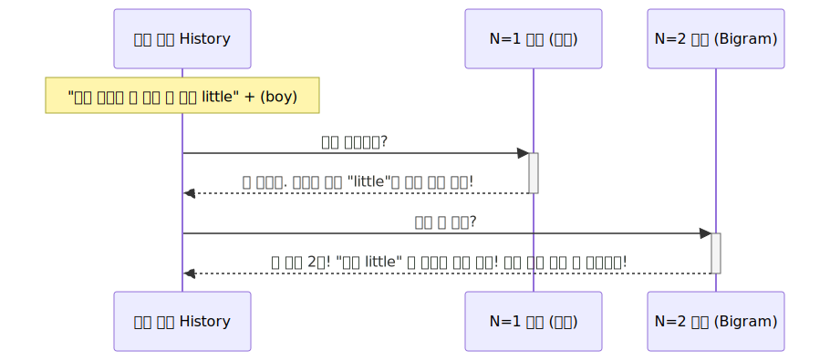

# 근시안적 타협의 꼼수: N-gram 마르코프 체인

문장이 세 단어 이상만 넘어가도 빈도수 0원(Sparsity)이 찍히며 분모 붕괴 에러를 맞이했던 컴퓨터 학자들은 결국, 완벽주의를 내려놓고 과거 확률의 일부분을 뭉텅 잘라서 쓰레기통에 버려버리는 '근시안적 통계의 꼼수'를 창안합니다.

---

## 00. 언어모델의 진화 타협점: 시야 가리기 (N-gram)
기존의 완벽한 수식은, 현재 단어 확률을 구하기 위해 앞에 나왔던 전체 주어나 수식어(History)를 모조리 하나도 빠짐없이 쳐다보았습니다. 그러니까 데이터가 부족해서 에러가 났죠.

이를 타개하기 위해 엄청난 잔머리(근사화, Approximation)를 굴렸습니다. 문맥 전체를 통째로 보려는 완벽주의를 포기하고, 앞의 길었던 주어들을 쿨하게 눈 감고 싹 다 버려버립니다. 그리고 오직 **"이전 단어 $N$개"** 만 타겟으로 보고 확률을 맞추기로 타협합니다.

### 수학적 타협 (근사화) 의 현장 
*   **(완벽주의 원본 모형)** $P(\text{is} \mid \text{어제 전학을 온 안경 쓴 착한 little boy})$
*   **(N-gram 근사 적용 꼼수)** 앞에 다 버리고 마지막 문맥 단어 하나 타협 $\approx P(\text{is} \mid \text{boy})$

> [!TIP]  
> **📖 초심자를 위한 쉬운 해설: 치매 노인의 대화**  
> `N-gram 모델`은 마치 엄청난 단기 기억상실증에 걸린 할아버지와 같습니다. 방금 전 1분 동안 무슨 긴 이야기를 나눴는지는(어제 전학 온~) 완전히 까먹어버렸지만, 오직 방금 상대방 입에서 나온 **마지막 한 단어(boy)** 에만 온 신경을 집중해서 잽싸게 다음 단어를 눈치껏 맞장구치는(`is`) 신들린 스킬입니다.

## 01. 이 꼼수가 정당화되는 이유: 마르코프 체인 (Markov Chain)
단어들을 그냥 마음대로 잘라버려서 버리는 행위가 수학적으로 죄를 짓는 것은 아닐까요? 놀랍게도 통계학에서는 이를 **'마르코프 성질(Markov Property)'** 이라는 유명한 철학으로 아름답게 합법화시켜 버립니다.

> **마르코프 성질**: "현재의 상태가 미래로 나아가기 위해, 너무나 아득하게 먼 과거 확률 데이터 요소들은 구태여 끌어올 필요가 없고, 오직 **아주 최근에 일어난 직전 상태 데이터 하나만**으로도 충분히 논리적으로 독립적이다."

즉, 저 멀리 앞에서 화자가 `어제` 라고 말했든 `전학 온` 이라고 말했든 간에 현재 문맥(동사)을 지배하는 건 바로 가장 가까이에 붙어있는 코 닿을 거리의 영단어 `boy` 라는 통계학적 베팅입니다.

## 02. N-gram 체급별 기억상실증 상태 분석
자르는 단위(`N`)에 따라 컴퓨터의 시야(기억력) 한계가 급변합니다.

*   **1단계 (Uni-gram, $N=1$)**: 이건 치매를 넘어 앞 장에서 무슨 일이 일어났는지 아예 인지 자체를 안 합니다. 앞의 단어가 뭐든 상관없이 그냥 자기가 읊고 싶은 빈도수 1위 글자(`is`)를 질러버립니다. 
*   **2단계 (Bi-gram, $N=2$)**: 바로 직전에 나왔던 한 개의 단어만 참고해서 다음 확률($\text{is}$)을 추측합니다. ($\approx P(\text{is} \mid \text{boy})$)
*   **3단계 (Tri-gram, $N=3$)**: 앞에 나온 두 개 단어를 참고해서 추측하는 나름 시야가 넓은 양반 모델입니다. ($\approx P(\text{is} \mid \text{little boy})$)

## 03. N-gram 편법의 한계점 (눈물의 붕괴)
마르코프 성질에 기대어 Sparsity 에러를 교묘하게 피한 것처럼 보이지만, 결국 '기억 상실'이라는 본질 때문에 문맥이 조금만 길고 복잡하게 꼬이면 또 한 번 모델이 바보가 되어버립니다.

### 🔴 롱-텀 디펜던시 (Long-term Dependency) 장기 기억 상실
언어는 가끔 **아주 멀리 떨어져 있는 과거의 단어가 현재의 뜻을 지배**하는 경우가 생깁니다.

> "철수가 어제 마트에서 사온 아주 빨갛고, 둥글고, 탐스럽게 열린 저 **( )**."

정답은 **'사과'** 입니다. 사람은 저~~ 멀리 있는 과거의 '빨갛고', '둥글고'를 머릿속에 계속 간직하고 읽기 때문에 100% 사과를 맞출 수 있습니다. 
하지만 우리의 N-gram 마르코프 치매 기계($N=2$)는 직전에 들은 `탐스럽게 열린 저` 두 단어 정보밖에 뇌 속에 없습니다! 이것만 보고 어떻게 확률적으로 앞의 과일(사과)를 알아낼까요? 불가능합니다. 

결국 이 고전 통계의 치명적인 시력(시야 확보)을 완전히 파괴적 혁신으로 고치기 위해, 인류의 천재들은 2017년에 모든 이전 단어들을 한 눈에 스캔하는 **[Attention (어텐션 눈치술)]** 이라는 트랜스포머 AI 딥러닝 흑마법 책을 펼치게 되며 역사가 바뀌게 됩니다.
