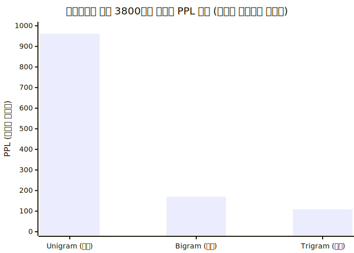

# 언어 모델의 채점관: Perplexity (PPL) 와 헷갈림 분기

우리가 앞서 만든 앞단어 찍기 확률적 모델이 얼마나 훌륭한 문장을 만들어 내는지, 기계 구조적으로 점수를 판별하여 채점해야 합니다. 정답이 아예 존재하지 않는 자연어 텍스트 문장을 수학적으로 채점하는 우아하고 소름 돋는 PPL 공식을 배웁니다.

---

## 00. 성능 평가의 기준: 이미지 분류 vs 자연어 채점
자연어 모델은 평가 메커니즘 자체가 이미지를 처리하는 AI와 아예 다를 수밖에 없습니다.

| 모델 형태 | 비유 (문제 형태) | 특징과 채점 방식 |
|:---:|:---|:---|
| **이미지 객체 탐지** | **객관식 시험** (정답 딱 1개) | (강아지를 보여주며) 컴퓨터가 `강아지`라고 맞히면 `100점`, `고양이`라고 하면 가차 없이 `0점`. 매우 직관적이고 칼같은 산술 채점. |
| **자연어 확률 모델** | **주관식 논술** (정답 수만 개) | "선생님이 교실로 부리나케 ( )" $\to$ `달려갔다`, `뛰어갔다`, `향했다` 등 수백 개 명제가 다 말이 됩니다. 객관식 채점이 수학적으로 불가능합니다! |

## 01. 자연어 일대일(1:1) 정답 기반 평가의 붕괴
만약 언어에서도 "밥을 먹었다"만을 유일한 `100점 정답`으로 잡고 딥러닝을 평가하면 어떻게 될까요? 
모델봇이 "식사를 했다"라고 완벽한 대답을 도출해도 기계는 문자가 다르다며 자비 없이 `0점 처리`를 해버립니다. 이런 빡빡한 방식으로 사람이 직접 붙어 다니며 하나하나 리뷰 채점하면 연구 속도는 완전히 박살 나버립니다.

## 02. 구세주의 등장: Perplexity (PPL) 란?
이러한 주관성 문제를 타개하기 위해 나온 수학-정보이론 통계 지표입니다. 
* 언어모델이 다음 단어를 지칭할 때(예측 확률을 뿜어낼 때), **얼마나 마음속으로 혼란스러워하지 않고 확신에 차서 확률을 맞췄는가**를 숫자율로 재는 심리 채점기입니다.
* 퍼플렉서티(PPL, 헷갈림 정도)는 십장생의 수치가 **낮을수록(덜 헤맬수록)** 절대적으로 우수한 성능의 언어모델입니다!

## 03. Perplexity 의 무시무시한 수학 공식
$N$개의 단어로 구성된 문장 $W$의 PPL(헷갈림 지수)은, 단어 확률들의 곱을 문장의 길이에 따라 기하평균을 낸 후 역수(루트)를 취하여 계산됩니다. 아, 말이 너무 어렵죠?

$$
PPL(W) = P(w_1, w_2, \dots, w_N)^{-\frac{1}{N}} = \sqrt[N]{\frac{1}{P(w_1, w_2, \dots, w_N)}}
$$

> [!TIP]  
> **📖 초심자를 위한 쉬운 해설: 헷갈린 방(갈림길)의 갯수**  
> 루트와 분수가 무섭게 떠다니는 저 공식이 사실 까보면 아주 쉬운 철학입니다.  
> PPL 지표는 곧 컴퓨터 과학의 **분기 계수(Branching Factor)**를 뜻합니다.  
> 즉 문장을 생성할 때, 기계 머릿속에서 **"음.. 다음 단어로 쓸데없는 후보들이 내 보기에 총 몇 개나 있지?"**라며 쥔 오지선다 보기 카드의 갯수를 뜻합니다.  
> *   `PPL = 1` : "무조건 100% 다음 단어는 이거야!" $\to$ 정답이 명확해 다른 보기를 생각조차 안 함 (천재)
> *   `PPL = 100` : "어... 다음 단어로 갈 길이 100갈래나 되는데 어디로 가지?" $\to$ 이마에 땀을 뻘뻘 흘리는 수치 (바보 멍청이)

## 04. 연쇄 법칙을 치환한 최종 PPL 수식 연산
따라서 우리가 앞선 챕터에서 배웠던 그 지독한 연쇄법칙(Chain Rule, 과거 조건 다 끌고 오기) 곱셈표를 저 무서운 분모(루트 구멍 안)에 집어넣어 전개해 보면,

$$ \text{PPL}(W) = \sqrt[N]{\frac{1}{\prod_{i=1}^N P(w_i \mid w_1, \dots, w_{i-1})}} $$

각 단어가 등장할 조건부 확률을 곱한 것의 통계적 역수 루트값으로 수학의 이가 딱 맞아떨어집니다!

## 05. 실전 적용: N-gram 체급별 헷갈림(PPL) 차이
월스트리트 저널의 데이터 3,800만 단어를 통과시킨 고전 모델의 채점표입니다.

*   **1단계 (Uni-gram 장님)**: 직전 앞 단어를 아예 안 보고 추측하는 무식한 모델 $\to$ 채점 결과 PPL이 무려 **`962`** (900개의 갈림길에서 갈팡질팡 식은땀을 흘림)
*   **3단계 (Tri-gram 양반)**: 그래도 앞에 나온 두 개 단어를 참고해서 추측하는 양반 모델 $\to$ PPL이 **`109`** 로 확 떨어지고 확신에 찹니다! 
*   **통계 결론**: 문맥(앞 단어 기록)을 조금이라도 더 길게 기억하고 참고할수록 컴퓨터의 헷갈림(PPL) 지수는 극적으로 안정화되며 무척 똑똑해집니다!
