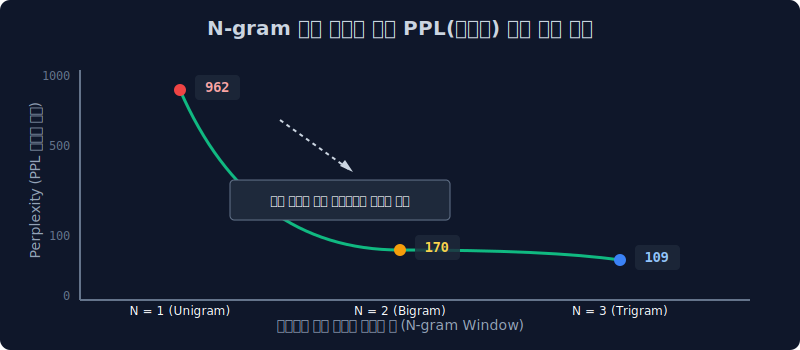

# 4.5 언어 모델의 가혹한 채점관: Perplexity (PPL) 와 분기수학

우리가 앞서 수학적으로 만든 단어 찍기 통계 확률 모델이 구글 검색엔진에 상용화될 만큼 훌륭한 문장을 만들어 내는지, 기계 구조적으로 점수를 판별하여 채점하는 척도가 필요합니다. 정답이 아예 정해져 있지 않은 자연어 텍스트 도메인을 마치 객관식 수학처럼 채점해 내는 우아하고 무서운 수학 지표 **PPL(혼란 분기 계수)** 공식을 파헤쳐 봅니다.

---

## 4.5.1 성능 평가의 기준 구조적 차이: 객체 탐지 vs 언어 채점

자연어 모델은 평가 메커니즘 자체가 이미지를 처리하는 컴퓨터 비전(Vision) AI와 아예 궤를 달리할 수밖에 없습니다.

| 모델 생태계 | 시험 문제의 형태 | 특징과 채점 방식 |
|:---:|:---|:---|
| **컴퓨터 비전 (객체 탐지)** | **객관식 O/X 시험** (정답 딱 1개) | (강아지 사진을 보여주며) 컴퓨터가 `강아지`라고 맞히면 `100점`, `고양이`나 `오리`라고 오답을 말하면 가차 없이 `0점`! 매우 직관적이고 칼같은 산술 채점. |
| **자연어 (확률 생성 모델)** | **무한 주관식 논술** (정답 수만 개) | "선생님이 교실로 부리나케 ( ? )" $\to$ 빈칸에 `달려갔다`, `뛰어갔다`, `도망갔다`, `향했다` 등 수백 개의 동사가 다 말이 됩니다. 객관식 O/X 채점이 수학적으로 완전 불가능합니다! |

---

## 4.5.2 자연어 일대일(1:1) 정답 기반 평가의 산술적 붕괴

이런 무한한 자연어의 자유도 환경에서, 만약 딱딱한 기존 컴퓨터 룰셋팅 방식처럼 `"밥을 먹었다"만을 유일한 100점 정답 표본` 으로 잡고 딥러닝 AI 채점 스크립트를 짜면 어떻게 될까요? 

모델 챗봇이 "식사를 성공적으로 마쳤다"라는 완벽한 문장 대답을 창조해도 기계는 *"스펠링 글자와 String Array가 다르다! 오답!"* 이라며 자비 없이 `0점 처리`를 해버립니다. 이런 빡빡한 방식으로 사람이 직접 모델 뒤에 따라다니며 일일이 읽어보고 채점하면 AI 연구 속도는 완전히 박살 나버립니다.

---

## 4.5.3 구세주의 등장: Perplexity (PPL) 의 철학

이러한 주관성 문제를 일거에 타개하기 위해 통계-정보이론 학계에서 꺼내온 절대적 평가 지표가 바로 PPL(Perplexity)입니다. 
*   **Perplexity (헷갈림, 당혹감)**: 언어 모델이 다음 단어를 지칭할 때(예측 확률을 뿜어낼 때), **얼마나 마음속으로 당황하지 않고 확신에 차서 정답의 확률 통계를 좁혀냈는가**를 구체적인 숫자로 모니터링하는 심리 채점기입니다.
*   PPL 수치는 높을수록 헤매는 바보 멍청이 깡통입니다. **숫자가 낮을수록(덜 헤맬수록) 절대적으로 우수한 성능의 언어 모델**입니다! 

> [!TIP]  
> **📖 초심자를 위한 쉬운 해설: 머릿속 수만 개의 갈림길 방(Room)의 갯수**  
> PPL 지표는 곧 컴퓨터 공학의 **분기 계수(Branching Factor)**를 뜻합니다.  
> 즉 문장을 1단어 1단어씩 생성할 때, 기계 머릿속에서 **"음.. 이 다음에 타겟 단어로 쓸데없는 후보들이 내 보기에 총 몇 개나 활성화되어 있지?"**라며 들고 있는 오지선다 보기 카드(분기)의 개수를 뜻합니다.  
> *   `PPL = 1` : "무조건 100% 다음 단어는 이거야 다른 건 수학적으로 없어!" $\to$ 정답이 명확해 다른 보기를 생각조차 안 함 (확신의 천재)
> *   `PPL = 5,000` : "어... 다음 단어로 갈 수 있는 경우의 수가 너무 많은데 5,000갈래 중 어디로 가지?" $\to$ 이마에 땀을 뻘뻘 흘리는 수치 (방황하는 깡통 모델)

---

## 4.5.4 Perplexity 의 무시무시한 역수 연쇄 공식

루트와 분수가 떠다니는 수식이지만 원리는 간단합니다. $N$개의 단어로 구성된 문장 $W$의 PPL(헷갈림 지수)은, **각 단어가 뜰 확률($P$)의 교집합 곱들**을 **문장 전체 길이 수($N$)**에 따라 기하평균을 낸 후, **역전(역수 루트)**을 취하여 뒤집어서 산출합니다.

$$
PPL(W) = P(w_1, w_2, \dots, w_N)^{-\frac{1}{N}} = \sqrt[N]{\frac{1}{P(w_1, w_2, \dots, w_N)}}
$$

우리가 배웠던 그 지독한 마르코프 체인 연쇄 곱셈 조건부 확률, $P(W) = \prod_{i=1}^N P(w_i \mid w_1, \dots, w_{i-1})$ 을 확률 공간 분모(루트의 바닥)에 집어넣어 최종 전개해 보면 아래와 같이 PPL 수식이 완벽히 수학적으로 귀결됩니다.

$$ \text{PPL}(W) = \sqrt[N]{\frac{1}{\prod_{i=1}^N P(w_i \mid w_1, \dots, w_{i-1})}} $$

---

## 4.5.5 실전 지표: N-gram 체급별 헷갈림(PPL) 점수 채점표 

실제로 2000년대 초기 영어권 월스트리트 저널의 코퍼스 3,800만 자 배열 훈련 데이터를 통과시킨 고전 통계 모델의 채점 성적표를 확인해 봅시다! 

1.  **눈먼 장님 (Uni-gram, $N=1$)**: 직전 과거의 단어를 아예 안 보고 현재 한 단어만으로 추측하는 무식한 단절 모델 
    $\to$ 채점 결과 PPL 기하평균 점수가 무려 **`962점(962 갈래)`** 이 뜹니다! (900개가 넘는 사지선다 객관식 보기 앞에서 식은땀을 흘리며 방황함)
2.  **기초 렌즈 (Bi-gram, $N=2$)**: 바로 앞 딱 1단어(역사)를 컨닝해서 두 단어의 확률 관계를 지어 본 기초 모델 
    $\to$ PPL 점수가 기하급수적으로 **`170점`** 으로 폭락(성능 진화)하며 안정을 찾습니다!
3.  **지식의 안경 (Tri-gram, $N=3$)**: 앞에 나온 무거운 두 개의 연속된 단어 맥락을 모두 외워 통계를 추측하는 양반 모델 
    $\to$ PPL 점수가 무려 **`109점`** 까지 극적으로 떨어지며 단어 생성에 대한 '통계적 확신'에 차오릅니다! 

**통계의 절대 결론**: 문맥(앞 단어 기록) 히스토리를 1개에서 2단어, 3단어로 조금이라도 더 길게 외우고 눈치 본 모델일수록 컴퓨터의 헷갈림(PPL) 객관식 보기 지수는 놀라울 만큼 극적으로 안정화되며 무척 똑똑하게 진화합니다. 
(그러나 앞 시퀀스를 다 외우면 Sparsity 차원의 저주가 뻗쳐버리니 딜레마에 빠지는 것입니다!)
