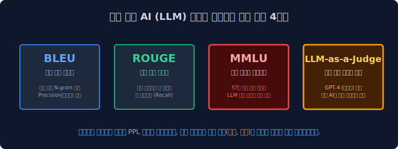

# 4.6 딥러닝 시대의 채점 4대장과 무서운 환각 (Hallucination) 버그

앞에서 배운 PPL(Perplexity)이 모든 자연어 인공지능의 절대적인 수능 평가 점수로 활용될 수 있을까요? PPL 지표가 가진 치명적인 결함과 그로 인해 발생하게 된 챗GPT 시대의 '환각(허언증) 증세'를 짚어보고, 현대 AI 학계가 이를 막기 위해 어떠한 평가 잣대들(MMLU, LLM-as-a-Judge 등)을 실무에 도입했는지 진화사를 배웁니다.

---

## 4.6.1 PPL 통계 지표의 치명적인 맹점

이전 장에서 PPL 수치가 낮을수록(거슬리는 다음 헷갈림 단어 후보 개수가 적을수록) 훌륭한 언어 모델이라고 극찬했습니다. 
하지만 이 단순 빈도 타겟팅의 통계 확률 기반의 PPL은, 현대 LLM(거대 신경망 딥러닝 모델)의 거대한 텍스트 생성 시대로 넘어오며 단 한 가지 끔찍한 재앙을 낳습니다.

> **PPL의 맹점**: PPL은 문맥이 인간 삶의 논리와 "역사적 팩트(Fact)"에 부합하는지 절대 채점하지 않고 검사도 불가능합니다! PPL 수학 공식은 오로지 문법 구조상 **"다음에 올 조사와 명사 단어로 얼마나 한국어답게 그럴싸하고 자연스럽게 확률을 뚫었는가(Syntax Probability)"** 만을 기계적으로 채점할 뿐입니다.

---

## 4.6.2 환각 (Hallucination) 사기꾼 버그의 탄생

이러한 내용물의 진짜 뜻(의미론)을 거세하고 껍데기 확률 통계 지표(PPL) 만을 강박적으로 낮추려고 발악한 AI 모델들이 내뱉는 처참한 역효과가 바로 허언증, **환각(Hallucination)** 현상입니다.

*   **유저의 낚시 질문**: `"1990년 월드컵에서 우승한 대한민국 축구팀 감독 이름이 뭐야?"` (※ 1990년에 한국은 우승한 적이 없고 감독은 이회택이었음)
*   **AI 모델 내부 확률 앵무새 시스템 작동 로직**:
    1. 대한민국, 축구, 1990년, 감독... 이 단어들이 유저에게 입력되었을 때 위키백과 역사적 팩트 DB를 참과 거짓으로 조회하는 스크립트가 도는 게 아닙니다.
    2. 과거 학습한 신경망(Weights)에서 저 단어들 뒤에 가장 '통계 빈도수' 로 부드럽고 매끄럽게 이어질 다음 단어 확률 룰렛판을 미친 듯이 연쇄적으로 굴립니다.
    3. `"아, 대한민국 축구 감독이라는 Context 다음에는 '히딩크' 라는 단어가 확률 95%로 제일 찰지게 많이 달라붙더라!"` 
*   **AI의 뻔뻔한 답변 도출**: `"네! 1990년 조별리그 월드컵에서 대한민국이 극적으로 우승할 때 감독은 거스 히딩크(Guus Hiddink) 입니다."`

이 뻔뻔한 허위 사실 문장은 문법적으로 너무나 완벽하게 한국어 명사-조사 연결 통계 규칙 확률을 준수했기 때문에, 옛날 PPL(헷갈림 지수) 채점관 기계가 검사했을 때는 **[⭐ PPL 점수 1등급: 확률적으로 가장 완벽하게 도출된 명문장!]** 이라는 대충격적인 만점 사기극 결과를 찍어줍니다!

---

## 4.6.3 환각을 부수어라: 범용 AI (LLM) 시대의 최신 채점 4대장

이러한 멍청한 카운팅 PPL 평가만 믿었다가 대량의 미친 수학 앵무새(허언증)만 양산하게 된 학계가 부랴부랴 도입한 팩트 감별 채점관들입니다.

### 1. 기계 번역 일치도 스캐너: BLEU (Bilingual Evaluation Understudy)
*   **목적**: 영어를 한국어로 구글 번역을 시킨 뒤, 그것이 얼마나 사람의 퀄리티에 근접한지 평가.
*   **원리**: 사람이 직접 먼저 번역해 놓은 완벽한 '정답 모범 번역본'과 비교 대조합니다. 기계가 번역한 "단어 조합"이 인간 번역본에 얼마나 **N-gram 교집합으로 단어 단위를 안 빼먹고 적중하여 겹치느냐(Precision, 정밀도)** 를 퍼센트로 환산합니다. (하지만 동의어 처리 등에서 맹점이 많아 최근엔 구시대 유물 취급받습니다).

### 2. 문서 요약 매칭도: ROUGE (Recall-Oriented Understudy)
*   **목적**: 네이버 뉴스 기사 30줄을 3줄로 던지도록 요약 AI를 시킨 후, 이 AI가 요약을 잘했는지 안 했는지 채점.
*   **원리**: 사람이 미리 요약해 둔 뉴스 핵심 정보와 기계가 뱉은 요약본을 대조합니다. BLEU와 비슷하지만 관점이 반대입니다. 문서의 진짜 액기스 팩트 키워드를 기계가 빼먹지 않고(Recall, 누락 방어율 중심) 요약본에 잘 주워 담았는가를 중점 채점합니다.

### 3. 대LLM 시대의 실전 수능 시험지: MMLU (Massive Multitask Language Understanding)
*   **목적**: PPL이고 번역 매칭이고 다 집어치우고, **"진짜 이 AI가 사람 수준의 논리와 역사 상식을 이해하고 있는가?"** 를 측정합니다.
*   **원리**: 수학, 물리학, 역사학, 전문의사 면허, 변호사 자격증 기출문제 등 무려 **전공별 57개 과목의 극악 사지선다 객관식 수능 시험지**를 모델에게 풀라고 던져주고 정답률 퍼센티지를 냅니다! 
*   **위상**: 오늘날 구글의 제미나이(Gemini), 오픈AI의 GPT-4/o1 추론 모델 등이 발표될 때마다 *"우리 모델은 MMLU 91점 돌파!"* 하면서 목숨 걸고 서로 자랑하며 경쟁하는 가장 거대하고 강력한 학력 인증 마크입니다.

### 4. 신(God)들의 채점: LLM-as-a-Judge (최상위의 감시자)
*   **목적**: "AI가 쓴 한 편의 위로의 시(Poem)가 예술적인 감성과 팩트를 잘 담았는가?" 같은 극도의 철학적 문제들은 4지 선대 MMLU 객관식으로도 스코어링을 낼 수 없자 짜낸 최신의 무서운 체계입니다.
*   **원리**: *"야, 내가 만든 스타트업 AI가 쓴 감동적인 자기소개서가 훌륭한지 쓰레기인지 내 맘대로 채점하기는 주관적인데? 제일 똑똑하고 무서운 **오픈AI의 GPT-4 신(God) 포지션 심판관 모델의 프롬프트에 이 글을 던져서 읽히고 점수(1점~10점)를 논리적으로 매겨달라고** 시키자!"*
*   **결과**: 초인적인 거대 AI(GPT-4 등)가 자기보다 떨어지는 다른 자잘한 AI들의 대답을 강력한 매로 쳐서 평가하는 **(AI가 AI를 검사하는 무한 감시 루프)** 메타 판단자(Judge) 채점 모델링의 시대가 오늘날 생성형 생태계의 판도를 정의하고 있습니다.

이렇듯 통계 카운트의 모래성(빈도와 꼼수 N-gram 계산)으로 출발했던 컴퓨터 언어 모델 공학은 진화를 거듭해, 결국 사람 수준의 극한의 전문 지식과 윤리를 가려내는 치열하고 거대한 LLM 평가 경쟁 시대로 돌입해 있습니다. 
이로써 4주 차 언어 모델 성능 평가 커리큘럼을 마무리합니다!
