# 딥러닝 시대의 채점 4대장과 확률 앵무새의 환각 (Hallucination)

앞에서 배운 PPL(Perplexity)이 모든 자연어 인공지능의 절대적인 수능 평가 점수로 활용되는 것일까요? PPL이 가진 치명적인 결함과 그로 인해 발생한 챗GPT 시대의 '환각 증세'를 짚어보고, 현대 AI 학계가 이를 막기 위해 어떠한 평가 잣대들(BLEU, MMLU 등)을 추가로 도입했는지 배웁니다.

---

## 00. PPL 지표의 치명적인 한계
이전 장에서 PPL 수치가 낮을수록(헷갈리는 단어 후보 개수가 적을수록) 훌륭한 언어 모델이라고 극찬했습니다. 
하지만 단순 통계 확률 기반의 PPL은 현대 신경망 딥러닝 모델로 넘어오며 한 가지 거대한 재앙을 낳습니다.

> **PPL의 맹점**: PPL은 문맥이 인간의 논리와 "팩트(Fact)"에 맞는지 절대 채점하지 않습니다! 오로지 문법 구조상 **"다음에 올 단어로 얼마나 그럴싸하고 자연스럽게 뚫렸는가(확률 통계)"** 만을 기계적으로 채점할 뿐입니다.

## 01. 환각 (Hallucination) 버그의 탄생
확률 통계 지표(PPL)만 강박적으로 낮추려고 발악한 AI 모델이 내뱉는 처참한 역효과가 바로 허언증, **환각(Hallucination)** 현상입니다.

*   유저: `"1990년 월드컵에서 우승한 대한민국 축구 국가대표팀 감독 이름이 뭐야?"`
*   AI 모델의 내부 확률 앵무새 작동:
    1. 대한민국, 축구, 1990년, 감독... 이 단어들이 짬뽕되었을 때 역사적 팩트 DB를 찾는 게 아닙니다.
    2. 저 단어들 뒤에 가장 '통계 빈도수'로 부드럽게 이어질 다음 단어 룰렛판을 미친 듯이 굴립니다.
    3. `"아, 한국 축구 감독은 '히딩크' 라는 단어가 제일 찰지게 많이 붙더라!"` (확률 엔진 도출)
*   **AI의 뻔뻔한 답변 도출**: `"1990년 월드컵에서 대한민국이 우승할 때 감독은 거스 히딩크입니다."`

이 문장은 문법적으로 완벽하게 통계 규칙을 지켰기 때문에, PPL(헷갈림 지수) 모델 평가 기계가 검사했을 때는 **[PPL 점수 1등급: 가장 완벽하게 도출된 명문장]** 이라는 대충격적인 만점 사기극 결과를 찍어줍니다!

## 02. 환각을 부수어라: 딥러닝 시대의 최신 채점 4대장
PPL만 믿었다가 미친 앵무새(허언증)만 양산하게 된 학계가 부랴부랴 도입한 팩트 감별 채점관들입니다.

### 1) 기계 번역 일치도 스캐너: BLEU (Bilingual Evaluation Understudy)
*   아프리카어를 한국어로 기계번역 시킨 뒤, 사람이 먼저 번역해놓은 완벽한 '정답 모범 번역본'과 비교 대조합니다.
*   **원리**: N-gram 스캐너를 돌려, 기계가 번역한 "단어 조합"이 인간 번역본에 얼마나 교집합으로 겹치느냐를 퍼센트로 환산합니다. (요즘엔 구시대 유물 취급받습니다).

### 2) 문서 요약 매칭도: ROUGE (Recall-Oriented Understudy)
*   네이버 뉴스 기사 30줄을 3줄로 던지도록 요약 AI를 시킨 후, 사람이 직접 요약해 둔 뉴스 핵심 줄거리 3줄과 대조합니다.
*   **원리**: BLEU와 비슷하지만, 문서의 진짜 액기스 팩트 키워드를 모델이 안 빼먹고(Recall) 요약본에 잘 넣었냐를 중점 채점합니다.

### 3) 챗GPT 시대의 실전 수능 시험지: MMLU (Massive Multitask Language Understanding)
*   PPL이고 문법이고 다 집어치우고, 진짜 AI 놈이 논리를 이해하고 있는지 수학, 물리학, 역사학, 의사 면허 시험지 등 **전공별 57개 과목의 극악 사지선다 객관식 수능 시험지**를 던져주고 점수를 냅니다! 
*   오늘날 구글 제미나이(Gemini), 오픈AI의 GPT-4 등이 발표될 때마다 "우리 모델은 91점!" 하면서 목숨 걸고 경쟁하는 가장 거대한 학력 인증 마크입니다.

### 4) 신(God)들의 채점: LLM-as-a-Judge
*   객관식(MMLU)으로는 인간의 감성을 측정할 수 없자 짜낸 최후의 미친 꼼수입니다.
*   "야, 내가 만든 AI가 쓴 시(Poem)가 예술적인지 쓰레기인지 채점하기 너무 힘든데, 제일 똑똑하고 무서운 **GPT-4 심판관 모델한테 이 글을 읽히고 점수(1~5점)를 매겨**달라고 시키자!"
*   초거대 AI가 다른 자잘한 AI를 매로 쳐서 평가하는(AI가 AI를 검사하는 무한 감시 루프) 메타-채점 모델링의 시대입니다.

이렇듯 통계의 모래성(빈도와 결합)이었던 자연어 모델링은 진화를 거듭해, 결국 진짜 사람의 '뜻'과 '참/거짓'을 가려내는 치열한 거대 평가 지표 경쟁 시대로 돌입해 있습니다.
이로써 4주차 언어 모델 성능 평가 커리큘럼을 마무리합니다!
