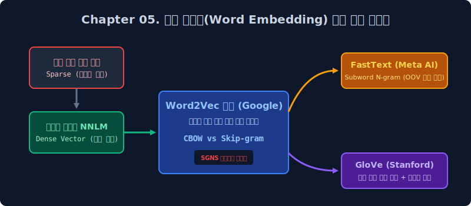

# 5주차. 워드 임베딩: 다차원 대수학 공간으로의 텍스트 투사(Projection)

이번 5주 차 커리큘럼에서는 과거 단순 빈도(Count)에 의한 이산적(Discrete) 통계 확률 매핑 계산에만 매몰되어 OOV(미등록 단어)와 희소성의 함정에서 헤어 나오지 못했던 고전 언어 모델계의 근본적 한계를 극복하고, 자연어 텍스트 처리의 패러다임을 신경망 기반으로 혁명적으로 전복시킨 **워드 임베딩(Word Embedding)** 기술의 위대한 기하학적 궤적을 철저히 다룹니다.

컴퓨터가 단순히 엑셀 장부의 카운팅 숫자를 훑어 문서의 확률을 이어붙인다는 과거의 정적인 메커니즘을 탈피합니다. 대신 인공의 뇌세포인 딥러닝 피드포워드 신경망(Neural Net)과 미적분 교차 엔트로피 손실 함수를 통제하여, 어떻게 방대한 10만 개 종류의 희소한 원-핫 텍스트 구조들을 **기하학적 3차원 실수(Float) 우주 공간(Dense Vector)** 의 점 단위 좌표로 정밀하게 응축시켜 쏘아 올릴 수 있는지, 그 내막을 통계 연산 수식의 증명과 함께 하나하나 파헤치게 될 것입니다.

---

## 🚀 상세 학습 목차

* 5.1 [차원의 저주 한계와 워드 임베딩의 기하학 매핑](/basic/05/sec01/)
  * 희소한 원-핫 인코딩의 거대한 비트(`0`) 낭비 배열이 촉발하는 치명적인 "차원의 저주(Curse of Dimensionality)"와 직교성(Orthogonal)에 의한 의미론적 유사도 파악 불가의 절대 한계를 분석합니다. 이를 타파하고 텍스트를 실수 행렬(Dense) 단위로 압축하여, 전설적인 `King - Man + Woman = Queen` 이라는 벡터 연산을 딥러닝이 어떻게 유추해 내는지 배웁니다.

* 5.2 [통계 빈도의 종말: 투사층 룩업 테이블(Lookup Table)과 NNLM](/basic/05/sec02/)
  * 단순 카운팅 공식을 최초로 해체하고 선형대수 `은닉층(Hidden Layer)` 가중치 뇌세포 구조를 도입한 NNLM 아키텍처를 해부합니다. 엄청난 연산 부하를 우회하기 위해 투사층 구조망에 숨겨 배치된 극강의 치환 연산 우회 기술인 "룩업 테이블 맵퍼(Mapper)" 메커니즘의 수학을 배웁니다.

* 5.3 [구글 Word2Vec 제국 1부 (CBOW 구조와 Skip-gram 분기)](/basic/05/sec03/)
  * NNLM 내부의 치명적으로 비대했던 피드포워드 은닉층의 오차 역전파 병목 한계를 철저히 타파하기 위해, 과감하게 은닉층 전체를 도려내버린 Word2Vec의 혁신적인 섀로우(Shallow) 튜닝 신경망 프레임워크입니다. 다중 주변 문맥을 평균 응축하여 타겟을 조준 예측하는 'CBOW'와, 오직 1개의 중심 타겟으로 다중 문맥 확률망 편미분을 스플릿 방사해 극대의 훈련 강도를 지니는 최고 효율 알고리즘 'Skip-gram' 철학을 선형대수로 비교 해부합니다.

* 5.4 [구글 Word2Vec 제국 2부 (SGNS 확률 이진 다운사이징 편법)](/basic/05/sec04/)
  * 어휘 목록 10만 단위 출력층 Softmax 비선형 지수 함수의 치명적인 연산 폭발로 인해 발생한 컴퓨팅 병목 위기를 무마하기 위해 도입한, 확률론계의 아름답고 위대한 수식 최적화 근사(Approximation) 기법인 SGNS(Negative Sampling) 튜닝 스킬입니다. 10만 지선다형 거대 객관식 평가 손실 미적분을, 빈도수에 비례해 추출한 극소수 패널티 노이즈 더미와 섞어 O/X 이진 교차 엔트로피(Binary Cross-Entropy) 게임으로 한정 치환함으로써 파이프라인 연산량을 99% 삭감한 마법을 깨우칩니다.

* 5.5 [희소 미등록 단어(OOV)의 방어막: 서브워드 분해와 FastText](/basic/05/sec05/)
  * 완벽에 가까웠던 구글 Word2Vec AI조차 모델 생전 처음 마주한 단 1개의 손가락 오타(예: apples 등 OOV)에 맞으면 즉시 인퍼런스 에러를 내며 셧다운(파업)되는 현상을 제어하고자, 단일 철자 형태소를 잘게 N-gram 알파벳 단위(서브워드) 파편으로 파쇄해 버리는 메타(Meta) AI 리서치의 맹렬한 반격 전략 (FastText) 구조망을 파헤칩니다. 독립 보관된 서브워드 벡터(Vector Sum)들의 평균 합산 공식으로 신조어 우주 좌표를 소름 돋게 재근사(Reconstruction) 복원해 내는 미적을 살핍니다.

* 5.6 [스탠포드 GloVe: 동시 발생 행렬(Co-occurrence)과 임베딩 융합](/basic/05/sec06/)
  * 글로벌 거대 텍스트 군집 덤프에 대한 고려 없이 지나치게 좁은 지엽적 돋보기 스캔 창문(Local Window) 만으로 임베딩 세상 빈칸을 채워 나가려는 Word2Vec의 편향적 오만함을 구조적으로 지적하며, 고대 문서 전체의 역사적 확률 통계치(Global Excel Count Matrix) 모수까지 손실 로그(Log) 목적 방정식 안에 한데 병합시켜 버린 스탠포드 통계 수학자들의 절대적 정보 타협안이자 최고의 글로벌 모델, GloVe 오차 함수 연산 방정식을 해부합니다.
