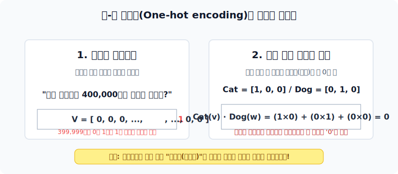
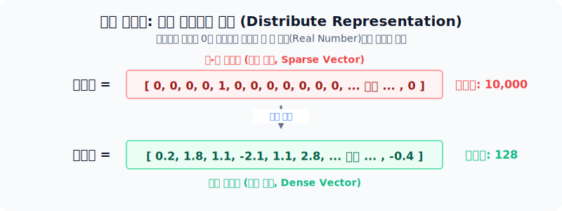
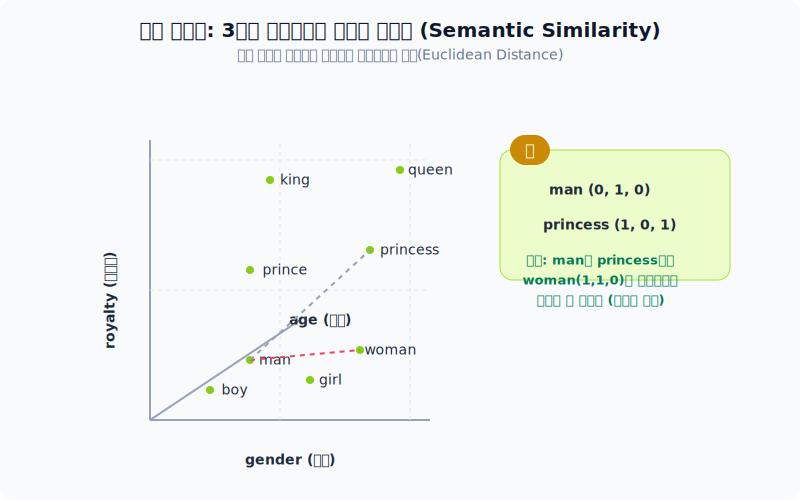
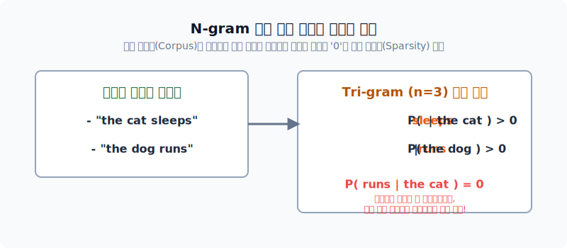
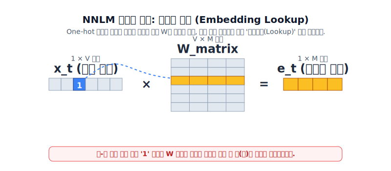
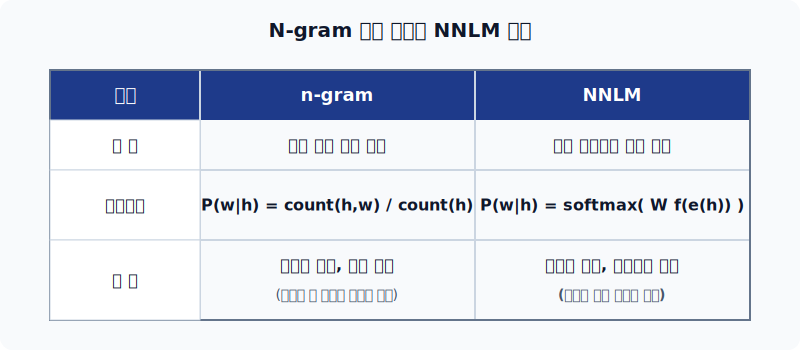

# 워드 임베딩(Word Embedding)과 언어 모델

단어를 컴퓨터가 이해할 수 있는 숫자로 어떻게 변환할 것인가? 에 대한 고민은 자연어 처리(NLP) 분야의 가장 근본적인 숙제였습니다. 본 섹션에서는 고전적인 방식의 한계점과, 이를 극복하기 위해 등장한 워드 임베딩 및 신경망 기반 언어 모델의 발전 과정을 살펴봅니다.

---

## 1. 공간적, 의미적 한계: 원-핫 인코딩(One-hot encoding)

가장 직관적인 단어의 수치화 방법인 원-핫 인코딩은 특정 단어의 인덱스에만 1을 부여하고 나머지는 모두 0으로 채우는 방식(희소 벡터, Sparse Vector)입니다. 하지만 두 가지 심각한 한계가 존재합니다.

*단어 하나마다 오직 한 자리에서만 1이 찍히는 1차원 배열의 나열*

*메모리 낭비와 벡터 내적(=코사인 유사도)이 항상 0이 되는 원-핫 인코딩의 치명적 단점*

기존의 정보 검색 방식(BoW 형식이나 TF-IDF) 역시 이 근본적인 원-핫 인코딩의 '다차원 희소성' 기반 위에 있기 때문에, 계산량이 기하급수적으로 늘어나고 문맥상의 의미(예: `bank`가 '은행'인지 '강둑'인지)나 동의어를 구분하지 못합니다.

---

## 2. 워드 임베딩(Word Embedding)의 등장

원-핫 인코딩의 단점을 극복하기 위해, 거대한 차원의 0의 바다 대신 **작은 차원 공간에 꽉 찬 실수(Real Value)로 단어를 표현**하는 기법인 "워드 임베딩(Word Embedding)"이 등장했습니다. 이렇게 표현된 단어 벡터를 밀집 벡터(Dense Vector) 혹은 분산 표현(Distributed Representation)이라고 부릅니다.

*어휘 집합의 크기만큼 팽창하는 10,000차원(Sparse)에서, 스스로 학습하여 축소된 128차원(Dense)으로의 진화*

이렇게 실수값으로 매핑된 단어들은 유클리디안 거리(Euclidean Distance)나 코사인 유사도 등을 통해 **단어 간의 의미적 친밀도**를 수치화할 수 있으며, 심지어 벡터의 덧셈/뺄셈 연산을 통해 단어의 의미적 지형도를 파악할 수도 있습니다.

*3차원 공간에서 각 단어의 거리를 통해 유사도를 측정하는 사상(Mapping) 개념도*

*대수학적 사칙연산을 구사하여 의미를 추론하는 벡터 연산 (King - Man + Woman = Queen)*

---

## 3. 학습 기법의 발전

### 잠재 의미 분석 (LSA, Latent Semantic Analysis)

수많은 0으로 이루어진 원본 행렬에서 수학적인 선형변환 과정인 **절단된 특이값 분해(Truncated SVD)**를 통해 노이즈를 제거하고 '비슷한 단어들로 압축된' 저차원의 잠재 의미 공간을 뽑아냅니다. 이 방법론은 이후 문서의 잠재 구조를 확률적으로 해석하려는 "토픽 모델링(Topic Modeling)"으로 진화하게 됩니다.

### 뉴럴네트워크 언어모델 (NNLM)

과거 빈도수 통계 기반 N-gram 언어 모델은 "학습 데이터에 등장하지 않은 순서(Sequence)"가 나타나면 예측 확률이 0이 되어 멈춰버리는 한계가 있었습니다. 

*조합의 수를 통째로 외우는 N-gram 방식이 맞닥뜨린 희소성(Sparsity) 문제*

이를 해결하고, '단어 사이의 유사성'을 엮어 일반화하려는 시도가 뉴럴네트워크 언어모델(NNLM)입니다.

- **투사층 (Projection Layer / Lookup Table)**: NNLM의 핵심 아이디어. 입력된 원-핫 벡터를 가중치 행렬(Matrix W)의 특정 행을 읽어오는 형태로 매핑시켜 밀집 벡터로 변환합니다. 변환층에는 일반적인 활성함수나 편향(Bias)이 존재하지 않습니다.
  
  
  *복잡한 연산 없이 원-핫 벡터의 1이 가리키는 위치의 임베딩 행(Row)을 복사해오는 Lookup 기법*

- **의미**: NNLM의 룩업 테이블 훈련 철학은 단순 빈도 계산을 탈피하여 "주변/유사 단어는 비슷한 임베딩 값을 갖는다"는 사상을 퍼뜨렸습니다. 이는 Word2Vec, FastText 등으로 발전하였고 현재 최신 대형언어모델(LLM)들의 임베딩 계층의 근간이 되었습니다.

*단순 모방(N-gram)에서 의미적 추론(NNLM)으로의 진화 요약*
