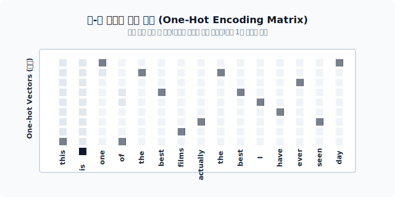
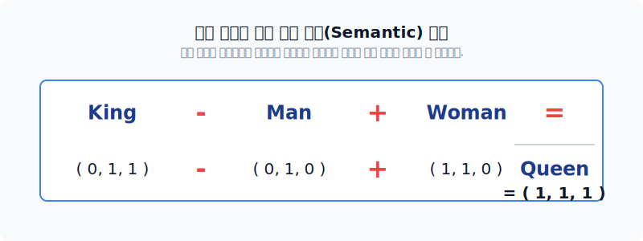

# 딥러닝 워드 임베딩: 개념과 NNLM

통계의 시대를 넘어 인공신경망의 시대가 도래했습니다. 희소한 1차원 배열에 갇혀있던 단어들을, 의미와 맥락이 숨 쉬는 **'기하학적 다차원 우주 공간'**으로 쏘아 올리는 황홀한 워드 임베딩(Word Embedding)의 개념과 NNLM 아키텍처를 배웁니다.

---

## 00. 워드 임베딩의 개념 도입
단순한 알파벳 글자 자체의 스펠링 한계를 부수고 의미론적인 수학 기하학 세계로 진입합니다.

## 01. 원-핫 인코딩 (One-hot encoding)의 복습
초창기 텍스트 데이터의 컴퓨터 입력 방식입니다. 내 자리 인덱스에만 `1`을 켜고, 나머지 온 동네에는 무자비하게 `0`을 다 때려 박았습니다.

$$ \vec{v}_{\text{사과}} = [0, 0, 1, 0, 0, \dots, 0] \in \mathbb{R}^{|V|} $$

## 02. 원-핫 인코딩의 구조
아래와 같이 하나의 문서는 수많은 `0`이 박힌 희소 행렬(Sparse Matrix)로 그려지게 됩니다.

## 03. 원-핫 인코딩의 치명적 한계점: 차원의 저주
사전의 단어가 10만 개라면, 고작 "사과"라는 단어 하나를 메모리에 올리기 위해 **99,999칸의 쓸데없는 빈칸(`0`)**을 할당해야 합니다!

> [!WARNING]  
> **📖 초심자를 위한 쉬운 해설**  
> 모래사장에서 바늘 하나를 찾기 위해 해수욕장 전체를 통째로 컴퓨터 메모리에 로드하는 멍청한 짓입니다. 이를 수학적으로 **차원의 저주(Curse of Dimensionality)**라고 부르며, 딥러닝 망을 미친 듯이 무겁게 만드는 주범이 됩니다.

## 04. 원-핫 인코딩의 의미적 한계: 상호 직교 (유사도 0)
더 치명적인 문제는 원-핫 벡터들이 공간에서 무조건 서로 **수직(Orthogonal)**으로 놓인다는 점입니다. 두 벡터의 코사인 내적을 구해볼까요?

$$ \vec{v}_{\text{개}} \cdot \vec{v}_{\text{강아지}} = [1, 0, 0] \cdot [0, 1, 0] = 1\times0 + 0\times1 + 0\times0 = 0 $$

기하학적 연산 결과가 `0`입니다. 즉, 컴퓨터 뇌 구조상 **'개'와 '강아지'는 우주 끝과 끝처럼 아무런 연관이 없는 완전한 남남**으로 판별됩니다!

## 05. 워드 임베딩 (Word Embedding) 이란?
의미 파탄 상태인 원-핫을 버리고 등장한 딥러닝의 축복입니다.
* 무식하게 컸던 차원을 확 구겨버려서(예: 10만 고정 $\to$ 256차원 고정), **'작은 차원의 압축 공간 안의 밀집된 실수(Float) 좌표'**로 표기합니다.
* 드디어 단어들 간의 각도를 잴 수 있게 되어 **기하학적 유사도 연산**이 완벽하게 가능해집니다.

## 06. 워드 임베딩의 물리적 2대 특징
| 특징 | 수학적 설명 | 비유 |
|:---:|:---|:---|
| **분산 표현 (Distributed Representation)** | 단어의 의미적 속성(강도, 성별, 품사)을 여러 축으로 잘게 쪼개어 수치화함. | 성격 테스트 그래프처럼 다방면의 능력치(육각형 스탯)를 배분함. |
| **밀집 벡터 (Dense Vector)** | 무의미한 `0`의 나열 대신, $[-1.24, 0.88, 3.14]$ 같은 꽉 찬 실수 배열을 가짐. | 텅빈 해수욕장 대신, 에스프레소 원액처럼 성분이 고농축된 액기스 한 잔. |

## 07. 워드 임베딩 유사도 3D 예시
임베딩 압축을 통해 10만 차원의 거대한 우주를 우리가 볼 수 있는 **3D 공간(X, Y, Z)**으로 우겨 넣었다고 쳐봅시다.

*   공간에 둥둥 떠다니는 단어들: $\vec{v}_{\text{man}} = (0, 1, 0)$, $\vec{v}_{\text{woman}} = (1, 1, 0)$

## 08. 워드 임베딩을 통한 기하학 연산 (유클리드 거리)
공간에 점이 확실히 찍혔으므로, 이제 자(Ruler)를 들고 두 점 사이의 거리를 측정(유클리디안 공식)할 수 있습니다.
* `woman`과 `man` 사이의 거리가 `princess`와의 거리보다 수학적으로 더 가깝게 측정됩니다. 즉, 이 둘이 의미적으로 더 유사하다는 뜻입니다!

## 09. 워드 임베딩 벡터 추론 방정식 (유추)
워드 임베딩 알고리즘의 대성공을 전 세계에 알린 전설적인 수학 방정식 단어 연산입니다. 
* 기하학적인 실수 좌표가 있으니 덧셈/뺄셈 산수 수식을 돌릴 수 있습니다!

$$ \vec{v}_{\text{King}} - \vec{v}_{\text{Man}} + \vec{v}_{\text{Woman}} \approx \vec{v}_{\text{Queen}} $$
*(대충 좌표에 대입해 보면)*
$$ (0, 1, 1) - (0, 1, 0) + (1, 1, 0) = (1, 1, 1) \to \text{Queen 위치 발견!} $$

> [!TIP]  
> **📖 초심자를 위한 쉬운 해설**  
> AI가 왕(King)과 여왕(Queen)이 뭔지 아는 게 아닙니다!  
> 그저 왕의 좌표에서 남자의 성질 축을 스윽 빼버리고, 여자의 성질 축 값을 쓱 더했더니 마침 그 허공의 공간 근처에 'Queen' 이라는 둥둥 떠다니는 단어가 우연히 찍혀있을 뿐입니다. 이것이 바로 임베딩의 마법입니다!

## 10. 통계 기반 기술 (TF-IDF의 맹점 상기)
과거의 TF-IDF는 `car`와 `automobile`이 아예 동의어라는 걸 죽었다 깨어나도 구별하지 못하며 0점 처리해 버립니다.

## 11. 통계의 반격: 잠재 의미 분석 (LSA, 행렬 분해)
딥러닝 기술이 나오기 바로 직전에 쓰이던 최후의 고급 수학 기법이었습니다.
* 커다란 원-핫 행렬이나 DTM(문서 행렬)을 통째로 썰어버려서 저차원으로 압축(**선형 변환**)시키는 무지막지한 기술입니다.

$$ A \approx U_k \Sigma_k V_k^T $$

*   **절단된 특이값 분해(Truncated SVD)** 공식을 거쳐 덜 중요한 행과 열을 가위표 마냥 쳐내버리고 노이즈를 날립니다.

## 12. N-gram 통계 언어 모델의 한계 재확인
결국 이전 주차에 배웠던 $P(\text{is} \mid \text{boy})$ 식의 한계점, **"한 번도 보지 못한 문장 조합이 들어오면 확률을 0으로 뿜어내며 모델이 죽는 현상"**을 해결해야 합니다.

## 13. 최초의 혁명: 뉴럴 네트워크 언어모델 (NNLM)
단어 횟수나 세던 통계학 장부에서 벗어나, 언어 모델 판에 **최초로 뇌세포(인공 신경망) 아키텍처**를 투입시킨 전설의 구원자입니다.

*   마르코프 N-gram처럼 최근 $n$개의 단어만 넣지만, 단순히 분수 놀음이 아니라 은닉망 가중치를 학습하여 다음 단어를 추론합니다.

## 14. NNLM의 핵심: 투사층 (Projection Layer)
NNLM은 아주 독특하게 구조 첫 단추에 가중치가 비어있는 **투사층(Projection)** 껍데기를 가집니다.
* 거대한 원-핫 배열이 시그모이드(비선형 함수) 없이 이 층을 통과하며 거대한 가중치 행렬 $W$와 곱해져, 아담한 실수 밀집 벡터로 체중 감량(압축)을 합니다.

## 15. 천재적인 트릭: 임베딩 룩업 테이블 (Lookup Table)
대충 보면 `원-핫 벡터 x 가중치 행렬 $W$`의 아주아주 거대한 크기의 행렬 곱셈 연산식 같지만, 사실 곱셈을 아예 안 합니다!

> [!IMPORTANT]  
> **📖 초심자를 위한 쉬운 해설**  
> `[0, 0, 1, 0...]` 처럼 1이 단 한 개 들어있는 행렬 곱은, 사실상 곱셈이 아니라 **가중치 행렬의 3번째 줄(Row)을 그냥 긁어서 복사해오는 것**과 결과가 소름 돋게 100% 똑같습니다.   
> 따라서 값비싼 GPU 전력을 낭비하며 곱하기를 하지 않고, 무식하게 엑셀 검색(Look-Up)을 하듯이 그냥 값을 빼옵니다! 이 혁신적인 스킬 덕분에 연산 속도가 수백 배 비약합니다.

## 16. NNLM 모델 체계 요약표 (vs N-gram)

| 비교 항목 | N-gram (통계 모델) | NNLM (신경망 모델) |
|:---:|:---|:---|
| **학습 방식** | 무식하게 출현 횟수 숫자 카운트 | 레이어 가중치(파라미터) 업데이트 정밀 예측 |
| **OOV / 희소성 방어** | 데이터에 없으면 무조건 0 반환 (에러) | 데이터에 없던 문장이어도, '좌표 공간 상의 비슷한 동의어'가 있으면 유연하게 임기응변! (대성공) |
| **특성** | 이산적 구조 (딱딱함) | 연속적, 기하학 일반화 가능 (말랑말랑함) |
