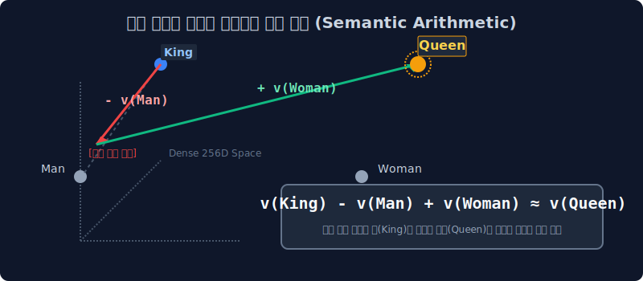

# 5.1 차원의 저주와 임베딩(Embedding)의 좌표 마법

통계 빈도수의 숫자를 세는 시대를 넘어, 인공지능의 뇌(신경망) 시대가 도래했습니다. 희소한(Sparse) 원-핫 행렬에 갇혀 완전히 남남으로 지내던 텍스트 단어들을, 깊은 의미와 맥락이 숨 쉬는 **'기하학적 밀집 차원 공간(Dense Vector)'** 으로 쏘아 올리는 황홀한 워드 임베딩(Word Embedding)의 사상을 배웁니다.

---

## 5.1.1 원-핫 인코딩(One-hot)의 복습과 절망적 용량 폭발

과거 3주 차에 배웠던 원-핫 인코딩의 치명적 한계를 다시 떠올려 봅니다.
원-핫 인코딩은 사전에 등록된 내 단어의 Index 자리에만 전구 스위치 `1`을 켜고, 나머지 온 동네 축에는 무자비하게 전구 `0`을 다 때려 박았습니다.

$$ \vec{v}_{\text{사과}} = [0, 0, 1, 0, 0, \dots, 0] \in \mathbb{R}^{|100,000|} $$

이 단순무식한 벡터 방식은 두 가지 치명적인 병목 한계를 발생시킵니다.

### 1. 차원의 저주 (Curse of Dimensionality)
영어 사전에 등록된 토큰 단어가 10만 개라면, 고작 "사과" 라는 단어 스펠링 한 개를 컴퓨터 램(RAM)에 띄우기 위해 무려 **99,999칸의 쓸데없는 빈칸(`0`, 암흑 물질)** 을 이중 배열로 그려 넣어야 합니다!
텍스트 문장이 길어질수록 의미 있는 알맹이(`1`)는 극소수인데 의미 없는 쓰레기 데이터(`0`) 행렬 칸 수만 수십억 개로 폭발하는 낭비 현상을 통계학에서 **[차원의 저주]** 라고 부릅니다. 이 커다란 희소 행렬(Sparse Matrix)로 딥러닝 연산을 돌리면 그래픽 카드(GPU)의 VRAM이 순식간에 터져 파괴됩니다.

### 2. 상호 직교 행렬 (유사도 도출 완전 불가)
더 무서운 기하학적 문제는, 원-핫 벡터들이 공간에서 무조건 서로 90도 **수직(Orthogonal)** 으로만 벌어져 꽂힌다는 점입니다. 

> *   우리가 아는 '개' 와 '강아지' 는 사실상 거의 똑같은 동의어입니다.
> *   하지만 원-핫 컴퓨터 뇌 구조에서는 두 벡터 간의 거리(코사인 내적 연산) 겹침 결과가 잔인하게도 **`0 (완전 수직, 독립적 남남)`** 입니다.

$$ \vec{v}_{\text{개}} \cdot \vec{v}_{\text{강아지}} = [1, 0, 0] \cdot [0, 1, 0] = 1\times0 + 0\times1 + 0\times0 = \mathbf{0} $$

컴퓨터 입장에서는 "강아지와 개 사이의 관련성이나, 강아지와 핵폭탄 사이의 겹침이나 기하학적으로 100% 똑같이 남남이야!" 라고 선언해 버리니 문장의 앞뒤 의미를 추론하는 AI 생태계가 완전히 박살납니다.

---

## 5.1.2 구세주의 등장: 워드 임베딩 (Word Embedding) 큐브

위 두 가지 치명적 단점을 완벽히 박살 낸, 현대 딥러닝 인공지능의 최고 축복 파이프라인(Pipeline) 시스템 구조입니다.

**"무식하게 10만 칸으로 쫙 벌려 놓은 텅 빈 원-핫 차원 우주를 뭉개버리고, 성별/크기/온도 등 단어의 속성을 담은 256차원짜리 꽉 들어찬 [밀집 벡터(Dense Vector)] 상자 안에 눌러 담자!"**

*   `0과 1` 이분법 정수 딱지가 아니라, `[-1.24, 0.88, 3.14]` 처럼 수의 체계를 뒤흔들어 놓은 **실수(Float) 좌표계 밀집 배열**을 가집니다.
*   공간이 확 줄어들며 컴퓨터 메모리 용량이 비약적으로 절약되며, 소수점으로 미세 조정된 탓에 마침내 단어들 사이에 **기하학적 유사성(각도 거리)을 연산** 할 수 있는 축복이 내려집니다.

---

## 5.1.3 워드 임베딩의 기하학 매핑과 3D 우주 측정

임베딩의 고차원 압축을 통해, 거대한 언어 사전을 우리가 볼 수 있는 **3D 실수 좌표 큐브(X, Y, Z)** 공간으로 우겨 넣었다고 상상해 봅시다. 구글 영어 사전 단어들이 캄캄한 우주 속의 행성들처럼 공간의 X, Y, Z 어딘가에 점으로 박혀서 둥둥 떠다닙니다!

공간에 실수 좌표점이 확실히 찍혔으므로, 이제 인공지능은 마침내 **자(Ruler)** 를 들고 점과 행성 사이의 물리적 거리를 수학적으로 잴 수 있게 됩니다.

*   AI가 3D 자로 재어보니 코사인 거리가 `woman` 행성과 `man` 행성 사이에는 고작 1cm 밖에 차이가 안 나지만, `princess` 와 `car(자동차)` 단어 행성 사이는 999km 거리가 납니다.
*   측정 즉시 컴퓨터는 통계를 부수고 **"아! 이 두 단어(boy, man)는 묶여있는 동의어 부락 집단 가족이구나!"** 라고 완벽하게 깨우치고 문맥을 파악합니다.

---

## 5.1.4 전설적인 임베딩 추론 방정식 (King - Man = Queen)

워드 임베딩 알고리즘의 천재적인 성공(Semantic Mapping)을 전 세계에 충격적으로 알린 전설적인 수학 방정식 뺄셈 연산입니다. 
알파벳 덩어리를 3D 공간에 실수 벡터로 매핑하면 아래와 같은 신비한 덧셈, 뺄셈 마법이 완벽하게 성립합니다.

$$ \vec{v}_{\text{King}} - \vec{v}_{\text{Man}} + \vec{v}_{\text{Woman}} \approx \vec{v}_{\text{Queen}} $$

> [!TIP]  
> **📖 초심자를 위한 쉬운 분석: 딥러닝이 여왕의 수수께끼를 푸는 법**  
> 이 아름다운 수식은 어떻게 성립될까요? 컴퓨터는 `King`과 `Queen`이 부부라는 정치학적 뜻을 스스로 깨우친 게 전혀 아닙니다. 기하학 선형대수 연산의 우연한 선물입니다.
> 
> 1. 기계는 **위대한 왕(King)** 의 3D 실수 좌표계 위치에서 **평범한 남자(Man)** 의 각도 화살표만큼을 쭈욱 스윽 뒤로 **마이너스 빼버립니다**. (이 순간 남성성 속성이 제거되며 절대 권위 권력 속성만 허공 공간에 덜렁 남게 됩니다).
> 2. 그 덜렁 멈춰진 허공 위치에서 다시 **평범한 여자(Woman)** 의 화살표 각도 길이만큼을 쓱 앞으로 **플러스로 전진하여 대입**해 봅니다.
> 3. 그랬더니 수학적 연산의 맨 마지막 종착지가 닿은 우주의 빈 좌표 공간 자리에, 우연히 아주 근접한 곳에 **'Queen (여왕)'** 이라는 단어 별이 아름답게 위치해 빛나고 있을 뿐입니다!
>
> 이것이 바로 현대의 자연어 처리 AI가 글자를 읽는 방식인 '임베딩의 기하학적 차원 투영(Projection) 마법' 입니다.

하지만 단어들을 도대체 어떻게 저런 아름답고 정교한 3D 별의 위치로 똑똑하게 보내 버릴(학습시킬) 수 있을까요? 
바로 다음 챕터에서 딥러닝 은닉층 뇌를 써서 **임베딩 투사 훈련**을 세계 최초로 해낸 모델 (NNLM)의 역사를 살펴봅니다.
