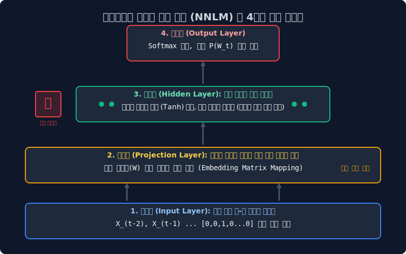
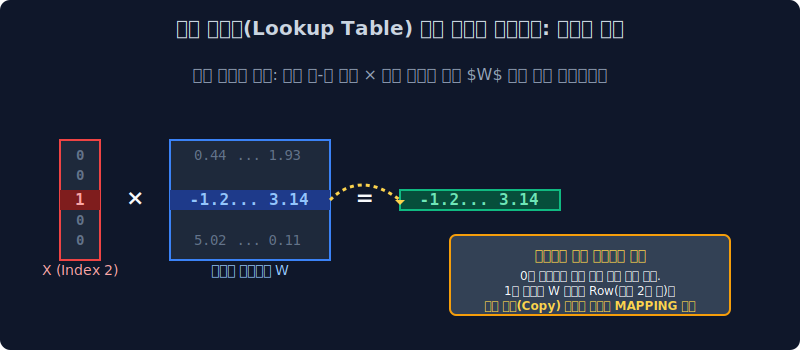

# 5.2 통계 빈도 카운트 시대의 종말: 투사층 룩업 테이블 트릭과 NNLM 아키텍처

아무리 훌륭한 N-gram 마르코프 체인 타협안을 도입한다 하더라도, 문서의 문맥 시퀀스가 조금만 길어지면 여전히 카운터 에러(분모 `0` 나눗셈)를 뿜어내며 시스템 셧다운을 유발하던 구시대 통계 계량 모델을 완전히 역사의 뒤안길로 몰아낸 전설적인 구조 모델이 탄생했습니다.

자연어 처리 학계는 단어 출현 횟수(Frequency Count)에 집착하던 경험적 검색 통계 부서의 완전한 해체를 선언하고, 인공의 뇌세포인 **딥러닝 신경망(Neural Network)** 계층을 텍스트 추론에 도입한 최초의 언어 생성 지능망, **피드포워드 신경망 언어 모델 (Feed-Forward Neural Net Language Model: NNLM)** 의 위대한 구조적 혁신과 룩업 맵핑 최적화 과정을 상세히 뜯어봅니다.

---

## 5.2.1 구시대 통계 모델의 영구적 태생 한계 (OOV 붕괴 현상)

우리는 바로 앞 4주 차에서 횟수 카운팅을 기반으로 한 모델의 구조적 맹점을 뼈저리게 분석했습니다. 
**"저 소년은 참 ( )"** 이라는 선행 문맥 시퀀스 텍스트 단서가 주어졌을 때 다음에 잇따를 단어 확률을 알아내려면, 구글이 가진 인터넷 데이터베이스를 모조리 스캐닝하여 일치하는 과거 텍스트의 결괏값 $\text{Count}$ 로 분수식을 나누는 쪼개기 수식을 병렬 시전해야만 했습니다.

하지만 통계 연산 기계가 운영 중 평생 단 한 번도 관측해 본 적이 없는 신조어 모음이나 고유 명사 텍스트 벡터(Out-Of-Vocabulary, OOV)가 입력 배열로 툭 떨어지면 어떤 사태가 벌어질까요? 카운터가 여전히 0(Zero Division, Sparsity 에러)을 반환하면서 언어 확률 곡선을 단 하나도 뿜어내지 못하고 모델 추론 서버가 백지 상태로 뻗어버립니다. **거대한 데이터 희소성의 굴레에서 선형 집계 중심의 단순 통계학은 결국 영원히 벗어나지 못했습니다.**

---

## 5.2.2 세계 최초의 신경망 자연어 추론: NNLM (Neural Net Language Model)

이에 NNLM 연구진은 기존 기계 학습의 카운터 판도를 완전히 뒤엎어 버리는 패러다임 선언을 단행합니다.
**"순수 통계 빈도학적 접근의 한계를 인정하고 단어 카운트 파이프라인의 전면 폐기를 명한다! 우리의 인공지능은 이제 인공 신경망(Neural Net)이 수만 개의 딥러닝 내부 가중치(Weights $W$, Bias $b$) 행렬을 역전파 미분으로 스스로 정밀 조절해 나가며, 인간의 유기적인 텍스트 직관처럼 [감각적으로 추론(Inference)] 하도록 가동 훈련될 것이다!"** 

설계된 NNLM 아키텍처는 아래와 같은 복잡한 4개의 다층 신경 계층(Layer)으로 뇌 구조망을 설계했습니다.
*   **1. 입력층 (Input Layer)**: 역사적 문맥 범위가 적용된 토큰 단어들의 거대한 10만 고차원(차원의 저주) 원-핫 뼈대 벡터들이 데이터 로더를 타고 쏟아져 들어오는 1번 대문.
*   **2. 투사층 (Projection Layer)**: 비선형 활성 함수(시그모이드, Tanh 등)가 배제된 완전 선형 스칼라 결합 우주 공간 (차원 압축을 담당).
*   **3. 은닉층 (Hidden Layer)**: 거대한 두께와 뉴런 뎁스를 가진 비선형 활성화 가중치 미분 연산망 (GPU 연산 병목 폭발의 주범).
*   **4. 출력층 (Output Softmax)**: 다음 예측 단어 1개를 고르기 위해, 사전 크기(10만 개) 전체 토큰의 발생 확률 밀도 분산 치(Softmax)를 토해내는 최종 산출 종착역.

추론 조건의 방식은 N-gram 근사화 기법(마르코프 타협)처럼, 문장 제일 앞에 위치한 옛날 시퀀스 스코프는 쳐다보지 않고 **최근 $N$개의 직전 단어 시야만 단절해 지켜본다**는 관점에서는 여전히 옛날 통계 모델과 동일한 프레임 워크를 공유합니다. 하지만 **내부 수리 모형으로 수치 분수 나눗셈식을 쓰는 게 아니라, 여러 단어 텐서 블록들을 은닉망(Hidden Layer)의 가중치 행렬로 뒤섞고 오차를 미분해서 무의식적으로 정답에 도달하도록 진화시켰다**는 점이 NLP 역사의 위대한 발걸음입니다.

---

## 5.2.3 두뇌 인터페이스의 핵심: 투사층 (Projection Layer) 의 고속 도로 차원 압축

NNLM 구조의 가장 극적인 첫 번째 관문인 **투사층 (Projection Layer)** 은 딥러닝 신경망 설계 역사상 가장 혁신적이고 독특한 선형 껍데기 공간입니다. 일반적인 은닉 신경망의 뇌세포 활성화 조절 스위치(비선형 함수) 계단이 이 층에는 전혀 설계되어 있지 않은 텅 빈 '선형 하이웨이(Linear Highway)' 가중 맵핑 고속도로입니다.

10만 칸짜리 거대하고 쓸모없는 `0` 전구만 잔뜩 켜져있어 차원의 저주를 뿜어내는 '원-핫 벡터 배열 무식쟁이' 들이 이 투사층 대문을 일단 통과하여 진입하고 나면, 대기하고 있던 아주 거대한 가중치 행렬 세트 매트릭스 $W$ 에 정면 충돌하며 강제 행렬 곱셈 처리를 당하게 됩니다. 
놀랍게도 기계 내부의 이 거대한 선형대수 수술 매핑(Mapping) 연산을 거치고 나면, 10만 차원의 비효율적인 쓰레기 희소 행렬 공간 좌표가 $\to$ 아주 작고 데이터가 밀도 높게 콤팩트한 **[128차원 정도의 꽉 찬 실수 우주 좌표(Dense 밀집 임베딩 벡터)]** 공간 텐서로 완벽하게 다이어트가 되어 기하학적 형태 변화를 이루어 냅니다. 이를 정보 공학에선 차원 압축(Dimensionality Reduction) 매핑이라고 부릅니다.

---

## 5.2.4 시스템 옵티마이저 천재들의 연산 트릭: 룩업 테이블 (Lookup Table) 바이패스

위의 투사층 수식 설명만 머릿속으로 듣고 있노라면, 여러분의 그래픽 카드가 미친 듯한 연산 부하로 VRAM 피를 토할 것처럼 절망적으로 느껴집니다. 
`[100,000차원 선형 배열]` 과 `[가중치 행렬 $W$ (100,000 x 128 크기 매트릭스)]` 끼리의 무겁고 우악스러운 수학적 선형대수 행렬 교차 곱셈(Dot Product) 연산을, 텍스트가 들어올 때마다 수백만 번 반복해야 한다니! 상상만으로도 메모리 병목과 GPU 전기세가 과부하로 폭발할 지경입니다. 하지만 똑똑한 구글/스탠포드급 엔지니어들은 이 대규모 곱셈 트래픽을 아예 수행조차 하지 않아도 되는 치명적인 수학의 허점 최적화(Optimization) 스킬을 심어두었습니다.

> [!NOTE]  
> **💡 핵심 공학 원리: 원-핫 항의 곱셈 사멸 원리를 활용한 룩업 테이블 "복사 붙여넣기(Copy & Paste)"**  
> 
> 입력 원-핫 벡터 데이터가 `[0, 0, 1, 0, 0 ... 0]` 처럼 오직 Index 3번 자리에만 유효 비트 `1` 이 딱 하나 켜져 있고, 그 앞뒤의 나머지 99,999칸 지표는 싹 다 쓰레기 노드 `0` 이 켜진 극단적인 희소 빈 배열이라고 수학적으로 곰곰이 상상해 보십시오.  
> 
> 컴퓨터가 이 거대한 입력 배열과 $W$ 행렬을 아무리 각 잡고 규칙대로 미친 듯이 일일이 다 이중 곱하기 포문(`For loop`) 수식을 돌려봤자, 결국 어차피 `0` 과 매칭되어 곱해진 텐서 열들은 싸그리 값이 0이 되어 허무하게 사멸하고 날아가 버립니다! 그렇게 긴 시간 낭비로 도출된 행렬의 최종 덧셈 결괏값은 놀랍게도, 무조건 **"타겟 가중치 행렬 $W$ 테이블에서 딱 3번째 줄(Row) 가로줄의 실수 리스트 배열 하나만 싹 다 긁어 복사 추출(Index Querying)해온 것"** 과 소름 돋게 100% 동일한 수리적 일치 결과를 가지게 됩니다!   
> 
> *   **시스템 엔지니어 차원의 편법 적용**: "연산 구조를 다시 짜!! 어차피 비트 텐서가 1이 켜진 $W$ 행렬이 몇 번째 줄(Row Element)인지 짚어서 도출해 내기만 하면 내적 정답이랑 완전히 똑같잖아? 값비싼 GPU 코어 전력을 낭비해 가면서 의미 없는 미친 10만 단과 행렬 곱하기 수식을 무식하게 도출하지 말고, 검색 인덱스 쿼리 시스템을 적용해!" 
> *   "그냥 메모리 책장에서 원하는 책 한 권 탁! 꺼내듯이 다이렉트 색인(Location Lookup)해서 **'어? 원-핫 3번 열에 전구 불 들어왔네? 그러면 행렬 곱셈 모듈 작동시키지 말고 걍 생략해! 뒤도 보지 말고 $W$테이블 3번째 줄 캐시 데이터만 다이렉트로 메모리 포인터 접근(Lookup)해서 빼온 다음 다음 은닉층으로 복붙(Ctrl+C, Ctrl+V) 해 넘겨버려!'**" 
>
> 이 혁명적인 바이패스 행렬 우회 전송 프로세서인 색인 매핑(Lookup Table Mapping) 스킬을 컴파일 모듈 단에서 내장해 놓았기에, 원거리의 차원 행렬 압축 연산 속도가 기존 대비 수천 배 이상 비약적으로 초가속화되며 희소성 배열 처리의 재앙에서 벗어나게 됩니다.

---

## 5.2.5 NNLM 아키텍처의 혁신적 성과와 최종 병목의 한계 결론

구시대 통계학 분수 공식을 완벽히 타파해 내고 선형대수 가중치 딥러닝(Neural Net) 언어 모델 지능망의 위대한 첫걸음을 정립한 역사적인 구조 모델이 됨은 부정할 수 없지만, 여전히 이 NNLM은 내부 레이어 노드의 치명적인 연산 속도 레이턴시 결함을 태생적으로 안고 구조적으로 무너지게 됩니다.

*   **🏆 카운트 희소성 에러(Sparsity) 차원의 완전한 극복 성공**: 단순 카운트 탐색 횟수가 0건이라 무조건 치명적인 오류를 내뿜고 블루스크린 띄우던 과거 단순 통계 알고리즘과 질적으로 다릅니다! 모델 내부에 가중치 행렬($W$)이라는 통계 데이터 '실수 보정 조정자'를 품었습니다. 학습 시스템이 생판 모르는 OOV 특이 단어 연쇄 시퀀스를 입력받더라도 기계는 *"출현 빈도는 없지만, 계산해보니 어차피 얘는 아까 훈련 세트에 넣어 두었던 비슷한 단어들과 임베딩 3D 밀도 큐브상의 위치 거리가 기하학적으로 거의 구역이 맵핑되네(가깝네)? 그럼 얘도 대충 문맥 발생 확률을 과거 애랑 똑같게 보정 시켜주자!"* 라며 융통성(Generalization) 있게 끊김 없는 유사도 벡터 예측을 넘겨버리는 학술적 대성공을 거두었습니다!
*   **💣 은닉층(Hidden Layer) 연산 파이프라인의 비대증 병목 타개 실패**: 하지만 전형적인 피드포워드 신경망 뎁스 구조 특착상, 뇌세포 집합 덩어리인 3번 구간 **은닉층의 거대한 가중치 노드 활성화 비선형 함수(시그모이드, Tanh 스퀴즈 등)를 거치는 미분 역전파 복합 연산망**을 구조 파이프라인 상에 여전히 너무나 무겁고 강압적으로 들고 있었습니다. (거대한 N-gram 컨텍스트 윈도우 스펙을 강제로 넓혀버리면, 메모리가 비례하여 지수 단위로 터져버리는 과거 병목의 굴레를 완벽히 털어버리지 못함). 결국 딥러닝 텍스트 훈련 컴파일 단이 본격적으로 구동되기 시작하면 거대 행렬의 연산 병렬 처리가 턱턱 체해버려, 전체 학습 가동 사이클 속도가 거북이 굼벵이처럼 터무니없이 질질 끌리는 컴퓨팅 자원의 비효율 재앙을 겪습니다.

이 무겁고 미련스럽게 비대하기만 한 은닉층 뇌세포의 끔찍하고 처참한 연산 병목 레이턴시 계측 현상을 쳐다보다가 제대로 분노하고 자극받은 실리콘밸리의 초거대 빅테크 데이터 집단, **`구글(Google)` 브레인 연구팀**의 천재 악마 엔지니어들이 움직이기 시작합니다. 그들은 신경 네트워크의 뇌 은닉 구조 자체를 절반으로 잔인하게 파쇄해 버리는 충격적이고 폭력적인 모델 다이어트 최적화(Optimization) 칼질 작업을 전격적으로 단행해 쾌속 모델 논문을 내놓게 됩니다. 

이것이 바로 구글이 전 세계를 공포로 과점해 몰아넣은 자연어 단어 임베딩 분야의 영원한 황제 대장 격 패러다임, **[Word2Vec (워드 투 벡터)]** 의 전설적 서막입니다.
