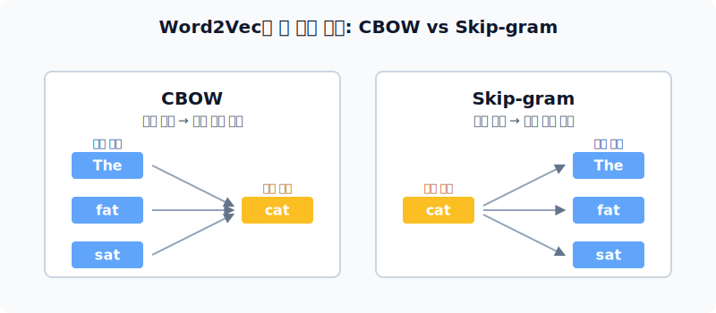
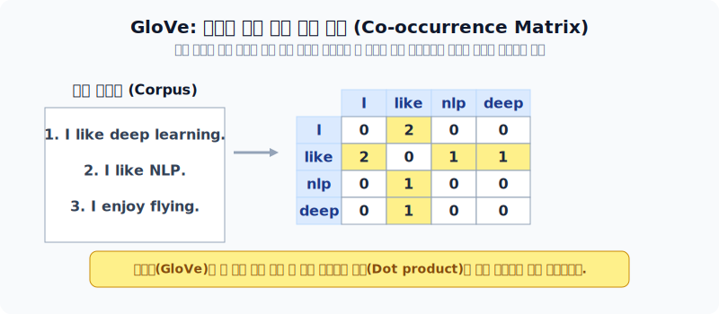

# 구글과 페이스북의 워드 임베딩 기법 혁신

초창기 모델의 연산 병목 현상을 천재적인 아이디어로 제거한 구글의 Word2Vec(CBOW, SGNS) 체계와, 그것의 유일한 구멍을 철자 단위 쪼개기로 완벽 방어한 페이스북의 FastText, 마지막으로 통계를 섞은 스탠포드의 GloVe 대서사시를 탐구합니다.

---

## 00. 산업계 워드 임베딩 기술 3대장
본격적으로 현명한 엔지니어들이 설계해 실무에 고착화된 3대 알고리즘의 원표를 배웁니다.

## 01. 구글의 걸작: Word2Vec 개요
단어의 앞뒤 '문맥(이웃)'을 수학적으로 분석 반영하여 벡터 가중치를 만드는 가장 대표적이고 거대한 산맥입니다.
* 무조건 신경망 은닉층 연산을 돌려대던 무거운 NNLM을 극도로 가볍게 다이어트 시킨 인공신경망입니다.
* 크게 중심-주변 방향에 따라 **CBOW**와 **Skip-gram** 2가지 쌍둥이 알고리즘으로 분화됩니다.

| 알고리즘 | 예측 목표 (임무) | 설명 및 비유 |
|:---:|:---|:---|
| **CBOW** | 주변 들러리를 보고 $\to$ 중심 맞히기 | "앞뒤에 경호원 단어 4명이 서 있네? 중간에 있는 놈 포지션 주인공 누구지?" 맞추기 |
| **Skip-gram** | 중간 주인공을 보고 $\to$ 주변 들러리 맞히기 | "가운데 범인이 떡하니 잡혔네! 얘 주변에 서 있었던 공범 3명 이름 모두 대봐!" |

## 02. CBOW (Continuous Bag of Words) 로직
**"주변 단어 뭉치(Context words)로부터 가운데 뻥 뚫린 빈칸(Center word)을 추론하라!"**

* 윈도우 크기($n$)가 `2`일 때, 중심 단어를 기준으로 좌/우로 2칸씩(앞뒤로 총 4개) 주변 단어를 벡터망에 넣습니다.
* 예: `The fat cat sat on the mat` 에서 윈도우 크기 2로 설정. 
  입력 데이터: `[The]`, `[fat]`, `[sat]`, `[on]`, 정답(타겟): `cat`

## 03. CBOW의 인공신경망 다이어트 구조
이 알고리즘의 맹점은 딥러닝 층 설계에서 발현됩니다. 기존 NNLM에서 치명적인 연산 병목을 유발하던 **은닉층(Hidden Layer)과 활성화 함수를 아예 뽑아 지워 버렸습니다**.
* 오직 입력층(Input)과 출력층(Output) 사이를 투사층(단순 껍데기 $W$) 연결만 남겨, 연산 속도를 빛의 속도로 올렸습니다. (곱셈이 아닌 룩업 테이블 탐색!)

## 04. Skip-gram: 역발상의 천재성
CBOW를 거꾸로 뒤집은 완벽한 거울 모형인데 성능이 훨씬 더 좋습니다.
* **"가운데 단어 하나만 딸랑 던져줄 테니, 걔 양옆에 있던 단어가 뭐였는지 싹 다 연산해서 내놔라!"**
* 하나의 단서로 여러 정답 분포를 추정해야 하므로 모델의 분산 표현 능력이 극한으로 단련됩니다.

---

## 05. Skip-gram의 구원자: 네거티브 샘플링 (SGNS)
단어 1개를 맞추기 위해 출력층 계산망(Softmax)에서 10만 개의 단어 묶음 로짓(분모) 연산을 다 돌리는 것은 미친 짓이었습니다. 연산량 다이어트를 최적화 한 가장 똑똑한 혁신입니다. (Skip-gram with Negative Sampling)

> [!TIP]  
> **📖 초심자를 위한 쉬운 해설**  
> (기존 병목 현상) `다음 단어가 cat이다 (전체 사전 10만 단어 중 cat 하나 고르기)`  
>   $\to$ 아, 10만 개 단어 가중치를 다 건드려야 하니 지구 온난화 주범이군!
> 
> (SGNS 천재적 치환) `입력된 (The, cat) 두 단어가 원래 서로 짝꿍이야? (True / False)`  
>   $\to$ 이제 모델 출력층이 10만 개가 아니라 딱 하나로 줄었습니다! 오직 1 아니면 0인 이진 분류만 하면 됩니다!

## 06. SGNS 데이터셋 오답 노트 조작 (False)
* 당연히 진짜 문장에서 발견한 짝꿍(`King`-`Brave`)은 `1 (True)` 레이블을 달아 학습 데이터로 밀어 넣습니다.
* 그런데 구글은 추가로 사전에 있던 아무 상관 없는 단어를 뽑아 억지 강제 짝꿍(`King`-`Apple`)을 만들고, 모델에게 **"이건 가짜야! `0 (False)`으로 업데이트 해!"**라고 오답 노트를 떠먹이며 훈련의 난이도를 낮춥니다.

## 07. SGNS 학습 및 수학적 오차 역전파
두 단어 $\vec{v}_c$ (중심단어)와 $\vec{v}_o$ (주변단어) 내적을 단순화하고 확률 이진 분류 시그모이드 $\sigma$ 함수를 돌립니다.
여기에 뼈를 때리는 교차 엔트로피 손실 함수 공식을 적용합니다.

$$ L = -\log \sigma(\vec{v}_c \cdot \vec{v}_o) - \sum_{i=1}^k \mathbb{E}_{w \sim P(w)} [\log \sigma(-\vec{v}_c \cdot \vec{v}_w)] $$

*(타겟 정답 `True` 단어의 내적은 올리고 확률을 1에 가깝게, Negative Sample 거짓 단어 $k$개 들과는 아예 다르게 틀리도록(`0`) 모델 수식을 역전파 보정합니다.)*

---

## 08. Word2Vec(구글)의 치명적 결함 2가지
완벽해 보였던 제국에도 한계치가 왔습니다.

1.  **OOV (Out of Vocabulary, 미등록 단어)**: 단어 사전에 스펠링 그대로 등록되지 않은 글자가 들어오면, 융통성 없이 즉시 에러가 폭발해버립니다. (예: `tensor`, `flow` 백만 번 읽어봐야 신조어 `tensorflow` 뜨면 붕괴됨)
2.  **형태학(단어 꼬리) 무시 문제**: `eat`, `eating`, `eats` 누가 봐도 같은 핏줄인데, 기계는 3개를 완전히 다른 외계어로 취급하고 따로따로 메모리에 저장해서 메모리 용량을 미친 듯이 소모시킵니다.

## 09. 페이스북의 대항마: FastText (서브워드 찢기)
원단어(Word) 집착증을 버리고, 알파벳 철자를 가위로 산산조각(Character N-gram) 내어버린 놀라운 모델입니다.

*   `apple` 이면 $\langle \text{ap}, \text{app}, \text{ppl}, \text{ple}, \text{le} \rangle$ 등 수많은 **서브워드 조각 벡터**를 생성하고 나중에 이들을 뭉쳐 합산($\sum$)합니다.

> [!WARNING]  
> **📖 초심자를 위한 쉬운 해설: 모르는 단어의 방어 기재**  
> FastText는 OOV 에러를 거의 절대 내지 않는 깡패 무적입니다!  
> 설령 `applpe`(오타)라는 단어가 처음 로드디어도 그 안의 멀쩡한 철자 조각들 `app`, `pl`, `pe`의 룩업 가중치가 사전에 살아 있으므로, 그것들을 끌어모아 짬뽕시켜서 대충 `apple` 비슷한 임베딩 좌표값을 유추해 도출합니다.

## 10. 스탠포드 GloVe: 통계와 신경망의 이종교배
*  **Word2Vec 한계**: 뜻은 기가막히게 맞추지만, 윈도우 크기(5칸)만 들여다보느라 좁은 우물 안 개구리 통계.
*  **LSA (DTM 통계) 한계**: 전체 대문맥(Global) 통계를 다루지만, 뜻이나 방향 추론을 전혀 못 함.
*  $\to$ 이 둘의 수식을 하나로 합쳐 거대한 혼혈 왕자를 창조했습니다.

## 11. GloVe - 동시 등장 확률 연산 (Co-occurrence)
가장 핵심이 되는 GLoVe의 임베딩 보정 수식입니다.
임베딩 된 중심 단어 $\vec{w}_i$와 주변 들러리 단어 $\vec{\tilde{w}}_j$ 의 내적 곱셈값이, 전체 통계를 기반으로 진짜로 도출된 '동시 등장 확률($P_{ij}$)' 과 딱 일치하도록 그 오차 손실을 최적화(MSE)시킵니다.

$$ J = \sum_{i, j=1}^{V} f(X_{ij}) \left( \vec{w}_i^T \vec{\tilde{w}}_j + b_i + \tilde{b}_j - \log X_{ij} \right)^2 $$

*(전체 문맥 통계 비율과, 국소적인 개별 윈도우 단어 간의 내적 의미가 절묘하게 크로스 되어 엄청난 임베딩의 질감을 부여했습니다.)*
