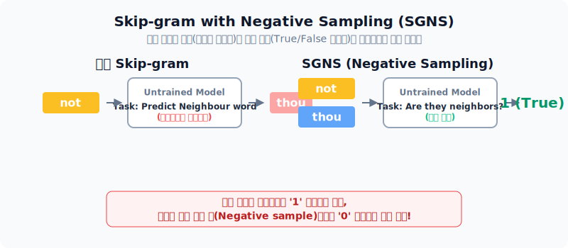
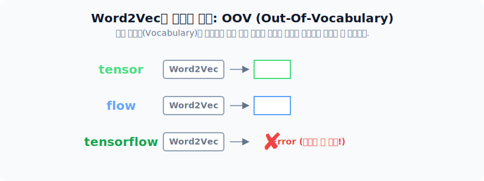
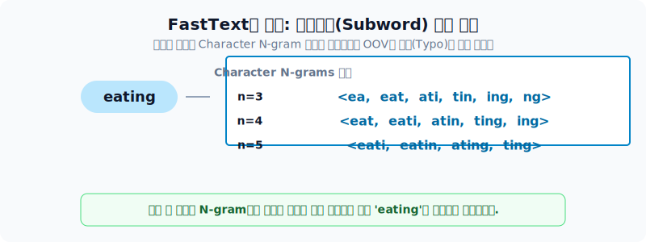

# 워드 임베딩 기법의 다양한 발전

단어를 수치화된 밀집 벡터로 변환하는 워드 임베딩(Word Embedding) 기법은 뉴럴네트워크 언어모델(NNLM)의 철학을 계승하며 큰 발전을 이루었습니다. 본 섹션에서는 그 중 가장 대표적인 모델인 **Word2Vec**과 이를 개량한 **FastText**, 통계적 장점을 결합한 **GloVe**의 탄생 배경과 동작 원리를 알아봅니다.

---

## 1. Word2Vec

Word2Vec은 단어의 의미를 반영한 임베딩 벡터를 만드는 가장 대표적인 방법입니다. 주변 단어들을 통해 중심 단어를 유추하거나, 반대로 중심 단어로 주변 단어를 유추하면서 단어 사이의 유사도를 학습해 나갑니다. 

*Word2Vec의 두 가지 학습 아키텍처 비교*

- **CBOW (Continuous Bag of Words)**: 윈도우 크기 내의 문맥(주변 단어)들을 모두 합쳐 중심 단어 1개를 맞추는 방식입니다. NNLM과 다르게 비선형 은닉층(Hidden layer)을 제거하여 연산 속도를 크게 높였습니다.
- **Skip-gram**: 중심 단어 1개를 보고 문맥(주변 단어)들을 예측하는 방식입니다. 일반적으로 CBOW보다 여러 문맥의 경우의 수를 고려하게 되므로 더 좋은 성능을 낸다고 알려져 있습니다.

### Skip-gram with Negative Sampling (SGNS)

위의 모델들은 단어장이 커질수록 수만 개의 단어 중 정답을 골라내는 '다중 클래스 예측' 문제로 인해 엄청난 연산량이 필요해졌습니다. 이를 획기적으로 개선한 트릭이 **SGNS(Negative Sampling)** 입니다.

*정답 단어를 찾는 문제에서, 주어진 두 단어가 서로 진짜 이웃인지를 True(1) / False(0)로 판단하는 이진 분류 문제로 치환*

일부러 전혀 엉뚱한 가짜 오답 샘플(Negative Sample)들을 섞어 넣어 오직 매 스텝마다 (정답 1개 + 오답 k개)에 대해서만 이진 분류를 수행하도록 하여 글로벌한 소프트맥스(Softmax) 연산 체증을 해소했습니다.

---

## 2. Word2Vec의 한계점과 FastText

뛰어난 성능을 보였던 Word2Vec에도 치명적인 약점이 있었습니다.

1. **OOV (Out-Of-Vocabulary) 문제**: 훈련 데이터에 없던 단어나 오타가 난 단어는 임베딩 벡터를 아예 만들 수 없습니다.
2. **형태학적 특징 무시**: `eat`, `eating` 처럼 어근이 같아도 완전히 별개의 단어로 취급합니다.

이를 해결하기 위해 등장한 것이 페이스북에서 개발한 **FastText**입니다.

*단어를 Character n-gram 단위로 쪼개어 학습함으로써 모르는 단어의 의미도 어근의 조합으로 유추해내는 FastText*

FastText는 단어 자체를 서브워드(Subword)인 $n$-gram의 집합으로 쪼개어 내부 벡터들을 합산합니다. 덕분에 학습에 없던 생소한 단어나 오타가 들어와도 내부의 부분 문자열을 통해 벡터값을 유연하게 추론해 냅니다.

---

## 3. 통계적 이점을 결합한 GloVe

Word2Vec와 FastText는 철저하게 한정된 '윈도우 크기' 안의 국소적인 컨텍스트(Local context)에만 의존한다는 한계가 있었습니다. 이를 극복하기 위해 글로벌한 통계까지 반영한 기법이 스탠퍼드 대학교에서 개발한 **GloVe(Global Vectors for Word Representation)** 입니다.

*글로벌 통계를 한눈에 보여주는 윈도우 기반 동시 등장 행렬(Co-occurrence Matrix)*

GloVe는 코퍼스 전체에서 단어들이 동시 등장한 횟수를 카운트한 행렬을 만든 뒤, 두 단어 벡터의 내적(Dot product)이 이 코퍼스 전체의 '동시 등장 확률의 로그값'에 근사하도록 손실 함수를 모델링합니다. 

즉, 국소적인 윈도우 창 학습(예측 기반 모델)과 전역적인 통계치 확보(카운트 기반 모델)의 장점만을 뽑아내어 설계된 임베딩 기법이라 할 수 있습니다.
