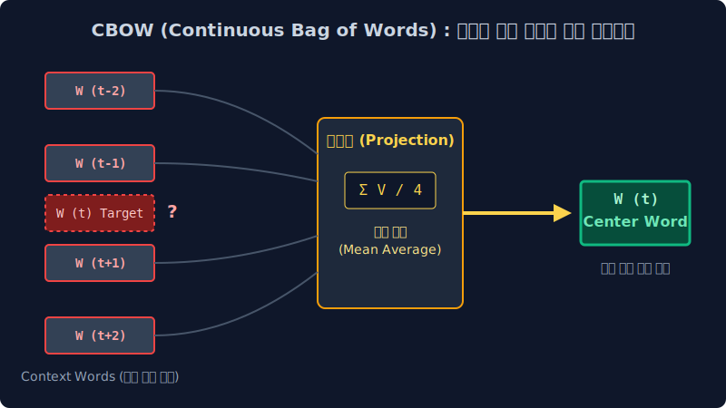
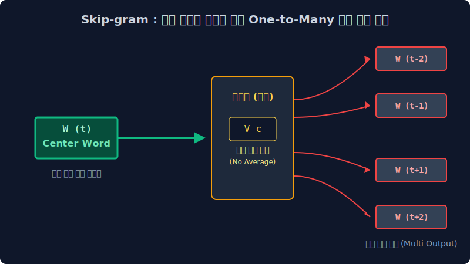

# 5.3 구글 워드 임베딩 제국 1부: Word2Vec (CBOW와 Skip-gram 알고리즘)

NNLM이 안고 있던 거대하고 태생적인 고통, 즉 '은닉층(Hidden Layer) 연산 파이프라인의 비대칭적 병목 현상'을 최적화(Optimization) 과정 혁신으로 일거에 제거해 낸 구글 딥러닝 연구팀의 전설적인 자연어 좌표 매핑 모델 **Word2Vec** 아키텍처의 철학을 선형대수학적 관점에서 낱낱이 파헤칩니다. 거대한 활성화 비선형 은닉 뇌 구조 전체를 물리적으로 도려내는 극한의 딥러닝 다이어트 기법과, 주변 문맥 예측 최적화 통제 시스템인 CBOW 및 Skip-gram 추론의 수학적 메커니즘을 알아봅니다.

---

## 5.3.1 구시대 NNLM 신경망 아키텍처의 비효율성 한계 모니터링

초기 연구작인 NNLM은 자연어 도메인에 최초로 인공 신경망 가중치 미적분을 설계해 도입했다는 학술적인 영광에 도취하였으나, 그 실상 구조는 너무나 비대하고 아키텍처 연산 오버헤드(Overhead) 효율 스탯이 열악했습니다.

1.  **맹목적인 과거 편향성 (Unidirectional Bias)**: 마르코프 체인의 윈도우 컷팅 타협점처럼 NNLM은 오로지 자기 앞에 전개된 '과거 시계열 역사 단어' 몇 개만 제한적으로 응시하고 '미래 다음 단어' 1개를 주관식으로 스핀 추론해 내는 일방통행 모델이었습니다. (문맥의 본질을 이해하려면 사실 타겟팅 구멍을 기점으로 뒤에 뻗은 후행 문맥(Right Context)도 양방향 스캐닝해야 하지만, 이 모델은 수학적으로 그것을 해내지 못했습니다.)
2.  **연산 부하가 극심한 심층 비선형 활성화 스택 (Hidden Bottleneck)**: 거대한 비선형 활성 함수(Activation Function, Tanh 등) 미분 노드 스위치들이 수천 겹 단위로 칭칭 물려있는 깊은 뎁스의 은닉층 곱셈 연산 파이프라인을 구동시켰기 때문에, 오차 교정을 위해 뒤로 돌아오는 편미분(역전파, Backpropagation)의 레이턴시(Latency)와 컴퓨팅 잉여 소모가 끔찍할 정도로 낭비적이었습니다.

이 시스템 상태를 디버깅 모니터링으로 지켜본 구글 데이터 마이닝 엔지니어 연구 군단은 딥러닝 역사상 가장 잔혹한 파괴적 결단을 수학적으로 도출해 버립니다. 
**"컴퓨팅의 이점을 무효화 시키는, 쓸데없이 미분 폭발만 유도하는 저 비만 스택 은닉층 네트워크(Hidden Layer) 아키텍처를 전부 삭제하라!"**

---

## 5.3.2 딥러닝 아키텍처의 뼈 깎는 다이어트 (Shallow Network 최적화)

구글 연구팀은 기존 NNLM의 거대한 입력층과 출력층 사이를 무겁게 가로막아 연산 트래픽을 유발하던 두껍고 깊은 피드포워드 다층 은닉 공간을 도무지 참지 못하고 모두 삭제해(Drop) 버렸습니다. 그리고 그저 차원 맵핑(Mapping)의 뼈대 기능만 수행하는 아주 극단적으로 **얇은 1단의 투사층 연결선 행렬(선형 룩업 테이블 가중치 $W$)** 메커니즘 단 하나만을 탑재한 **극평면 신경망(Shallow Neural Network)** 아키텍처 논문을 발표합니다. 

단순히 신경 단계를 반 토막으로 깎아낸 무식한 처사였음에도, 이 뼈 인간(Word2Vec) 구조는 중심 타겟 기준 앞뒤 이웃 단어들(Window Context Size) 전부를 동시에 스캐닝해 들여다보는 양방향 교차 훈련 편법 트릭을 장착하여 연산 속도는 압도적인 수천 배의 광속으로 끌어올리면서, 성능 정확도 지표는 거대 은닉망을 압살하는 무시무시한 자연어 제왕이 되었습니다.
이 Word2Vec의 가중치 추론 수학적 방향성에 따라 통계학은 **CBOW** 와 **Skip-gram** 2가지 종류의 쌍둥이 작전으로 모델을 분리하여 설계하게 됩니다.

---

## 5.3.3 다중 문맥의 응축 평활화 전략 (CBOW : Continuous Bag Of Words)

CBOW 모델은 주변 단어들의 통계 벡터값을 결합해 중심 타겟 정답을 예측 도출하는 다수결 응축 병합 구조입니다.
**"우리가 시스템 입력 텐서로 주변(Context) 들러리 힌트 단어의 배열 벡터들을 일괄 투입하겠다. 기계 너는 이 다차원 다수 벡터들을 결합 투사하여, 한가운데 위치한 (블라인드 처리된) 중심 단어(Center word) 타겟 하나가 무엇인지 확률을 도출해 보아라!"**

*   **다대일(Many-to-One) 스펙 비율 매핑**: 수십 명의 주변 들러리 목격자 노드 배열 값 입력 $\to$ 단 `1개`의 중앙 타겟 소프트맥스(Softmax) 단어 정답 예측 출력.
*   **관측 윈도우 스팬 (Context Window Size)**: 만약 윈도우 스펙 수치를 `2`로 설정하면, 중앙 단어 위치 기준 앞에서 2개 단어 벡터 수열, 뒤에서 2개 단어 벡터 수열 (총 4개의 주변 감시망 텐서)만 입력 파라미터로 스캔하여 은닉 연산 힌트를 얻습니다.

> [!NOTE]  
> **💡 다수결 매핑 구조 이해: 4개의 Context 벡터가 중앙 타겟(Center)을 조준하는 법**  
> `The fat ( ? ) sat on the mat` 이라는 거대한 스크립트 도화지가 있습니다.    
> 윈도우 스팬 반경 파라미터를 `C=2`로 세팅하고 돋보기를 가운데 대봅니다.  
> 
> 시스템이 도출해야 할 정체불명의 수수께끼 타겟(`?`) 앞자리에 입력으로 `The` 와 `fat` 이라는 주변 텐서 2개가 서브미션 되고, 뒷자리에는 `sat` 과 `on` 이라는 벡터 2개가 동시 배열 병렬로 투입됩니다. 
> 투사층 기계 맵핑은 앞뒤 이 4개 단어의 밀집 벡터 실수 데이터 배열들을 한 큐에 종합 병합하여, "**이 주변 어휘 망들이 포위한 가운데 단어는 높은 확률 통계 수치로 [cat 고양이] 벡터에 수렴함이 증명됩니다!**" 라고 단 한 번의 은닉 결합 연산만으로 정답 파라미터를 역산해 띄워 올립니다. 

---

## 5.3.4 평균(Mean) 정보 손실의 딜레마: CBOW 의 구체적인 선형 결합 수식

비선형성을 탈피한 가벼운 뼈대 투사층(Projection layer) 내부에서 CBOW 알고리즘은 다음과 같은 기계 수학적 단계를 거칩니다.

1.  이웃한 4개의 주변 문맥 단어들이 탑재한 거대한 10만 고차원 희소(Sparse) 원-핫(One-hot) 텐서들이 일제히 시스템 입력망 포트에 투입됩니다.
2.  이전 NNLM 챕터에서 배웠던 극강의 **'투사층 다이렉트 룩업 테이블(Lookup Table)'** 스킵 스킬을 발동하여, 무거운 행렬 내적 연산을 생략한 채 순식간에 128 혹은 256 차원의 압축 실수 밀집 임베딩(Dense Vector) 스탯 공간 좌표로 변신하여 추출됩니다.
3.  💥 **가장 치명적인 구조적 맹점 파악**: 방금 입력된 문맥 단어 4개의 각자 독립된 벡터 고유의 성질 배열 세트를, 이 가벼운 투사층은 전부 포용해 낼 수학적 폭포(Depth) 그릇이 없습니다. 따라서 이 4개의 독립 다차원 배열(압축 파워 값)을 단순히 요소 성분별로 선형 다 합해버린 다음, 개수로 무식하게 4를 나누어 도출하는 $\frac{\sum V}{4}$ **'평균 내기 병합(Mean/Average Projection)' 짬뽕 연산** 을 때려 강제로 하나의 벡터 체급으로 병합 귀결 시켜버립니다! (고유 문맥의 섬세한 의미 벡터 정보 손실이 필연적으로 유발됨)
4.  결국 하나로 뭉개져 버린 단일 스탯의 평균 스칼라 결합 벡터 덩어리가 마지막 출력층 역치 활성(Softmax) 가중치 계단을 타오르며 10만 단어 어휘 공간 중 [cat(고양이)] 이라는 범인 정답 확률표 분포 1개를 그려내게 됩니다.

---

## 5.3.5 분기 확산 (Skip-gram) 의 단일-다중 수학적 역발상 구조

CBOW 파이프라인의 아쉬운 평균 짬뽕화(Mean Average Loss) 단점을 깨우치고, 뇌 구조 지표의 연산망을 수식적으로 완전히 180도 물구나무 세워버린 수학 천재 모델이 나타났으니 이것이 바로 Word2Vec의 진정한 왕좌 지배자 **Skip-Gram(스킵-그램)** 아키텍처입니다. 
**"자, 내(시스템)가 아주 극단적인 조건으로 오직 중심에 발현된 보스 단어(주인공 정답) 텐서 딱 1개만 허공에 던져서 입력할 테니까! 기계망 파라미터 너는 오직 저 단서 벡터 1개만 찢어서 분석한 후, 니 중심 단어의 좌우 반경 윈도우 스팬(Window Span)에 숨어 도열했었던 나머지 들러리(Context) 문맥 단어 수십 개 파라미터 전체를 혼자 힘으로 싹 다 추론 분기해서 분산 예측해 내라!!"**

*   **일대다(One-to-Many) 스펙 역전 비율 매핑**: 오직 최초 `1명(1 Node)`의 중앙 타겟 벡터 입력 단서 $\to$ 수십 개의 주변 들러리 예측 출력값 병렬 확산 (Softmax 예측 노드가 병렬로 동시에 다수 출력됨).
*   **아키텍처 정보 보존의 강점 특징**: CBOW처럼 목격자 4명의 고유 특질 정보 스탯을 함부로 뭉뚱그려(평균 함정) 소실시키지 않습니다!! 오직 독립된 보스(Center) 1명의 고유 실수 차원 좌표 성분만 찢어 파헤쳐 보고 주변 좌우 문맥 단어 4개를 일방향으로 한꺼번에 스플릿(확산)시켜 확률 밀도를 전개해야 하므로, 인공지능 내부 벡터 가중치($W, W'$) 매트릭스는 CBOW의 평균 내기 예측 시절보다 무척 혹독하고 엄청난 지능 스탯업 **오차 역전파(Backpropagation) 지옥 훈련**을 받으며 기하학을 구축해 나갑니다.
*   **글로벌 최적 평가 산출**: 이처럼 혹독하게 강압적 확산 분기 멘탈 훈련이 된 Skip-gram 단어 밀집 벡터 모델이 CBOW 알고리즘 모델보다 거대 문서 품질, 심층 의미 벡터 매핑, OOV 문맥 파악, 기하학적 유사성 클러스터링 모든 지표면에서 **압도적으로 월등하게 정교하고 뛰어난 퀄리티를 생산해 낸다**고 수많은 논문을 통해 교차 검증 완료되었으며 현존하는 모든 고전 Word2Vec 구현체의 디폴트(Default) 기초 영웅 셋팅이 되었습니다.

---

## 5.3.6 구글 시스템의 연산량 병목 직면: 출력층 소프트맥스의 대폭발

하지만 신경망의 뎁스 병목을 얇은 투사층 하나로 다이어트해 혁명적인 압축 계산 연산 성공의 찬란한 영광에 도취했음에도 불구하고, Word2Vec의 뼈대 역시 또 다른 아키텍처의 구조적 심장마비 발작(Bottleneck Overflow) 오류를 겪게 됩니다. 바로 모델의 최종 종착역 통과 관문인 **원-핫 다중 분류 출력층 '소프트맥스(Softmax)' 가중치 미분 함수 연쇄의 치명적 병목 현상 폭발**입니다.

강인한 Skip-gram이 오직 중심 토큰 1개를 던져주고 주변 4개의 정답 토큰들을 도출해 낼 때 그 가장 매끄럽고 완벽한 코사인 정답을 가중치 행렬로 찾아내기 위해서는, 딥러닝 출력 망에서는 매 연결 학습 미분 스텝(Epoch)마다 수학적으로 **`오차 역전파를 적용해 무려 전체 사전에 등록된 10만 개 종류나 되는 수십만 오답 단어 스위치들의 소프트맥스 가중치 전체 파라미터 벡터를 싹 다 전수조사하여 편미분 분모 단위 연산으로 일괄 갱신(Update)`** 하며 시스템 전력을 무자비하게 고갈시키는 지옥의 참사가 벌어졌습니다. 

"이딴 식으로 타겟 문제 1개 풀 때마다 기계 내부에서 10만 개의 오답지 데이터 포트(Negative Class) 행렬의 가중치 미적분 갱신 폭탄 연산을 전부 다 쳐 돌리다가는 서버 VRAM 터지고 전기료 파산한다! 이건 압축 효율 모델이 아니다!" 

결국 구글의 악마적 집념을 지닌 천재 공학자들은 이 말도 안 되게 무거운 출력층 오차 갱신 미분 계산의 폭발 트래픽을 단 번에 회피하고 속여 넘기기 위해, 정보학 및 딥러닝 튜닝 역사상 가장 추악한 수학적 속임수이자 동시에 소름 돋게 우아하고 완벽한 타협 알고리즘인 **[네거티브 샘플링 사기극 편법 (Negative Sampling - 노이즈 대비 추정)]** 이라는 위대한 회피 기술을 창조해 냅니다. 이 거짓말 확률론의 대서사시 모델링 수학 체계는 바로 다음 장에서 심층 연결 이어집니다.
