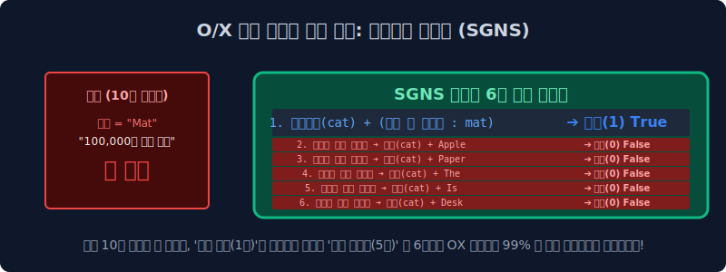

# 5.4 구글 워드 임베딩 제국 2부 (SGNS 네거티브 샘플링)

출력 계층의 Softmax 분수 함수 연산량 때문에 구글의 천문학적인 최신 딥러닝 서버마저 과열되어 터져 나가는 수학적 위기를 막기 위해, 구글 엔지니어 10만 단어 중 '쓰레기 오답' 몇 개만 억지로 골라와서 거짓말 시험지를 만드는 마법의 다이어트 트릭, **네거티브 샘플링(Negative Sampling)** 의 수학적 진실을 공개합니다.

---

## 5.4.1 병목 역전파: Softmax 가중치 미세 조정의 폭발

전 챕터에서 단어망 통과 계산의 마지막 극단적 병목은 바로 소프트맥스(Softmax) 계단 통과와 오차 역전파 연산이었습니다. 기계가 중간 타겟 시드 `[Cat]` 을 던져서 옆에 찰떡같이 어울리는 `[Mat]` 이라는 경호원을 다중 클래스 분류로 추론해야 하는 Skip-gram 수식 과정입니다.

딥러닝 모델이 저 `Mat`이라는 정답 확률 수치를 1번 갱신시키기 위해, 출력층 뒷단에서는 무식하게 도열해 있는 전 세계 **10만 개 종류의 모든 영어 단어 가중치를 일일이 싹 다 몽땅 꺼내서 미분 계산 모델을 돌려 타겟 오차를 갱신(Update)** 해야만 합니다.

*   `Apple` 전구는 빵점 오답 처리 (미분 갱신 가동)
*   `Student` 전구도 빵점 오답 처리 (미분 갱신 가동)
*   `Mat` 전구는 100점 무한 가점 투척 (미분 갱신 가동)

... 이 거대하고 오지게 무식한 10만 개 편미분 스위치 연산 강요를 딥러닝 에폭(Epoch Step)마다 수억 번이나 돌려버리니 GPU VRAM이 과열로 터져 다운될 수밖에 없었습니다.

---

## 5.4.2 위대한 치팅: 네거티브 샘플링 (SGNS)

이런 어처구니없는 전기 낭비를 보다 못한 구글 천재 악당 연구진은 통계학 논문을 뒤져 천재적인 꼼수 아이디어를 냅니다.

**"야이 멍청아!! 10만 개 단어 가중치를 모델에서 왜 다 갱신하고 자빠졌냐? 그냥 10만 개 중에 대충 오답 쓰레기 단어 5개만 무작위(Random) 룰렛으로 돌려서 뽑아와! 그래서 정답 1개랑 그 쓰레기 5개, 딱 수학 문제 6개만 가지고 AI가 이진 OX 채점하게 강제로 속여버려!!"** 

이것이 Word2Vec을 최강자의 반열에 올린 핵심 엔진, **SGNS (Skip-Gram with Negative Sampling)** 기술입니다.

---

## 5.4.3 시험지 수술: 10만 지선다형 객관식 $\to$ 2지선다 OX 퀴즈

기존 모델이 10만 번 지선다형 거대 객관식 시험표를 풀어야 했다면, SGNS 모델은 갑자기 초등학생 수준의 단순한 **이진 분류 게임(Binary Classification 트릭 게임)** 으로 뇌 수술을 당합니다.

1. **테이블 중앙 (진짜 정답 세트 1개)**: 내가 방금 본 윈도우 시야 안에 들어있던 실제 경호원 단어 한 쌍 `(Cat, Mat)` $\to$ 얘네 둘이 역사적으로 세트로 붙어서 나타났으니까 너희 둘이는 무조건 연결 정답 모델 레이블 **[True (1)]** 이야 참!
2. **거짓말 더미 (오답 세트 무작위 5개 샘플링)**: 구글 사전 전체 10만 개 어딘가에서 아무 관련도 없는 완전히 생뚱맞은 똥 쓰레기 단어 5개를 주사위를 굴려 던져 테이블로 강제로 끌고 옵니다. `(Cat, Apple)`, `(Cat, Pencil)`, `(Cat, President)` ... $\to$ 얘네들은 당연히 문장에 같이 붙어있던 적이 없으니까 무조건 연결 오답 레이블 **[False (0)]** 이야 거짓!

---

## 5.4.4 연산량의 비약적인 99% 단축(다이어트) 마법

위 상황처럼 O/X 이진 거짓말 게임 조작으로 수능 문제를 치환해 버린 계산량의 결과는 확률 수학적으로 엄청났습니다.
*   **과거**: 1개의 문제를 풀 때마다 10만 개 종류의 출력층 가중치($W$) 편미분 미적분 수식망을 전원 다 켜놓고 돌려야 했습니다.
*   **SGNS 마법**: 오답 5개(Negative)와 정답 1개(Positive), **단 6개의 이진 교차 엔트로피(Binary Cross-Entropy) 가중치 계산과 미분 연산만 아주 잽싸게 갈겨버리고 컴퓨터 연산을 종료하고 퇴근해버립니다!** 

이는 기존 모델 행렬 대비 연산량이 무려 역대급 효율인 $\frac{1}{16000}$ 수준 밑으로 줄어드는 미친 가성비의 최적화 수학 트릭입니다.

---

## 5.4.5 네거티브 뺑뺑이 룰렛판의 확률 철학 (빈도 억압 지수)

그런데 가짜 오답 5개를 사전에서 무작위 주사위로 뽑아올 때, 단어들을 공평한 확률로 1/N 뽑기 하는 게 절대로 아닙니다!

> [!CAUTION]  
> **📖 초심자를 위한 쉬운 해설: 잡초 불용어의 패널티 억압 룰렛**  
> 오답을 뽑는 확률 룰렛 다트판의 면적 크기는 "단어가 문장들에서 평소에 얼마나 미치도록 자주 등장했느냐(단어 빈도수, $\text{Frequency}$)" 에 정비례하여 크기가 부풀려 조절됩니다. 
> 
> * 즉, 우주구급 관사 스팸 단어인 `The`, `a`, `is` 같은 잡초 앵무새 놈들은 룰렛판 면적이 어마어마하게 크게 잡혀있습니다. 
> * 컴퓨터가 다트(랜덤)를 던져서 오답 단어 5개를 골라올 때마다, 이 쓰레기 관사 잡초 놈들이 **주로 억울하게 오답(거짓, False 0) 진술자로 미친 듯이 많이 찍혀서 무대 위로 불려 올라옵니다.**
> 
> 결과가 어떻게 될까요? 끊임없이 거짓(0점) 판정 패널티 매를 연속으로 맞으며 딥러닝 가중치 벡터 파워가 무한정 바닥으로 깎여나가기 때문에, 훈련이 끝나고 나면 저절로 이들 불용어 쓰레기 단어들의 임베딩 위치 파워는 알아서 좌표 구석탱이로 전락하여 **자연도태** 되어버립니다! TF-IDF 공식을 굳이 쓰지도 않았는데 딥러닝 랜덤 룰렛 세팅만으로 불용어를 응징해 버리는 아주 극도로 우아한 인공지능 최적화 설계입니다!

이렇게 네거티브 샘플링이라는 천방지축 치트키 엔진을 무장한 Word2Vec은 전 세계 NLP 학계를 점령하고 제국을 건설했습니다. 하지만, 방심한 틈에 또 다른 거대한 글로벌 라이벌 집단 (페이스북 Meta 군단)이 반란을 선언하고 Word2Vec이 잡지 못하는 아주 커다랗고 징그러운 결함 한 가지를 찾아내고 반정도를 시도합니다. 다음 장에서 스펙터클한 전쟁이 벌어집니다.
