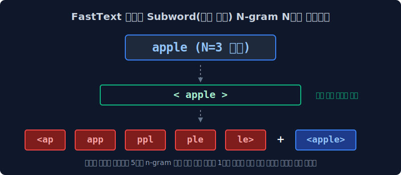
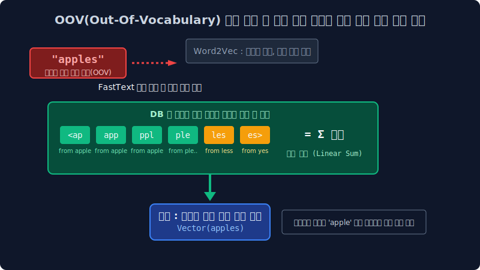

# 5.5 미등록 미지 단어(OOV)의 치명적 방어막: 서브워드(Subword) 분해와 FastText

전 세계 모델링 생태계를 장악하며 천하무적 같았던 구글의 Word2Vec 제국에도 아키텍처 상의 피할 수 없는 치명적인 구멍 하나가 있었습니다. 바로 자연어 처리 시스템이 한 번도 훈련해 본 적 없는 신조어나 오타 코퍼스가 테스트 데이터에 등장하면, 훈련된 차원 좌표를 찾지 못하고 또다시 그래픽 카드 엔진이 에러를 뿜으며 셧다운 되어 버리는 고전 통계학의 질병, **OOV(Out-Of-Vocabulary)** 병목이 완벽히 해결되지 않았다는 점입니다. 이 약점을 파고들어 정보 임베딩을 글자 조각 단위로 파쇄해 버린 메타(Meta, 구 페이스북 AI 연구팀)의 **FastText 하위 단어 분해 추론 기술**을 알아봅니다.

---

## 5.5.1 전통 Word2Vec 제국의 절망적인 한계 (OOV 구조의 붕괴)

Word2Vec은 모델 훈련 당시 텍스트 덤프 데이터 안에 포함되어 "자체 서버 단어집 형태소 사전(Dictionary)" 안에 등록된 고정된 형태의 정규 단어들(예: `Apple`과 `Phone` 같은 고빈도 단어들)에 대해서는, 코사인 거리와 수학적인 유사도 기반 3D 차원 공간을 환상적으로 완벽히 잘 구축해 냈습니다. 하지만 서비스 배포 현장에서는 뼈저린 현실적 장애 인퍼런스(Inference) 오류를 유발합니다.

1.  **신조어나 인간의 오타 (OOV 미등록 단어 에러)**: 만약 스마트폰 한국어 리뷰 데이터에서 `"아이폰 사과폰 좐맛탱이네 ㅋㅋㅋ"` 라는 평가 문장이 런타임에 들어왔다고 가정해 봅시다. Word2Vec 내장 사전에는 이전에 훈련시킨 `존맛탱` 은 들어있지만, 오타가 난 `좐맛탱` 은 글로벌 10만 단어 DB 카탈로그 어디를 뒤져봐도 벡터가 매핑되어 있지 않습니다. 사전 목록의 고정된 Index(행렬 인덱스) 자리가 원천적으로 존재하지 않는 토큰이 들어왔으므로 시스템 연산 포인터가 갈 곳 잃어 널(Null) 참조를 일으키며, 거대한 GPU 서버가 `UNK(Unknown 단어 변환 에러)` 패널티를 띄우면서 문장 전체의 유사도 연산을 거부해 버리는 현상입니다.
2.  **데이터 희소성: 출현 빈도가 매우 낮은 롱테일(Long-tail) 단어의 역행**: SGNS 알고리즘으로 단어가 임베딩 우주 고정 좌표를 매핑 확립하려면 다트판 빈도로 문장에 자주 노출되어 가중치 미분 역전파 매를 꾸준히 맞고 스탯을 서서히 조절해야만 합니다. 그러나 거대 코퍼스 1,000만 줄의 텍스트에서 딱 1번만 등장한 특이한 '우즈베키스탄 사람 고유명사' 토큰이 있다면 어떻게 될까요? 가중치 갱신 훈련 횟수(Epoch)가 턱없이 부족하여 임베딩 미적이 덜 끝난 탓에, 좌표 평면상 아무 연관도 없는 완전히 생뚱맞은 오류 구역(Noise Sector)에 표류해 배치되면서 타겟을 둘러싼 앞뒤 문맥 벡터망 전체를 순식간에 난장판으로 붕괴시켜버립니다.

---

## 5.5.2 메타(Meta AI)의 파괴적 반격: N-gram 도마 글자 부분 분해(Subword) 전략

이러한 고질적인 Word2Vec의 OOV 멘탈 붕괴 사태를 조용히 관전하던 글로벌 IT 라이벌 페이스북(현 Meta) AI 리서치 연구팀이, 드디어 2016년에 **FastText (패스트텍스트)** 라는 명칭의 비밀 반격 무기 논문을 발표했습니다. 그들의 수학적 정보 접근 마인드는 기존 학계의 고정 관념을 부숴버릴 정도로 폭력적이면서도 기발했습니다.

**"형태소 토큰들을 왜 단어(Word)라는 큰 단위의 덩어리로만 취급하여 분절하고 통째로 벡터 표를 맵핑해서 암기시키려 하는가? 그런 경직된 정보 구조는 버려라. 우리는 한 단어를 그보다 더 작은 최소 알파벳 단위(Subword)의 조각들로 데이터 도마 위에서 다시 무자비하게 썰어서 N-gram 단위로 쪼개어 독립 훈련시킨다!"**

FastText 알고리즘 인프라 내부에서는 오리지널 단어 1개를 바라볼 때, 알파벳 철자 양 끝 경계 구역에 모델의 인식 특수 기호인 `<` 와 `>` 문자열을 강제 태깅 부착합니다. 그리고 `N-gram` (글자들을 $n$개 묶음 덩어리로 슬라이싱 하기) 분할 공정 파이프라인을 가동합니다.
예를 들어 `N=3` (철자를 3글자 단위로 연속 슬라이싱 윈도우 스팬) 팩터(Factor)로 타겟 토큰 `<apple>` 을 파쇄해 버린다면 다음과 같이 변환됩니다.

*   `<ap`
*   `app`
*   `ppl`
*   `ple`
*   `le>`

---

## 5.5.3 부분 단어(Subword) 분해 파편들의 선형 덧셈(Linear Sum) 조합 공식 마법

위와 같이 알고리즘 단에서 서브 토큰으로 무참히 썰려 나간 파이프라인의 종착 결과를 살펴보면, 시스템 모델은 이제 더 이상 우주 좌표 차원 배열 공간 내부에 `apple` 이라는 단일 거대 벡터 행성을 1개의 인덱스로 치부해 단독 저장하는 1차원적 방식을 쓰지 않습니다. 
데이터 도마에서 썰려 나간 저 쪼가리 파편 **알파벳 조각 스펠링 5개 타일(Subword) 객체들 하나하나 각각에 딥러닝 임베딩 독자적 벡터 스칼라 값(개별 실수 좌표점 행렬)을 따로따로 부여** 하여 아주 미세하고 잘게 쪼개진 파편 벡터들을 훈련시킵니다. 
어디 거기서 끝일까요! 심지어 파편화되기 이전 원래 덩어리였던 오리지널 온전한 토큰, 시그니처 단어인 `<apple>` 통째 벡터까지 예비용으로 모두 병렬 포함하여 싹 다 메모리 가중치 풀(Pool) 레이어 장부에 때려 집어넣습니다. 인덱스 사전의 절대 용량 크기 자체는 Word2Vec에 비해 무지막지하게 무거워져 연산 캐램(RAM)을 요구하지만, 이에 보상받는 OOV의 수학적 방어력과 복원력은 거의 무적에 가까운 초월적 수준으로 상승합니다.

> [!TIP]  
> **💡 구조 분석: N-gram 파편을 선형 결합(Linear Combination)으로 정합하여 복원하기**  
> 그럼 추론 모드로 들어갔을 때, 최종 타겟 목표인 `apple`이라는 의미적 발화 단어의 벡터 기하학 스탯을 어떻게 도출 연산해 낼까요?  
> 아주 단순하면서도 무식하고 완벽한 수학 공식이 도입됩니다. **"아까 도마에서 잘라 나누어 저장해 둔 저 n-gram 서브워드 벡터 파편(기하학 매트릭스) 값 객체 성분들을 다시 루프 메모리로 싹 끌고 모아 온 다음, 수학적으로 행렬을 몽땅 일괄 덧셈(Summation 평균 선형 결합)해서 단 1개의 은닉 타일로 압축 합체해버려라!!"**  
> 
> $$ \vec{\text{apple}} = \vec{\text{<ap}} + \vec{\text{app}} + \vec{\text{ppl}} + \vec{\text{ple}} + \vec{\text{le>}} + \vec{\text{<apple>}} $$
> 즉 FastText가 그려내는 실수 차원의 기하 행성 벡터 본질은, 저 무수한 파편 조각 알파벳 N-gram 레고 벡터 속성들의 총합 덩어리가 이끌어내는 치밀한 선형 누적된 근사치 스칼라 평균 수치입니다.

---

## 5.5.4 FastText의 압도적인 미등록 어휘(OOV) 에러 파쇄와 기적의 복원력

도대체 저렇게 무식하고 무거운 서브워드 분해 덧셈 기술 뭉치가 어떻게 OOV(미지 단어 에러)를 방어하는데 그렇게 절대적인 방어 위력을 뽐낼 수 있을까요? 여기서 FastText의 위대한 수학적 복원 진가가 폭발적으로 발휘됩니다.

> **상황 발동**: 인터넷 실시간 대화창 테스트 문장에 `apples` 라는, 사전 DB 장부 훈련 스텝에 단 한 번도 등록된 적 없는 희소 미등록 단어(OOV)가 유저의 손가락 오타나 문법 변형으로 갑자기 툭 튀어나오며 파이프라인에 난입했습니다!

*   **구글 Word2Vec AI 매핑 (과거)**: "경고 에러 삐빅! `apples` 파라미터는 내 백과사전 스코프 10만 개 목록에 없음! `UNK` 에러 트래픽 뿜어내고 파이프라인 전체 추론 거부 선언!"
*   **페이스북 FastText AI 추론 (진보)**: "음... 내가 전체 풀 사이즈 단어인 `apples` 라는 온전한 덩어리는 살면서 한 번도 본 적이 없는 무명 변수 단어지만... 잠깐! 이 이어진 단어 배열 철자 조각을 3조각(N=3) 크기 기반으로 데이터 칼질 분해 스캔을 돌려보자 (`<ap`, `app`, `ppl`...) 어!? 이 알파벳 조각 찌꺼기 부분 벡터 배열들은 **내가 저번 달에 옛날 구글 단어 `apple` 이랑 `lesbian` 같은 수십만 개 글로벌 영단어 훈련 모듈 돌려댈 때 미친 듯이 뒤지게 많이 쳐다보고 익혀두었던 바로 그 익숙한 스펠링 N-gram 덩어리 벡터 가중치 좌표 데이터들이네?** 그럼 비록 저 원래 단어는 누군지 모른다 칠지라도, 이 내 사전에 이미 기록되어 있는 저 서브워드 알파벳 쪼가리 파편 객체들만 팍팍 루프로 모아서 다이렉트로 수학적 선형 결합 덧셈 처리해 합쳐버리면, 이 처음 들어온 `apples` 놈 단어도 대략 임베딩 우주 공간 3D 어딘가(apple 언저리)에 처박혔는지 평균 스탯 기하학 유사도 좌표 근사 유추 계산이 완벽하게 성립되겠군!!"

이처럼 놀라운 수학적 유추를 통해, FastText 아키텍처는 시스템이 평생 처음 관측해 보는 신조어나 손가락 실수 오타, 띄어쓰기 모음 하나나 자음이 미세하게 빠진 빈도가 희박한 한국어 텍스트 문장이 유입될지라도 다운되지 않고 꿋꿋하게 **'기적의 벡터 좌표 복원 근사 추론(Approximation)'** 모델링을 달성하게 이끌어줍니다. 특히 활용 용언 어미 변화나 띄어쓰기 교착 어형 변화(Morphology)가 무지막지하게 다변화하여 폭발적인 OOV 생성 변수를 지닌 한국어, 터키어 같은 아시아어 교착어 구조 도메인, 또는 한 번도 본 적이 없는 희박한 라틴어 파생 원소 단어들이 결합되는 의료 공학 같은 전문 하드(Hard) 코퍼스 NLP 필드 현장에서, Word2Vec을 완전히 짓밟고 뛰어넘어 FastText가 압도적인 모델링 정확도 성능 우위를 발휘하는 철옹성 구세주가 되었습니다.
