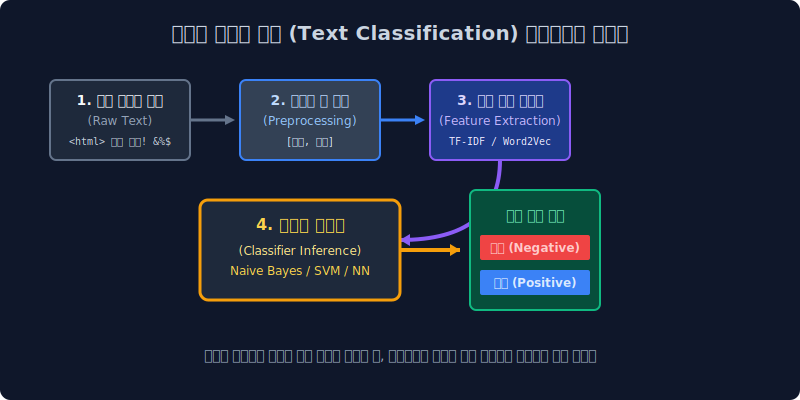
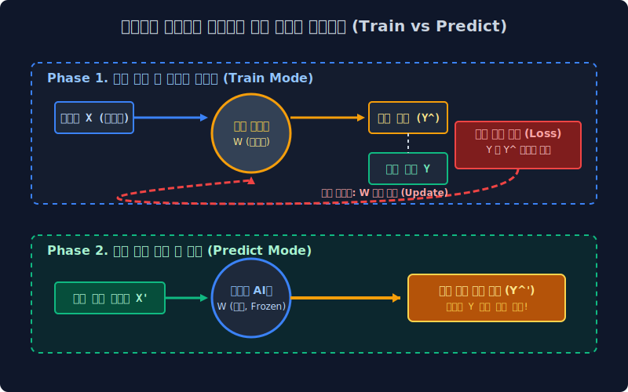

# 6.1 기계학습: 텍스트 분류의 본질과 파이프라인

이전 5주 차 커리큘럼까지 우리는, 방대한 글자들을 인공지능이 계산할 수 있는 수학적 숫자 행렬과 기하학적 3D 좌표 스펙(Word Embedding 등 밀집 벡터)으로 수술하고 변환하는 '특성 추출(Feature Extraction)' 기술을 배웠습니다. 

이번 6주 차부터는 그렇게 1종 조립을 마친 "숫자가 박힌 엑셀 종이 고기"를 인공지능 기계가 아예 날것으로 씹어 삼켜서, 이것이 정상 메일인지, 스팸인지, 고객의 극대노 쌍욕 리뷰인지를 논리적으로 판별해 내고 색인 방(Room)으로 강제 분리 수거해 버리는 **텍스트 분류(Text Classification)** 머신러닝의 파괴적인 판결 엔진들에 대해 탐구합니다.

---

## 6.1.1 텍스트 분류 (Text Classification) 란?

기업의 빅데이터 부서 현업에서 가장 천문학적인 돈을 쏟아붓고, B2B IT 솔루션의 영업 매출을 책임지는 자연어 처리(NLP) 스킬의 1위이자 핵심 심장입니다.

> **본질**: 주어진 무작위 문자열 문장 덩어리를 딥러닝 뇌세포가 읽어 들이고 씹어서, 개발자가 사전에 철저하게 세팅해 둔 여러 개의 **'목표 범주(Category/Class) 방'** 중 가장 적합한 라벨 하나를 골라 100% 강제로 집어던져 수감시키는 우체부 색인 역할입니다.

*   **스팸 필터 모델 (2진 분류기)**: $\to$ (스팸 쓰레기통 방, 정상 업무 메일 방) 2개로 분리
*   **감성 분석 모델 (다중 분류기)**: $\to$ (매우 긍정, 긍정, 소소, 화남, 쌍욕 분노) 5개로 분리
*   **뉴스 카테고리 로터리 서버**: $\to$ 네이버 뉴스가 올라오자마자 사람 개입 없이 1초 만에 텍스트 속성을 읽고 (정치, IT, 연예, 국제 사회) 각 부서 게시판으로 스플릿!

---

## 6.1.2 텍스트를 재단하는 거대한 컨베이어 벨트 (Pipeline)

판별 AI(분류 모델)는 입력만 넣으면 자동으로 똑똑한 정답이 튀어나오는 마법의 요술 지팡이가 절대 아닙니다. 공장에서 철광석을 다듬듯이, 아주 엄격하고 냉혹한 데이터 처리 **컨베이어 벨트 파이프라인**을 전부 통과해야만 겨우 모델이 한 입 베어 물 수 있습니다.

1.  **원시 텍스트 수집 (Crawling)**: 욕설, 오타, HTML 태그가 더럽게 묻은 웹 크롤링 덩어리.
2.  **정제 및 전처리 자르기 (Preprocessing)**: 정규표현식 메스를 통한 특수문자 파괴, 쓸데없는 관사 삭제, 어간 엑기스 추출(토큰화).
3.  **특성 추출 통계 번역 (Feature Extraction)**: 문자를 들이밀면 컴퓨터는 미적분 연산을 거부합니다. 따라서 지난주 배웠던 카운팅 엑셀표(TF-IDF)나 밀집 딥러닝 3D 공간 행렬(Word2Vec 벡터 $0.41, -2.13$)로 **완벽하게 숫자로 통역 압축**하는 공정.
4.  **$\to$ 최후의 분류 심사역 (Classifier Brain)**: 자, 드디어 우리가 6주 차에 도착한 마지막 종착 위치입니다! 전처리와 임베딩이 끝난 완벽한 숫자를 삼키고 수학적 가중치를 저울질하여 "이건 90% 스팸이다!" 라고 법정 판결을 내리는 진정한 AI 모터 계층.

---

## 6.1.3 분류 AI 모델의 이중 심장 엔진 (Train & Predict)

지도학습(Supervised Learning) 기반 머신러닝 분류기 시스템은 프로그램이 켜질 때, 하나의 심장으로만 뛰지 않습니다. 무조건 과거와 미래를 담당하는 두 개의 분리된 모터 엔진 시스템으로 격리 작동합니다. 과거의 족보를 갉아먹는 **학습(Train)**과 새로운 미래를 예언하는 **예측(Predict)** 입니다.

### 1단계 심장: 두뇌 활성화 고통의 학습 엔진 (Train)
입력되는 과거의 텍스트 덩어리 데이터 모음($X$)과, 알바생 수천 명이 노가다로 옆에다가 직접 정답("오, 이건 스팸이네")을 체크해 놓은 정답지 라벨 배열($Y$) 100만 건을 동시에 묶어서 AI의 입에 잔혹할 정도로 무한정 꾸역꾸역 들이붓습니다. 

* 기계는 데이터($X$)를 보고 자기 맘대로 정답을 찍었다가, 옆에 족보 통지표($Y$)와 비교해 보고 대참사 틀림을 경험합니다!
* "어? 틀렸네?" 오류 충격을 먹고 자신의 뇌세포인 **가추치($W$) 스위치들의 기울기 값**을 통계 미적분(역전파)으로 서서히 조절(Update Tuning)해 나갑니다. 이 미적분 노가다 고통 과정을 기계 학습(Train)이라고 부릅니다.

### 2단계 심장: 마스터 졸업생의 실전 예측 엔진 (Predict)
딥러닝 훈련이 전부 완전히 끝난 채 서버에 올라가 배포된 상태입니다. 이제는 인간 알바생 정답지 족보($Y$)를 절대로 주지 않고 다 불태워 버립니다.

* 오로지 어제 갓 태어나서 모델은 자기 평생 한 번도 본 적이 없는, **그 생초면의 뉴스 텍스트 구조($X'$)를 입력**으로 뚝 떨어뜨려 던집니다.
* 과거 피가 터지는 1단계 훈련 모터에서 다듬어진 뇌세포 가중치 직감만을 바탕으로 삼아, 이 낯선 문서가 스팸방에 갈 확률인지 정치 뉴스방에 갈 확률인지를 스스로 뱉어냅니다(예측 라벨 $Y'$). 기계가 독립적인 판사로 홀로 우뚝 서는 영광의 순간입니다.

---

## 6.1.4 부활하는 과거 유산의 그림자 (피처 추출기 복습)

당장 다음 챕터에서 통계학의 최강 스팸 판독기인 `나이브 베이즈(Naive Bayes 모델)`를 배울 것인데, 여러분의 기억 저편에 묻어 두었던 카운트 피처 모듈 2개(BoW와 TF-IDF)를 무조건 가동시켜야 합니다. 잠시 뇌 창고를 리프레시합니다.

> [!NOTE] 
> 📄 **1. 가장 무식하고 충직한 집계원: BoW (Bag of Words)**  
> 텍스트의 앞뒤 맥락 위치 구조를 다 개무시하고, 단지 각 단어가 "몇 번(Counts) 문서에 등장했는지"를 정수로 세어서 아주 더럽고 큰 텅 빈 엑셀 희소 행렬표로 찍어냅니다. (바보 같지만 속도가 어마어마하게 폭발적으로 빠릅니다.)

> 📄 **2. 교활한 잡초 암살자 패널티 필터: TF-IDF**  
> `the`, `is` 같은 무의미한 관사 잡초 녀석들이 무식하게 조회수만 1억 번 찍어 BoW 엑셀 통계의 파워 1등을 교란하며 장악하는 것을 막기 위해, 로그($\log$) 스케일 역수 치기를 걸어 **자주 나오는 쓰레기 단어는 스탯 파워를 압사시키고, 전체 10만 개 중 몇 개 문서에만 가끔 유독 튀어나오는 극단적 키워드('비아그라', '대출 특가')는 역으로 막대한 파워 점수를 뻥튀기 부스팅 시키는** 마법의 가중치 조절 행렬입니다. 스팸 분류기들의 가장 거대한 멱살 견인차 파츠입니다.

이 지독한 두 개의 엑셀 무기표를 장전하고, 바로 다음 장 무대인 '통계의 황제 모델, 조상님 베이즈 주사위' 챕터로 진격합니다.
