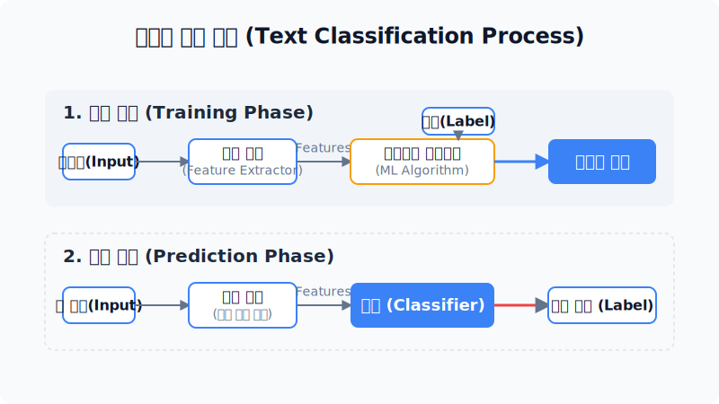
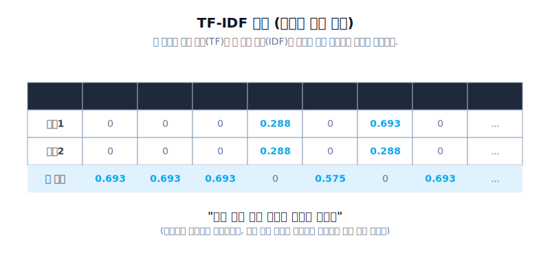
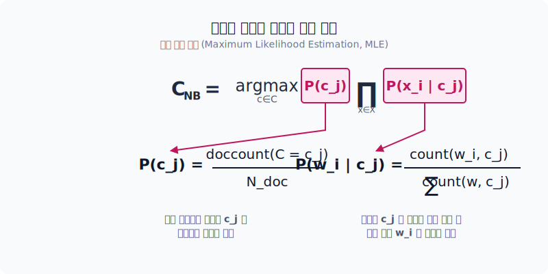
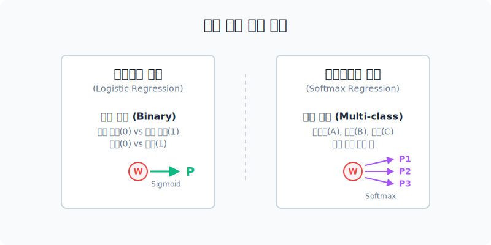

# 기계학습 모델을 활용한 문서 분류 기법

이전 주차까지 텍스트를 기하학적 숫자(벡터)로 바꾸는 법을 배웠습니다. 이제 기계가 그 벡터를 씹어 삼켜서, 이 문서가 과연 '긍정'인지 '부정'인지 '스팸'인지를 스스로 판별해 내는 **텍스트 분류(Classification)** 머신러닝의 대단원을 시작합니다.

---

## 00. 텍스트 분류의 개념
현업에서 가장 돈이 되고 수요가 많은 애플리케이션 중 최고봉입니다.

## 01. 자연언어처리 기법의 파이프라인
* **텍스트 수집**: 크롤링 등
* **텍스트 전처리**: 불용어 파괴, 형태소 쪼개기
* **특성 추출(Feature Extraction)**: 카운트를 기반으로 벡터 만들기 (BoW, TF-IDF, 임베딩)
* **$\to$ 텍스트 분석 (문서 분류)**: (우리가 지금 서 있는 위치) "이 메일은 스팸 범죄입니다!" 도출!

## 02. 텍스트 분류의 내부 과정도
텍스트 분류 머신러닝은 무조건 `학습(Train)`과 `예측(Predict)` 두 단계 엔진으로 구동됩니다.
*   **학습 엔진**: 텍스트와 그 답지 레이블(Label)을 묶어서 무수히 밀어 넣으며 통계 가중치를 적응시킵니다.
*   **예측 엔진**: 처음 보는 문장이 들어와도, 학습된 가중치 모델을 바탕으로 알아서 클래스(예: 정치 기사)를 도출합니다.

## 03. 과거의 유산: 피처 익스트랙터 (Feature Extractor)
모델은 바보이기 때문에 "I love it" 같은 사람이 읽는 영어를 던지면 무조건 계산 에러가 뜹니다.
따라서 이전에 배웠던 `BoW` 매트릭스나 `TF-IDF` 가중치 변환기 등의 **전처리 추출 모듈**을 반드시 먼저 통과시켜서 숫자로 구워 넘겨주어야 기계가 수학적 분류 연산을 할 수 있습니다.

## 04. 텍스트 특성 벡터화 리뷰 - BoW (단어 가방)
단순 빈도수 카운트표. 가장 멍청하지만 확실합니다.

## 05. 텍스트 특성 벡터화 리뷰 - TF-IDF
단순 카운트의 맹점(The나 a 같은 쓸데없는 단어가 1위를 독식하는 현상)을 수학적으로 극복한 로그($\ln$) 보정식 적용본. 핵심 식별 명사(`스팸`, `대출`)에 더 높은 가중치를 배당하여 분류기 성능을 멱살 잡고 끌어올리는 주역입니다.

---

## 06. 통계학의 위대한 아버지: 나이브 베이즈 분류기 (Naive Bayes)
딥러닝의 복잡한 레이어가 등장하기 훨씬 전부터 존재한, 가장 역사가 깊고 직관적이며 속도가 무식하게 빠른 통계 문서 분류기입니다. **베이즈 규칙(Bayes rule)** 확률 방정식에 그 근간을 둡니다.

### 베이즈 공식
문서 $d$가 주어졌을 때, 그것이 클래스 $c$(예: 스팸)일 확률:
$$ P(c|d) = \frac{P(d|c)P(c)}{P(d)} $$

## 07. 나이브 베이즈의 억지스러운 두 가지 가정 (Naive)
수학적 확률 계산의 폭발을 막기 위해, 통계학자들은 아주 'Naive(너무 순진하고 멍청한)'한 억지 가정을 세우고 수학식을 난도질했습니다.

1.  **위치(순서) 독립성 무시**: 단어가 문장 앞에 오든 뒤에 오든 뉘앙스 차이를 아예 100% 무시합니다. (BoW 사상 유지)
2.  **조건부 독립성 억지**: 엄청난 길이의 텍스트가 들어왔을 때, `good`과 `movie` 같은 연관 깊은 단어조차 "얘네들은 피차 아무 영향을 안 주고 완전히 우연히 독립적으로 떠오른 단어들이야" 라며 억지로 사건 수식을 분리(독립 사건 취급)해 버립니다.

> [!WARNING]  
> **📖 초심자를 위한 쉬운 해설**  
> "나이브"하다는 건 컴퓨터가 바보처럼 앞뒤 맥락을 포기하고 "단어들이 다 남남이지 뭐!"로 퉁친다는 겁니다. 현실 세계 언어 법칙에 크게 위배되는 쓰레기 억지 가정 같지만, 신기하게도 실제 스팸 분리 같은 곳에 적용해 보면 딥러닝급으로 엄청나게 답을 잘 맞춥니다!

## 08. 모델 학습: 최우도 추정법 (MLE, Maximum Likelihood)
나이브 베이즈 모델이 학습 데이터로부터 확률 파라미터 점수를 수확하는 수학적 과정입니다.

$$ P(w_k | c) = \frac{N(w_k, c) + \alpha}{N(c) + \alpha |V|} $$

* 클래스(스팸) 집단 폴더 내부에 포함된 전체 단어들 중에서 특정 단어 `W(대출)`가 등장한 **발현율을 단순하게 카운트하여 분수 수학 계산**으로 추정합니다.
* 분모의 $\alpha$는 한 번도 본 적 없는 단어(OOV) 확률이 0으로 폭발하는 것을 막기 위한 라플라스 스무딩(보험)입니다.

## 09. 이진 분류 예측 연산 예시 (영화 리뷰)
* `“I love this fun film”` 문장이 들어왔습니다! 이게 긍정 리뷰일지 부정 리뷰일지 어떻게 예측할까요?

$$ \hat{c} = \arg\max_{c \in C} P(c) \prod_{i=1}^n P(w_i | c) $$

* 위 무서워 보이는 $\arg\max$와 $\prod$(곱하기) 공식을 풀어쓰면 정말 어이없을 만큼 단순한 아래의 엑셀 곱하기가 됩니다.

*(모델의 뇌 구조 시뮬레이션)*
*   긍정 쪽 확률($P(c)$)과 단어들의 확률들을 쭉 곱해봤더니 긍정 점수 `5e-8` 달성!
*   부정 쪽 확률들을 찝찝하게 쭉 곱해봤더니 부정 점수 `1e-9` 도출.
*   **$\to$ 결론:** 긍정 점수가 압도적으로 높으므로 이 문장은 "긍정(Positive)" 판정!

## 10. 선을 긋는다: 로지스틱 회귀 (Logistic regression)
주사위 수학(나이브 베이즈)의 한계를 깨기 위해 들이댄 본격 머신러닝의 꽃입니다. (분류 문제의 기본 모델)
* 데이터들의 특징(숫자 벡터)과 파라미터 가중치를 곱해 선형 조합을 산출한 뒤, 가장 알맞게 영역을 쪼개는 결정 경계선(Decision Boundary) 함수를 긋는 방식입니다.

## 11. 로지스틱과 시그모이드 (Sigmoid) 함수
이 모델이 내놓는 숫자는 마이너스 무한대부터 플러스 무한대까지 날뜁니다. 여기서 아름다운 마법의 곡선(`S커브`, 시그모이드) 수식을 통과시켜 **분류 확률 강제 압착**을 시도합니다.

$$ \sigma(z) = \frac{1}{1 + e^{-z}} $$

* 이 함수는 세상의 아~무리 큰 데이터 수치라도 무조건 `0`과 `1` 사이의 작은 실수 비율(확률 퍼센트)로 납작하게 만들어버립니다!
* "스팸 확률이 85%($0.85$) 네요!" 라고 말할 수 있게 해주는 마법입니다.

## 12. 다중 클래스로의 확장: 소프트맥스(Softmax)
스팸/정상 2개(이진 분류)가 아니라 카테고리가 15개(정치/사회/경제/스포츠 등)면 로지스틱의 선 하나로는 부족합니다.

* 마지막 출력단에 전체 카테고리 확률의 압착 총합이 무조건 **`1.0 (100%)`**이 되게끔 비중을 분산 펌핑하는 **소프트맥스(Softmax)** 확률분포 회귀 수식을 탑재시켜서 다중 분석 분류기로 맹활약하게 합니다.
