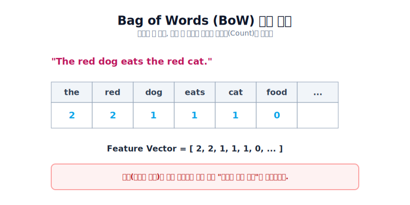
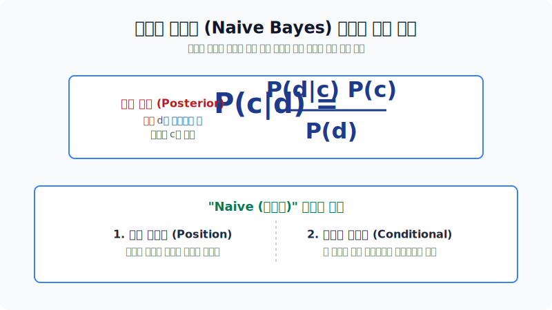
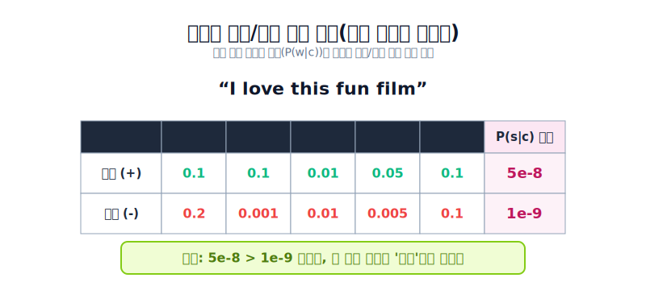

# 텍스트 분류 (Text Classification)

자연언어처리(NLP) 분야에서는 수집된 텍스트들을 효과적으로 분석하고 활용하기 위해 다양한 기법들이 존재합니다. 형태소 분석부터 네트워크 분석, 기계번역 등 다양한 갈래 중에서도, 텍스트가 어떤 범주(Category)에 속하는지 식별해내는 작업을 가리켜 **텍스트 분류(Text Classification)**라고 합니다.
- **예시**: 메일의 스팸/정상 여부 분류, 뉴스 기사의 주제별 분류, 리뷰의 감성(긍정/부정) 분류 등

---

## 1. 텍스트 분류 과정 (Training & Prediction)

텍스트 분류 모델을 만들고 사용하는 과정은 크게 **학습 과정(Training Phase)**과 **예측 과정(Prediction Phase)**으로 나뉩니다.

1. **학습 과정**: 이미 정답(Label)이 주어진 수많은 텍스트 데이터를 통해 패턴을 찾습니다. 텍스트를 기계가 알아들을 수 있는 수치형 '특성(Features)'으로 추출한 뒤 이를 ML 알고리즘을 이용해 학습시켜 모델을 도출합니다.
2. **예측 과정**: 학습된 모델을 활용해, 정답이 없는 새로운 문서가 들어왔을 때 기존 규칙과 동일하게 특성 추출을 거친 뒤 그 문서가 어떤 카테고리(Label)에 속할지 예측합니다.

---

## 2. 텍스트 특성(Feature) 추출

분석 과정에서 가장 중요한 것은 인간의 언어를 기계가 이해할 수 있는 수학적 **숫자 특성 벡터(Feature Vector)**로 변환하는 일입니다. 가장 기본적인 2가지 방법을 살펴봅니다.

### 2-1. Bag of Words (BoW)

BoW는 텍스트를 단순히 "단어들의 가방"으로 취급하는 가장 직관적인 방식입니다. **단어의 문법이나 어순(위치)은 완전히 무시**하고, 오직 **특정 단어가 몇 번 등장했는지(빈도수)**만을 카운트하여 벡터로 기록합니다.

- 단점: 'the'나 'a', 'is'처럼 모든 문서에 자주 등장하는 무의미한 단어들 때문에 핵심 단어의 가치가 묻힐 수 있습니다.

### 2-2. TF-IDF (Term Frequency - Inverse Document Frequency)

단순 빈도로만 측정하는 BoW의 한계를 극복하기 위해 등장한 가중치 기법입니다.
- **TF(단어 빈도)**: 특정 문서 내에서 단어가 얼마나 자주 등장했는가?
- **IDF(역 문서 빈도)**: 전체 문서군을 통틀어 보았을 때, 이 단어가 얼마나 흔하게 등장하는 단어인가? (흔한 단어일수록 페널티를 부여)

TF-IDF는 이 두 값을 곱하여 가중치를 구하므로, 'the' 같이 뻔한 단어의 점수는 낮아지고, 해당 문서의 '핵심 주제'를 담은 희소성 있는 단어의 점수는 높아지게 됩니다.

*희귀 단어에 가중치를 부여하는 TF-IDF 행렬 변환 예시 표*

> 20개의 서로 다른 뉴스 카테고리를 모아둔 20 뉴스 그룹 데이터셋 등을 분석할 때, BoW로 적용하면 수많은 0들이 섞인 희소 행렬(Sparse Matrix)이 나오지만 단순 숫자만 찍히고, TF-IDF는 핵심 키워드를 더욱 두드러지게 표현하는 차이가 있습니다.

---

## 3. 대표적인 분류 모델

문서를 벡터로 변환했다면, 이 숫자화된 문서를 바탕으로 어떤 카테고리인지 결론 지을 **Classification Model (분류 모델)**을 입혀야 합니다.

### 3-1. 나이브 베이즈 (Naive Bayes) 분류기

조건부 확률 기반의 **베이즈 정리(Bayes Theorem)**를 사용하는 가장 단순하지만 강력한 모델입니다.

가장 큰 특징은 **"단순한(Naive) 가정"**에 기반한다는 것입니다.
1. 문장 내에서 단어의 **위치**는 무관하다.
2. 각 단어들이 등장하는 사건은 서로 **조건부 독립적**이다. (즉, 'apple'이 나왔다고 해서 'pie'가 나올 확률이 변하지 않는다고 가정함)

이러한 조건부 독립 가정 하에서, 나이브 베이즈 알고리즘은 아래와 같이 과거 텍스트 분포로부터 **최대 우도 추정(MLE)**을 계산하는 산식을 취합니다.

*전체 데이터 대비 해당 클래스의 비율과, 클래스 내 특정 단어 파편의 비율을 독립적으로 구하는 직관적인 산식*

이런 단순화 덕분에 매우 빠르고 계산 비용이 적어 스팸 분류, 텍스트 긍정/부정(감성 분석)에서 널리 사용됩니다.

*문장을 이루는 각 단어들의 개별 확률을 서로 곱하여(독립 사건 취급), 최종 점수가 가장 높은 클래스(긍정)로 분류해내는 과정*

### 3-2. 로지스틱 회귀와 소프트맥스 회귀

단순한 확률 통계가 아닌, 기계학습 모델의 최적 파라미터(Weight)를 학습해 판단 영역의 선을 긋는 함수 모델입니다.

- **로지스틱 회귀 (Logistic Regression)**: 최종 결과물을 S자 형태의 Sigmoid 함수로 감싸 0에서 1사이의 결괏값으로 출력합니다. 그래서 결과가 A아니면 B인 0/1 **이진 분류(Binary Classification)**에 최적화되어 있습니다.
- **소프트맥스 회귀 (Softmax Regression)**: Softmax 함수를 이용하면 출력 결과물의 확률 총합을 1.0(100%)으로 만들어줍니다. 여러 카테고리로 나누어야 할 때 (예: 스포츠/정치/경제/사회 중 하나 배정), **다중 분류(Multi-class Classification)** 시스템으로 확장된 방식입니다.

---

## 4. 분류 성능 최적화를 위한 접근 전략

실제 텍스트 분류 문제에서 성능을 극대화하려면 모델 알고리즘 외에도 다음과 같은 최적화 접근이 필요합니다.

1. **텍스트 전처리 준비**: 분석할 가치가 적은 텍스트 노이즈를 제거하기 위해 정규표현식 클렌징, 영문 불용어(the, is 등) 제거, 어간(Stemming) 추출 등을 사전 진행합니다.
2. **N-gram 도입**: 단어 순서가 파괴되는 BoW 방식의 한계를 보완하기 위해 단어를 1개(Unigram) 단위가 아니라 2개 구(Bi-gram)나 3개 구(Tri-gram) 단위로 묶어서 특성사전에 반영하여 약간의 *문맥*을 학습시킵니다.
3. **알고리즘 선정 및 하이퍼파라미터 튜닝**: 문제에 맞춰 로지스틱 회귀나 트리모델(Random Forest), 딥러닝(RNN, BERT) 등 최적의 모델을 고르고 내부 모수를 섬세하게 튜닝합니다.
