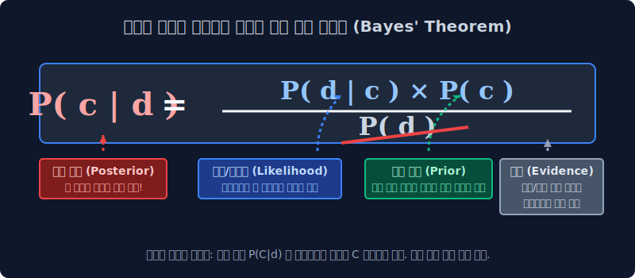
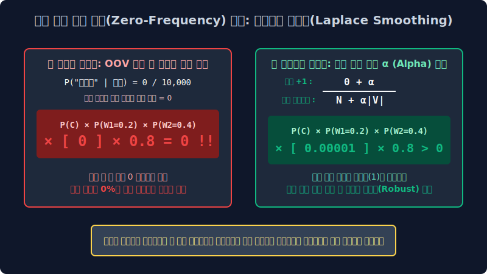

# 6.2 멍청한 통계의 기적: 나이브 베이즈 분류기 (Naive Bayes)

수십 개의 레이어가 중첩된 딥러닝 우주가 도래하기 훨씬 전, 학계를 장악했던 전설적인 고전 통계 확률 모델입니다. 파이썬 코드가 단 세 줄이면 완성되어 연산 속도가 빛의 속도 마냥 빠르지만, 스팸 메일 분류 실무 현장에서는 무거운 딥러닝 모델의 뺨을 서늘하게 후려칠 만큼 압도적인 실전 명중률을 자랑하는 통계 문서 분류기의 영원한 조상 **나이브 베이즈(Naive Bayes)** 의 모순된 기적을 배웁니다.

---

## 6.2.1 모든 것의 시작: 베이즈의 정리 (Bayes' Theorem)

18세기의 통계 천재 토마스 베이즈가 창안한 전설의 확률 방정식에 뿌리를 둡니다. 베이즈 정리는 "우리가 어떤 사건의 진실(정답)을 당장 모를 때, '그 집단이 평소에 가졌던 태생 퍼센트(사전 확률)'와 '방금 내 눈앞에 뚝 떨어진 강력한 단서들(증거)'을 조합해서 $\to$ **진실이 무엇일지에 대한 퍼센티지를 거꾸로 역추적 계산하는 도구**" 입니다.

### 🚨 스팸 판독기의 베이즈 공식
수천 개의 알파벳(단어 증거 $d$)이 쏟아져 들어왔을 때, 컴퓨터가 이 문서를 악성 스팸 폴더($c$)로 확 판결해 버릴 종합 확률 공식은 아래와 같습니다.

$$ P(c|d) = \frac{P(d|c) \times P(c)}{P(d)} $$

*   $P(c)$ **[Prior 사전 확률]**: 무작정 내 메일함에 들어온 메일 중 평소 스팸이 차지하던 비율 통계 (예: 대충 평소 메일함의 40%가 스팸이더라~ 하는 편견).
*   $P(d|c)$ **[Likelihood 우도]**: 스팸($c$)이라고 이미 판정된 쓰레기 메일 방 안에서, 하필 방금 들어온 `대출!` 이라는 단어($d$)가 과거에 몇 번이나 발견되었었는가에 대한 일치율(증거력).
*   $P(d)$ **[Evidence 분모]**: 우주 전체에서 이 단어가 나타날 확률. 하지만 우리가 긍정 방 점수랑 스팸 방 점수를 비교할 때, 양쪽 방정식에서 똑같이 이 $P(d)$ 숫자로 나누기를 하게 되기 때문에 **분모는 과감하게 쓰레기통에 버려도(생략 무시)** 대소 비교에 아무런 지장이 없습니다! 컴퓨터 전기 아껴야죠!

---

## 6.2.2 억지스러운 두 가지 가정 (Why "Naive"?)

저 멋진 베이즈 공식을 문장("I love this fun movie") 전체에 때려 박으려다 보니 대참사가 일어납니다. "단어들이 연쇄적으로 연달아 발생할 연결 확률 분수 곱셈"이 수십만 단위로 폭주하면서 메모리(RAM)가 녹아내렸습니다. 그래서 학자들은 눈물을 머금고 모델 이름에 **'Naive(너무 무식하고 순진한)'** 이라는 칭호를 붙이며 다음과 같은 막 나가는 억지 가정을 도입해 컴퓨터의 뇌를 도려냅니다.

1.  **위치와 어순 무시 (단어 가방 본능)**: 단어가 문장 맨 앞에서 튀어나오든, 꼬리에서 튀어나오든 뉘앙스 차이를 100% 개무시합니다. "존맛 사과" 든 "사과 존맛" 이든 나이브 베이즈에게는 그저 `존맛` 1개, `사과` 1개가 뽑힌 랜덤 깡통 주머니일 뿐입니다.
2.  **조건부 철저한 남남 취급 (독립 사건의 억지)**: 텍스트에 나타난 단어들은 문맥상 당연히 붙어있어야 합니다. 하지만 나이브 모델은 이렇게 선언합니다. **"나는 `good` 이라는 단어와 `movie` 라는 단어가 서로 손을 잡고 시너지를 낸다는 사실을 절대 모른 척할 거다! 그냥 우주 공간에서 주사위를 던졌는데 얘네 둘이 완전히 우연의 일치로 튀어나왔다고 퉁칠거다! (독립 사건)"** 

> [!TIP]  
> **😲 나이브한 논리 파괴가 왜 훌륭할까?**  
> 앞뒤 문맥을 포기하고 독립 사건으로 분수를 박살 낸 덕분에, 모델의 계산 속도가 타의 추종을 불허할 정도로 수천 배 이상 가속화됩니다!   
> 게다가 이렇게 주사위 게임처럼 멍청하게 단순해진 특성 덕분에, 데이터 수가 적을 때 딥러닝처럼 **특정 오타 문장 하나를 달달 사진으로 외워버리는 오버피팅(과적합 함정)** 오류에 빠질 틈이 없습니다. 스팸 필터 전쟁에서 이 멍청함이 오히려 무지막지한 명중률 쾌거를 가져왔습니다.

---

## 6.2.3 최우도 추정법과 스무딩 방어막 (Smoothing)

나이브 베이즈 모델이 과거 학습 데이터로부터 확률 파라미터 장부를 짤 때는 엄청나게 단순한 초등학생 산수 나누기 모델(최우도 추정법, MLE)을 가동합니다.

$$ P(w_k | c) = \frac{N(w_k, c)}{N(c)} $$

> **해석**: 스팸($c$) 폴더 전체 방어막 안에 단어가 총 1,000만 개($N(c)$) 흩어져 있는데, 그중에서 `비아그라($w_k$)` 라는 단어가 발견된 횟수가 5,000번이었다네? $\to$ 아항! 이 단어의 살상 확률은 $\frac{5,000}{10,000,000}$ 로구나! 

### 🚨 멸망의 위기: 신조어 분자 0의 저주
만약 오늘 아침에 갓 탄생한 신조어 `영끌족(W)` 이 내 10년 치 메일 학습함에 단 일(1)도 없었다면 무슨 일이 벌어질까요? 
1. 발견된 적이 없으므로 분자 횟수가 `0` 이 됩니다. 
2. 나이브 베이즈는 모든 단어 확률을 연속으로 계속 곱하기($\prod$)하는 모델입니다. 
3. 이 거대한 주사위 곱하기 체인 중간에 **숫자 `0`**이 하나 똑 떨어지면, 아인슈타인이 와도 그 뒤에 곱하는 수만 개의 모든 점수가 도미노로 붕괴하여 최종 확률이 모조리 `0%` 로 파괴되어 버립니다!

이 폭발을 막기 위해 전 세계의 코더들은 이 엑셀 표에 **라플라스 스무딩(Laplace Smoothing)** 이라는 인공호흡 생명 보험 연장 장치를 우겨넣습니다.

$$ P(w_k | c) = \frac{N(w_k, c) + {\color{red}\alpha}}{N(c) + {\color{red}\alpha |V|}} $$

모든 단어 분자 꼬리에 강제로 가짜 발견 횟수 **$+1 (\alpha)$** 을 더해줍니다. 이렇게 하면, 완전히 생판 모르는 단어조차 최소한 확률값이 `0` 이 되는 파국을 건너뛰고 아주 찌질한 `0.00000001%` 라도 살아남게 되어 전체 연쇄 도미노 곱셈 파괴 현상을 매끄럽게(Smoothing) 막아낼 수 있습니다.

---

## 6.2.4 실전 평가 주사위 굴리기 시뮬레이션

기계에게 이 모든 이론을 탑재시키고, 배포 서버에서 미지의 테스트를 진행합니다.
* **미션**: "방금 막 들어온 `“I love this fun film”` 이라는 문장이 스팸이야 정상(긍정)이야?"

$$ \hat{c} = \arg\max_{c \in C} P(c) \prod_{i=1}^n P(w_i | c) $$

나이브 베이즈 뇌 속에서는 위의 어지러운 $\sum$과 $\prod$ 같은 수학 기호를 던져버리고 사실 아래와 같은 아주 원초적인 초등학생 연속 주사위 곱셈 놀이가 벌어집니다.

1.  **긍정(Positive) 통 룰렛 돌리기**: (기본 긍정 메일이 들어올 확률 60%) $\times$ (긍정 방에서 `I`를 뽑을 확률) $\times$ (긍정 방에서 `love` 확률) $\times$ (`fun`) $\times$ (`film`) 을 주르르륵 다 곱해봅니다!
    *   $\to$ 결과 점수 도출: `0.00000005` (`5e-8`)
2.  **부정(Negative) 통 룰렛 돌리기**: 부정 방에서도 똑같이 과거 확률을 꺼내 다 곱해봅니다!
    *   $\to$ 결과 점수 도출: `0.000000001` (`1e-9`)
3.  **최종 결론 심판**: "어라? 긍정 통의 최종 곱하기 룰렛 점수 결과가 부정 통 점수보다 압도적으로 거대하네? 그럼 이 문장은 무조건 **긍정(Positive) 룸에다 던져!!**"

이토록 원조 콩국수 집 같은 극도로 단순한 파이프라인 확률 곱하기 엑셀 방식 하나로 수십 년간 텍스트 자연어 데이터들의 대문 통제가 완벽하게 가동되었습니다. 이제는 이런 단순 엑셀 비교를 넘어서서, 인공지능이 두 진영 가운데에 거대한 미적분 면도칼로 담장 경계선을 똑바로 긋는 **로지스틱 회귀와 소프트 맥스(Softmax)** 파트로 진입합니다.
