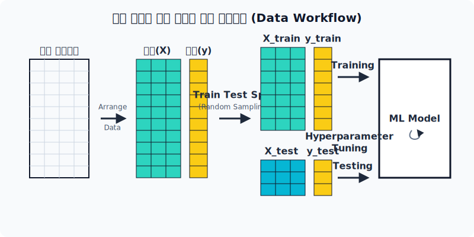
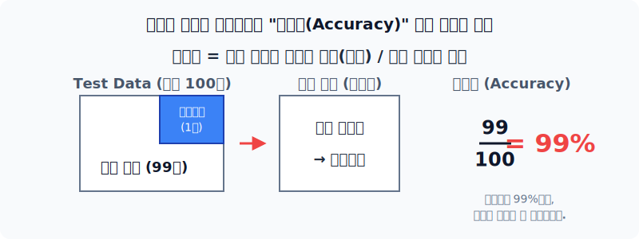
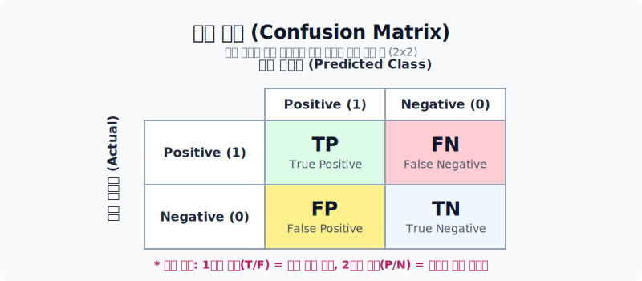
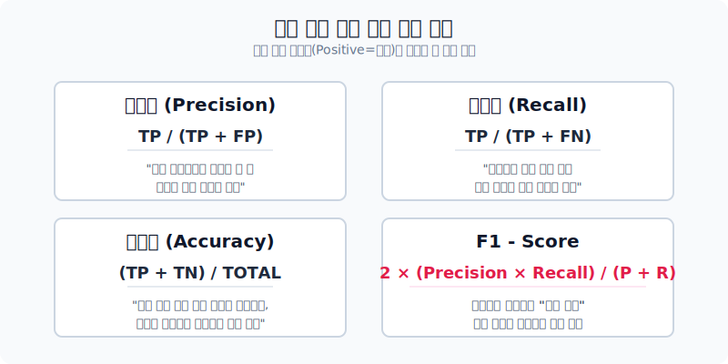
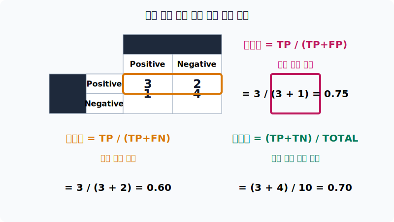
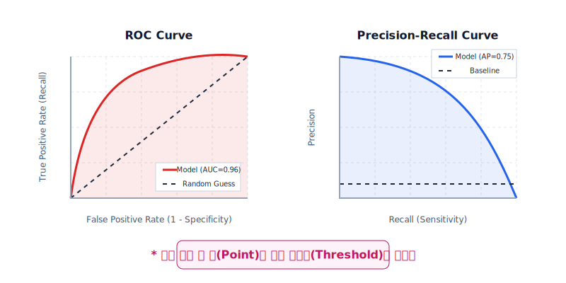

# 텍스트 분류 모델 평가

머신러닝 모델을 만들고 나면, 이 모델이 새로운 데이터에 대해서도 훌륭하게 작동하는지 검증하는 단계가 필수적입니다. 이를 위해 데이터를 어떻게 나누어야 하는지, 그리고 모델의 성능을 어떤 지표로 채점해야 하는지 알아봅니다.

---

## 1. 모델 성능평가를 위한 데이터 분할

학습과 평가를 공정하게 하기 위해, 전체 데이터를 보통 세 가지 역할로 쪼개어 사용합니다. 모의고사와 수능의 관계로 이해하면 쉽습니다.

*원본 데이터가 특성(X)과 정답(y)으로 나뉘고, 다시 학습용과 평가용으로 무작위 분할되는(Train-Test Split) 워크플로 모식도*

- **Training data (학습 데이터)**: 교과서. 모델을 훈련시키는 데 직접적으로 사용됩니다.
- **Validation data (검증 데이터)**: 모의고사. 학습이 잘 되고 있는지 중간 점검을 하거나, 모델의 하이퍼파라미터(초모수)를 최적화할 때 사용합니다. 
- **Test data (평가 데이터)**: 수능. 최종 모델의 진짜 성능을 평가할 때 딱 한 번만 사용합니다.

### K-Fold 교차 검증 (Cross-Validation)

특정 데이터만 운 좋게(혹은 운 나쁘게) Validation Set으로 빠지는 것을 방지하기 위해 데이터를 K개의 그룹(Fold)으로 쪼개어 돌아가면서 평가를 수행하는 기법입니다.

*K=5 일 때, 각 Fold가 한 번씩 1회차부터 5회차까지 돌아가며 Validation 역할을 수행합니다.*

모든 데이터가 최소 한 번씩은 검증에 사용되므로 모델의 성능 평가 결과를 훨씬 더 신뢰할 수 있게 됩니다.

---

## 2. 혼동 행렬 (Confusion Matrix)

분류 모델의 결과를 단순히 "맞췄다/틀렸다"로만 채점하지 않고, **어떻게 틀렸는지**를 체계적으로 시각화한 표를 혼동 행렬이라고 합니다.

> [!WARNING]
> 데이터 불균형 상황에서의 정확도의 함정
> 만약 100건 중 99건이 정상 메일이고 딱 1건만 스팸 메일이라고 가정해봅시다. 
> 어떤 바보 같은 분류 모델이 내용을 아예 보지도 않고 그냥 "모든 메일은 정상!"이라고 찍어버렸다면, 정확도(Accuracy)는 자그마치 99%가 나옵니다. 하지만 스팸 방지라는 본연의 기능은 0점입니다. 이러한 왜곡을 잡기 위해 혼동 행렬이 필요합니다.
> 
> 
> *"정확도 99%"의 착시 현상을 보여주는 데이터 분포 비율의 함정*

결과 해석 요령은 다음과 같습니다.
1. **첫 번째 글자(True/False)**: 모델의 예측이 정답과 일치했는가? (T=정답, F=오답)
2. **두 번째 글자(Positive/Negative)**: 모델이 뱉어낸 판단은 무엇인가? (보통 우리가 찾아내려는 '스팸'이나 '질환' 등을 Positive로 둡니다.)

- **TP (True Positive)**: 스팸이라 찍었고, 실제로도 스팸이었다. (정답)
- **TN (True Negative)**: 정상이라 찍었고, 실제로도 정상이았다. (정답)
- **FP (False Positive)**: 스팸이라 찍었는데, 실제로는 정상이었다. (오답 / 1종 오류)
- **FN (False Negative)**: 정상이라 찍었는데, 실제로는 스팸이었다. (오답 / 2종 오류)

---

## 3. 세부 성능 평가 지표

혼동 행렬의 TP, TN, FP, FN 숫자들을 조합하면 자신이 풀고자 하는 비즈니스 문제에 가장 알맞은 채점 기준표(지표)를 만들어낼 수 있습니다.

*분류 모델의 4가지 핵심 평가 지표 공식 요약*

실제로 혼동 행렬에서 결괏값 숫자가 주어졌을 때 각 지표가 어떻게 계산되는지, 아래 10개짜리 샘플 평가 예시를 통해 방향성(가로/세로)을 시각적으로 확인할 수 있습니다.

*TP, FP, FN, TN 값을 실제 식에 대입하여 Precision, Recall, Accuracy를 산출하는 계산 사례표*

1. **정밀도 (Precision)**: 내가 Positive라고 지목한 것 중에 진짜 Positive의 비율. (FP를 줄이는 것이 중요할 때)
2. **재현율 (Recall)**: 실제 세상에 있는 전체 Positive 중에 내가 놓치지 않고 잡아낸 비율. (FN을 줄이는 것이 중요할 때)
3. **정확도 (Accuracy)**: 전체 데이터 중 정답(TP, TN)을 맞춘 비율.
4. **F1-Score**: 정밀도와 재현율이 한쪽으로 극단적으로 치우치지 않게 두 수치의 **조화 평균**을 낸 값. 데이터 불균형 상황에서 모델 성능을 평가할 때 가장 널리 쓰이는 지표입니다.

### 임계값과 곡선 (ROC & PR Curve)

- 기계학습 모델은 보통 0과 1 사이의 '확률'을 내뱉습니다. 예를 들어, 스팸일 확률이 50%일 때 스팸으로 간주할지, 80%일 때 스팸으로 깐깐하게 간주할지 기준선(임계값, Threshold)을 잡아야 합니다.
- 임계값을 이리저리 바꾸어 가며 점들을 찍어 이은 선이 바로 1) 정밀도-재현율 곡선(PR Curve)과 2) ROC 곡선입니다.

*모드 가능한 임계값을 시뮬레이션하여 그려진 두 종류의 모델 성능 증명 곡선*

- 이 곡선 아래의 면적을 **AUC(Area Under Curve)**라고 부르며, 면적이 1.0에 가까울수록(넓을수록) 어떤 임계값에서도 성능이 훌륭한 이상적인 분류기임을 의미합니다.
