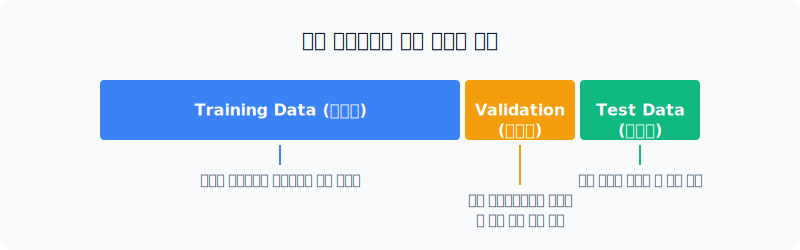
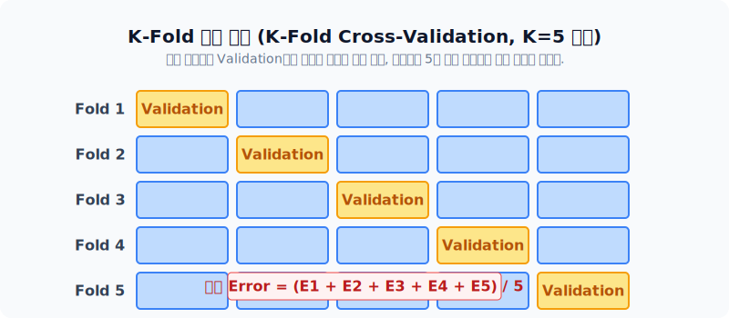

# 모델의 오만함 판별: 성능 평가 및 지표 교차 검증

우리가 훈련시킨 멍청한 분류 모델이 실제로 현장에서 얼마나 잘 예측하는지, 혹은 정확도 99%라는 사기 뒤에서 어떤 뻔뻔한 치부를 숨기고 있는지를 **엄격한 과학적 수학 지표**로 해부하고 들춰내는 단원입니다.

---

## 00. 텍스트 분류 모델 평가 파트
"정확도 99%? 당장 버려라!" 단순한 정확도의 맹점을 깨고 진짜 실력을 캡처하는 혼동행렬의 시야로 들어옵니다.

## 01. 모델 채점을 위한 통계적 데이터 3분할
우리가 문제집 1권을 다 풀었다고 해서, 똑같은 문제집으로 수능 시험 성적을 잴 수는 없습니다. 컴퓨터도 마찬가지입니다. (이런 부정행위를 `과적합/Overfitting` 이라고 부릅니다). 이를 막기 위해 데이터 파이 나누기를 합니다.

*   **1. Train Data (학습 파트 - 60%)**: 밥 먹고 오직 모델이 지식을 쌓고 가중치를 업데이트하는 데에만 쓰는 "일반 교과서".
*   **2. Validation Data (검증 파트 - 20%)**: 학습 중간중간 모델이 너무 자기 방어에 빠지지 않았는지 중간 체크하고, 하이퍼파라미터(설정값) 옵션을 세팅하는 "모의고사".
*   **3. Test Data (시험 파트 - 20%)**: 개발이 전부 끝나고 출고 직전에만 꺼내서, 모델의 찐 실력을 평가하기 위해 끝까지 꼭꼭 숨겨두는 "최종 수능 시험지".

## 02. K-fold 교차 검증 (Cross-validation)
* **Hold-out의 불운**: 만약 어쩌다 1번의 모의고사(Validation set)를 뗐는데 거기에 하필 극악 난이도 문제만 몰렸다면 모델 튜닝이 박살 납니다!
* **K-Fold 교차방지 전략**: 데이터를 무작위 5조각(`K=5`)으로 갈기갈기 찢은 뒤, 각 조각별로 4개씩 모아서 번갈아가며 학습하고, 남은 1개로 **공평하게 순서대로 총 5회 모의고사**를 치르는 방법입니다.

## 03. 성능 평가에서 마주하는 치명적 오류: 정확도(Accuracy) 역설
정답을 맞춘 전체 비율만 보는 '그놈의 정확도' 수치 하나만 맹신했다가는 회사가 부도날 수 있는 환경이 바로 **'극도로 불균형한 데이터 뻥튀기 환경(Imbalanced)'**입니다. 

> [!CAUTION]  
> **📖 초심자를 위한 쉬운 해설: 99.9% 깡통 스팸 필터의 전설**  
> 10,000통의 메일 중 진짜 스팸(빨간 독 편지)은 딱 1통뿐인 회사 메일함이 있습니다. 모델 개발자가 그냥 무조건 "모든 메일은 정상(`0`)이다!"라고 뇌를 빼고 출력만 찍어내는 쓰레기 AI 모델을 배포했습니다. 
> 
> 채점 결과 이 쓰레기 AI 모델의 **'정확도(Accuracy)'는 무려 99.99%** 가 되어버립니다(9999통의 예측 적중)! 이처럼 정확도는 단 1개의 치명적인 범죄자를 다 놓쳤음에도 "나는 S급 완벽한 모델입니다!"라며 오만한 거짓 통계를 뿜어냅니다.

## 04. 진실의 방: 혼동행렬 (Confusion Matrix) 도출
단순 정확도의 사기극을 타파하기 위해, 모델이 맞추긴 맞췄는데 **'어떻게 헛발질을 쳤고, 뭘로 잘못 찍었는지'**까지 적나라하게 감별해 낸 크로스오버 채점표입니다.

| 지표 코드 | 모델 예측 | 실제 정답 | 설명 방정식 및 해석 비유 |
|:---:|:---:|:---:|:---|
| `TP` | True (범인이다!) | True (범인 맞음!) | **(대성공)** 경찰이 진짜 테러범을 잡아 구속시킴. |
| `TN` | False (범인 아님) | False (범인 아님) | **(성공)** 선량한 대학생을 선량하다고 내버려 둠. |
| `FP` (치명적)| True (범인이다!) | False (범인 아님) | **(억울함 대폭발-거짓 양성)** 모델이 선량한 대학생을 범인으로 억울하게 지목해 평생 감옥에 가둬버림! (스팸 오판으로 중요 사업메일 날아감) |
| `FN` (치명적)| False (범인 아님) | True (범인 맞음!) | **(경찰청장 사퇴-거짓 음성)** 모델이 속아서 진짜 테러범을 구경만 하고 풀어줘서 폭탄이 터져버림! (스팸 방어 시스템 붕괴) |

## 05. 정교한 성능 지표 (Precision, Recall)
위의 표를 활용하면 모델의 진정한 본색 성향을 알 수 있습니다.

### 정밀도 (Precision: 예민한 검찰점수)
**"모델이 스팸(Positive)이라고 확신해서 의심한 놈들 중, 진짜 찐 스팸으로 밝혀진 범인 퍼센트!"**

$$ \text{Precision} = \frac{TP}{TP + FP} $$
*   (수사가 너무 허술하게 이것저것 막 잡아들여 억울한 시민(`FP`)이 감옥에 가면 정밀도가 수직으로 폭락합니다.)

### 재현율 (Recall: 투망 사냥 그물점수)
**"실제 전국의 숨어있는 진짜 찐 스팸 놈들 전체 중에서, 내 모델이 놓치지 않고 싹 다 안으로 잡아들인 범인 비율!"**

$$ \text{Recall} = \frac{TP}{TP + FN} $$
*   (그물망을 헐겁게 쳐서 진짜 범인 놈(`FN`)들이 검색을 뚫고 도망가 버리면 재현율이 바닥에 꽂힙니다.)

## 06. 정밀도와 재현율의 딜레마
**"억울한 1명의 무고한 시민이 감옥에 가도 99명의 범죄자를 다 잡을 것인가?(Recall 집중)"** vs **"범죄자를 설령 다 놓치는 한이 있더라도 억울한 무고한 시민을 재판에 세우지 않을 것인가?(Precision 집중)"** 의 이 위대한 시소 게임(Trade-off)에서 머신러닝의 파라미터가 결정됩니다. 

## 07. 조화평균의 산물: F-1 Score 지표
결국 재현율과 정밀도, 어느 한 쪽으로 극단적으로 쏠리지 않게 밸런스를 맞춘 **머신러닝 최고 권위의 통합 분류 점수**입니다. (현대의 기본값 메트릭)

$$ F_1 = 2 \times \frac{\text{Precision} \times \text{Recall}}{\text{Precision} + \text{Recall}} $$

단순한 산술평균이 아니라 **조화평균(Harmonic Mean)** 분수 역수를 치함으로써, 어느 한 지표라도 바닥을 기고 있으면 (예: 모델이 무조건 스팸이라고만 찍어서 재현율 100%, 정밀도 0%) F1 점수는 가차 없이 0점에 수렴하도록 설계되어 모델의 꼼수를 원천 차단합니다.

## 08. 임계점 곡선 (ROC / PR Curve) 과 넓이 (AUC)
* **임계값 (Threshold)**: 모델이 스팸 확률 $0.5$를 기준으로 범인을 잴 건지, 아니면 $0.8$ 이상은 돼야 범인으로 잡을 건지 기준값을 뜻합니다.
* 특정 임계값에 요동치는 정밀도와 재현율 그래프의 궤적(ROC 곡선 선형)을 그려놓고, 아예 **그 선 아래의 모든 면적 구간(Area Under Curve, AUC)** 점수 면적의 덩치를 재버립니다!
* 결국 외부의 설정값의 입력을 막론하고 이 모델 자체가 기본기(기초체력)가 얼마나 단단한 놈인지 알려주는 궁극의 평가 도구입니다.

