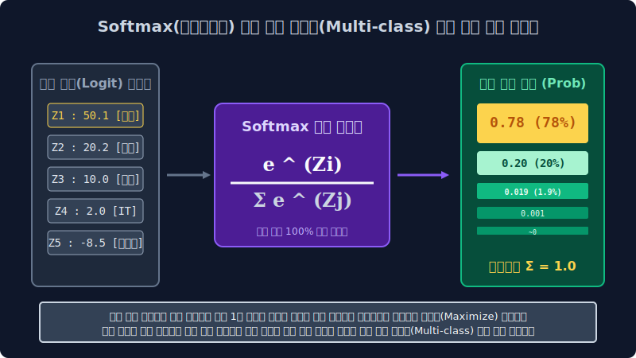

# 6.3 분류기의 최적 결정 수렴: 선형 판별망 로지스틱 회귀와 소프트맥스 변환

나이브 베이즈처럼 독립사건 확률 곱셈을 투영시키는 조건부 근사 확률 모듈에서 벗어나, 이제 대수학의 연속적인 다차원 텐서 파라미터 허공 공간 한가운데에 타겟 양성 클래스(스팸 적군)와 음성 독립 공간(정상 메일 아군)을 기하학적으로 완벽히 양분하여 가르는 거대한 초평면(결정 경계 선형)을 최적화(Optimization) 최저 오차로 그어내는 본격적인 머신러닝의 메인스트림 분류 판별 엔진 모듈, **로지스틱 회귀(Logistic Regression)** 와 다중 스위치 로직을 통제하는 **소프트맥스(Softmax)** 활성화 함수 네트워크의 수학적 아키텍처 비밀을 설계합니다.

---

## 6.3.1 최적 스레숄드를 찾아 선을 긋는 모델의 이데올로기: 로지스틱 회귀

현대 데이터 사이언스 범주형 판독 맵핑의 가장 교과서적인 기초 스탠다드이자, 현대 다층 퍼셉트론 딥러닝 인공 뇌세포 단위 신경망의 모델 뼈대 베이스로 완벽하게 구축되는 로지스틱 기반 기초 통계 기법 모터입니다. 
명칭에 '회귀(Regression - 연속형 실수 근사치 추정 파이프라인)' 라는 함정 단어가 붙어있어서 처음 입문한 엔지니어들이 주가 예측 같은 실수 지표를 맞추는 선형 모델로 오해를 사지만, 엄연히 이 레이어의 수학 모델은 100% 카테고리 공간군 매핑 타겟인 **범주 분류(Classification) 전문 판독 엔진**입니다! 

> **분류 모델 결정 경계의 수학적 철학**: 스팸과 정상 메일의 피처화된 통계 텐서들(TF-IDF나 Dense 벡터)이 뭉쳐 군집을 이루고 다변수 대수학 허공 평면에 수만 개의 데이터 점성군 구름 블록으로 떠다닐 때, 로지스틱 모듈은 오차율 로그 로스 기반 손실 가중치 미적분 훈련 피팅 파이프라인을 가동해 정확하게 그 **두 개 이진 타겟 진영 한가운데의 차원 허공 공간을 최소한의 충돌 손실 오차율로 꿰뚫고 갈라 나누는 일차방정식 스케일 선형 결정 경계(Decision Boundary Model Hyperplane)** 차원 분할막을 그어버리는 기하학적 미분 최적화 연산을 수행합니다. 선 위에 분포하면 해당 임계 확률로 1 집단 소속 수렴, 선 밑이면 타 집단 소속 수렴으로 처리해 버리는 살벌한 초근사 임계 분할 시스템입니다. 

---

## 6.3.2 1차 선형 회귀 모듈의 Z 극한 대폭주 로직 결함

단순한 일차방정식 $z = Wx + b$ 선형 회귀 추론 수식을 무턱대고 텍스트 클래스 분류 확률 통계로 매핑 시스템에다 전면 들이박으면, 수학적으로 어떤 대참사가 발생할까요? 특정 입력 영단어 분포 빈도수나 가중치 차원 벡터(ex: '무보증 특가' 같은 결정적 키워드)가 압도적인 스케일 노이즈 이상치 비율을 선점할 경우, 연쇄 가중합 곱셈 변환 연산 파워 모델이 제어 불능으로 증폭되어 출력 예측 모델의 정답판 Z 스코어가 $+9,182,301$ 같은 무한대(Infinity) 차원 안드로메다로 폭주해 날아가거나, 음의 극단으로 $-800$ 같이 컴컴한 마이너스 지수 지하실로 내리꽂히는 오버플로우/언더플로우 극한 폭주 결함 구조 현상이 무조건 일어납니다.

이런 제어되지 않는 연속형 실수 Z 무한대 숫자 스케일을 그대로 들고 기계 모듈이 "이 이메일 판독 벡터 결정 연산 점수가 플러스 구백만 단위고, 반대 메일의 판독은 마이너스 팔백이니 각자 분류 판정입니다!" 라고 딥러닝 타겟 매핑 레이블을 제출할 수는 없는 노릇입니다. 기계 뇌가 제멋대로 뿜어낸 그 다변수 무한대 거대 선형 야생의 스코어 연속체 값 치수를 인간이 논리 설계상 가장 직관적으로 읽고 임계점 기준을 판별할 수 있는 규격화 모델인 **'[0.0, 1.0] (0% ~ 100%) 비율형 확률'** 이라는 단단하고 안정된 통계 공리 창틀 안으로 강력하게 우겨넣어서 가두어버리는 정규 압착기 척도 활성 변환 필터 레이어가 반드시 파이프라인에 필수 요구됩니다.

---

## 6.3.3 차원 유한 압축 필터의 수학적 구원자: 시그모이드 (Sigmoid S-Curve) 함수 활성

바로 위 모델망에서 무한대로 날뛰는 야생마 같은 극단적 선형 증폭 결합 모델 로직 수치($z$)를 미분 역학 멱살을 잡아 변환 모델링 단으로 극한 분모로 끌어내려서, 확고한 이진 공리 지표 단위인 **[0.0 ~ 1.0 비율 상수]** 사이의 한정된 평탄 타겟 연속 평면으로 무조건 빈대떡처럼 안정화 찌그러뜨려 강제 좁은 차원 귀속 정규화 압축 착륙을 달성시켜버리는, 딥러닝 역사상 최고의 분류 타겟 활성 방정식 **이진 발명품 모듈(Sigmoid Activation function 필터 트랜스듀서)** 입니다.

$$ \sigma(z) = \frac{1}{1 + e^{-z}} $$

시그모이드 활성 함수의 수학적 S자형 점근 궤도 곡선은 대단히 신비로우면서도 모델의 가중치를 보호하는 강제성 극한 수렴 수학 구조 튜닝 능력을 가집니다.
*   **스팸 점수 원형 로지스틱 결과 Z 통계가 극단적으로 거대한 양수 오버레이 모수(+8000)** 일 경우, S-곡선 포물선 기울기는 우상향을 치고 올라가다가 극한의 아식스 포인트 구간인 $1.0$(100%)이라는 수학적 임계 천장 곡면 벽에 도달해 영원히 머리를 박으며 극한 미분 포화를 맞아 절대로 1 범위를 초과 상향 이탈하지 못하고 수직선 $y=1$ 한도 한계 부근에 스케일 찰싹 달라붙어버립니다. (Gradient Saturation 포화 안정 장치 가동).
*   **정상 메일 레이어 판독 역산 모델의 원형 로지스틱 Z 점수 치가 극단적 스케일 마이너스의 음수(-500)** 로 쳐박힐 경우, 곡선 하강 기울기는 최저점 추락 하한선인 $0.0$(0%) 임계치 플랫으로 추락하며 진입하다가, $0$ 미만의 마이너스로는 절대 추락을 하방 방어 파편화되며 지하실 공기 밀도 쿠션 수학 바닥($y=0$)에 막혀 수렴 포화되어 $0.0$ 선상에 딱 붙습니다.
*   **판독 지표의 평정 산포화 달성**: 이 기가 막힌 유한 압축 미분 곡선 도출 마법 모듈 방정식 체계 덕분에, 기계 추론 회귀 레이어는 비로소 정규화 확률론 차원에서 "임계 엔진 판독 활성화 연산 척도 변환 맵핑 결과 분포 확률이 $0.85$ 포인트입니다. 결론 모델링적으로 이 문서 데이터 모수 벡터가 **스팸 카테고리 클래스 집합에 안착할 귀속 수렴 확률은 논리적으로 딱 85%(합격률 초과 임계) 점** 으로 정밀 수치 판결 맵핑됩니다!" 라고 소름 돋게 깔끔하고 통계 백분율적인 유한 명제로 리포트 텐서를 토해 출력하게 됩니다. 

즉 이 시그모이드 구조 모터는 "신규 데이터 스트림, 당신 유한 임계 상수(Threshold=0.5) 넘겼어 안 넘겼어!? 양성 반응 채택 합격(1) 집계 카운트냐, 아니면 기준선 미달 누락으로 음성 불합격(0) 판정이야!" 결정 이진 노드 분리 스위치 양자택일을 가차 없이 통제 기하 가려내는 **이진(Binary Cross Entropy 환경 모델) 분류기 생태 알고리즘 차원의 절대 권력 왕좌 조율러**입니다.

---

## 6.3.4 로지스틱 1:1 결정 변환 이진 회귀 데스매치 필터망의 근본적 태생 한계

다만 절망적이게도 시스템 상 위에서 배운 고전적인 시그모이드 스케일러 레이어 필터 단위 한 개짜리는 오직 스팸 타겟군 판단(O)이냐 정상 클래스군 분류 체계(X)냐, 또는 영화 리뷰 데이터가 호감 긍정 점수(O)이냐 불만 부정 점수(X)이냐의 **오직 2개의 한정 독립 집합 타겟 목적의 문(Binary 룸)** 앞에서만 그 배율 분리 통제 위력을 발휘합니다.
그런데 만약 우리 데이터 사이언티스트 팀이 맡은 NLP 업무가, 포털 서버 소켓에서 실시간으로 새로 쏟아져 들어온 복잡 기사들의 통계 문맥 변수 텐서를 판별 측정 분석해 `정치 카테고리`, `사회 카테고리`, `국제 경제 타겟`, `IT 기술 동향`, `올림픽 스포츠 뉴스` 총 **5개의 다발 분기 카테고리 레이블 다중 룸 라우터 망** 중 가장 확률 높은 적절한 하나의 확률 최대 방으로 점수를 모아 슛을 날려버리라고 명령이 스케줄링 떨어지면 과연 어떤 대참사 버그 아키텍처가 터지게 될까요? 

입력 통계 스케일 점수들을 일괄적으로 이분법 양자택일 스위치 칼날 1개짜리로 임계 수치를 선형으로 눌러 자르는 1차원 이진 시그모이드 선 긋기 모듈 필터만 들이대서는, 차원 망에 널린 5개 타겟 방향 모수 확률 벡터 비율 모델들을 한꺼번에 병렬 분할 통제 방사하여 각 방의 스위치 분할 확률 배팅 각도를 동시에 합산 맵핑하며 상호 비교 측정을 정합 평가할 수단이 없습니다! 기존의 단극 연결 추론 이진 수학 알고리즘 모듈 파이프라인에 기하학적인 거대한 분기 초과 에러 브레이크 셧다운이 연쇄 걸리며 로직 인퍼런스 단의 멘탈 계산 오류 차단(Logical Block Breakdown) 한계 패널티가 발동하게 되는 현장입니다.

---

## 6.3.5 다중 타겟 제국 클래스군의 배급 조율 비율 압축 통제관: 소프트맥스 (Softmax) 정규 변환 압축기

다중 분기 다채널 카테고리 라벨 스펙트럼(Multi-class 타겟이 독립적으로 3개 집합 룸 이상의 다변수 문 분할 모델 환경 배열) 상황에서는 더 이상 이진 결정 임계 함수를 쓸 수 없기에, 시그모이드 필터 엔진망 장치를 전격 일선에서 해제 완전 사임 하차시키고 구원 투수격 파라미터 모듈 레이어로 전격 등판 승격 투입 배치하는 딥러닝 다중 출력 확률망 레이어단의 영원한 분배 지배 사령관이 있습니다. 
이 강력한 지배 활성 함수(Activation Module) 소프트맥스는 다발 통계로 쏟아진 다변수 오즈비 로짓 스코어 난장판 속에서 다차원 합산 확률 총량 1.0 (100%) 비율 정합화 분할 규칙을 아주 가혹하게 스케일 다운 압축 지배 통제합니다.

**[소프트맥스의 극대 논리 구동 변환 모델 통계 공학 분할 매핑법 ($e^{z_i} / \sum_j e^{z_j}$)]**
1.  **야생 스코어 수신 텐서 도출 파트**: 딥러닝 파라미터 내장 가중치 통계 행렬 수식 연쇄 연산 모터 엔진들이 거대 레이어를 통과하며 열심히 데이터 미적 통계 미분망 계산 파이프라인을 구동 처리 해내서, 5개로 갈라진 마지막 최종 아웃풋 출력 카테고리 타겟 방망 노드에 각각 다음과 같이 선형 가중합의 스케일 없는 무식한 야생 정답 스태틱 점수($z$ 로짓 차원 변수) 타일 블록들을 제멋대로 파워 넘치게 냅다 뱉어냅니다: `(예측 스코어 Z-로짓 야생 방류 결과 셋트: 정치 50.1점 모드, 사회 20.2점 로그 결합, 경제 10점, IT 기술망 2점 추정, 스포츠는 완전 연관도 노이즈 감소 -8.5점 언더 하강)`
2.  **모듈 투입 흡수**: 이 무한의 범위를 가지고 있어 지들끼리 100% 비율 정합 비교가 억지 불가능 구제 불능 수준인 엉터리 분포 덩어리들을 일괄 포집해 수학 공식 **소프트맥스 활성화 함수 스윗 압축 필터 모듈 통 모터 방정식** 안에 다이렉트 전부 다 탈탈 한 큐에 부어 필터 갈기 구동을 돌려버립니다!
3.  **지수 로그 마법 정규 작동 모듈**: 소프트맥스 함수는 저 야생 점수 $Z_i$ 모수 값들을 몽땅 다 베이스 상수의 지수형 거듭제곱($e^{Z_i}$)으로 폭증 으깨어 스케일 지수 주물러서 파악한 다음 분모 합산에 가두어 배치시킵니다. 그래서 5건의 방 각각 클래스 라벨 귀속 확률 소속 점수값 퍼센티지 총합산 누적치 결과 $\sum \sigma$ 가 무조건 **수학의 어머니 법칙 확률 공리 한도 그 자체가 절대 법칙 규격화 모수 상수 스케일 딱 극단 압축 통제된 `1.0 단위 (100% 총합 전체 파이 백분율 지표)` 한 판** 타일로 결착 귀결 수렴 떨어지게끔! 전체 확률 상대적 파벌 비율 모수 스코어를 무자비한 분배 알고리즘으로 쥐어짜 압착 강제 조각 편익 수치($0.0 \dots 1.0$)로 분절해 나누어 버립니다!
    *   $\to 소프트맥스 압축 변환 인퍼런스 패스 통과 출력 벡터 변환 체계 결과 어레이 데이터 모델: [정치 타겟 유력 매핑 0.78 확률 지표 (전체 확률 분포 지배율 78\%), 사회 확률 밀도 0.20 방사, 경제 0.019 마이너리티 위축 잔류, IT 단 0.001 간신히 보존, 스포츠 추정치 극한 마이너스에서 철저히 소거 정규 파괴 수렴 0.000]$

> [!CAUTION]  
> **📖 구조 특성 해석망: 1짱 레이블 권력 수치 독식 현상의 자본주의 지표 분배 스캐터 맵핑 수학 공식**  
> 소프트맥스의 압축 기하 확률 정규 모듈 수식 모터는 통계 텐서에 지수 지지대 $e^z$ (자연 상수 모델의 거듭제곱 다변량 스케일링 체계)를 연산 과정 속 분자와 스케일 분모 변환 패널티망에 융합 사용하기 때문에, Z 로짓 선형 스코어 공간에서의 초반 1위 유력 권력 모델 등수와 상대적 2등 약소 모델이 원래 가졌던 스코어 확률의 치수 격차 한계를 극한 현실 다항 모델 평가보다 훨씬 기괴한 단위 폭으로 극한 증폭(Maximize Amplification Target) 과장 차원 분리하여 날려 맵핑 증폭 배율 분배를 때려 버립니다.  
> 
> 한 카테고리 레이블(가령 '정치 방 클래스 모델') 타겟 추정치 변수 로짓 누적 Z 모델이, 남들 노이즈 주변 잔챙이 여타 노드 경쟁자들의 23점 대 로짓 점수판보다 조금만 유독 미세치 이상 $50.1$ 오버 파워 타겟 스코어로 유별나게 단독 돌출로 확연히 높아버리면, 이 자연 상수 지수 방정식 모듈 필터 관문을 투과해 빠져나오는 소프트 연산 확산 순간 전체 허용된 확률 피자 100% 밀도 크기 자원 파이 면적량의 무려 **78% 이상 절대 다수 메이저 몫 비율 파라미터 계수** 를 자기 로드 하나가 무소불위로 혼자 극한 독식 상향 강탈로 꿀꺽 다 삼켜 텐서망 최대 파워 클래스 유력 확률 지표 통제 레이어 지배 권력자가 되어 독립적으로 확률을 발산 분기해 버립니다! 그럼 남은 불쌍하고 약한 스코어를 지녔던 주변 4종류의 아류 경쟁 카테고리 후보 레이블 방망(Nodes) 모델 타겟들은 대체 어떤 판정 운명을 맞이하게 되나요? 저 강대한 위력이 다 휩쓸어가버리고 강제로 모델 계산 공간에 패널티 비율 계수로 유보 남겨진 불쌍한 확률 잔여 찌꺼기인 `22% 미만 누적 파이 분배 껍데기 조각 스코어 지수 모델` 부스러기 한 줌 자원을 하위 그룹 자기들끼리 상호 이스케이프 배타성 경쟁 논리로 가루째 미약하게 비루하게 나눠 먹으며 납작하게 극한 로우($\to 0$) 바닥으로 분포 확률 확률 통계치가 엎드려 찌그러진 오답 제거 클래스로 미분 강압 통제 정규화되어 배제 삭제 모델 처리를 밟게 구동됩니다.
> 
> 이 무자비하지만 모델 결정 스코어 명확성에 있어서는 극도로 유리 우수한 1위 스코어 증폭 타겟 확률 압축 분할 수리 함수 논리 필터를 통해 인공 뇌 신경망 다중 출력단 클래스망 레이어는 애매모호한 추정 결정 오답 고민 경계 맵핑 분포 지점을 깔끔하게 완전 분쇄 삭제 소거하고, **"이 새로 인입된 뉴스 텐서 구조 기사 데이터 집합의 분류 모델에서 가장 확률 밀도 높은 절대적이고 뚜렷하게 압도적인 1위 로짓 확률 스코어(Target Score 1) 최유력 정답 결정 우승 예측 레이블 방(Node)은, 주변 쓰레기 노이즈 변수 혼동 타겟 클래스 놈들의 혼란 오차 비율 자원을 지수로 싹 다 완전 눌러 짓밟아 무수히 확률을 증폭 배당 매핑을 따낸 '정치 클래스룸 타겟 결정' 모델로 확률 추정 유의성 정답 분리 결론을 압살해 제출한다!"** 라며 기계 추론 모델 스스로 강력하고 명경지수 같은 확신 기반 독립 모델링 카테고리 정답 예측을 최종 선언 산출해 랭크 출력 아키텍처로 쏠 수 있는 확고한 최적 최우도 분기(Class Target Max Logit) 마진 자신감을 얻게 확률 분포를 단단하게 압축 통제 구성 최적화 매핑 모듈을 단행해 지원해 주는 위대한 분류 필터링 수학 함수 맵핑 모듈 기법입니다.
