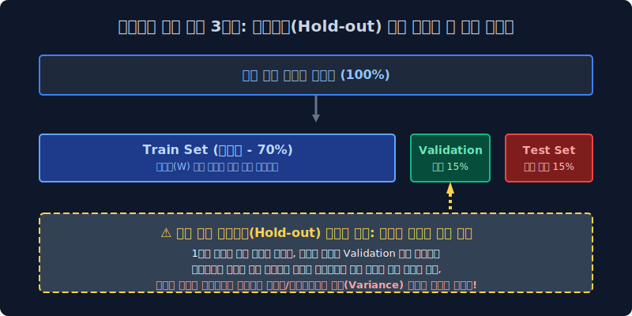
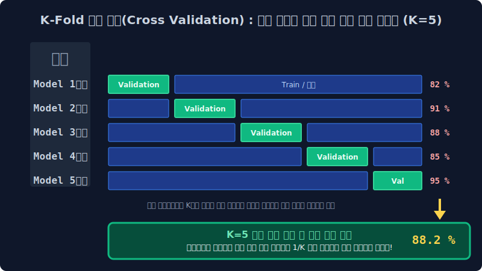

# 6.4 기계의 오만함과 로직 붕괴 판별: 데이터 분리 체계와 K-Fold 교차 검증

아무리 뛰어난 초평면 분할 공리식이나 다중 정규화 확률론 소프트맥스를 모델망에 설계 탑재했다고 하더라도, 모델이 내부 런타임에 자신이 과거에 암기했던 편향된 정답지 코퍼스(Train Data)로 똑같은 인퍼런스 실력 평가 역산 시험을 치르도록 파이프라인을 방어선 없이 방치하면, 모델은 평생 자신이 도메인의 모든 우주 규칙을 정복한 완벽한 명중률(100% Accuracy) 스코어 모자를 달성한 줄 아는 망상 편향 로직에 빠집니다. 머신러닝 인공지능의 절대적인 모델 무력화 타락 과정 방식인 과적합(Overfitting) 사태를 미연에 방지하고 포착해 내며, 이 수학 모듈이 가진 진정하고 강건한 일반화(Generalization) 성능을 합리적으로 분별 평가해 내는 고등 데이터 분포 분할(Data Splitting) 기술 기조와 엄격한 통계적 교차 검증 확률 교환 파이프라인(Cross Validation Topology)을 정립합니다.

---

## 6.4.1 모델 피팅 치명적 수학 역설: 과적합 (Overfitting) 파국의 방관

자연어 NLP 모델링 프로세스에서는 리서처가 초기 수집 단계에서 무려 100만 라인짜리 엄청난 텍스트 코퍼스 데이터셋 덤프를 파워풀하게 구축해 긁어모았다고 해서, 그 100만 개 원시 배열 풀 덩어리 전량을 모조리 한꺼번에 모델 학습 모터 엔진 입구에 들이붙여 무자비하게 피팅(Fitting) 암기시키도록 하는 것은 데이터 공학적 모델링 관점에서 완전한 자살 설계 행위입니다.

> **과적합(Overfitting) 논리 타락 붕괴 현상**: 기계 학습 아키텍처가 거대 코퍼스 환경에 깔려있는 인간의 언어 규칙과 근본적인 보편적 통계 시맨틱 문법 분포 패턴을 유연하고 견고하게 이해한 것이 아니라, 특정 훈련 데이터 소스 도메인 특유의 찌질하고 튀장스러운 마이너스 노이즈 오타 배열이나 대단히 편향성 높은 엑기스 토큰 지문 조합 배치 좌표 그 피처 배열 자체를 그냥 **벡터 인덱스 하나까지 통째 사진 찍듯이 '맹목적 암기 덤프(Memorization)로 뇌세포 $W$ 가중치 행렬에 강제 박아버려서'** 외부 변수에 전혀 노이즈 대응할 수 없는 헛똑똑이 유리몸 우상 괴물이 되어버리는 전형적인 머신러닝 논리 구조의 극한 붕괴 진단 및 사망 선고 스펙입니다.

우리가 인간 세계의 <수능 수학의 10년 치 정석 기출> 문제집 텍스트 1권 분량을 전부 알파벳 토시 하나 안 틀리고 매핑해서 뇌 스펙에 박아버려 달달 외웠다고 해서, 내일 실전으로 새롭게 생성 출제되는 진짜 낯선 분포 확률의 수능 시험장 구조에서도 그 수험생이 만점 역량 스탯 성적을 뽑아 보장할 수 있다고 어느 누구도 예단할 수는 없습니다. 기계 파라미터가 장착한 변수망의 이방인 처우 실력 타겟, 이른바 진정한 모델 예측 강건성 스탯(일반화, Generalization Threshold)을 엄정 검증 평가하려면 데이터 원시 파일럿 코퍼스 파이를 무조건 강압적으로 나뉘어 관리하는(Splitting Separation) 방화벽 훈련 스케줄 통제 룰을 무조건 1순위로 실행하여 모델 뇌세포 망을 감시해야 합니다.

---

## 6.4.2 가장 원론적인 기초 정적 훈련 검열 모델: 데이터 3분할 텐서 홀드아웃 (Hold-out) 격리 기법

이러한 지능 결함 붕괴 오류를 막기 위해 전통 머신러닝 시대부터 무조건 구축되어 채택되던 분할 룰은, 전체 수집된 텐서 트래픽 데이터 호수를 크게 세 단위 구역의 견고한 메모리 방어벽 블록으로 통제 타겟을 가둬 격리 차단해 버리는 정적 분할 홀드아웃(Hold-out Ratio Division) 기법이었습니다.

1.  **Train Data Set (학습 전용 코퍼스 파트 - 전체 파이의 보통 60~80% 분리 비중)**: 런타임 오직 시스템 모델 내부 엔진이 정보 매핑 지식을 스폰지처럼 미분 역전파 그루브로 빨아들이고, 내부 두뇌 신경계 활성 가중치 텐서($W$)를 오차 수정 목적으로 무한정 반복 업데이트 튜닝하는 데에만 수학적으로 갈아 혹사시킬 목적으로 내어주는 "보편적 일반화 정보 자습 반복 훈련망 교과서 벡터 칩".
2.  **Validation Data Set (검증 파라미터 최적화 파트 - 전체 파이의 보통 10~20% 할당 비중)**: 상기 Train 모델 교과서로 학습 훈련 모델 에폭(Epoch 루프)이 무수히 한 번씩 사이클이 도는 중간중간 인접 지점마다, 동결된 모델 모듈의 편향 실력을 단기적 타겟으로 체크해 보기 위해 외부에서 슬쩍 들이미는 "3월/6월 외부 평가원 텐서 모의고사 인퍼런스 종이". 이 스코어 지표 로그(Score Log) 성적표를 보고, 엔지니어(설계자 교사)는 메인 모델의 학습 활성화 구조 텐스 설정값이나 미적분 보폭 속도인 학습률(Learning Rate 파라미터 스탭 하이퍼값) 같은 상위 통제 외부 세팅 하이퍼파라미터 체계를 미세 조정(Tuning Control) 합니다.
3.  **Test Data Set (최종 판독 심판 시험 관문 파트 - 전체의 10~20% 절대 격리 분리 비중)**: 컴파일링 훈련과 검증 파라미터 조정 모델링이 이중으로 전부 완전히 완료되고 서버 아키텍처 배포 런칭을 찍기 직전 마지막 임계 순간에만, 최고 보안 텐서 금고 락스에서 단 한 번만 꺼내 인스턴스를 올려서 투과시켜, 해당 모델의 진짜 실전 필드 트래픽 타격 성능 명중률을 최종 인퍼런스 도출 평가하기 위해 철저하게 보안을 걸어 꼭꼭 숨겨두는 단 한 번의 전격 **"11월 찐 생초면 낯선 수능 오리지널 실전 텍스트 시험지" 구역**. (모델 모터에게 수십 시간 동안 훈련 도중에 이 Test 데이터 조각 배열을 우연히 단 1줄이라도 유출 노출시켜 미분 학습을 시키게 되는 치명적 데이터 리크(Deta Leak)가 터지는 순간, 그 머신러닝 평가지표 모듈 모델링 프로젝트는 데이터 오염망으로 완전히 파산 붕괴된 통계 망조입니다.)

---

## 6.4.3 정적 홀드아웃(Hold-out) 맵핑의 엄청난 불운 딜레마와 분산 폭탄 한계

위 SVG 아키텍처 다이어그램처럼 그냥 전체 모집단 배열 데이터 구조를 바보같이 3덩이 파이 무작위 정적 분할 비율 사이즈로 갈라 토막 잘라내서 검증 절차 파이프라인을 진행시키는 이 기초 방식은 극히 세팅이 고전적이고 구현 코딩도 단순하여 쉽지만, 통계학적으로 엄청난 추출 "우발적 재수 확률 변동/편향 운빨(High Variance Hazard)" 이 시스템 평가 점수에 절대적으로 따라줘야만 정상 점수 퀄이 도출된다는 치명적 평가 결함을 보유하고 있습니다.

> [!CAUTION]  
> **📖 구조 특성 해석망: 확률 분배의 딜레마, 불운의 3월 모의고사 (억까 지뢰 과소평가 오류)**  
> 
> 시스템 개발 모델러 엔지니어가 하필 Random Seed 추출 뽑기 배열 운이 수리적으로 파멸적으로 나빠서, 어쩌다 우연히 데이터 호수에서 시스템 가위로 뜯어낸 20% 분량의 모의고사용도 단일(Validation set) 종이 블록 텐서 구역에만, **현실에서 거의 나타나지도 않을 초극악 난이도 최고 킬러 레어 함정 희소 노이즈 변수 분포 문제들(특이한 외계어 은어 트래픽들, 극대 오타 편향 타겟 문장 집합들)이 우연의 분포 일치 오류로 모조리 쏠려서(Sampling Bias 편향) 격리 배정**되어 담겨 버렸다고 수학 구조를 가정해보자!  
> 
> 모델 엔진 레이어는 এই 왜곡된 미친 지뢰 모의고사를 돌려 테스트 볼 때마다, AI 모델의 점수 스코어가 훈련 모델은 훌륭함에도 계속 거짓된 환영인 30점 붕괴 수치 확률만 뜨면서 검증이 파탄 결렬 구조로 나락 붕괴해 버립니다. 모델은 나름 Train 훈련 교과서를 무진장 잘 파악하고 통계 일반화 구조를 수렴하며 안정 성장 중이었는데, 구경하고 모니터링하던 개발 운영자만 오직 저 왜곡된 점수에만 미쳐 속아 넘어가 그만 "아 내 컴파일 모델 파라미터가 지금 완전히 멍청한 바보 설정값 구조 상태구나!" 착각 판별해 버리고 미친 듯이 멀쩡한 신경망의 활성 레이어 장기 뇌세포를 도로 날카롭게 찢어 해부 강하하고, 모델 노드를 다시 엎어버리고 하이퍼 텐서를 기괴하게 꼬아 버리기를 무한 삽질 반복하다가 개발 프로젝트 스텝 스케줄만 말아먹고 최종 배포에서 완전히 성능이 파괴 폭망 망가지는 인지 오류 환상 지옥이 생겨납니다. (단일 분할이 유발하는 우연적 셋 분리 편향 분산 Variance 평가 오류 한계)

---

## 6.4.4 기적의 평가 확률 텐서 돌려막기 동적 로테이션 방어막: K-fold 교차 검증 (Cross Validation 파이프라인)

이런 불행한 운빨 스코어 데이터 게임 구조 환경(어쩌다 극단 수치 노이즈가 모여 갈라진 1회분 시험지 독립 구역 파편화 이슈) 평가 오류율을 근본 수식적으로 완벽히 폭파 소각 상쇄시키기 위해, 데이터 파이 훈련 블록 구역 차원을 그냥 통째로 여러 개 스텝으로 재활용 로테이션 배당해서 계속 모의고사 폴드 룰렛 타일을 다중 빙글빙글 위치 교대 돌려막기 연산하며 산술 평균 통합 편차를 잡아내는 최후의 통계 수학적 모델 과학 성능 검증 안전 맵핑 기법입니다.

**[K-Fold 5분할 교차 검증 시스템(K=5 Fold Cross Validation) 작동 메커니즘 구동 예시]**
1. 최초 시스템 10만 개의 데이터 모집단 코퍼스 전체 텐서 종이를 무작위로 사이즈 비율 볼륨에 맞게 시스템상에서 잘라 **정확히 똑같은 5조각 균등 파이 청크(Chunks)** 조각으로 확률 분포를 유지해 갈기갈기 찢은 뒤 봉투 독립 컨테이너 5개(K-Folds 배열망)에 넘버를 매겨 보관 넣습니다. 
2. **첫 라운드 연산 인스턴스 반복 (Iteration 1회 차)**: 1, 2, 3, 4번 넘버 봉투 블록만 모조리 책상 램에 쏟아서 학습망(Train) 교과서 파이프라인으로 죽어라 텐서를 관통시켜 미적분 공부 신경 파라미터를 역전파 세팅으로 시킵니다! 그리고 남겨둔 나머지 `마지막 5번 블록 패널 봉투` 파편 단 한 장짜리 블록 리스트를, 오직 오늘 밤 채점 평가망으로 던질(Validation 인퍼런스) 모의고사 타깃 시험지로만 강압 격리 지시를 내려 처리해 내어 1차 스코어 점수를 독단 도출해 냅니다 (예: 82점 스코어 산출).
3. **두 번째 파이프라인 폴드 재분류 라운드 (Iteration 2)**: 기계는 아까 방금 전 1라운드 모델 모의고사 시험지 대타로 소모 썼던 5번 종이 블록을 온전하게 회수해서 훈련 덤프로 돌려 이번엔 다시 공부 교과서(Train 메인 스트림) 거대 무리에 복구 편입시켜 줍니다! 그리고 반대로 사이클 규정에 따라 이번 라운드에선 임의로 `4번 넘버 봉투 블록` 구조를 거대 교과서 무리 텐서에서 슬쩍 빼서 완전히 격리, 그것만으로 이번 모의고사용 새로운 평가 포트 시험지(Validation) 타깃 대타를 세우고 모니터링 추론 인퍼런스를 거쳐 또 독립적 2차 스코어 점수 텐서를 냅니다 (예: 운이 좋아 점수가 확 뛰어 91점 기록 산출).
4. 이렇게 모의고사 타깃 시험지 역할을 배열망 블록 멤버 타일들이 $k=1$ ~ $n$ 루프를 따라 사이클 돌아가면서 **계속 1칸씩 회전초밥 그루브처럼 옆으로 교대 스왑 넘겨 평가망 검증 대타를 차례차례 치면서**, 모델은 데이터의 손실 없이 정확하게 코퍼스 전역 차원을 서로 완전히 다른 데이터 블록 파트로 오버랩 없이 5회의 독립된 검증 시험 수렴 절차를 모두 완주하며 루프를 치릅니다!
5. **편향 상쇄 최종 심판 평가 산출 계산**: 로지스틱을 통과한 독립 각 라운드 모의고사 스코어 런타임 결과 5개의 독립 퍼센트 수치 배열들(82%, 91%, 88%, 85%, 95%) 텐서를 거둬들여 전체 산술 분산 평균을 싹 내어 통계적 극한 오차를 부드럽게 무마해버리고 산정 조절한 **불변의 최종 통합 평균 Validation Mean Score(최종 통계 오차율 $88.2\%$ 유의성 지표)** 데이터 결과값 하나만을 견고하게 세상 모델 엔진 리포트에 공식 확정 도출로 제출합니다! 

어떤 특정 억까 파멸 지뢰 노이즈 데이터 집단이 한쪽 특정 Fold 블록 파이 껍데기에만 우연의 일치로 쏠려 몰려 맵핑 들어가서 1회 분할의 파탄이 있었다 한들, 1/K 회전 5번의 완벽한 순환 검증 타깃 로테이션 공평한 통합 산술 보간 통계 평균 내기 병렬 룰렛 시스템이 전체망에 융합 발동하면서 치명적 편향 모델 폭발 과소/과대 파라미터 계수 수치가 부드럽게 무한 분산되어 전부 상쇄 압수당하고 진정한 데이터 본연 코퍼스의 객관적인 평균 기초 체력 통계 역량 밸런스 평가표 척도만 가장 강건하게(Robustly) 남게 검증 정제됩니다. 

이러한 가장 살벌하고 공정하며 깐깐한 K-Fold 회전 파이프라인 방어막 테스트 루프 확률 공간 검열을 투과하여 통과한 머신러닝 AI 지표 객체에게는, 이제 기계의 찌질한 아차상 거짓말 정답 분류 파편 비율까지 전부 낱낱이 파헤쳐 사지를 까발리는 **'기만 확률의 사멸 심판장: 혼동 행렬의 진실 방 모듈 지표 맵핑'** 이라는 살벌한 모델 성능 메트릭 통계 사기 필터 체망 분기점만이 챕터 라스트 보스로 다음 구역에서 기다리고 있습니다. 자연어 검증의 확률 끝판왕 공간 다음 챕터 6.5 로 진격합니다.
