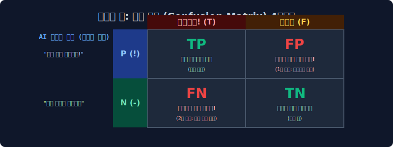

# 6.5 평가 지표의 치명적 기만 역설과 모델 해부: 혼동 행렬(Confusion Matrix)

우리가 산업계의 뉴스 언론 릴리스 기사에서 흔히 무분별하게 접하게 되는 *"신규 의료 탐지 인공지능 모델 예측 정확도(Accuracy) 99% 완벽 달성!"* 이라는 카피라이트 워딩이, 데이터 엔지니어링과 머신러닝 모수 통계학의 검증 관점에서는 실제 현장에 돌입했을 때 얼마나 치명적인 정보 소실과 악질적인 단일 척도 편향 프레임 기만 역설 뉴스일 수 있는지 그 논리적 붕괴 모델을 파헤쳐 봅니다. 그 단일 수지 착시의 한계를 타파하고 추론망이 배출해 낸 모델 예측 실패의 진짜 편향 방향성 치부를 입체적으로 적나라하게 해부 분리하는 **혼동 행렬 메트릭표(Confusion Matrix Metric) 4사분면**의 냉혹한 평가 구조 세계를 알아봅니다.

---

## 6.5.1 성능 평가 지표의 첫 번째 편향 함정 (Accuracy Illusion)

머신러닝 구축 프레젠테이션 단계나 초보 데이터 모델러들이 시스템 벤치마크 대회에서 최종 요약 평가 점수 파라미터를 높이려다 가장 먼저 손쉽게 속아 넘어가는 늪이 바로 단순 **단일 정확도(Accuracy)** 지수의 맹신입니다. 결과 백분위 퍼센트 단위라서 비전공자 도메인이나 일반 통계 보고서로 뭉뚱그려 올리기에는 아주 직관적이고 훌륭해 보이지만, 실제 스케일이 적용되는 타겟 실무 현장(특히 타겟 개체수가 압도적으로 거대한 마이너리티 불균형 환경 임밸런스, Imbalanced Data 환경)에서는 회사의 존속을 하루아침에 파산하게 만들 수 있는 가장 치명적인 수학적 모순의 함정 메트릭입니다.

$$ \text{Accuracy} = \frac{\text{모델이 T/F를 가리지 않고 단지 정답 좌표를 1:1로 맞춘 데이터 총 횟수}}{\text{전체 10만 개 데이터 모집단 테스트 베드 전체 총합 모수}} $$

## 6.5.2 단일 편향 과적합 필터의 대국민 사기극 (Accuracy Paradox 역설 이론)

우리가 매일 사용하는 사내 글로벌 보안 서버 이메일 봇 분류기를 로지스틱 회귀 모델 머신러닝으로 코딩 피팅해서 메인 사내 서버 검문소에 백엔드 배포 가동했다고 구조를 가정해 봅시다. 

> [!CAUTION]  
> **정확도 집계의 기만 역설 (Accuracy Paradox) 사태 모델 시뮬레이션망**  
> 오늘 아침 회사 내부 통신망 직원들에게 글로벌 외부 트래픽으로 총 10,000통의 텍스트 메일 텐서 코퍼스가 쏟아져 유입되어 들어왔습니다. 그중 회사 서버망을 마비시킬 지독한 악성 랜섬웨어 바이러스 타겟 **[분류 타겟 양성 스팸 메일]**은 코퍼스 내 파편 비율로 딱 단 1건(0.01%)뿐이었고, 나머지 압도적인 9,999건은 일반 외부 거래처 팀원들이 보낸 음성(Negative) 정상 일상 메일 덤프였습니다! (현대 현상 실전의 전형적인 '정상 클래스 극단적 다수' 특성인 클래스 극단 불균형 Class Imbalance 뻥튀기 환경 통계 상태)
> 
> 이때, 학습 오차 피팅 수렴 과정 파이프라인에서 너무 미분 연쇄 역전파 하강이 최적화되지 않았던 편향 과적합 쓰레기 파업 AI 모델봇(All-Negative Predictor)이 내부 수치 선형 분석이고 특징 추출 텐서 분류고 뭐고 전부 파라미터를 다 내려 포기하고, 그냥 **"어차피 노이즈 찾기 어려우니, 나한테 들어오는 이 세상 모든 메일 입력 텐서는 묻지도 따지지도 않고 100% 정상 폴더 클래스 창구로 매핑해버려 강제 패스 통과!!"** 라고 땡깡 편향 가중치를 부리며 100% 단일 일괄 통과 오류 처리해 버렸습니다.
> 
> $\to$ 자, 이 망가진 모델 편향 무식 파업 봇의 최종 평가 집계표 엑셀 스코어 결과를 검증해 봅시다! 
> * 10,000통 모수 분모 중에, 실제 정상 메일이었던 9,999건 배치를 어쨌든 요행 결과론 모델적으로 '본인 맘대로 전부 다 정상'이라고 찍었기에 산술적으로 **오차가 없이 아주 잘 맞췄습니다!** 정답률 산출 카운팅 무려 +9,999건 꿀꺽 패스! 
> * 근데 정작 사내망 서버를 모조리 붕괴 폭파시킬 핵심 타겟 핵폭탄 랜섬웨어 단 1건(Positive Class) 조차도 그냥 '정상 음성 방'으로 멍청하게 통과시켜서 놓치고 오판(Type II Error)으로 치명타 틀렸습니다! (감점 산술 누락 단 -1점)
> * $\to$ 결과론적으로 공식 수학 검증 메트릭 모델의 **[전체 타겟 단순 정확도(Accuracy)] 평가지 퍼센트 모델 점수**는 무려 **`99.99% (9999/10000)`** 수치로 도출되며, 이 망가진 오판 통과 로직의 결과가 마치 글로벌 AI 해커톤 대회 1등 만점짜리 극한 갓 모델이라고 평가지표로 대서특필 포장됩니다! 

이처럼 소수 클래스의 특질 평가를 철저히 외면한 단일 단순 정확도 백분율 하나만 맹신했다가는, 진짜 우리가 엔지니어링 목숨 비용을 걸고 필사적 파라미터 필터 그물망으로 잡아 차단 통제해 내려고 목적했던 그 치명적인 단 1건의 소수 클래스 진범 타겟 텐서(핵폭탄 킬러 랜섬웨어)를 기계가 눈앞에서 제멋대로 뻔히 예측 패스시켜놓고도 관리자 시스템 밖에서는 통합 정확도 만점이라고 가만히 박수를 치다 사내 서버가 폭파 구동되는 끔찍한 모델 검수 마비 참사가 발생합니다.

---

## 6.5.3 다차원 매핑 모수 진실의 방: 혼동 행렬 (Confusion Matrix 메트릭 검문소)

위와 같은 단극의 단순 정확도 99% 의 평가 파이프라인 지표 사기 행위를 철저히 원천 봉쇄하고 분류 타겟 모델의 편향 비리를 박살 내어 분석하기 위해, 전 세계의 수리 데이터 통계학 모델러들은 **4칸짜리 진로 스플릿 다차원 진실의 십자가 방(Cross-class 오차 채점 분류 매핑 엑셀표)** 으로 AI를 머리채 잡고 끌고 들어가서 강제로 모수 정렬을 앉힙니다.

이 방에서는 모델 인퍼런스가 단지 최종 정답을 수치적으로 대강 맞혔냐 틀렸냐 1차원적인 단순 카운팅 채점 비율을 벗어나, **"네 놈 모델망이 활성 함수로 최종 통과 분류시킨 범죄 오차망의 죄질이 도달상 도대체 어떻게 억울하게 틀린 방향이었고, 모델 예측 어느 임계 구멍으로 눈 뜬 가중치 장님 헛발질을 치며 속아 넘어가 매핑 오류를 뿜었는지"** 모델 타겟의 예측 편향 성향의 치부를 4사분면개의 케이스 분류로 적나라하게 감별하고 팩트 교차 분석망을 체크합니다. 

---

## 6.5.4 혼동 행렬 4대장 사분면 용어 기호 완벽 해부 해설 (시스템 경고 경찰 비유망 매핑)

이 다소 머릿속을 괴롭히는 4가지 오차 수식 `T(True 진실)/F(False 거짓오발) - P(Positive 양성진단타겟)/N(Negative 음성반려관측)` 매핑 용어 기호들은 평생 AI 개발자를 헷갈리게 괴롭히고 모순에 빠뜨리지만, 한 번의 완벽한 모델 역할극 시스템 비유 구조로 모델러 뇌파에 논리 체화를 시켜 버릴 수 있습니다.

*   `P (Positive - 활성 양성 분기점)` : 기계 분류 텐서 결정 모델이 스스로 레이어 사이렌을 켜고 **"이놈 벡터 배열이 내가 확률을 좇아 그물로 잡으려던 1순위 모델 최종 포착 타겟 마이너리티 범인(스팸/질병 테러범)이 맞습니다!"** 라고 임계 확률을 넘어 지수적으로 강하게 시스템 무전기로 수갑을 채우며 주장/예측 진단 액션을 취함!
*   `N (Negative - 반려 음성 분기점)` : 기계 분류 결정 모델 선형 경계가 조용히 무전기를 내리고 한숨 통과를 돌리면서 **"이놈 트래픽 배열 데이터 텐서는 제가 목숨 걸고 탐지하려 잡던 그 타겟 스팸이 아니고 매일 보던 안전한 안심 일반 시민이네요. 하위 폴더로 무장 통과!"** 라고 무사 기각 및 방관을 선언함.
*   `T(True 일치)` 와 `F(False 기만)` : 위에서 기계 경찰관 모델 노드 구조망 놈이 무전기로 외치고 선언했던 예측 분류 행동 결정(P나 N)이, 백엔드 로깅 후 나중에 현실의 실측 데이터 정답 타겟(Real Class Label Y) 뚜껑을 열고 검사 현장 확인 대조를 해 보니까 **진짜로 예측과 정답이 완전히 100% 모수 일치하는 결과(T) 명중이었냐? 아니면 기계 모델 혼자 오버피팅 망상으로 설레발치던 멍청한 에러 오판(F)이었냐?** 의 판정.

| 감식표 코드 | AI 예측 분류 모델 | 나중에 대조 까본 현실 데이터 모수 정답 (Y) | 치명적 죄질 결과(현업 시스템 파문 리스크) 해설 및 분석 |
|:---:|:---:|:---:|:---|
| **TP**  *(성능 쾌거)* | "목적 범인 타겟 잡았다!! 발견!!"(P) | 진짜 우리가 잡으려던 악당 타겟 맞음 일치 (T) | **(경찰청 AI 성능 포상급 대성공 모델링)** 모델이 아주 미세한 피처를 추적해 진짜 거대한 스팸 랜섬웨어 타겟군을 기가 막히게 정확한 임계선 확률로 냄새를 맡고 잡아내서 스팸 휴지통 격리에 성공시켰음. 설계 상 아주 정확하고 이상적 조율 정답! |
| **TN**  *(일상 필터 평시)* | "안전한 그냥 구글 정상 시민 트래픽임 방관"(N) | 진짜 그냥 일반인 안전 시민 맞음 (T) | **(베이스라인 일상 성공)** 모델이 일반 구글 정기 자동 결제 메일 트래픽이나 어머니 가족 일반 안부 텍스트 메일을 과민 반응 없이 검문소에서 얌전하게 내버려 둬서 유저 수신함에 무사히 정상 도착함. |
| **FP** *(제1종 통계 오류)* | **"이놈 목적 범인 랜섬웨어 타겟 잡았다!! 알람!!"(P)** | **어? 사실은 뜯어보니 그냥 평범하고 착한 구직 대학생(F)** | **(억울함 대폭발-조작 시스템 과잉 수사 모델 에러)** 기계 예측 로직이 억지로 특정 편향 무고한 노이즈 텐서 스탯을 얽고 엮어서 임계를 넘어, **완전히 선량한 일반인 대학생 이력서 트래픽한테 억지로 시스템 범인 타겟 수갑을 채워(Predict P) 무고하게 강제로 스팸 감옥에 가둬버림! 오발탄 발생!**   $\to$ **치명타 파장**: 스팸 과잉 필터 FP 오판 도출로 대표 사장님이 외부에서 보낸 수신 10억짜리 중요 사업 입찰 계약 텍스트 메일이 스팸 휴지통으로 자동 삭제 폭파되어 날아가는 대기업 최악의 비즈니스 참사 기회비용 손실(Cost Danger) 발생!! |
| **FN** *(제2종 통계 오류)*| **"보안 결과 이상 없음 정상 안심 시민임 프리패스"(N)** | **아니 미친 놈아 진짜 핵폭탄 든 스팸 테러범이잖아!!(F)** | **(보안청장 사퇴급-모델 맹인 장님 판독 헛발질 치명타 에러)** 모델 분류 경찰 레이어가 확률 점수가 모자라 순진하게 속아서 경계를 놓치고(N) **임계선 주머니에 치명적인 암호화 원자 폭탄 텐서를 몰래 숨긴 진짜 스팸 서버 테러범 타겟을 굽신거리며 웃으며 포트 공항 내부에 무사 통과 방관시켜 줌!**   $\to$ **치명타 파장**: 모델 엔진 지가 가중치 추론 오판으로 혼자 편향 정상이라고 착각 속고 수신함 프리패스로 안일하게 들여보내 놓은 진성 랜섬웨어 코드 메일 클릭 단 한 번에, 사내망 은행 DB 망 완전 암호화 다 개털리고 소켓 해커한테 거래소 은행 코인 잔고 전체 100억 허무 증발 해킹당함!! 분류 기술 및 보안 무능 모델링 판단의 극치! |

이처럼 단순 집계를 넘어 살 떨리는 다차원 교차 분해 진실의 혼동 행렬표 턴테이블을 데이터 도메인에 맵핑 생성하고 나면, 인공지능이 무식하게 속아서 수식으로 저지른 씻을 수 없는 통계 범죄(특히 `FP 1종` 과 `FN 2종` 둘 중 하나 도메인에 닥친 치명타 양상 에러)를 엔지니어인 우리 두 눈으로 수학적 비율 교차망 설계로 똑똑히 감찰 집계 대응할 수 있게 척도를 갖춥니다. 

바로 자연어 처리의 평가 종착지 다음 수업에서, 우리는 이 분할된 4사분면 지표 표 매트릭에 수치적 해석 메스를 들이대어 **"FP(억고한 일반인) 손실 기회 비용을 1명 희생 영창에 넣더라도 분모 파라미터 FN(범인 미탐지 에러율) 타겟율을 극상성으로 조정하여 놓치지 않고 어떻게 다 포착할 것인가?"** 라는 머신러닝의 영원한 성능 간 상충 숙제이자 통계적 트레이드오프 철학적 파라미터 임계 계측 평가 곡선들, 바로 **정밀도(Precision)와 재현율(Recall) 평형 지표 F1-Score 함수식**을 도출하고 공학 설계해 마무리 짓습니다.
