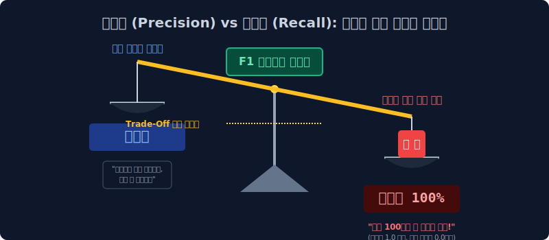

# 6.6 진실을 꿰뚫는 지표의 파괴력: 정밀도, 재현율, F1, ROC/AUC

이전 챕터인 진실의 혼동 행렬 십자가 표(Confusion Matrix)를 들여다보면, AI 기계가 무식하게 저지른 '1종 억울한 누명 씌우기 범죄(FP)'와 '2종 눈 뜬 장님 테러 방관 범죄(FN)' 데이터를 정확하게 계측해서 적발해 냈습니다. 

이제 이 두 종류의 끔찍한 에러 수치들을 분모 분자 나눗셈으로 결합하여, 최고 경영진이 머신러닝의 '수사 성향 스탯'을 자신의 서비스 목적에 맞게 완전히 조율 설계할 수 있도록 해주는 **궁극의 통계 평가 메트릭스(정밀도, 재현율, F1 조합 곡선)** 들을 배웁니다.

---

## 6.6.1 예민함의 스탯: 정밀도 (Precision)

오로지 **"경찰청 AI 모델이 사냥을 해서 감옥에 데리고 온 범인들의 순도 엑기스"** 에만 집착하는 수학적 깐깐한 비율 지표입니다.

$$ \text{Precision} = \frac{TP}{TP + FP} $$

*   **방정식 시뮬레이션 해석**: 분모($TP + FP$)는 경찰 AI 모델이 검문소를 치고 "야 내가 잡은 수갑 채운 놈들 다 구치소로 와봐!" 라고 불러들인 숫자입니다. 즉, AI 본인 스스로가 자신만만하게 '이건 스팸이다(양성 Positive)' 라고 강력하게 찍어서 **감옥에 쳐넣은 무리들의 총 분량**입니다. 
*   **지표 폭락의 순간**: 만약 경찰 AI가 건수 실적이 너무 궁해서, 아무런 증거도 없이 그냥 지나가는 대학생이나 회사원까지 마친 놈처럼 줄줄이 모조리 스팸이라고 무전망 예측(FP)을 때리며 남발해서 일단 구치소에 불임차게 가뒀다고 치자!
*   $\to$ 구치소는 무고한 시민($FP$)들 원성으로 가득 차버리고, 진짜 진또배기 범인($TP$)이 차지하는 찔끔한 순도 결과값은 바닥으로 폭락하면서 이 수사 무리수의 **'Precision(정밀 타격률)'** 은 쓰레기가 됩니다.
*   **활용처**: 스팸 분류기에서 정상적인 사장님 중요 송금 메일(FP)이 쓰레기통으로 가는 최악의 오판 폭파 참사를 막기 위해, 기계 모델에게 **가장 빡빡하게 목숨 걸고 지키라고 세팅해야 하는 방패 파라미터**입니다.

---

## 6.6.2 투망 사냥의 스탯: 재현율 (Recall = Sensitivity)

이번에는 정밀도와 반대로 오로지 **"어차피 일어날 우주 전체의 실제 사건들 중, 내 AI 그물망 레이더에 몇 명이나 레이더에 걸려들었냐?"** 생포량 엑셀에만 미친 듯이 집착하는 스탯 지표입니다.

$$ \text{Recall} = \frac{TP}{TP + FN} $$

*   **방정식 시뮬레이션 해석**: 이번엔 분모가 아까와 다릅니다. 분모($TP + FN$)는 내 인공지능이 잡았냐 못 잡았냐 핑계 따위는 관심 없고, 어쨌든 지금 이 지구상 현실 우주에 엄연히 실재하는 **진짜 오리지널 악당 찐 테러범들의 총집합 숫자**입니다. (내 AI가 똑똑하게 잡은 놈 10명 + 내 멍청한 AI의 눈을 속이고 공항을 유유히 통과해 나간 눈 뜬 장님 테러범 90명 = 총 100명 분모)
*   **지표 폭락의 순간**: 인공지능이 자기는 절대 오판을 하기 싫다며(FP 혐오), 수갑 채우기 조건 세팅을 너무 빡빡한 기준으로 올리는 바람에 그물망이 듬성듬성 구멍이 나버렸습니다. 그 틈을 타 폭발물을 든 찐 범인 놈($FN$)들이 검색대 사이의 허술한 구멍을 모조리 다 뚫고 비행기를 타고 도망가 버리면? 
*   $\to$ 암세포를 눈앞에서 놓쳐버리는 이 돌팔이 기계의 **Recall(재현율 방역망 스탯)** 은 바닥으로 부서집니다.
*   **활용처**: 병원 폐암 X-ray 판정기 시스템 시스템이나, 공항 무기 테러범 감식기에서는 멀쩡한 사람의 간을 찢어서 오진 수술(FP 발생)을 하는 한이 있더라도 일단 아주 미세한 테러 암세포 점 하나라도 무조건 때려잡고 살려봐야 하므로, 죽을 각오를 하고 1.0(100%)을 찍어야 하는 공격형 레이더 가중치입니다.

---

## 6.6.3 트레이드 오프 (Trade-off) 잔혹한 시소 게임

정밀도와 재현율은 잔인한 수학적 딜레마로 엮여 있어서, 절대 둘 다 만점 100점을 받을 수 없으며 완벽하게 거꾸로 타는 피의 시소판 위에 올려져 있습니다.

1.  **"단 1명의 억울하고 무고한 일반인이 스팸 처리 에러를 겪어 회사 프로젝트가 파괴되는 걸 막겠다!! (정밀도 Precision 100% 극투자 고정)"** 
    $\to$ 이렇게 세팅 기준을 올리면, 의심이 아주 눈곱만큼이라도 가는 진짜 애매한 암살범 바이러스들도 "아.. 증거 불충분으로 혹시 무고한 인간일지도 몰라 ㅠ" 라며 경찰 AI가 바들바들 쫄아서 그냥 패스(FN) 시키며 길거리로 다 풀려나가 나라가 멸망합니다 (Recall 재현율 바닥 파괴).
2.  **"테러범이 내 앞을 1마리라도 지나다니는 꼴을 난 도저히 볼 수 없다!! 지나가는 가방 멘 놈들 쌍그리 다 잡아들여!! (방역 재현율 Recall 100% 만땅 극투자)"** 
    $\to$ 테러범의 씨를 말리고 몽땅 잡긴 잡았습니다. 근데 지나가던 백팩 맨 초등학생이나 낚싯대 들고 가던 100만 명 선량한 시민까지, 범죄자 실루엣만 겹친다고 다 피눈물 흘리며 투망 그물에 낚여 감옥에 무고하게 수감되어 에러 민원 폭주로 사내 국가가 멸망합니다 (Precision 정밀도 바닥 파탄).

---

## 6.6.4 통합 조화평균의 산물: F1-Score 지표 (심판관)

결국 AI는 재현율과 정밀도 시소, 어느 한쪽으로 극단적으로 꼼수를 부리거나 스탯을 쏠리게 찍어 대중을 기만할 수 있습니다. 이를 막기 위해 두 지표의 멱살을 잡고 기괴하게 결합시켜 버린 **가장 엄격한 분류 시험 종합 점수판 수식**이 등판합니다. 바로 `F1-Score` 입니다.

$$ F_1 = 2 \times \frac{\text{Precision} \times \text{Recall}}{\text{Precision} + \text{Recall}} $$

이 공식은 단순하게 $(X+Y)/2$ 처리하는 초등학생 산술평균이 아닙니다. **조화평균(Harmonic Mean)** 이라는 무자비한 분수 역수 곱셈 기법을 씁니다. 

기계 코더가 꼼수를 부려서 정밀도 스탯방어만 1.0 (100%) 으로 사기 쳐 올려놓고 재현율은 0.0 으로 바닥을 기고 있을 경우, 이 조화평균은 자비 없이 `0.0` 값을 한 번 곱해버린 뒤 역수로 엮어버려 최종 모델 성적을 **가차 없이 0점으로 락인(Lock-in)** 시키는 가혹한 수학적 방어막을 칩니다. 이 F1 점수가 0.9 이상이면 진짜 대단한 무결점 밸런스 갓 모델입니다.

---

## 6.6.5 권위의 정점과 면적 페인트 붓: ROC 곡선과 AUC

마지막 평가지의 화룡점정을 찍습니다. 위의 모든 확률과 꼼수조차 의미가 없게, 특정 인간 개발자의 세팅 환경조차 아예 배제시키고 **저 딥러닝 뇌세포 모델 자체가 태어날 때부터 얼마나 피지컬과 기초 체력이 근본적으로 단단한가?** 를 알몸으로 까놓고 도표 도화지 위에 그리는 위대한 측량 예술입니다.

1.  **임계값(Threshold) 롤링 꼼수의 무력화**: 스팸일 확률이 `0.5`만 넘으면 모델 보고 "스팸!" 이라고 결정을 내리게 할 수도 있고, 임계값 세팅을 보수적으로 빡빡하게 올려서 확률이 `0.85%` 이상은 나와야 간신히 스팸 팻말을 들도록 인간 디렉터가 문턱을 조작할 수 있습니다. 
2.  **무한대 시뮬레이션 곡선 (ROC)**: 평가 시스템은 인간의 조작을 비웃기라도 하듯, 아예 모델의 이 임계값(Threshold) 선 기준을 **[0.0부터 1.0 끝까지] 아날로그 볼륨 다이얼 돌리듯 미친 듯이 돌려 가면서**, 그 수천 번 조건이 바뀔 때마다 그때그때 미세하게 출렁거리면서 요동치는 기계의 정규 확률 곡선 좌표(FPR vs TPR 스탯 변동 궤적 X, Y점)들을 도화지 허공에 모조리 다 수만 개의 점으로 이어 그려버립니다!! 이게 전설의 ROC 곡선(Receiver Operating Characteristic Curve) 테두리 선입니다.
3.  **최종 면적 체중계 달기 (AUC, Area Under Curve)**: 아예 도화지에 그려진 그 ROC 하늘 곡선 궤적 밑으로 깔려있는 아래 바닥 전체 넓이! 파란색 페인트로 칠한 그 **전체 바닥 '면적 퍼센티지(Area)'** 덩치를 정적분 값 1.0 비율로 분해해 구합니다. 

결국 인간 디렉터가 가해오는 세팅 입김과 임곗값 훼방 롤링에도 미동도 하지 않고, 이 딥러닝 망 자체가 가지고 태어난 본연의 직관 확률 분별력 퀄리티가 넓은 면적 스펙(1에 가까워지는 상단 두께)으로 단단하게 증명됩니다. 현존하는 세상 모든 최고 권위의 딥러닝 AI 논문들은 분류 결과 자랑을 오로지 이 **AUC 수치 (예: AUC=0.96 달성)** 스탯 박기로 끝을 냅니다.

> 바로 이것이 수만 권의 뉴스 쓰레기를 구글 인공지능이 1초 만에 깔끔한 IT/경제함으로 때려 박을 수 있는 기계학습 수학 분류 판단식 파이프라인의 종착역입니다. 수고하셨습니다.
