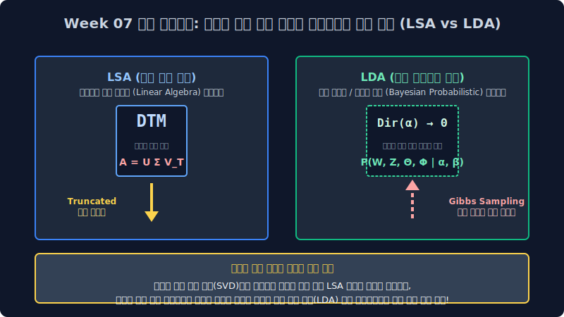

# 07. 비지도 학습 기반 텍스트 주제 모델링과 차원 축소 텐서 확률망 아키텍처 (LSA / LDA)

사전 정의된 정답 꼬리표(Y Label) 레이블 환경에 전적으로 기댈 수밖에 없던 온실 속의 기존 지도 학습(Supervised Learning) 텍스트 분류 세계망을 완전히 벗어나, 인간의 정답지 코딩 개입 도움 없이 딥러닝 기계 개척자 시스템 컴파일러가 홀로 세상의 수십만 장 야생 관측 가능 뉴스 코퍼스 덩어리들이 어떤 시맨틱 공통점 군집 카테고리를 통계적으로 파벌로 이루며 내부에 잠재 은닉되어 분포하고 있는지 파라미터로 눈치채게 강제 도출 예측시키는 **"딥마이닝 비지도 학습(Unsupervised Clustering Model)"** 의 황무지 대수학 정수를 본격 심층 들이마십니다.

초거대 스케일의 DTM 희소 분할 행렬을 선형 수학의 타격 프레스로 박살 절단 내어 텍스트 차원의 저주 오차 분산을 기하학적으로 증발시키는 차원 축소 압축망 잠재의미분석(LSA 모형)의 거친 수학 대수학 패러다임부터 도출합니다. 그런 뒤 애초에 문서의 본질 팩트를 기계 조물주가 뱉어내는 룰렛 무작위 확률의 유연한 복합 피조물 결과로 취급 가정하고, 옵저버 관측 노이즈들을 통과하여 MCMC 연속 깁스 샘플링(Gibbs Sampling) 통렬한 파괴 역연산을 통해 은닉된 확률의 기저 비율표 파라미터를 소수점까지 역측산해 훔쳐보는 당대 최강의 텍스트 파라미터 확률론 베이즈 통계학 전개 모델, **잠재 디리클레 할당(LDA 모형)** 의 확률 분포 역추론 모듈을 마스터합니다.

* 7.1 [비지도 학습 체제 전환: 자율 탐색 텍스트 주제 분석과 K-Means 한계 철학](/basic/07/sec01/)
  * 7.1.1 레이블 없는 다차원 야생 텍스트 방생 묶음과 클래스 분류 매핑 모형 세계관의 정면 충돌
  * 7.1.2 다중 오버랩 융합 비율을 허용하지 않는 경직된 강제 군집화 K-means 확률망의 물리적 맹점 파괴

* 7.2 [잠재 의미 축의 기하학적 차원 압축 해체망: 특이값 매핑 잠재의미분석 (LSA 모듈)](/basic/07/sec02/)
  * 7.2.1 초거대 OOM DTM 매트릭스 1,000만 배열을 절단 최적화 단 3차원 코어로 썰어내는 행렬 분해(Truncated SVD)
  * 7.2.2 동적 온라인 문서 추가 트래픽 +1건 유입에 행렬 전면 재부팅 연쇄 파단 계산이 모조리 폭발하는 O(N^3) LSA 재부팅 저주 모델 폭파 한계망

* 7.3 [베이즈 생성 패러다임의 위대한 역전 회귀 타임머신 모델: 통제 모수 기계 조물주의 확률적 생성 유니버스 과정](/basic/07/sec03/)
  * 7.3.1 무작위 주사위 조합 밀도 통제 파라미터로 문서 타일 배열을 짜깁기 배열해내는 확률 공장 확률 룰렛 시뮬레이션망 (Generative Story)
  * 7.3.2 최종 방출된 표면 관측 단어 결과물을 외부 증거로 손에 쥐고 그 이면의 시간 은닉 파라미터를 배후 역연산으로 거슬러 미분 도출 올라가는 엔지니어링 임무 (Reverse Bayesian Inference Engineering)

* 7.4 [확률 역추적 톱니바퀴 엔진 아키텍처망의 성배: 잠재 디리클레 할당 (LDA 베이즈 확률망) 아키텍처 도입부](/basic/07/sec04/)
  * 7.4.1 반반 치킨 오버레이 토픽 다중 복합 결합 확률망을 유연하게 허락 인정하는 소프트 어사인 기적의 모델 문서 룰렛 지분표 모형 파라미터 ($\theta$ 분배율 세타)
  * 7.4.2 오직 특정 타겟 토픽 레이블의 지독하고 극단 편향적인 벡터 텍스트 스펠링 배타적 편식을 관장 지배 독립 통제하는 고유 할당 단어 스위치 발생 주머니망 ($\phi$ 빈도 파이)

* 7.5 [다변수 다항 확률 디리클레 차원 자판기와 생성 건축 조건부 플레이트 표기법망 시각화 (Plate Notation Architecture)](/basic/07/sec05/)
  * 7.5.1 심플렉스 극한 공간의 3차원 삼각뿔 극단적 단일 희소 몰빵 코너 구조 분포와 박애주의 다중 섞어 혼합 융합을 마음대로 모델 매핑 조율 제어하는 하이퍼 파라미터 알파($\alpha$) 초깃값 세팅 통제 마법
  * 7.5.2 다변수 확률계 루핑 스캐닝 무결 상태 상상 도면망 벡터 계층의 단절 독립 노드 인과성을 구조 텐서로 추상화한 베이즈 통계 건축 아키텍처 노테이션 도면망 플레이트 매핑 구조식 연산식 치환 해석

* 7.6 [최우도 추론 통계 해킹 페이퍼의 미학 극치 미분: 무결한 답을 도출하는 깁스 샘플링(Gibbs Sampling) MCMC 체인 역산 추론망의 세계](/basic/07/sec06/)
  * 7.6.1 완전 망각 상태에서 목적 함수 분석 의지 없이 초기에 아무 인덱스에나 방사 확률 단정을 질러버리는 초기 극한 혼돈 난장판 무작위 할당 난수 세팅(Random Initialize Status) 변수 스태킹
  * 7.6.2 오직 내 문서 단어 방안의 다른 룸메이트 동거 단어들 눈치 비율 보기와 바깥 우주 거대 동일 스펠링 쌍둥이 토픽의 도플갱어 빈도 눈치만을 다이내믹 곱으로 쓱 살피어 갱신 치환하는 마르코프 절대 모수 최우도 커닝 조건부 갱신 확률 최적화 수렴 하강 잣대 원리 메커니즘
