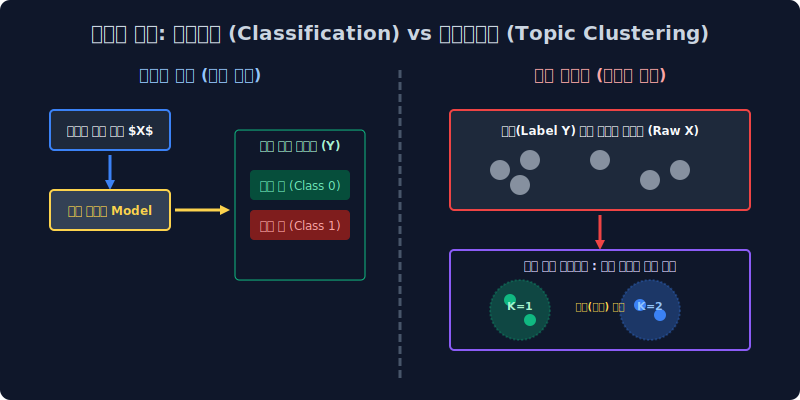

# 7.1 비지도 학습: 토픽 추론 모델링 메커니즘과 군집 차원 축소의 철학

누군가 상위 레이어에서 감독관처럼 입력 데이터에 대한 타겟 방향성(Target Label) 정답을 일일이 매뉴얼 매핑으로 부여해 주지 않아도, 수십만 장의 무정형 원시 텍스트가 묻혀있는 빅데이터 코퍼스 시스템 속에서 기계 모델이 스스로 "어라? 이쪽 좌표 공간에 몰려 맵핑된 문서들은 상호 간에 은밀하게 어떤 공통된 잠재 빈도 지표(Topic) 파라미터 파벌을 구조적으로 공유하고 있네?" 라며 보이지 않는 추상적인 군집을 유추해 내고 확률 차원 컴포넌트로 엮어내는 **비지도 학습(Unsupervised Learning)** 기반 토픽 모델링의 기본 정립 메커니즘을 배웁니다.

---

## 7.1.1 텍스트 주제 분석 (Topic Modeling / Clustering) 모델이란 무엇인가?

**"지금 시스템 DB 스토리지에 유입된 야생 네이버 뉴스 기사 100만 건, 굳이 휴먼 레이블러가 개입하여 읽어 분류 처리를 치르지 않아도, 내부 패턴 단어들의 공기(Co-occurrence) 빈도를 따라가면 스스로 5개의 메인 방(Topic Latent Clusters)의 최저 오차 코어 스펙 분포로 추론 매핑 정렬 찢어지겠군!"**

지난주의 6주 차 커리큘럼 구역까지 우리가 피 터지는 목적 함수 미분으로 최적화하며 배웠던 자연어 패러다임은 철저한 **결정론적 분류 모형(지도 학습 분류기, Supervised Classifier)** 체계였습니다. 이는 인간 알바생 수천 명이 도메인에 달라붙어서 *"이 메일 객체 텐서는 스팸 폴더 차원 귀속, 저건 정치 타겟 귀속!"* 이라고 정해진 타겟 지도 데이터 정답지 종착점 꼬리표(Y Label) 매핑 지시를 사전에 거대하게 달아주며 족집게처럼 목적 좌표를 하드코딩해서 학습 튜닝 과외를 시켜야만 연산 오차 역전파 파이프라인이 돌아가는 의존형 수동 시스템이었습니다.

하지만 현실의 데이터 엔지니어링 실무에 널려 있는 웹 크롤링 소스 포털 댓글이나 무수한 브런치 블로그 원문 덩어리 글들은, 사전에 아무런 Y 꼬리표 좌표 없이 그냥 무정형 벡터 날것 상태로 서버 스토리지 우주 허공에 굴러다닙니다. 이 거친 불균형 쓰레기 노이즈 배열 더미들에 알고리즘 모터를 작동시켜, **"이 레이블 없는 문서의 점 덩어리 배열들은 대체 내부 텍스트망 기저에서 무슨 공통된 확률론적 잠재 화제(Latent Semantic) 패턴 분포를 엮어 떠들고 있는 거지?"** 라며 기계 스스로 그 내재된 지배 방정식 패턴의 특징량 컴포넌트를 분리해 눈치채게 구축해 만드는 것이 정보 검색 및 군집 분석(Topic Analysis) 시스템 모듈의 주된 설계 목적입니다.

---

## 7.1.2 "사전 정의 라벨이 부여된 일반 타겟 지시 분류망"과의 세계관 충돌 아키텍처

인공지능 모델 텐서링 시스템이 세계의 입력값을 인식하고 맵핑하는 두 가지 상반된 머신러닝 패러다임 아키텍처망을 직관 모델로 기하하적 대조 비교해 구축 살펴봅시다.

| 알고리즘 패러다임 계열 방식 | 모델 엔진에게 주어진 가혹한 파편 미션 모델링 임무 | 직관적 시스템 구동 롤플레잉 구조 모델링 비유 |
|:---:|:---|:---|
| **텍스트 결정 분류기 (Classification)**   *(지도 학습 구조망 Supervised)* | 개발자 감독자 층이 이미 절대 공리로 만들어 둔 기저 카테고리(타겟 정답 스코어 방) 박스 제약 구조가 사전에 주어져 있고, 신규 입력 문서를 그중 최적 스루풋 합산이 나오는 한 유력 박스 인덱스에 강제로 맵핑 책임 귀속시켜 판별 슛 집어넣어 모델을 구여 구속 시켜야 함. | **(사이드 매핑 객관식 강제 사지선다형 시험 룰)** "이 배열 메일 덤프가 방금 시스템 큐에 유입 들어왔는데, A(스팸군) 박스 계층에 쳐넣을지 B(일반 양성) 박스 귀속 모수층에 확정 쳐넣을지 확률을 유도해 빨리 골라맞혀 슛을 쏴!" |
| **토픽 자율 군집 분석 (Clustering)**   *(비지도 확률 탐지 Unsupervised)* | 정답 목적 함수 박스 같은 한계 스루풋 캡핑 뷰는 애초에 세상에 주어지지 않음. AI 모델이 완전 자율 비지도 방식으로 텍스트들의 단어 발생 빈도 행렬 패턴 확률적 눈치를 레이턴시 살피고 지들끼리 텐서 밀도가 높은 컴포넌트 데이터 친목질 덩어리 군집 모수를 스캔해 자율적으로 스케일 압축 묶어내 구별해 차별화 분리 매핑해야 함. | **(MT 군집화 유사도 조별 과제 강제 재단 분리망)** "여기 초기 입력 레이블 신입생 1만 명 트래픽 강당에 그대로 다 널브러져 모아둘 테니까 친밀도 연관 지표 높은 가까운 텐서 애들끼리 알아서 거리 계산 공식 눈치껏 컴포넌트 5개 묶음 덩어리 조 짜봐 찢어!" |

---

## 7.1.3 비지도 좌표계 다차원 무작정 물리적 스케일 조 짜기 거점 구동: K-means 알고리즘 (유클리드 K-평균 군집화)

기계 시스템이 레이블 같은 사전 정보 단서의 도움 지시선 입력망이 아예 0인 베이스 상태에서, 거대 데이터 덤프 다차원 벡터 배열 평면 처음부터 어떻게든 K조각으로 쪼개 자의적으로 군집 분기 분할 모임 덩어리를 억지로 강제 배정 짜려고 목적 시도할 때 도입 발동되었던 가장 역사 깊고 차원 물리적 스케일 계산 방식의 기본인 고전 군집화 거리 계산 아키텍처 알고리즘 모델입니다.

*   먼저 서버는 대량의 1만 장 덤프의 문서들을 지난주 배운 역빈도 스칼라 엑셀 희소 행렬표(TF-IDF) 통계 공간 매트릭스 변환 수치로 인퍼런스화 시켜 치환하여, 거대한 거대 행렬 배열 2차원(n차원) 수학적 좌표 통계 평면에 쇠구슬 물리 밀도처럼 점으로 좌표 치환 매핑 산포해 팍팍 다 공간에다 뿌려 산개 버립니다.
*   그러고 나서 이 기하학적 연속 대수 벡터 유니버스 공간 안에서 다차원 단순 바보 자(Line Ruler)를 대면하고, **가장 단순 무식하게 오직 유클리드 일직선 기하 물리적 벡터 최단 스케일 놈(Norm) 거리가 가까운 덤프 문서 데이터 점 노드 들끼리** 올가미 마구잡이 방망을 빙그르르 돌려 구속 포괄해 한 덩어리 중심 매듭으로 K개의 무리 결속을 짓고 단절 지어 버립니다.
*   **수학적 한정 논리 기초**: "단편적인 좌표 허공 기하학에서 최단 배열로 가까이 붙어 뭉쳐있는 노드 파편 분포 놈들은 필시 기사 코퍼스 안에서도 비슷비슷한 동일 단어 차원을 매우 높게 쓰고 있을 테니, 아마 속으로 하나의 잠재 의미론(Topic 군집)을 몰래 동일 공유하고 있을 것이다!" 라고 거리라는 스케일을 의미로 무작정 넘겨짚어버리는 직관적 강압 차원 초식입니다.

---

## 7.1.4 왜 거리 지표로만 척도를 확정 배정해 매핑하면 망하는가? (K-means 하드 클러스터링의 절망적 한계 결함 역설)

이 군집 방식 배열망 모델 초식은 얼추 유클리드 군집 분할 조별 덩어리가 눈으로 보기엔 거리상 잘 직관적으로 갈라지긴 구분되지만, 실제 고도화된 NLP 딥러닝 현업 의미론적 스펙 도메인에서는 인간 분석가들이 전혀 의미를 해석해 써먹질 못하는 기계적 맹목 단순 분할 쓰레기 공간 결과표 파라미터를 도출 제출해 줍니다. 그 치명적인 절망의 맹점 컴포넌트 2가지를 분석합니다.

1.  **눈 먼 기계의 구조 결함 모델 벙어리 시스템 (이름표 레이블 시맨틱을 상실한 블라인드 노드들)**
    차원을 계산한 K-means 클러스터 모듈 칩셋 컴퓨터 모델 엔진이 미친 듯이 거리 스케일 연산을 해서 지정 옵션인 5개 파라미터 묶음 K 군집 덩어리를 아주 예쁘고 명확하게 공간 올가미를 쳐서 분할 결속 묶어 차단을 내긴 성공했습니다. 
    *"모델러 주인님! 좌표 벡터 계산 찢기 끝! 지시대로 이렇게 유클리드 좌표 5개로 갈라 단절시켜 묶어 놨습니다 짠!"* 
    그런데 정작 기계 엔진이 그 5개 K 덩어리 단절 파벌 감옥에 강제로 가둬놓은 각 다변수 노드 단어 무리들이 수식으로 통계 묶이긴 했지, 대체 인간이 볼 때 **"도대체 이 군집방 안의 주된 시맨틱 기저 의미(타겟 파벌 이름표)가 무엇을 내포하고 대표를 뜻하는지(이 방이 정치 뉴스끼리 모인 방인지, 연예 관련 단어 토큰 노이즈 방인지, 주식 요리 레시피 잡탕 방인지 등)"** 를 추론 모델링 스스로는 절대 연산 구조적으로 내부 변수 입 밖으로 선언 추출하여 정의 내리지 못하는 맹점, 확률 의미 부여 단어 꿀 먹은 딥러닝 블랙박스 벙어리 산출 상태가 떨어집니다. 결국 나중에 개발자 휴먼 리서처가 일일이 인간의 수고로 직접 도출 결과 분기망 1번 좌표 덩어리 문서를 까보고 스크리닝해서 "아.. 여기 클러스터엔 국회, 대통령 같은 TF-IDF 피처 단어가 많이 가중치 튀어 잡혔네. 이거 수동 분석해 보니 정치 토픽 파벌 방 배열 군집망이네!" 하고 모조리 직접 일일이 다이렉트 사후 수작업 휴먼 매뉴얼 네이밍 라벨링 분석 노가다를 다시 쥐어 짜서 해석 붙여줘야 하는 절반의 무능 반쪽짜리 구조 시스템입니다.
2.  **배타적 확률 매핑 결속: 교집합 멀티태스킹 유연성 절대 파괴 차포 떼기 (100% 독점 할당의 경직성 저주)**
    현실의 뉴스 데이터 텐서는 어떠합니까. '이 기사는 정치법 관련 확률 모델 구성 50% 비율' 과 '금리 인상 규제 지수 경제 은행 파라미터 특성 모델링 영향력 50% 비율'가 유연하게 황금비율 지수 파라미터로 상호 융통성 있게 섞여 있는 복합 지표 기사(ex: 뉴스 기사 타이틀: "미 국회 국채 재정, 은행 금리 규제 법안 드디어 통과!") 처럼, 각자 하나의 토픽 카테고리가 아니라 다양한 다변수 확률에 양쪽 다 걸쳐 있는 다차원 혼합 오버랩 기사들이 사실 현실 텍스트 필드의 거의 구조적 분포 90% 이상 코퍼스 대다수를 차지합니다. 
    하지만 단순 무식한 K-means 군집 올가미 텐서 계산 모듈 시스템은 유연 비율 곡면 융통성이 설계 구조 수식상 단 1% 도 전혀 고려되지 않은 배타적 수학적 단절 거리 철근 콘크리트 결정 바리케이드 모델이라서, 1mm 마이크로 단위라도 거리가 아주 미세하게 연산상 더 가까운 방이 탐지되면 그 방에 저 다중 의미 모델 오버랩 문서 속성 하나를 통째로 **오직 단지 유일한 1개의 몰빵 편향 소속 타겟 폴더 블록 속으로만 100% 비율 지분율로 상호 소통 없이 차단 잔혹하게 밀어 강제로 쳐박고 나머지 의미는 소멸 배제 절삭 절단해버립니다. (이를 머신러닝에서 무식하고 강압적인 배타적 할당이라고 하여 1. Hard Assignment 할당 기법이라고 무정하게 지칭합니다)** 문서가 가지는 유연성 있는 차원 비율 다중 결합 확률 섞임성(유연 비율 다중성 Soft Margin 스펙 확률)이 완전히 붕괴 박살 절단 납니다.

이러한 기하학적인 멍청한 단순 무식 자막대기 유클리드 다차원 최단 직선 단일 거리 척도 계산 재기의 맹목적 클러스터 붕괴 한계를 극복 초월하고, 진짜 내부 언어 수학 매트릭스 텐서 내부 분해 상관 행렬 선도 스펙 모델을 고유값 분해 차원으로 완전히 특이값 분해 분쇄 압착 작살내어 붕괴시켜, 기성 데이터 공간 기저층 아래에 암묵의 규칙으로 심층 도사리는 진짜 **"수학적 연관성의 핵심 잠재 차원 의미 스펙 본연(Latent Semantic Meaning Core)"** 확률 압축 피처를 소프트하게 비율로 다변수 채굴로 캐내려는 천재 선형 모델러 통계학자 대수학자들의 모델 수학 증명 역사상 초거대 특이 행렬 SVD 톱질 텐서 압축 분해 공정(LSA 모형) 위대한 수식 증명 파이프라인 설계가 바로 이 극악의 K-means 멘탈 붕괴 이후에 등장하게 된 태동 배경 역사이자, 바로 다음 챕터에서 이 장엄한 대수 공간 분해 연산의 LSA 모델로 해부를 이어갈 것입니다.
