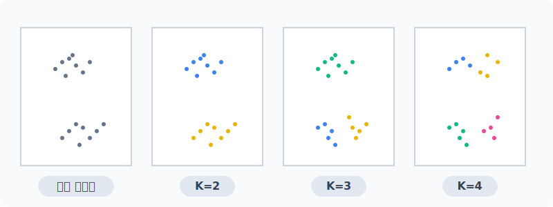
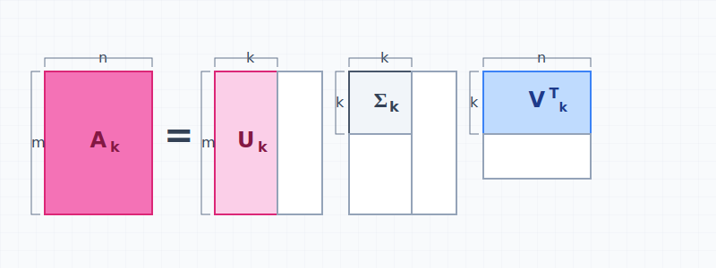
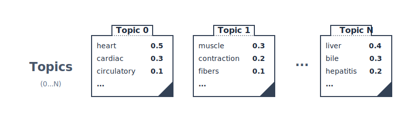

# 텍스트 주제 분석과 토픽 모델링의 철학

누군가 정답을 알려주지 않아도, 수만 장의 야생 텍스트가 쌓여있는 빅데이터 속에서 "우리끼리는 어떤 숨겨진 주제를 공유하고 있다"는 추상적인 군집을 스스로 엮어내는 **비지도 학습(Unsupervised Learning)**의 진수를 배웁니다.

---

## 00. 텍스트 주제 분석의 개념
"지금 당신이 들고 있는 1만 장의 뉴스 기사, 굳이 다 안 읽어봐도 대충 5개의 메인 주제 파벌로 찢어지겠군!"

## 01. 텍스트 주제(Topic) 도출의 필요성
문서 분류 모형과 달리 인공지능이 스스로 맥락을 잡아내야 합니다.
* 세상의 방대한 문헌들(논문, 신문, 댓글)을 일일이 사람이 카테고리 태깅(Tagging)하는 것은 불가능에 가깝습니다.
* **"이 덩어리 문서들은 대체 안에서 무슨 공통된 화제로 떠들고 있는가?"** 파악이 목적입니다.

## 02. "정답이 있는 텍스트 분류"와의 근본적 대조
과거 주차에서 배웠던 분류(Classification)와 근본 철학 자체가 다릅니다.

| 패러다임 방식 | 모델의 임무 | 비유적 상황 |
|:---:|:---|:---|
| **텍스트 분류**   (지도 학습) | 이미 지정된 카테고리(스팸/일반 등)가 주어져 있고 그 정답지 틀 안에 문서를 배정. | (객관식) "이 메일이 사기(스팸)인지 결백(일반)인지 두 보기를 골라 맞혀라!" |
| **토픽 분석**   (비지도 학습) | 정답 카테고리가 아예 없음. 자율적으로 텍스트들의 단어 패턴을 눈치채고 끼리끼리 묶음. | (조별과제) "여기 1만 명 모아둘 테니까 친한 애들끼리 알아서 비슷하게 조 짜봐!" |

---

## 03. 가장 원시적인 방식: 단순 군집화 (Clustering)
조별 모임을 짜는 가장 원시적인 물리적 알고리즘입니다.
* 모든 문서를 수치 좌표공간에 뿌려놓고, 자를 대고 재서 **상대적인 기하학적 거리가 가까운 문서들끼리** 물리적으로 한 덩어리 매듭을 짓습니다.
* "좌표 공간 상에서 가까운 놈들은 필시 비슷한 주제를 은밀히 공유할 것이다"라는 무지성 가정에 근거합니다. (대표 알고리즘: `K-means`)

## 04. 군집화 로직의 한계 (K-means)
* 내가 직접 `K=3`(3명씩 조 짜라!)이라고 숫자를 정해주지 않으면 컴퓨터가 영원히 몇 개로 묶을지 방황합니다.
* 묶인 덩어리 자체는 나오는데, 덩어리 속의 단어들이 대체 **"무슨 의미를 뜻하는지(정치인지 스포츠인지)"**를 모델은 전혀 혀로 내뱉지 못합니다.

## 05. 심해로 들어가는 잠재의미분석 (LSA, 행렬 분해)
가벼운 덩어리 묶기를 넘어, 무식하게 큰 문서 단어 행렬(DTM)의 차원을 억지로 찍어 누르며 압축하는 선형 대수학 기술로 숨은 토픽을 캘 수 있습니다.

$$ A \approx U_k \Sigma_k V_k^T $$

* 거대한 매트릭스를 차원 벡터 **특이값 분해(Truncated SVD)** 공식을 통해 3차원으로 납작하게 찌그러뜨립니다.
* 이때 산출된 `[0, 3, 1]` 같은 실수 벡터 수치들을 마치 "3가지의 숨겨진 주제(Latent Topic)"인 양 억지 비유해서 해석합니다.

## 06. 잠재의미분석(LSA)의 치명적 한계점
고전 수학에 기반한 LSA는 실무에서 쓰기에 너무 끔찍한 단점들을 수반합니다.

> [!CAUTION]  
> **📖 초심자를 위한 쉬운 해설: 박대감 시스템의 오류**  
> 1. 추출된 차원 압축 숫자를 사람이 쳐다봐도 도대체 "이게 경제 토픽이야, 아니면 동물 토픽이야?" 하고 이름표를 명확히 붙이기가 너무나도 어려운 혼재된 구름 수치 상태로 표출됩니다.
> 2. 만약 내일 최신 뉴스 기사(문서 데이터) 문서가 단 한 장 이라도 DB에 새로 추가되면, 업데이트가 안되고 **처음부터 끝까지 전체 시스템 SVD 매트릭스 행렬 분해 구조를 밑바닥부터 다시 계산(재부팅)** 해야 하는 하드코어 연산 폭발이 발생합니다.

---

## 07. 확률 생성모델로의 진화 (Generative Model)
결국 행렬 자르기 장난질에서 벗어나, 철학적 발상의 전환으로 **문서 생성 패러다임**에 발을 들입니다.

* **모델의 정신세계**: "이 수백만 개의 문서는 그냥 랜덤 숫자가 아니라, **어떤 보이지 않는 신(통계 모델)이 엄격한 주사위 확률을 굴려 써내려 간 창작 결과물이다!!**" 라고 대전제를 깔아 버립니다.

## 08. 문서 생성모델의 논리 구조 흐름
만약 당신이 조물주(확률 기계)라면 이렇게 가짜 신문 기사를 편찬했을 겁니다.

| 생성 시퀀스 | 생성자의 행동 |
|:---:|:---|
| **STEP 1** | 아, 이번 기사는 **'정치 70%, 경제 30%'** 느낌으로 섞인 꿀잼 문서를 써봐야지! (토픽 혼합률 $1.0$ 세팅) |
| **STEP 2** | 자, 문장 첫 단어를 쓸 차례야. 70% 짜리 '정치' 주사위를 굴려서 걸렸네? |
| **STEP 3** | '정치' 단어 주머니 손을 쑥 넣자. 확률에 따라 흔한 `국회`라는 단어가 집혔다! (단어 발현) |
| **STEP 4** | 다음 단어도 주사위 굴리자! 이번엔 30%짜리 '경제' 단어 주머니에서 `세금` 단어가 집혔다! (반복) |

## 09. 현대 토픽 모델링 (Topic Modeling) 의 결론
진짜 토픽 모델링 알고리즘의 임무는 결국 이겁니다!
* 우리 앞에는 8번 규칙대로 작성된 완성본 꼬리표 없는 결과 텍스트 기사들만 산더미처럼 쌓여있습니다.
* 이 텍스트들을 전부 때려 넣고 확률 백트래킹 계산을 통해서 **"과거에 저 문서 생성자(조물주)가 대체 몇 퍼센트짜리 정치 주사위와 단어 주머니를 썼었을까?" 그 잠재 파라미터(주사위 비율)를 역추적해서 까발리는 일입니다!**

## 10. 확률의 역추적 원리
`loan`, `bank` 라는 단어가 같이 쓰인 문서를 발견했습니다.
* 기계는 `돈(money)` 주머니 안에 평균적으로 이 단어들이 압도적으로 많이 함유되어 있다는 통계 연산을 구축합니다.
* 이걸 보고 "아, 이 글은 옛날 조물주가 작성할 때 확률을 `money` 토픽 주사위로 굴리고 작성했었군!" 하고 정답 **주제 분포를 역발견** 합니다.

## 11. LSA와 신규 토픽 모델링 체계 (LDA 비교)
행렬 수치 분해 중심 모델링 vs 생성 확률 역산 모델링.

* **LSA (잠재 의미 분석)**: 선형 대수학에 근간을 두고 차원을 폭력적으로 압축해 잠재 축을 토픽으로 포장. 거리가 빠름.
* **LDA (잠재 디리클레 할당)**: 토픽 모델링의 성배. 주사위 모델(확률 생성 과정)의 철학을 세우고, 조건부 통계 추론 연산으로 본연의 단어 집합 토픽 군집을 가장 정교하게 역발굴. (자세한 건 다음 단원!)
