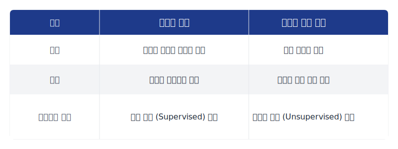
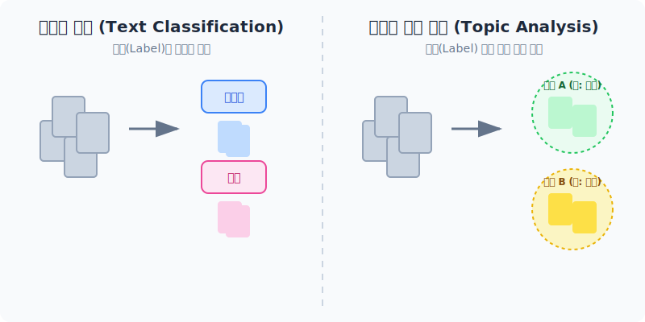
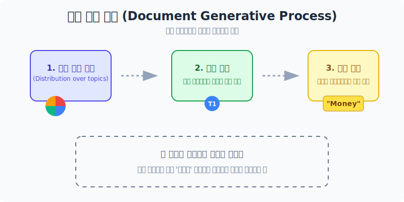
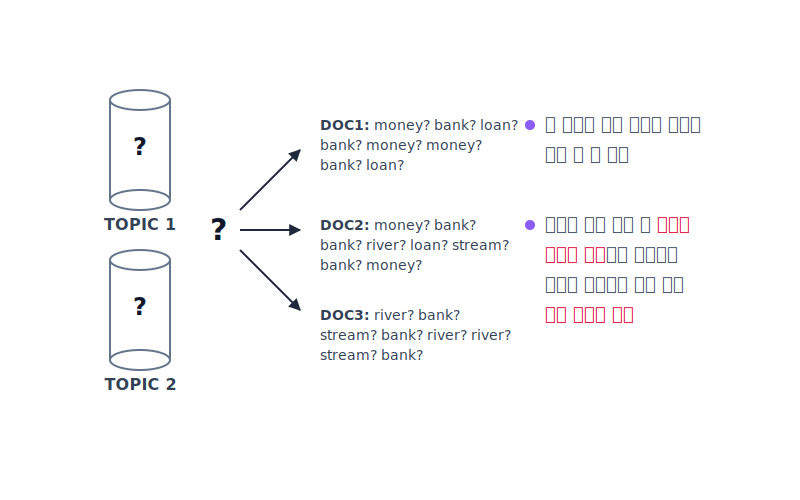
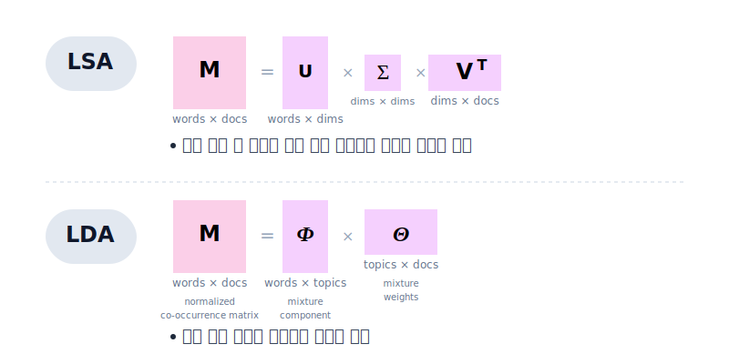
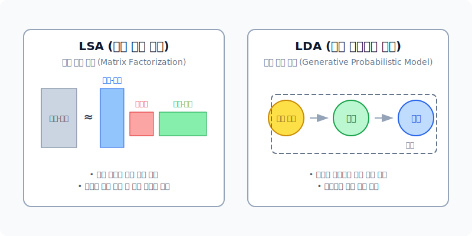

# 텍스트 주제 분석의 개념과 접근

우리가 수많은 문서(예: 뉴스 기사, 논문 초록, 정책 보고서, 문학 작품)를 마주했을 때, 가장 먼저 드는 질문은 **"이 문서들은 각각 무엇에 대해 이야기하고 있는가?"** 입니다. 이렇게 텍스트들의 핵심 내용을 파악하고 유사한 문서들을 묶어내는 작업을 **텍스트 주제 분석(Topic Analysis)**이라고 합니다.

---

## 1. 텍스트 분류(Classification) vs 텍스트 주제 분석(Topic Analysis)

텍스트 처리를 위한 두 가지 대표적인 접근법은 그 목적과 '정답'의 유무에 따라 크게 다릅니다.

* **텍스트 분류 (Text Classification)**: 사전에 정의된 '정답 레이블'이 존재합니다 (지도 학습). 목표는 새로운 문서가 들어왔을 때, 이미 알려진 카테고리(예: '스포츠' 또는 '스팸') 중 어디에 속하는지 올바르게 예측하는 것입니다.
* **텍스트 주제 분석 (Topic Analysis)**: 사전 레이블이 없는 상태에서 시작합니다 (비지도 학습). 목표는 데이터 자체에만 의존하여 텍스트 내부 구조를 이해하고, 유사한 문서들을 자연스럽게 그룹화하여 새로운 주제 카테고리를 찾아내는 것입니다.

*텍스트 분류는 주어진 라벨을 맞추는 것이고, 주제 분석은 데이터 스스로의 패턴(유사성)을 통해 군집(Cluster)을 형성하는 과정입니다.*

---

## 2. 군집화 (Clustering) 방식의 주제 분석

가장 직관적인 텍스트 주제 분석 방법은 문서를 수치형 **벡터(Vector)**로 변환한 뒤, 기하학적으로 **가까운 공간에 모인(유사한) 문서들끼리 묶는(Clustering) 과정**입니다. 
"비슷한 단어를 많이 포함한 문서는 비슷한 주제를 다루고 있을 것"이라는 기본적인 가정에서 출발합니다. 예를 들어 K-Means 알고리즘을 사용하면 다음과 같이 동작합니다.

1. **클래스 중심(Centroid) 계산**: 임의의 기준점들을 잡습니다.
2. **할당**: 각 문서(데이터 포인트)를 가장 가까운 중심점에 할당합니다.
3. 이 과정을 중심점이 더 이상 변하지 않을 때까지 반복하여 그룹을 형성하고, 각 그룹에 공통적으로 나타나는 단어들을 통해 그 กลุ่ม을 **"경제 기사 군집"** 혹은 **"스포츠 기사 군집"**으로 해석합니다.

*군집화 알고리즘(예: K-means)을 통해 K값에 따라 문서를 여러 군집으로 나누는 예시입니다.*

---

## 3. 잠재 의미 분석 (LSA, Latent Semantic Analysis)

**잠재 의미 분석(LSA)**은 군집화를 한 단계 더 발전시킨 방법론으로, 문서에 나타난 표면적인 단어 빈도(n개의 단어 빈도)를 넘어 그 이면에 숨겨진 **"잠재적인 의미(Latent Semantic)"**를 포착하는 것을 목표로 합니다.

수학적으로 LSA는 **특이값 분해(Truncated SVD)**라는 선형대수학의 **행렬 분해 기법**을 사용합니다. 
거대한 (단어 × 문서) 행렬을 세 개의 작은 행렬로 쪼개는 차원 축소 과정을 통해, 고차원의 단어 공간을 아주 작은 저차원의 '의미 공간(주제 공간)'으로 맵핑시킵니다. 그래서 각 문서는 이러한 k개의 축소된 **잠재적 의미 축(Topic)의 비중**으로 표현됩니다.

*LSA의 기본 원리인 행렬 특이값 분해(SVD) 과정*

> [!WARNING]
> **LSA의 한계점**
> 1. **해석의 어려움**: 추출된 잠재적 공간(축)은 명확한 '단어'가 아니라 혼재된 수치 공간이므로 사람이 "이 주제는 이런 내용이다"라고 이름 붙이기가 어렵습니다.
> 2. **높은 연산 비용**: 고정된 행렬 연산을 기반으로 하므로, 매일 시시각각 새로운 문서나 단어가 추가될 때마다 전체 행렬을 구성하여 무거운 Truncated SVD 과정을 처음부터 다시 반복수행해야 합니다.

---

## 4. 문서 생성 모델 (Document Generative Model)

LSA의 한계를 극복하기 위해 등장한 강력한 관점이 바로 **'문서 생성 모델'**입니다. 이 관점은 데이터(문서)가 어떻게 "만들어졌는가?"를 수학적(통계적) 확률 분포로 상상해보는 것에서 출발합니다.

**생성 모델(Generative Model)의 기본 가정**
어떤 확률 분포와 파라미터가 존재할 때, 그 규칙(Random Process)을 따라 사람이 단어를 고르고 문서를 작성했다고 '거꾸로' 가정하는 것입니다. 
- **문서(Document)**는 여러 **토픽(Topic)들의 혼합 비율**을 가지고 있습니다.
- 각각의 **토픽(Topic)**은 수많은 **단어(Word)들이 뽑힐 확률 분포**를 가지고 있습니다.

*각 토픽이 서로 다른 단어들의 출현 확률 분포를 가지고 있는 모습*

### 문서 생성 절차
이 모델의 관점에서 작가가 문서를 작성하는 과정은 다음과 같은 확률적 샘플링의 결과물입니다.

실제 세계의 **토픽 모델링(Topic Modeling)**은 이 과정을 역방향으로 추적하는 것입니다. 즉, 최종 결과물인 관측된 문서와 단어들을 보고 데이터(문서)를 가장 잘 설명할 수 있는 "최상의 잠재 변수 집합(가장 이 문서를 만들기 적합했던 원래의 토픽 분포)"을 발견하는 **통계적 역추론 기법**입니다.

*관측된 단어들로부터 역으로 가장 가능성 높은 토픽 모델을 추론해내는 통계적 역추론 과정*

---

## 5. LSA와 LDA 비교

문서 생성 모델의 대표적인 구현체가 바로 **LDA (Latent Dirichlet Allocation, 잠재 디리클레 할당)** 입니다.

| 구분 | LSA (잠재 의미 분석) | LDA (잠재 디리클레 할당) |
|---|---|---|
| **기반 이론** | 선형대수학적 차원 축소 (행렬 분해, SVD) | 확률론적 통계 추론 (문서 생성 모델) |
| **목적** | 단어와 문서 사이의 숨겨진 의미적 관계 벡터 포착 | 문서 집합 내에서 확률적 특성을 띄는 명시적 토픽 발견 |
| **토픽의 해석** | 수치 연산에 의해 혼재된 값이 나와 직관적 해석이 다소 어려움 (음수 발생 등) | 토픽이 '단어 확률 분포'로 나오므로 사람이 주제를 더 쉽게 해석 가능 |
| **문서 갱신** | 새로운 문서가 추가되면 전체 행렬 분해 연산을 다시 수행해야 함 | 확률 모델 업데이트 방식을 통해 비교적 유연하게 모델 업데이트가 가능 |

결론적으로, 초기의 텍스트 주제 분석은 수학적인 행렬 분해(LSA)에 의존했으나, 현대에는 문서가 확률적인 토픽-단어 선택 과정을 거쳐 생성되었다고 가정하고 이를 역추론하는 생성 모델 기반의 **LDA**가 텍스트 마이닝에서 가장 널리 활용되고 있습니다.
