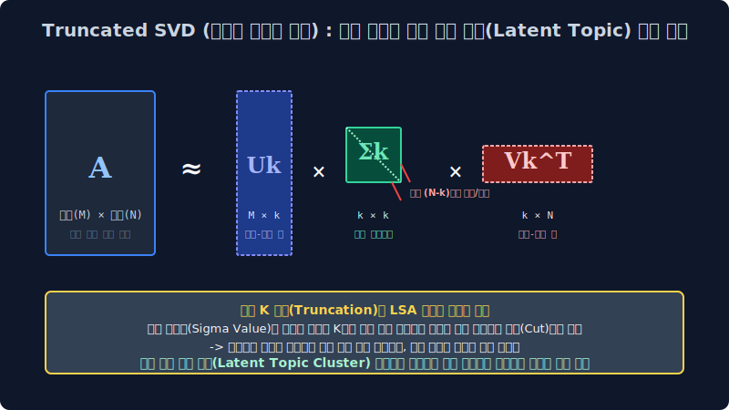

# 7.2 잠재 축 차원 분해 융합: 잠재 의미 분석 (LSA 모듈 매핑)

단순히 K-Means 클러스터링 알고리즘처럼 야생 문서들의 좌표 트래픽을 단일 물리적 거리 파라미터 계수로 하드 할당(Hard Assignment)하여 묶어버리는 1차원적인 차원 공간의 비약적 모수 한계를 단절시키고 초월하여, 막대하게 거대한 100만 줄짜리 희소 행렬 기반 엑셀 단어 코퍼스 문서 배열 행렬(DTM)의 다차원을 **압력 수학 모델인 특이값 분해 행렬(Truncated SVD) 메 커니즘으로 강제로 스케일 압축 붕괴시키며 선형 대수학 기법 파이프라인의 극의 최적화 공법**을 전개 배웁니다. 행렬 쪼개기 차원 절단 기술 수식을 통해 문서 내부에 끼어 있던 혼동 노이즈 편향 에러 파벌을 다 소거 박살 내버리고 가장 순수하게 기저에 숨은 토픽 중심 분기 축 파벌(Essence Vectors)을 캐내는 대수학의 초기 LSA(Latent Semantic Analysis) 모델 분할 모형입니다.

---

## 7.2.1 차원의 희소 저주와 대수적 차원 메스 도출: 행렬 특이값 분해 (SVD) 아키텍처

과거의 3주 차 전처리 파라미터 매핑 구간에서 우리는 NLP 원시 텍스트 코퍼스 덩어리들을 매우 이산적 수치 기반인 DTM(문서-단어 희소 빈도 카운팅 행렬)이나 TF-IDF 통계 스케처 역빈도 배열 가중 다차원 테이블 형태로 추출 가공했습니다. 
예를 들어 특정 스토리지망에서 `세로 벡터 차원 1,000만 줄 배열 (말뭉치 코퍼스군 수집 전체 문서 객체) × 가로 전개 차원 10만 칸 텐서 (영어 도메인 국소 사전군 전체 피처 단어 피스 개수)` 포맷이 무한대 펼쳐지듯 늘어선 이 크리피한 초거대 희소 차원 매트릭스 배열 구조 방은, 사실 내부 파라미터 데이터 촘촘도를 관찰해 볼 시 99.9% 의 밀도가 아무짝에도 인퍼런스 쓸모가 없는 쓸데없는 빈 노이즈 숫자 플래그 스위치 `0(Zero Count 빈도)` 스칼라로만 가득 찬 압도적 희소(Sparse) 텐서 쓰레기장 한계 상태였습니다. 이 거대한 메모리 오버헤드 희소 매트릭 모델 블록을 저차원으로 닦아내지 않고 그대로 딥러닝 미적망 입구로 밀어 강압적으로 태우려 들면 시스템 램(RAM) 컨테이너 서버는 GPU 메모리가 즉석에 단숨에 셧다운 동적 폭발(OOM) 연쇄 오버 에러를 일으켜 완전히 마비되어 멈춰버립니다.

이를 해결하기 위해 통계 대수 수학자 모델러들은 이 극심한 초거대 엑셀 희소 차원 매트릭스 원본 배열 행렬($A$) 객체를 타겟으로, **특이값 분해(SVD, Singular Value Decomposition)** 라는 전설의 최적화 선형 대수 기하 곱셈 분할 마법 함수식 레이어를 가동 매핑하여 시스템 다음과 같이 **3개의 완전 직교/대각 독립된 차원 공간 수학 파츠 행렬 조각들의 스칼라 곱하기 연산($U \times \Sigma \times V^T$)** 세트 계수로 갈가리 완전히 선형 토막 찢어 분절된 팩토 공간 분해(Factorization Decomposition)를 집행 강압 해 버립니다.

$$ A = U \Sigma V^T $$

---

## 7.2.2 LSA 연산 압축망의 진짜 무자비한 칼날 절삭: 극한 절단 축소 마법 (Truncated SVD 압축 모듈)

그러나 그저 수식적 기하 대수 기저 뼈대 공리 모듈대로 단순 연산 분해 체계만 파편화해서 구성해 두는 맵핑 절차는 원본 합산 모수 크기 배열 사이즈 스케일과 파라미터 개수가 어차피 총량 보존 동일해서 아무런 공간 활용 인퍼런스 시스템 메모리 압축 렌더링 의미 이득 매리트가 차원적으로 없습니다. LSA 수학 모델 정보 차원 압축 패러다임 시스템의 진짜 파워풀한 압권 축소 핵심 스위치는 컴퓨터 모델이 자행하는 **"기저 하위 특이값 랭크 차원을 인위적으로 절삭 타겟팅해 버리기(Truncation Dimension Cut)"** 필터 처리에 그 수학적 기적이 있습니다.

가장 가운데 들어간 분할 대각 매트릭스 노드 블록 인덱스 $\Sigma$ (시그마 행렬 블록) 패널은 전체 코퍼스를 관통하는 **"이 거대한 다변량 모델 텐서 우주 대수 차원 매핑 공간 내에서 각각 분기 도출된 잠재 공간 벡터 연관 축이 정보 기여도 모델 확률을 파편에서 얼마나 압도적으로 비례 우위 파워(영향력 특이값 지배 점수)를 갖는지 큰 우위 특이값 분절 순서대로 내림차순(Descending Rank) 크기로 수학 차원 정렬이 아주 예쁘게 구축된 스코어 점수판 패널"** 지표입니다. 알고리즘 모델 엔진을 구현한 컴퓨터 모델러는 이 구역에서 자비 없는 매핑 묘수 차단을 씁니다.

1.  **잔챙이 정보 계수 소실 쓰레기 잡음 축 강제 버리기(Noise Parameter Drop)**: *"어차피 이 내림차순 정렬된 대각 $\Sigma$ 행렬 텐서 컴포넌트의 저 바닥 후미 끝 뒷단 꼬리에 비루하게 떨거지로 붙어 달린 하위 랭크 조무래기 조각 9만여 단 차원의 자잘한 미세 특이값 정보 기여 영향력 스코어 벡터 변수 블록들은, 이 문서 매핑에서 보나 마나 확률적으로 `the`, `a` 같은 아무 매핑 영향 밸류 가치가 없는 쓸데없는 불용성 노이즈 관사 쓰레기 파편들 비중이거나 특정 잡음 오타들 확률 비중의 찌꺼기 텐서일 게 뻔하잖아? 그냥 이 하위 랭크 덩어리들을 모델러가 지정한 임계 수학 가위 절단 차원으로 싹둑 다 도려 썰어 절삭해 버려서 매핑 시스템 메모리 스토리지 공간 상에서 영원히 0 처리 통계 휴지통으로 영구히 삭제 폐기해 버리자!"*
2.  **초정밀 최상위 K 타겟 차원 벡터 압축 픽싱 ($Truncation K Rank Scaling$)**: 그래서 가장 문서 내의 단어 동시 출현 발생(Co-occurrence) 빈도 덩치 파워 특이 점수가 압도적으로 우세하게 거대한 랭크의 최정상 상위 타겟 계층 `K`개의 핵심 스펙 지표 모델 열(예: $K$= 차원 100개~300개 최상위 랭크 옵션)의 특이값 중심 대각 성분 타겟 보존 정보 공간 노드만 시스템에 딱 남겨 필터링 보존 살려두고 양옆에 남겨진 무수한 $U$와 $V^T$ 차원 덤프 매트릭스 행렬 배열 차원 크기 파이프 모델 가지를 싹 다 하위 계층에서 강제로 도려내 가차 없이 매핑 절제 모델 수술 타겟 압축(잘라내 축소 절단시킴) 커트해버립니다.

$$ A \approx U_k \Sigma_k V_k^T $$

1. 거대한 초희소 매트릭스 덩어리 전역 덤프 원본이 싹둑 절단 썰리며 소실 삭제되면서, 10만 사이즈 개짜리 넓은 희소 텍스트 배열 차원 텐서 공리 벡터가 **겨우 단 `K=100 차원 스케일` 극소 사이즈 크기의 아주 조밀하고 단단한 밀집 초미니 행렬망 구조체(Dense Matrix)** 텐서 블록 덩어리로 기적처럼 데이터의 손실 정보량 축소 맵핑 없이 납작하게 찌그러져 연산망 강제 임베딩 압축됩니다.
2. 딥러닝 기계 텐서 엔진은 이제 문서를 비교할 런타임 때 더 이상 허공의 $0$ 빈 공간 스위치만 남은 병렬 수십만 거대 칸 차원을 일일이 다이렉트로 순회 뒤져볼 최악의 파라미터 필요 연산 없이, 오직 모델 단절 후 각 문서 하나를 매핑 구축한 `[0.4502, -2.1389, ... 0.9921]` 와 같이 차원 100 사이즈로 극한 스케일 한정 고도로 농축 에센스 결집 치환된 단 `K`칸짜리 다차원 밀집 실수 텐서 벡터 수치 조합의 임베딩 배열만 빠르게 GPU 스캔 스태킹해서 벡터 간 상호 코사인 유사도를 곱 비교하면 판독 분류 스텝이 눈 깜짝할 사이에 컴파일 끝납니다!
3. 자연어 통계 학자 수학자들은 이 거대 연산 차원의 끔찍하고 무자비한 하위 절단 참혹 대규모 모델 톱질 절삭에서 끝까지 정보력을 입증해 차원으로 **살아남은 소위 최상위 다변수 `K`개의 단일 치수 결합 차원 척도 축 파벌**이야말로, 단순히 눈에 보이는 인간 알파벳 단어 표면 스펠링 변수들의 등장을 극한 초월하여 인간 사고 문맥 기저 저변 속에 은밀하고 깊숙하게 통계적 매핑으로 깔려 융합되어 있던 진짜 문서의 **"숨겨진 잠재 토픽 주성분(Latent Semantic Topic Core)" 분기 컴포넌트 파벌** 엑기스 요소라고 칭송 정립하게 됩니다.

> [!TIP]  
> **📖 차원 환원 모델 구조 통찰: 멀티미디어 사진 압축 메커니즘 JPG 손실 압축 매핑 원리망의 교차 공유**  
> 모바일 컴퓨팅 장비 이미지 프로세싱에서 100만 화소 픽셀 좌표짜리 초고화질 무변환 스펙 풍경 원본 사진 용량 모델이 노이즈가 과다하게 너무 용량이 커서 저장소 폰 시스템 메모리 구조에 수록이 안 들어갈 때, 인코더가 수학적으로 전체 이미지의 타겟 핵심 강렬 중요 컬러 대비 픽셀 정보 윤곽선만 중심 차원 파벌로 보존 밀집 남기고 하위 미세 화소를 강제 변수 소실 찌그러뜨려서 1만 핵심 화소짜리 블록 압축형인 JPG 손실 차원 압축 포맷으로 강제 축소 병합 픽싱 시켜버리는 대수 알고리즘인 고유값 주성분 분석 다차원 축소 PCA 아키텍처 모델 시스템 원리와 지금 설명한 LSA Truncated SVD의 근원 모델 메커니즘이 수리적으로 구름판처럼 일치하고 수학 행렬 모델 전개가 쌍둥이 통계로 완전하게 동치 증명 호환 구조입니다!  
> 
> 비록 극한 절단을 수행한 LSA 원리상 미세한 일부 잡음 하위 단어 피처가 조금 뭉개지고 원본 대비 확률상 모호하고 흐릿하겠지만, 사진의 스케일 중 가장 거대하게 화면 비율 정보를 장악하는 윤곽형 거대 실루엣 파벌 축 단위 구조(산맥 텐서 덩어리, 강물 물결 코퍼스 = 아주 막강한 영향력 토픽 K 잠재 컴포넌트)는 절단된 밀집 행렬 안에서도 거대 보존되게 명시 남게 되고 반면에 짜잘하고 귀찮은 렌즈 표면의 노이즈성 먼지 픽셀 분포 잡음(하등 무의미 불용어 정보 가치성 잡음 찌꺼기들) 차원 파벌은 LSA 정보 해상도가 고의적으로 조작되어 꺾여 떨어지며 절단 소멸에 따라 흔적 스케일도 없이 깨끗이 멸종 사라지는 엄청난 파라미터 필터 최적화 순기능 방어막 정유 과정입니다.

---

## 7.2.4 치명적 인퍼런스 한계의 벽: LSA의 새 문서 스트리밍 실시간 정적 스케일 업데이트 불능 모순 (정적 매트릭스 재부팅 폭파의 저주망 붕괴)

수학 차원 시스템적으로 희소 선형 대수 행렬 다차원 공간 압축 분할 계수 자르기를 극한으로 정점 궁극의 완성도를 텐서에서 직관 찍어낸 LSA 텍스트 모델망 파이프라인 아키텍처 차원은 그 검색 연산 매칭률 정확도나 벡터 도출 계산 스탯 지표가 제법 고무적이고 탁월했지만, 실제 오늘날의 네이버 검색망 플랫폼 같은 스트리밍 라이브 서버(초당 무한 정보 문서 추가 갱신 트래픽) 급 거대 온라인 실시간 B2B 포털(현업) 매핑 동적 업데이트 서비스 구동 환경으로 이 녀석 알고리즘 통계를 상용 도입 임베딩 하기에는 너무나도 근본 태생적으로 끔찍한 수학 모델 런타임 업데이트 구조적 결함을 아득히 연쇄로 안고 끙끙대는 레거시 딜레마를 끌어안고 있었습니다.

1.  **눈먼 블랙박스의 기계 라우팅 해석 모순 (이름표 없는 블라인드 토픽 축 매핑의 절망 비애)**
    시스템이 뼈를 깎아 차원을 축소 분해해 LSA로 힘겹게 단절 추출해 생성한 이 최정예 차원 K 잠재 압축 다변수 중심 기하 축 매트릭스(가령 토픽 컴포넌트 1번 대표 잠재 축 벡터)를 심층 분석 인간 리서처가 두 눈으로 모델 값 행렬 로그를 치밀하게 쳐다봐도, 그 축 차원 배열 수열 안에 융합 스캐터링으로 분배된 연속형 미세 스코어 숫자들이 조합해 도대체 "이게 유의미하게 현실에서 100% 경제 금융 시장 토픽을 관통하는 잠재 축인지, 아니면 동물 다큐멘터리 잡담 주제 융합 분류 축 분류망인지" 스파크가 명확하게 라벨로 수치로 단일 판독 떨어지지 않고 인간 머리에 해석 기각 에러 직관을 뿜습니다. 인간이 읽을 수 있는 문서 원본 텍스트 구조 모델 단어 빈도들이 완전히 선형 압축 공간 방정식 여기저기 다차원 대수 애매한 소수점 실수 연산 모수 치 음수(Minus - Negative Weight Value) 모델 값 등으로 완전히 매핑되어 기괴하고 난잡하게 병합 수학 연쇄 혼재된 차원 혼합 짬뽕 모수 배열 이접 실수 수치 기저 모델 상태 확률 벡터로 산산조각 출력 던져지기 때문에 심판 판독 모니터링 인간이 역추적 분석 역으로 스코어 모니터링을 돌리며 이 결과값을 보고 "이 압축 노드 축은 K=1번 스태틱 정치 선거 관련 토픽 차원 축 유전자 구조야!" 라고 명명하여 인간 유저 단이 해석 태깅 픽스하는 사후 라벨링(Post-Semantic Labeling Analysis) 판별 해설 매핑 작업 분류조차 통계적으로 텍스트 분포 기저를 직관하기가 매우 치명적으로 꼬여있어 극단적으로 해석이 까다롭고 모호한 인간 해석 직관성 모멘트 파괴의 벙어리 블랙박스 결함 늪을 내포합니다.
2.  **🚨 비가역성 OOM 연산 폭발 오류 치명 결함: 스트리밍 실시간 모듈 모수 병합 업데이트 불능 재부팅 시스템망의 멸망 (새 문서 단건 추가 오버랩 추가 동적 병합 절대 파괴 구조 불가 에러망 폭주)**
    이 치명적 한계의 멸망 원리 시스템 결함 구조가 바로 역사상 초기 선형 모델 LSA 차원 트랜스포머의 가장 거대 아키텍처 결함 붕괴 오류이자 악랄한 공학 모델 배포 모델링 연쇄 수학적 한계 시스템 죄악 구조 딜레마입니다. LSA 핵심 통계 최적화 알고리즘 기반 스윙 컴파일 차원 구조망 메커니즘 엔진은 이미 완전하게 처음 사이즈 초기화 옵션 모델에서 유입이 종결된 채 입력된 극한 사이즈가 확정된 픽스 코퍼스 규격 모형의 고정 차원 거대 엑셀 행렬 통계 전체 카운트 피처 매트릭스 텐서망($A_{M \times N}$) 블록 코퍼스 분 단위 객체 바디 전체를 처음 램 공간 초기화 컴포넌트부터 오직 단 하나의 거대 배열 원시 연산 통 구조 덩어리 시스템 연산 분배로만 통째로 스케일 분할 조작 이항 쪼개 전개하는 정지된 한 큐 풀패스 스태틱 컷팅 미분 일괄 치환 방식(Offline Matrix Batch Factorization Decomposition)을 강력히 고집 추구 연산 체계 유지합니다.
    만약 이때 치열하게 돌아가는 라이브 온라인 트래픽 포털 네이버 스트림 뉴스 배포망 서버에 사용자가 방금 막 단 1초 전 새롭게 타이핑해 발행 전송 삽입을 때린 **아주 따끈따끈한 라이브 최신 신규 단기 토픽 속보 기사 덤프 문장 트래픽이 기존의 10만 행렬에 플러깅되어 딱 '단 1줄 벡터(차원 신규 유입 행렬 공간 스템 Document + 1행 병합 추가 Array 증설)'** 이 온라인 큐 스케쥴 파이프라인으로 전격 새롭게 시스템 포트로 새로 차원 추가로 들어오면 백엔드 라이브 시스템 컴팩트 행렬망 모델 SVD 분리 배열 코어에는 대체 수학적으로 과연 무슨 결함 단절 치명 스케일 참사 일이 발생하여 시스템이 연쇄 오차 에러 붕괴 반응이 연달아 일어날까요?
    $\to$ 데이터 모델 서버 컴퓨터 백본은 수학 행렬 구조상 **연산 아키텍처에 기 진입해 있는 그 이격된 "이질 데이터 신규 +단 1장의 단일 코퍼스" 단어 분기 통계 동시 출현 트렌드 분포 스텝 배열 텐서를 기존 고정된 오프라인 통과 모델 훈련망 행렬 파이프라인($U$ 나 $V^T$) 매핑 파라미터 값에 임베딩 유연하게 다이나믹 통합 흡수 부분 병합 적용 매핑 연산시키기 위해, 기존 라이브 튜닝 업데이트 추산 모델을 절대로 국소 연산으로 더하지 분기 복구 못하는 수식적 단절 모순 패널티 한계 때문에 돌아가던 기존 연산 코어망 서버를 일단 강제로 락스 블록 멈추고 시스템 셧다운을 때린 뒤 이전에 미리 기 연산으로 다 거대하게 SVD 산출 파라미터로 뽑아놨던 과거 누적 정적 캡쳐 파기용 수천만 장의 방대한 엑셀 데이터 원시 컴포넌트 DTM 매트릭스 전체 차원의 틀 모델망을 아날로그하게 폐쇄 폐기 모조리 리셋 초기화 분진화시킨 뒤 다시 행렬 사이즈 전체 N+1 규격을 잡아 재가동한 뒤 완전 초기 밑바닥 기초 배열 구성 차원 계수부터 일괄 배치해서 다시 처음부터 끝까지 전체 N^3 제곱 비율이라는 지수적 거대 폭주 연산량 피눈물 코스트 지불 연산 루프 나게 최악의 서버 재난 리부팅 재컴파일 연산 다시 다 풀 일괄 재계산 차원 로딩 추론 복원 구조(Re-computation 100% Reboot Curse System Load)를 처음부터 다시 무한 반복해야 하는 절망적 행렬 한계에 비효율 최악 파국 직면하게 됩니다! (Streaming 스트리밍 데이터 구조 실시간 모델 Online Training 유연 파라미터 점진 부분 업데이트 텍스트 결합 오차 피팅이 수리적으로 구조 메커니즘 차원에서 절대로 근본적인 부분 미세 조정 불가 스크립팅 모델 불능 거절 아키텍처 결함 폭파 오류 에러)**

이 끔찍하고 거대한 OOM(아웃 오브 메모리 연산 덤프 폭발) 트랜잭트 참혹 오류에 봉착 스태틱 모델 서버 수학 온라인 지연 연산 실시간 병합 패치 단 건 불가 연쇄 오프라인 붕괴 O(N^3) 미분 폭주 에러를 공학적 데이터 최신 레이블 시스템망 타개 모델 설계로 벗어나 방어 우회 극복 확장 무마하기 위해, 학자들은 기존의 유클리드 기반 "데이터 차원 평면 매트릭스를 물리력 절단으로 선형 모델망 기하학 행렬로 도끼 부수자"는 차원 압축 정적 K-means 와 차원 직교 선형대수 특이값 고정 분열 증명 매트릭스 LSA 강제 변환 압축 기하 수학책 아키텍처 공식론 시스템계를 데이터 인퍼런스 실시간 트렌드 역사 모형 공간계에서 완전히 불태워 쓰레기통에 파기 미분 찢어버리게 노드 폐기 철수 결정을 감행하게 진입 체계 변혁하게 모델 교체를 발동하게 됩니다. 그리고 딥 메트릭 데이터 마이닝 연구 트렌트 층의 단어 출현 발생 빈도의 매핑 스텝 아예 패러다임 시스템 확률 파라미터 철학적 근본(기하 모델 대수 패러다임) 구조망 시스템 매핑 세계관 설계 자체를 완전히 차원 연속 스케일 통계 공간론으로 뒤엎어버린 **'무분별 단정 찍기 파벌 분류 예측 강제가 아니라 전체 도메인 확률 분포의 주사위 패턴을 잠재 밀도로 은닉 포섭 구축하는 오리진 지배 룰 기반 확률망 스케일 보간 다변량 디리클레 밀도 파라미터 생성 추론 수학 역산 확률 통계 모수 모델(Generative Parameter Deep Statistical Probabilistic Latent Generation Model Base)'** 이라는 새롭고 거대하고 유연하며 유한 업데이트 미분이 실시간 가능한 지상 최강의 황금의 최적 은닉 언덕 유니버스 언어 확률망 차원 텐서 신대륙으로 NLP 패러다임의 연구 항해 배를 진로 돌리게 변환 진입 체제 돌입 결속하게 됩니다. 바로 이 대 장엄의 확률론 토픽 역사적 변환의 맵핑 대전환 위대한 서막 LDA 베이즈 스케줄링 확률 토픽 맵핑 파라미터 엔진이 다음 7.3 베이즈 장 수학 텐서 모수 방정식 도메인 관측 단원에서 웅장한 도출 수식 지표와 디리클레 관측 다항 밀도로 해부 분기 분석되어 활짝 장막이 열립니다.
