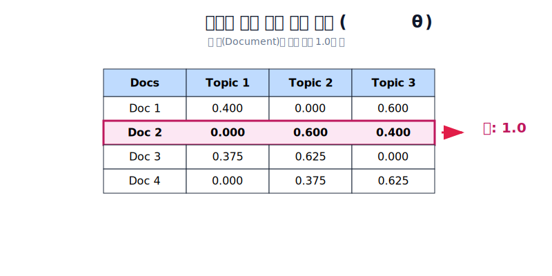
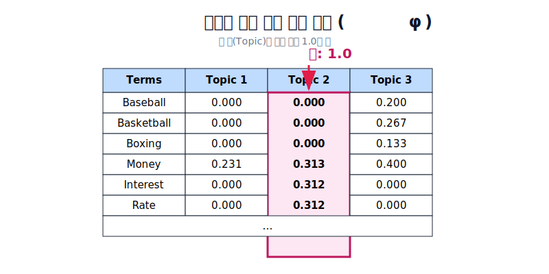
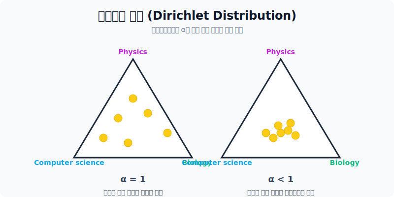
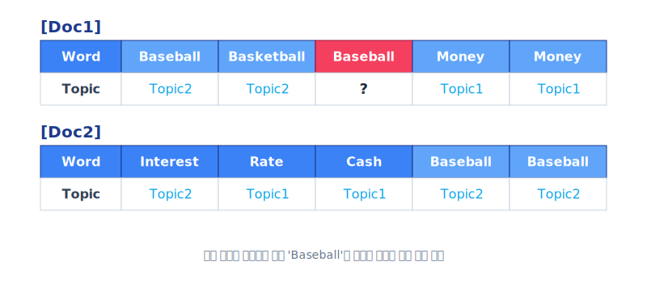

# 토픽 모델링과 LDA

잠재 디리클레 할당(LDA, Latent Dirichlet Allocation)은 현존하는 텍스트 데이터 분석 기법 중 가장 널리 쓰이는 토픽 모델링 기법입니다. 문서는 여러 토픽이 혼합된 확률 분포로, 각 토픽은 단어들의 확률 분포로 이루어져 있다는 **"문서 생성 모델"**의 기본 철학을 완벽하게 구현하고 있습니다.

핵심 포인트는 우리가 실제 관측할 수 있는 변수는 오직 **'단어'** 뿐이며, 이 관측된 단어들을 바탕으로 숨겨져 있는 변수인 **'토픽의 확률 분포'**를 찾아내는 **사후 추론(Posterior Inference)** 방법론이라는 것입니다.

---

## 1. 직관적 예시: 3개의 문서와 2개의 토픽

LDA의 가정인 "문서는 토픽의 무작위 혼합"이라는 개념을 직관적인 예시를 통해 살펴보겠습니다.

가령 수없이 많은 관측된 단어들을 통해 K=2 (토픽 2개)라고 가정을 했을 때, 내부적으로 2개의 토픽은 각각 다음과 같은 단어 출현 확률을 지니게 됩니다.
* **토픽 1 (과일 토픽)**: 사과 20%, 바나나 40%, 먹어요 40% ...
* **토픽 2 (동물 토픽)**: 귀여운 33%, 강아지 33%, 좋아요 16% ...

이때, 실제 사용된 3개의 문서(Document)는 다음과 같이 토픽들이 혼합되어 생성되었다고 역추론해볼 수 있습니다.

| 문서 내용 (관측값) | 문서 내 토픽 확률 분포 (추론값) |
|---|---|
| 문서1: "저는 사과랑 바나나를 먹어요" | 토픽 1 (과일) 100% |
| 문서2: "우리는 귀여운 강아지가 좋아요" | 토픽 2 (동물) 100% |
| 문서3: "저의 깜찍하고 귀여운 강아지가 바나나를 먹어요" | **토픽 2 (동물) 60% + 토픽 1 (과일) 40%** |

이처럼 문서는 하나의 주제로 한정되기보다 **복수 개의 토픽이 확률적으로 섞여(Mixture) 있다**고 가정합니다.

---

## 2. LDA의 확률 모형 (그래프 모델)

이러한 직관을 통계학적으로 완벽히 수리 모델화 시킨 것이 바로 아래의 그래픽 모델(Plate Notation)입니다.

*LDA의 확률 모형 생성 메커니즘 도식*

**모델의 각 변수 의미 (N: 문서 내 단어 수, D: 총 문서 수, K: 총 토픽 수)**

1. $\alpha$: (하이퍼파라미터) 문서들이 토픽들을 얼마나 다양하게 가질지에 대한 디리클레 분포 파라미터.
2. $\theta_d$: 특정 $d$번째 문서의 토픽 혼합 확률 분포 (예: 토픽A 60%, 토픽B 40%).
3. $Z_{d,n}$: 확률 $\theta_d$에 기반하여, 문서 내 $n$번째 빈칸에 들어갈 '특정 토픽'이 할당된 횟수/상태.
4. $W_{d,n}$: (유일한 관측값) 단어 위치에 부여된 특정 단어.
5. $\phi_k$: 특정 $k$번째 토픽의 단어 출현 확률 분포.
6. $\beta$: (하이퍼파라미터) 각 토픽이 단어들을 얼마나 다양하게 가질지에 대한 디리클레 분포 파라미터.

*행렬 표 형태로 본 문서별 토픽 분포 혼합 비율($\theta_d$)*

*행렬 표 형태로 본 토픽별 단어 출현 분포($\phi_k$)*

> [!NOTE]
> 디리클레 분포(Dirichlet Distribution): 하이퍼파라미터 값이 1에 가까울수록 특정 문서(또는 토픽)가 아주 다양한 주제(또는 단어)들을 골고루 포함하도록 유도하는 수학적 확률 분포 룰입니다.

*알파(α) 값에 따른 극단적 스파스(Sparse) 분포와 균등 분포의 차이 시각화*

---

## 3. LDA의 토픽 갱신 추정 과정 (Gibbs Sampling)

문서를 처음 접할 때 우리는 실제 토픽을 모르기 때문에 모든 단어를 무작위 토픽에 배치합니다. 그리고 나서는 **확률 분포를 추정하는 Gibbs Sampling 기법** 등을 사용하여 점진적으로 맞는 위치를 찾아 들어갑니다.

**LDA 갱신(추정) 4단계**
1. 사용자가 토픽의 개수 $K$를 미리 지정합니다.
2. 문서 내 모든 표면 단어를 $K$개 중 하나의 토픽에 일단 임의로(Random) 할당합니다.
3. 문서 내 각 단어 $w$에 대해 **"나 자신은 잘못된 토픽이지만, 나를 뺀 나머지 모든 단어들은 제대로 된 토픽에 할당되어 있다"**고 가정 한 뒤, 2가지 확률을 곱하여 토픽을 다시 선별해 할당합니다.
4. 3번 단계를 더 이상 할당이 변하지 않고 수렴할 때까지 계속해서 반복합니다.

*실제 단어(Baseball)의 기존 토픽 할당을 잠시 무효화(?)하고 주변 맥락 기반으로 새로 토픽을 추정 계산하려는 상태 예시*

*실제 재할당에 사용되는 2가지 기준 곱*

재할당 시 곱해지는 2가지 핵심 확률 기준:
* $p(t|d)$ : **"이 단어가 속한 문서가 전반적으로 다루는 토픽은 주로 무엇인가?"**
* $p(w|t)$ : **"선택지를 저 토픽(t)으로 바꿨을 때, 해당 토픽에서 지금 이 단어(w)가 나올 확률이 얼마나 높은가?"**

두 가지 관점의 점수를 곱한 확률 분포가 제일 높은 쪽으로 현재 단어 $w$의 토픽을 변경하면서 전체 문서군의 토픽 모델을 정교하게 깎아나갑니다.
