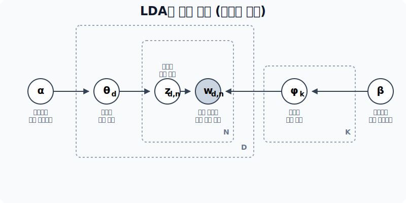
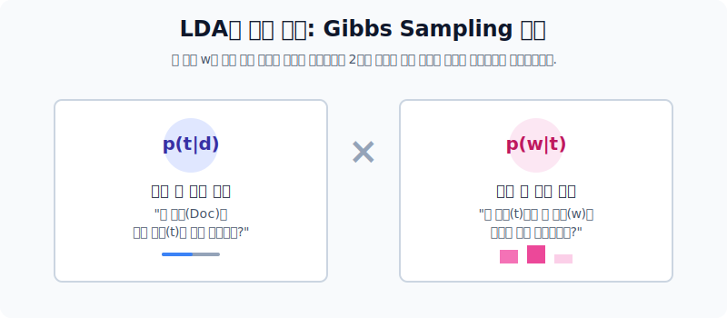

# 잠재 디리클레 할당(LDA)과 역추적 확률 연산

문서가 하늘에서 '확률 주사위'를 통해 무작위로 생성되었다고 가정하는 그 유명한 방법론입니다! 가장 대중적인 확률 기반 토픽 분석 알고리즘인 **LDA (Latent Dirichlet Allocation)**의 무시무시한 수학 공식들을 부수고 핵심 원리를 습득합니다.

---

## 00. 토픽 모델링의 대명사: LDA 알고리즘 
"도대체 과거에 조물주는 어떤 비율의 확률 주사위를 쥐고서 이 1만 개의 문서를 토해냈는가?" 결과를 보고 과거의 사건(토픽 사후확률)을 족집게처럼 유추해 내는 수학 탐정 기술을 배웁니다.

## 01. 잠재 디리클레 할당 (LDA) 의 2가지 통계적 가정
우리가 볼 수 있는 현상(데이터)은 오직 문서($D$)와 그 안에 적힌 단어($W$)뿐입니다. 통계 모형을 짜기 위해 가상의 변수($k, \theta, \phi$)를 가정합니다.
1.  **가정 1**: 하나의 무작위 문서는 반드시 미리 정해진 `K`개의 짬뽕된 토픽(주제)들로 버무려져 구성되어 있다.
2.  **가정 2**: 각 토픽은 또다시 자기만의 특색을 가진 고유한 `단어의 등장 확률 비율표`를 무조건 별도로 가지고 있다!

## 02. 토픽 역 혼합의 재정의 - $\pi$ (문서 관점)
세상에 총 $K=2$ (과일, 동물) 2가지 토픽 주머니뿐이라고 가정해 봅시다.

| 문서 | 포함 문장 분석 결과 | 유추된 토픽의 혼합 퍼센티지 ($\theta$) |
|:---:|:---|:---|
| **문서 1** | "사과랑 바나나 먹어요" | 과일 토픽 100% |
| **문서 2** | "귀여운 강아지가 좋아요" | 동물 토픽 100% |
| **문서 3** | "강아지가 바나나를 먹어요" | 과일 40% + 동물 60% 로 요상하게 **혼합(Mixed)**됨! |

## 03. 토픽 속 단어 확률 지분 - $\phi$ (단어 관점)
동물 주머니와 과일 주머니를 열어보면 뽑기 확률이 다릅니다.
*   **[과일 주머니 $\phi_1$]**: `사과 20%`, `바나나 40%`, `강아지 0%`, `여왕 0%`
*   **[동물 주머니 $\phi_2$]**: `사과 0%`, `강아지 33%`, `귀여운 33%`, `사자 16%`

이 거대한 두 확률 톱니바퀴 모형이 맞물려 돌아가며 오늘 매일 아침 네이버 뉴스가 자동 생성된다는 게 LDA의 철학입니다.

## 04. 디리클레 분포 (Dirichlet Distribution)
확률이라는 것은 어쨌든 전부 다 합치면 무조건 `1.0(100%)`이 되어야 하는 굴레에 갇힙니다.
이 합 1.0이 되는 집단 확률값들을 이리저리 무작위 다면체로 뽑아내는 수학 함수가 디리클레 함수입니다. ("분포들을 뽑아내는 분포 함수")

$$ \text{Dir}(\alpha) \sim \frac{1}{B(\alpha)} \prod_{i=1}^{K} x_i^{\alpha_i - 1} $$
*(대충 이 복잡한 하이퍼 함수값을 건드리면, 기계가 문서를 판별할 때 한 문서의 토픽을 무조건 극단적으로 다양하게 섞을지, 한 토픽으로만 몰빵 시킬지 뭉쳐짐 성향이 달라집니다)*

## 05. LDA 생성 방정식의 시각화 (Plate Notation)
컴퓨터가 상상 속에서 가짜 신문 기사를 1장 뽑아내는 과정을 도식화한 플레이트 설계도.

*   **$\theta$ (세타)**: 이번 문서의 "정치 70%, 경제 30%" 짜리 비율 주사위.
*   **$Z$**: 주사위를 굴려서 걸린 토픽. (아, 이번 단어는 무조건 정치 쪽 단어로 뽑아야겠다!)
*   **$\phi$ (파이)**: 정치 토픽 주머니. 여길 뒤져서 가장 등장 비율이 높은 쪽지(`선거`, `공천`)를 확 꺼냅니다.
*   **$W$**: 최종적으로 잉크를 묻혀서 종이에 기록되는 실제 글자 데이터.

> [!TIP]  
> 우리는 위 순서도의 반대로 역주행을 갈 것입니다! 진짜 현실에는 결과 똥인 종이 쪼가리 문서 $W$ 밖에 없기 때문입니다! 이것들로 역으로 파고 들어가 $Z$(토픽)를 찾아내고, 그걸 모아 거대한 주사위 확률비율표 $\theta$와 $\phi$ 매트릭스를 다 복원시키는 게 우리의 목표입니다.

## 06. 진정한 기계의 노동: 깁스 샘플링 (Gibbs Sampling)
현실 분석에서 기계는 텍스트를 보고 단번에 $\theta$ 비율 표를 뽑아내는 마법을 부릴 수 없습니다. 
따라서, 기계는 처음에는 **"개나 소나 그냥 랜덤으로 아무 토픽 스티커나 마구마구 붙입니다"**. (난장판)

그리고 $\to$ **수렴할 때까지 무한 반복 최적화 검수**를 돕니다.

## 07. 깁스 샘플링의 추론 업데이트 원리 (MCMC 방식)
랜덤 스티커가 붙은 어떤 억울한 단어 $w_i$ 하나를 골라서 검열관이 묻습니다. "너 원래 진짜 고향(토픽표)이 어딘지 까먹었지? 자, 주변을 보면서 눈치껏 확률적으로 다시 토픽을 바꿔 달렴."

$$ P(z_i = k \mid z_{-i}, w) \propto \left( \frac{n_{d, k}^{-i} + \alpha}{\sum n_{d, \cdot}^{-i} + K\alpha} \right) \times \left( \frac{v_{k, w_i}^{-i} + \beta}{\sum v_{k, \cdot}^{-i} + V\beta} \right) $$

기계는 저 무시무시한 조건부 확률 최우도 수식을 통해 단어의 스티커를 교체합니다. 그러나 그 원리는 아래 2개로 요약되는 아주 단순한 커닝 잣대입니다.

### 잣대 1번: 내 문서 안의 형제들은 지금 무슨 표찰표를 차고 있지? ($P(t|d)$)
내 문서 `[Document 1]` 안에 사는 다른 형제들(`Basketball`, `Player`)이 압도적으로 `Topic 2(스포츠)` 표찰을 달고 있다고?
$\to$ "그럼 나(Baseball 단어)도 분위기상 `Topic 2` 일 확률이 압도적이네, 뻘쭘하게 나 혼자 `정치` 토픽 달지 말고 바꿔 달아야겠다!"

### 잣대 2번: 바깥 동네에 사는 나랑 똑같은 스펠링 형제들은 무슨 표찰표를 차고 있지? ($P(w|t)$)
근데 불안해서 저기 옆 동네 `[Document 7]`에 살고 있는 스펠링 `Baseball` 한테 물어봤습니다. "너 지금 무슨 토픽 표찰 달고 있냐?"
$\to$ 바깥 동네 스펠링 형제들도 전부 다 `Topic 2(스포츠)`를 차고 있습니다.
$\to$ "아, 이 단어의 유전자 본성은 원래 `Topic 2` 인 거구나! 완전 확정!"

## 08. LSA 모델과 LDA 생성 모델의 패러다임 총평

| 항목 | LSA (잠재 의미 분석) | LDA (디리클레 할당 토픽) |
|:---:|:---|:---|
| **핵심 뼈대 알고리즘** | 선형 대수학 행렬 자르기 (Truncated SVD 분해) | 통계 및 사후 확률 역추론 (디리클레 주사위 분포 + 깁스 샘플링 반복) |
| **작동 결과의 철학** | "문서랑 단어를 강제로 찌그러뜨려서 3차원 축을 뽑자! 이 축이 잠재 의미(토픽)겠지?" | "문서는 확률에 의해 신이 쓴 생성물이니, 역확률을 돌려 신이 세팅했던 파라미터를 복구하자!" |
| **강약점** | 속도는 압도적으로 빠르나 단어 추가 시 재부팅 필수. | 토픽 분포 추정이 압도적으로 정확하고 유연하나, MCMC 등 수천만 회 반복 루프 자원 소모 큼. |
