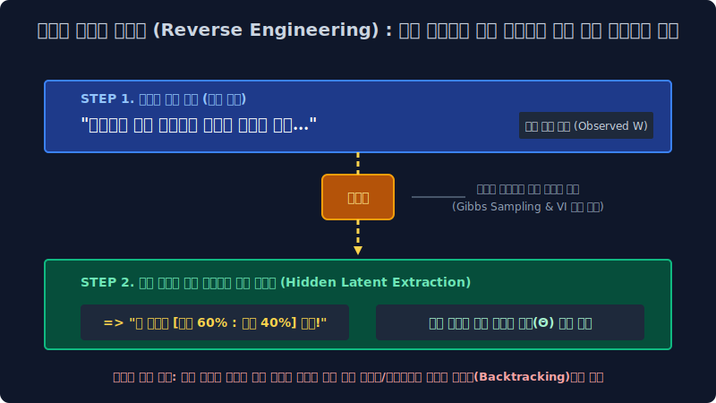

# 7.3 패러다임의 역전: 확률적 문서 생성 역추적 모델

거대한 데이터 엑셀 매트릭스를 강제로 톱질해 자르던 잔혹한 강제 찌그러뜨리기(LSA 모형) 수학의 딜레마 폭파에서 완전히 벗어나게 됩니다.
데이터 분석 학계는 수학적 행렬 연산의 세계를 탈출하여, 철학적 발상의 극단적 전환점인 **문서 생성 패러다임 (Generative Model)** 이라는 황홀한 베이즈 통계학의 신대륙에 발을 들이며 무대의 룰을 새롭게 씁니다.

---

## 7.3.1 문서는 글자가 아니라 "확률 주사위의 산물"이다.

새로운 통계 학자들의 모델 정신세계는 일반인의 관점에서 보면 아주 기괴한 "망상"에서 출발합니다.

*   **기존 물리적 관점**: 눈앞에 수백만 개의 문서는 그냥 사람이 타자치고 스펠링이 나열된 종이 더미다.
*   **생성 모델의 대전제**: *"아니다! 이 네이버 뉴스 문서들은 우연히 찍힌 게 아니다. 과거에 어떤 보이지 않는 신령(기계 조물주)이 방 안에 갇혀서, **엄격한 확률 주사위를 굴려 확률대로 스펠링을 인쇄해 낸 피조 창작 결과물이다!!**"*

이 얼토당토않은 소리를 코딩으로 증명하기 위해, 기계가 어떻게 가짜 주사위로 가짜 뉴스를 써 내리는 시뮬레이션 확률 공정을 거치는지 그 4단계를 추적해 봅시다.

---

## 7.3.2 조물주(확률 통계 기계)의 가짜 문서 공장 시뮬레이션

만약 당신이 아무 지식도 없는 깡통 기계인데 가짜 신문 기사를 하나 편찬해야 한다고 칩시다. 

| 생성 시퀀스 스텝 | 가상의 조물주(확률 통계 통제기)가 취하는 마술적 행동 루틴 |
|:---:|:---|
| **STEP 1**   *(타겟 비율 세팅)* | 아하! 이번 기사는 **'정치 70%, 경제 30%'** 느낌으로 섞인 하이브리드 문서 1장을 써봐야지!  $\to$ (주사위 뽑기판 전체 타겟 비율 모수 $1.0$ 세팅 완료) |
| **STEP 2**   *(토픽 룰렛 굴리기)* | 자, 종이의 '첫 번째 단어'를 쓸 차례야. 나한테 방금 잡은 비율(70:30)로 맞추어진 '룰렛판'이 안대에 씌워져 있어. 눈감고 휙 굴렸더니 70% 높은 확률로 뚱뚱했던 **[🔴 정치 구슬]**이 툭 튀어나왔어! |
| **STEP 3**   *(문자 스펠링 통 뽑기)* | 내 책방 벽에는 각 구슬 색깔마다 단어가 들어있는 거대한 전용 **'단어 뽑기 통'** 들이 주르륵 서 있어. 방금 나온 빨간색 정치통에 손을 쑥 넣자.   정치통 통계를 보니 `비자금`, `국회`가 잡힐 확률이 높군! 무작위로 하나 휙 집어보니 `국회`라는 단어가 집혔다!  $\to$ 종이에 `국회`라고 1글자 잉크로 기록 쾅! |
| **STEP 4**   *(무한 루프 찍어내기)* | 다음 두 번째 단어를 써볼까? (STEP 2로 복귀). 또 메인 룰렛판을 굴렸어. 헐! 이번엔 30%짜리 운석이 터져서 좁은 **[🟢 경제 구슬]** 라인이 걸렸네!   자 초록색 경제 통에 다시 손을 쑥 넣었더니 높은 확률로 `펀드` 단어가 튀어나왔네. 종이에 잉크 기록 쾅! |

컴퓨터가 이 확률 시뮬레이션 노가다를 수백 번 반복하여, 종이에 `"국회 펀드 펀드 국회 주식 비자금 세금..."` 이라는 그럴싸한 비율이 버무려진 기괴한 가짜 뉴스를 수만 장 뚝딱 찍어냈습니다!

---

## 7.3.3 시간의 역주행 타임머신 (우리의 진짜 임무)

자, 이제 꿈에서 깨어나 잔혹한 현실 통계학 연구원 우리의 시점으로 돌아옵니다.
여러분 책상 위에는, 방금 저 신령 조물주가 방 안에서 문을 잠그고 주사위 룰렛을 굴려서 찍어낸 **정답 꼬리표 없는 결과물 기사 뭉텅이들(문서)만 산더미처럼** 버려져 있습니다. 
과거 저 방 안에서 무슨 비율 주사위를 굴렸는지 우린 블랙박스라 알지 못합니다.

> [!IMPORTANT]  
> **토픽 모델링의 빛나는 존재 이유: 역주행 (Reverse Engineering)**
> 현실 세계를 연구하는 과학자의 임무는 바로 **떨어진 종이 흔적을 보고 시간의 흐름을 거꾸로 타서 주사위 세팅값을 소환하는 것**입니다.

1. **관측된 사실 투입**: 기계는 이 종이 텍스트(유일하게 인간의 눈에 보이는 관측 가능 지표)들을 전부 스캐너에 때려 넣습니다.
2. **역산 백트래킹 엔진**: 단어들의 빈도 분포 군집을 보며 **확률 백트래킹(역산 미적분) 계산**을 쉬지 않고 돌립니다. 
3. **[최종 진실의 방] 파라미터 복구 완료**: *"야, 이 종이 안에 '비자금', '의원', '금융'이라는 스펠링 잉크가 이 비율로 묻어있는 걸 거꾸로 계산해 보니까, 과거 조물주 놈이 방 안에서 첫 번째 룰렛을 세팅(STEP 1)할 때 보나 마나 **[정치 60, 경제 40] 비율 셋팅값 주사위($\theta$)** 를 썼었음이 100% 확실하구만!!"* 

이처럼 과거 눈에 보이지 않던(Latent) 조물주의 파라미터(주사위 비율표)를 현실의 찌꺼기를 통해 수학적으로 역추적해서 까발리는 극한의 과정! 
이것이 현대 비지도 학습의 척추인 **[잠재 확률 토픽 모델 (LDA)]** 의 빛나는 정체성입니다. LSA처럼 더 이상 행렬이 폭발할 일도 없고, 이 방식은 인간의 직관과 가장 소름 돋게 일치하는 문맥 분석 능력을 발휘합니다. 다음 단원에서 본격적으로 이 "주사위 방정식 2개"의 구조를 해부하기 위해 디리클레 할당장으로 진입합니다.
