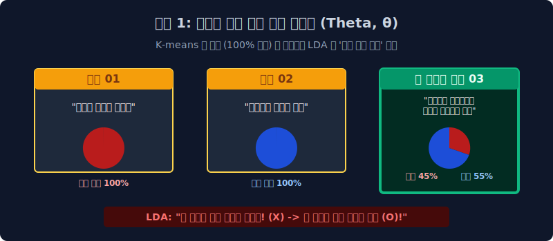
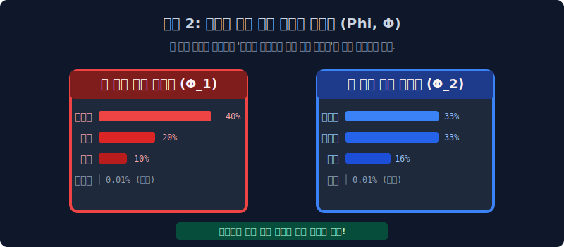

# 7.4 확률 역추적의 성배: 잠재 디리클레 할당(LDA) 의 통계 철학

이전 챕터에서 배웠던 '신의 주사위 역추론 통계 스캐너' 패러다임을 실제로 파이썬 코딩으로 완벽하게 구현하여 2003년 전 세계 머신러닝의 텍스트 군집화 영토 일통을 이루어낸 전설의 알고리즘, 바로 **LDA (Latent Dirichlet Allocation, 잠재 디리클레 할당)**의 위대한 수학적 톱니바퀴 2개를 뜯어봅니다.

---

## 7.4.1 왜 "잠재 (Latent)" 와 "할당 (Allocation)" 인가?

이 복잡한 이름의 뉘앙스부터 파괴해야 합니다.
1.  **Latent (잠재적)**: 우리 인간의 눈 모니터에 보이는 건 오직 텍스트 스펠링($W$)뿐. 그 뒤에 은밀하게 숨겨져서 단어를 조종했던 '조물주의 주사위 배합 지표($\theta, \phi$)' 들은 눈에 보이지 않는 잠재적 수치입니다.
2.  **Allocation (할당)**: 문서 안의 수백 개 "개별 단어들 하나하나마다" 너는 정치 토픽 출신이고, 너는 경제 토픽 출신이라며 이름표(스티커)를 강제로 할당해서 배분해 주는 것이 궁극의 임무입니다.

현재까지도 토픽 분석 실무에서 K-means 물리적 조 짜기 따위를 버리고 압도적인 디폴트 베이스로 수렴해 사용하는 텍스트 분석 알고리즘의 성배입니다.

---

## 7.4.2 LDA 의 근본적인 2가지 이중 룰렛 통계 가정

LDA 엔진은 이 세상 구동 원리를 2개의 돌아가는 거대한 기어 톱니바퀴 모형 확률값으로 정의했습니다. 그것이 바로 조물주의 설정값 $\theta$(세타)와 $\phi$(파이) 입니다.

1.  **가정 1 (문서 중심 룰렛 $\theta$)**: 하나의 문서는 그냥 무식하게 100% 한 우물만 파지 않는다. 룰렛처럼 미리 정해진 `K`개의 여러 토픽(주제)들이 각자의 지분율(%)로 짬뽕되어 섞여 구성되어 있다.
2.  **가정 2 (토픽 중심 주머니 $\phi$)**: 각 토픽 방은 무색무취가 아니다. 자기만의 특색을 가진 고유한 `단어 스펠링의 등장 확률 쪽지 비율표`를 무조건 독립적으로 별도 보관하고 있다!

---

## 7.4.3 가정 1: 토픽 혼합 룰렛 지분표 - $\theta$ (세타) 관점

가장 먼저 한 문서가 한 폴더에만 갇히지 않는 "다중 인격 비율 모델링($\theta$)"을 확인합니다. 세상에 정치랑 경제 같은 토픽 대신, 총 $K=2$ (과일 방, 동물 방) 2가지 토픽 룰렛 주머니뿐이라고 가정해 봅시다. 

| 관찰된 실제 데이터 문서 텍스트 스펠링 ($D$) | LDA 스캐너 역추론 성공: 문서 룰렛의 혼합 퍼센티지 ($\theta$) 예측값 |
|:---|:---|
| **`Doc 01`**: "사과랑 바나나 달콤하게 먹어요" | 과일 토픽 100% |
| **`Doc 02`**: "귀여운 강아지가 꼬리를 쳐요" | 동물 토픽 100% |
| 🚨 **`Doc 03`**: "사육사가 강아지한테 맛있는 바나나를 먹여요" | **[과일 토픽 45% + 동물 토픽 55%]** 로 요상하게 **짬뽕 혼합(Mixed)** 된 황금비율 문서!! |

위에서 보듯, LDA 수학의 위대함은 K-means 같은 멍청한 강제 조 짜기 녀석들처럼 문서 3번을 억지로 100% 동물 폴더로 쳐박아 가두지 않는 점입니다. LDA는 **유연하게 "얘는 반반 치킨 비율로 섞인 애매한 혼합 문서야!" 라고 파이 확률 자체를 인정해 줍니다.**

---

## 7.4.4 가정 2: 토픽 속의 단어 쪽지 분포 지분 - $\phi$ (파이) 관점

이번엔 그 토픽 방 안의 단어 씀씀이(어휘장)를 뒤져 속성을 까봅니다. 동물 주머니 방벌과 과일 주머니 안을 까보면 그들이 사랑하는 단어가 뽑혀 나올 스펠링 수학 확률($\phi$) 표찰이 완전히 편파적으로 다릅니다.

*   **[🔴 과일 토픽 주머니 $\phi_1$]**: `바나나(40%)`, `사과(20%)`, `달콤(10%)` $\to$ **🚨`강아지(0.01% - 절대 안나옴)`** 
*   **[🔵 동물 토픽 주머니 $\phi_2$]**: `강아지(33%)`, `귀여운(33%)`, `사자(16%)` $\to$ **🚨`사과(0.01% - 절대 안나옴)`**

이 거대한 두 확률 톱니바퀴 모형($\theta$ 의 문서 룰렛 혼합 확률)과 ($\phi$ 의 토픽별 단어 편식 확률)이 맞물려 미친 듯이 빙글빙글 공장처럼 돌아가며 조물주가 오늘 아침 뉴스를 뽑아냈다는 철학, 그것이 바로 LDA가 세상을 바라보는 수학적 관점의 정체입니다. 

그럼 이 톱니바퀴를 과연 어떻게 조물주가 세팅했던 걸까요? 이 비밀의 세팅 자판기가 바로 **'디리클레(Dirichlet) 다면체 분포 수식'** 이라는 이름으로 다음 단원에서 아키텍처 도면으로 그려집니다.
