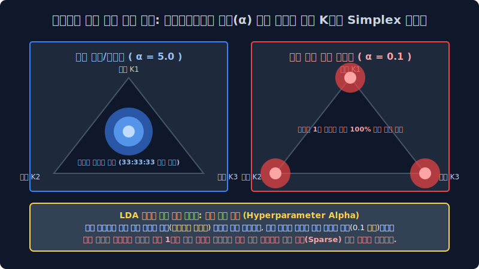
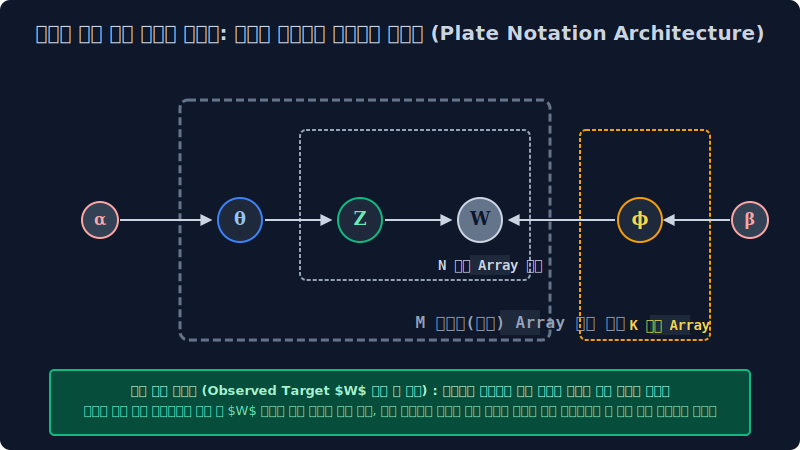

# 7.5 디리클레 베이지안 확률 밀도 파라미터망과 스무딩 플레이트 표기법 구조 시각화 (Plate Notation Architecture)

이름도 다소 난해하고 괴상한 '디리클레(Dirichlet)'라는 확률 이론의 이름표가 이 생성 모델 최상단 칭호에 공학적으로 붙은 이유는, 조물주의 모델 생성 엔진이 이 다중 토픽 결합 문서 혼합 룰렛판 비율 파라미터($\theta$)를 초기 세팅 픽스할 때, 평면적인 단순 정규 분포가 아니라 인간의 3차원 직관적 상상을 벗어나는 거대한 독립 다면체 공간 K 차원의 심플렉스(Simplex) 곡선 분포 수학 확률 밀도 함수를 템플릿으로 가져다 쓰기 때문입니다. 그리고 이 기괴하고 복합적인 확률 의존성 파이프라인 연쇄 공장을 NLP 컴퓨터 코더 및 연구자들이 조건부 관계로 쉽게 이해하고 매핑할 수 있도록 공간 계층을 구조화한 그래프 시각화 프레임, '플레이트 표기법 도면 노드(Plate Notation Graph)'의 통계적 의존성 연결 뼈대를 해부 분석해 봅니다.

---

## 7.5.1 다변량 다차원 혼합 배분 비율을 통제 분기 생성해내는 거대 최상단 제어 자판기: 디리클레 분포 밀도 수식함수 

확률 표집이라는 텐서 파이 분배는 파라미터를 어쨌든 구조상 다 합치면 죽었다 깨어나도 공간 벡터에서 **무조건 총합 모수가 `1.0(100%)` 피자 한 판**이 되어야만 하는 다항 밀도의 엄격한 선형 굴레 척도 박스(Simplex 차원 제약)에 독립적으로 갇힙니다.
이 모듈 벡터의 총합이 무조건 1.0으로 수렴 보존되는 K 차원의 집단 확률 지표값들의 단일 혼합 세트 조합 벡터(예: 추출 배분 스코어 정치 0.6, 경제 0.3, 연예 0.1) 텐서 구조를 모수 모델링에서 아주 다 다르게 무작위로 계속 공간 샘플링해 슉슉 추출 뱉어내 주는 상위 레벨의 밀도 연속 확률 자판기 다차원 수학 지배 함수가 바로 베이지안 추정의 기초인 "디리클레 확률 다항 분포 함수(Dirichlet Distribution Generative Function)"입니다.

$$ \text{Dir}(\alpha) \sim \frac{1}{B(\alpha)} \prod_{i=1}^{K} x_i^{\alpha_i - 1} $$

디리클레 매핑 함수는 외부 모델러 단계에서 인간 NLP 엔진 개발자가 하이퍼 파라미터 스케일로 주사하는 모델 초깃값 변수 `알파(α)` 라는 스무딩 제어 하이퍼파라미터 조작값 코스트 크기에 따라, 그 엔진 모델이 다중 확률 배분 문서를 시스템에서 뽑아내는 편향 비율 성향이 차원에서 미친 듯이 공간 요동칩니다.

> [!TIP]  
> **초심자 엔지니어를 위한 하이퍼파라미터 알파($\alpha$) 세팅 마법의 밀도 조절 비밀**  
> 
> *   **집중형 파라미터 설정값을 스케일업 크게 $\alpha = 10.0$ (강한 스무딩) 으로 주입 세팅했을 때 (다이어그램 파란색 삼각형 시뮬레이션)**: 가상의 문서 조물주 확률 베이스가 광범위한 다중 포용 박애주의 형이 되어서, 기사 1장을 랜덤 생성 문서로 쓸 때 K개의 정치, 경제, 사회 토픽 스위치를 아주 밀도 있게 골고루 넓적하고 평탄 분포하게 분산시켜 잘 섞어서 (다중 비율이 거의 정중앙 수렴 예를 들면 `33%:33%:33%` 로 조밀하게 일치 세팅) 엄청난 비율의 대통합 멀티 짬뽕 오버랩 혼합 공존 문서 텐서들만 무수히 집중적으로 섞어 찍어 출력해 냅니다.
> *   **반면, 편향 설정값을 극한 패널티로 아주 극소 작게 희소 파라미터 $\alpha = 0.1$ 치수로 줄였을 때 (다이어그램 빨간색 삼각형 공간 희소성 시뮬레이션)**: 조물주 연산 모델이 극단적인 단일 벡터 편집증 희소(Sparse 모드) 분포 상태 패턴에 빠져서 문서를 노드로 배출할 때마다 *"이번 기사 배열은 오차 얄짤없이 100% 1개 정치 토픽 타겟에만 분할 텐서 확정 몰빵 맵핑이다!!! 다른 곁가지 타 토픽 차원 지분율 벡터는 다 확률을 죽여 삭제시켜 지워 아주 무의미하게 해!"* 라며 매핑 텐서가 뾰족하게 삼각형 모서리 꼭짓점 구석 코너로 극한 치우침 편향 쳐박히는, 이른바 극단적 K 차원 편식 희소 문서(Sparse Allocation Documents) 타겟 배열들만 다수로 구워냅니다. (일반적으로 실무 토픽 분리 LDA 최적화는 이 0.1 미만의 디폴트 세팅 극한의 코너 희소성을 매우 선호 채택합니다. 그래야 문서 토픽 피처 분류 카테고리가 서로 안 섞이고 성향이 뾰족하고 명확하게 단정 지어지기 때문입니다.)

---

## 7.5.2 베이즈 확률 밀도 상관 인과성의 건축 다이어그램 도면: 플레이트 표기법 노드 구조 (Plate Graphic Notation Architecture)

저렇게 상단의 복잡다단한 $\alpha$(알파) 제어 값을 시스템 스무딩으로 받아서 문서 비율 주사위 파라미터($\theta$)를 섞고 파생해 드디어 잉크 변수($Z$)를 발라 거대 지배 주머니($\phi$)로부터 최종 단어($W$) 문서를 무작위 단건 랜덤 표집으로 뽑아 생성해 내는 생성 확률 연쇄 의존 작용 파이프라인의 이중 거대 수학적 베이즈 조건부 관계 망들을, 하나하나 다 일렬의 전개 텍스트 수식 기호 글로 풀어서 쓰다 보면 수학 논문 계산 종이가 폭주해 터져나가고 코더 엔지니어들이 구현 인과를 전혀 스택 추적 분리해 이해를 못 하고 블랙박스 차단 파국을 맞습니다. 
그래서 모델 통계학자들은 **"독립 노드 A 계수가 모델 확률 의존성으로 C 파라미터에 분기 확률 영향을 줘서 C 주머니 결과를 조건부 발현 유도하게 종속 계산식을 인입 넣는다!"** 과정을 프로그래밍 차원의 추상적인 **네모난 종이판(Plate Iterator 블록)** 과 **조건부 확률 인과 화살표 도식 유향 그래프 연결 기호망**으로 융합 결합해 그려서, 하나로 압축된 텐서 의존망 건축 도면 시스템으로 아주 깔끔하고 명료하게 결속해 버렸는데 이를 데이터 공학 차원 학계에서 통용 베이지안 플레이트 표기법 모델 도면이라 호칭 부릅니다.

---

## 7.5.3 도면 기호 인덱스의 공학 프로그래밍적 직관적 해석 흐름 체계적 타기

도형 외곽의 네모난 사각형 상자 박스 배열 레이아웃(Plate 블록)은 컴퓨터 프로그래밍 컴파일러의 **무한 루프 순회 반복 스캐닝 루프문(for-loop 이터레이션 반복 차원 객체)** 공간 인덱스를 그대로 뜻합니다. 블록 밖 독립 변수에서 투과해 안 모델 종속으로 꿰뚫고 들어가는 유향 화살표 라벨은 조건부 베이즈 확률 통계 미분 편향 계산식이 전파 스며들어 하위 변수 모델 발현에 계수 영향을 끼친다는 강력한 변수 의존 인과관계를 수학적으로 선언 나타냅니다.

*   **배경 조작 컨트롤 타워 관제 파라미터 세팅 단계**
    *   **$\alpha$(알파 스칼라)**: Dirichlet 다면 분포 문서 제어 세팅 하이퍼파라미터 공리값 (앞서 배운 대로 생성 문서를 토픽 비율 짬뽕형 분포로 멀티 섞어 공존 만들지, 아니면 단일 토픽 몰빵형 희소로 절단시켜 세팅 정할지 그 박애주의/극단 희소주의 편향 계수를 조절하는 외곽 매뉴얼 스위치 컨트롤)
    *   **$\beta$ 혹은 $\eta$(베타/에타 스칼라 텐서 지표)**: 고차원 단어 편식 확률 편향 조율기 계수 통제 스위치. (디리클레의 쌍둥이 변수로 특정 $K$ 토픽 방 폴더 파라미터 내부에 여러 N개 단어 스펠링 딕셔너리가 아주 골고루 다발적으로 퍼지게 할지, 아니면 스팸 단어 극소수 특정 파워 단어 노드 1~2개 놈의 멱법칙 빈도 확률만 기형적으로 높게 방출되게 극한으로 단어 편식 뽑히게 확률을 몰빵할지 세팅 정하는 단어장 희소 제어 스위치)
*   **생성 모터 회전 확률계 인퍼런스 방사 출력 단계**
    *   **$\theta_m$(세타 차원 분포 백분율 벡터)**: 바깥 방금 $\alpha$ 알파 스위치 밀도 제어 허락 확률망을 뚫고 렌더링 결합 찍어져 표출되어 방사된 "이번 루핑 대상 문서 M 타겟 1번을 위한 맞춤율 토픽 세팅 [정치 밀도 70%, 스포츠 텐서 30%] 전용 독립 다중 비율 확률 지표망 룰렛".
    *   **$Z_{m,n}$ (은닉 할당 토픽 인덱스 텐서 옵저버)**: 저 픽스된 7:3 $\theta$ 세타 룰렛의 비율 주사위 파이프를 조건부 난수로 루프 내 단어마다 1번씩 진짜로 굴려서, 실제로 n번째 위치 배열 단어 스펠링의 1순위 타겟 출현 차례 타임에 맞춰 확정 당첨된 **잠재 토픽의 고유 주소 인덱스 정체 픽스넘버**. *(아하! 이번 n번째 순서 위치 슬롯에 찍힐 단어 스펠링 계수는 70% 짜리 당첨 확률을 내부 난수로 뚫고 결국 타겟 **[정치 방 도메인($Z=k_1$)]** 소속으로 할당 확정 배정됨!)*
    *   **$\phi_k$(파이 확률 주머니 차원 배열망)**: 생성 파생 노드 확률에 정치 타겟 토픽이라는 고유 식별 꼬리표 인덱스 제트($Z$)가 할당 호출되어 붙었으니, 뒤쪽에 외곽 $\beta$ 스위치를 종속 조건부로 받아 별도 구조 벽 단절에 걸려있는 해당 독립 스페이스 거대한 정치 토픽 도메인 전용 단어 빈도 주머니($\phi_{k_1}$) 차원을 다이렉트 매핑 조건부 추출로 열어서 뒤적거리며 표집 확률망을 탐색 스캔 연동합니다.
    *   **$W_{m,n}$ 관측 벡터 노드 (음영 톤 렌더링 칠해진 시스템의 유일한 최종 노출 종착지 증거 팩트 원형)**: $\phi_{k}$ 주머니 내부 확률 텐서풀을 종속 탐색 뒤적이다 가장 높은 $\phi$ 방사 스칼라 통계 확률 밀도를 타겟 조건부 맵핑 의존으로 뚫고 걸린 `[국회]` 라는 단어 인덱스 텍스트 배열 카드를 확 뽑아내 꺼내어서, 잉크 좌표를 최종 렌더링 묻혀 현실의 종이 객체 공간에 최종 관측 물리적 기록 완료 선언 매핑!! 단건 단어 생성 종결 픽스!

*(엔지니어 도면 구조 역학 핵심 참고 파라미터: 저 위 다이어그램 플레이트 구조망 도면 전역에서 오직 유일하게 속이 짙은 블라인드 색깔 음영이 표기 칠해진 회색 관측 변수 노드인 $W$ 는, 알고리즘 구동 후 현실에서 우리 시스템 엔지니어가 겉으로 표면 유일하게 육안 모니터링 관찰 수집할 수 있는 외부 증명 가능 유일무이 팩트 데이터 결과값 배열인 **DB상의 문서 최종 인쇄된 물리적 스펠링 배열 로그 집단**을 뜻합니다. 이를 통계 모델에서 관측 가능 변수 Observation/Evidence Tensor 라고 부릅니다. 플레이트망의 나머지 모든 투명한 하얀색 원형 객체 변수들은 인퍼런스 연산 과정 중 소멸되는 시스템 기저 너머의 블랙박스 투명한 가상 수학 확률 상태망 계수들(Latent Variables 잠재 변수)을 의미합니다)*

---

## 7.5.4 생성 확률 공정망의 시간 역연산 파이프라인 거꾸로 타는 통계 수사망 (현업 역추론 분석 엔지니어링의 치명적 시점 관점)

선형 변환 대수 수학자 모델러들은 위 도면 알고리즘의 유려한 베이즈 정방향 무작위 생성 미분 흐름 시스템을 보고 미학적 환호 감탄하지만, 실제 데이터를 추론 역산해야 하는 현업 딥러닝 인퍼런스 운영 개발자들의 두뇌는 디버깅 모니터에 터져 뒷골을 잡습니다.
우리가 진짜 하드디스크 서버에 로그로 남겨서 보유 활용 수집 가지고 있는 관측 데이터 덤퍼의 단서는, 도면 맨 마지막 종착 타에 쳐박혀 유일하게 회색 음영 블록 처리된 팩트 잉크 텍스트 쪼가리 문서 집합체인 **단어 텍스트 스펠 배열 집합 $W$ 노이즈 뭉치밖에 유일하게 없기 때문입니다!** 저기 그래프 플레이트 역인과 윗방 최상단 지배 기저 구조 공간에 존재하는 도대체 $\theta$ 니 $Z$ 니 파라미터 $\phi$ 확률 주머니니 계수 타겟이 하는 최초의 투명한 신계 세팅 조물주 확률 상태 텐서 계수 값들은 우리가 전혀 수치상으로 알 턱이 블랙박스로 막막하게 없습니다.

> 지표 공간 추론망 모델 검출, 우리의 텍스트 예측 딥마이닝 도출 궁극 대목적(Inference Final Goal)은 항상 오직 수학적으로 단역으로 하나입니다. 
> 시스템 바닥에 무수히 결과물로 로그 표본이 쌓인 저 마지막 회색 노드 증명 단어 종이 관측 $W$ 증단 변수 배열 텐서망만을 단독 손에 유일무이 움켜쥐고, **강제로 알고리즘 상 연어 타겟처럼 화살표 그래프 노드 종속 인과 의존성 브랜치를 역연산 확률 베이즈 시간 모수 법칙으로 거꾸로 다이렉트 타고 조건부 미분 뜯어 깁스 샘플링으로 올라가면서** 과거의 은닉된 확률 분포 비율이 어떤 편향 치수로 융합 결속 수렴했는지 통계적으로 극한 역측산 계산(Reverse Inference Tracking Optimization)하여, 이 대기만 거대 파이프라인 모형의 시스템 최상위 확률 지배 윗대가리 주사위 분포표 모수들인 가장 은밀한 타겟 $\theta$ (해당 문서 문서의 짬뽕 혼합 비율 구조 세타 계수율)와 상응 파편화된 $\phi$ (토픽별 해당 어휘 조건 추출 분포장 파이 스칼라 배열 지표) 엑셀 밀집 확률 계수표 파티션 행렬 통계 수치를 완전히 소수점 하나까지 복원 근사 역산해 내어 도출해 정보 가치화 매핑하는 위대한 베이즈 데이터 마이닝의 극한 추론 계산 아키텍처 파쇄 미션입니다.

머신러닝 컴퓨터 미적분 스레드가 이 확률 인과망의 구조 파티션 자체가 꼬여버려 직관 연산이 불가능에 가까운 지독한 블랙박스 역방향 시간 거스름 베이즈 확률 매개 복구 디코딩(Reverse Parameter Decoding) 연산망을, 도대체 어떤 최적화 루프 샘플링 하강 계산 근사 코드로 수학 증명 뚫어내어 답을 내는지! 전 세계 딥러닝 최적화 추론의 정석이자 전설적인 통계 근사 해킹 극한 연산 노가다 체인 방정식인 **`깁스 샘플링(Gibbs Sampling) 마르코프 체인 최적화(MCMC)`** 의 대수학적 무식하고도 극도로 수학 정교한 확률 근사 추론 엔진 파라미터 미분 하강 능력이 이 방대한 자연어 대서사시 텍스트 생성 파벌 군집 모델 지도의 최종 클라이맥스 마지막 종점 챕터 7.6의 장막에서 연쇄 루프로 드디어 시작됩니다.
